# Score Chat Msg + Members Schema

## Schema: chat message and members
<!-- type: schema lang: yaml -->

```yaml
$id: score-chat-msg-members-schema
description: |
  Extended data shapes for the `aw chat` verb. Extends projects/agentic-workflow/tech-design/surface/specs/score-chat.md.
  The channel file at /tmp/aw-channel.md stores messages as consecutive
  YAML-frontmatter blocks delimited by `---`, one per message, each followed
  by the message body. The members registry at /tmp/aw-channel-members.yaml
  is a YAML document listing all registered members. CLI auto-fills all
  fields except --to and --body-file; agents must not pre-format YAML.

definitions:
  ChannelMessage:
    $id: "#/definitions/ChannelMessage"
    type: object
    description: |
      One message block inside /tmp/aw-channel.md.
      Serialised as per-message YAML frontmatter delimited by `---` markers
      followed by the body text. CLI auto-fills id, from, timestamp;
      agents supply only --to and --body-file.
    required: [id, from, to, timestamp]
    properties:
      id:
        type: integer
        description: Monotonic msg id, CLI-assigned as max(existing ids) + 1.
      from:
        type: string
        description: |
          Sender identity. Auto-filled by CLI via identity detection chain:
          (1) git branch from CWD, (2) members.yaml lookup by branch -> name,
          (3) fallback to branch name itself, (4) fallback to git-toplevel basename.
          Backwards-compat: if .aw/config.toml [team] name exists and branch
          is not in members.yaml, use config name.
      to:
        type: array
        items:
          type: string
        default: []
        description: |
          Addressee team names. Comma-separated on CLI; stored as YAML sequence.
          Empty means broadcast. @me resolves to caller identity.
      re:
        type: integer
        nullable: true
        description: Anchor msg-id for reply threading. Null on root messages.
      project:
        type: string
        nullable: true
        description: |
          Optional project tag supplied via --project flag. Used for filtering.
          Null when not provided.
      timestamp:
        type: string
        format: date-time
        description: ISO-8601 UTC timestamp written at post time via chrono::Utc::now().

  ChannelStorage:
    $id: "#/definitions/ChannelStorage"
    type: string
    description: "/tmp/aw-channel.md on-disk format."
    x-format: |
      Each message block consists of:
        ---
        id: <integer>
        from: "<string>"
        to: [<string>, ...]
        re: <integer | null>
        project: "<string | null>"
        timestamp: "<ISO-8601>"
        ---
        <body text>
      Blocks are appended sequentially. No separator between blocks other
      than the leading --- of the next block.

  Member:
    $id: "#/definitions/Member"
    type: object
    description: |
      One entry in /tmp/aw-channel-members.yaml members list. Written
      by `aw chat members --register`. Identity = branch; name is the
      human-readable label resolved from branch lookup.
    required: [name, branch, wt_path]
    properties:
      name:
        type: string
        description: |
          Stable human-readable identifier. Used as the resolved `from:` value
          in ChannelMessage when branch matches.
      branch:
        type: string
        description: Git branch for the worktree. Used as the lookup key for identity resolution.
      wt_path:
        type: string
        description: |
          Absolute filesystem path of the worktree root. Derived from
          git rev-parse --show-toplevel at register time; not read from config.
      projects:
        type: array
        items:
          type: string
        description: Project tags this member is active in. Used for routing filters.
      capabilities:
        type: array
        items:
          type: string
        description: Free-form capability tags declared in [team] capabilities in config.toml.
      last_seen:
        type: string
        format: date-time
        description: ISO-8601 UTC timestamp written at --register time.

  MembersFile:
    $id: "#/definitions/MembersFile"
    type: object
    description: |
      /tmp/aw-channel-members.yaml — the members registry. Written and read
      by `aw chat members`. Replaces the old /tmp/aw-channel-agents.md
      per-member markdown file format.
    required: [schema, updated_at, members]
    properties:
      schema:
        type: string
        const: "score-chat-members-v1"
        description: Schema version sentinel. Must be "score-chat-members-v1".
      updated_at:
        type: string
        format: date-time
        description: ISO-8601 UTC timestamp updated on each --register call.
      members:
        type: array
        items:
          $ref: "#/definitions/Member"
        description: List of all registered members.

  MembersArgs:
    $id: "#/definitions/MembersArgs"
    type: object
    description: |
      Args for `aw chat members` (renamed from `aw chat agents`).
      `agents` is retained as a deprecated alias for one release.
    properties:
      register:
        type: boolean
        description: |
          Write or upsert caller's Member entry in /tmp/aw-channel-members.yaml.
          Auto-fills branch (git rev-parse --abbrev-ref HEAD) and wt_path
          (git rev-parse --show-toplevel) and last_seen (Utc::now()).
          Preserves existing projects and capabilities unless explicitly overridden.
      list:
        type: boolean
        description: Print all registered members from /tmp/aw-channel-members.yaml.
      terse:
        type: boolean
        description: Force terse output.
      human:
        type: boolean
        description: Force human output.

  PostArgsV2:
    $id: "#/definitions/PostArgsV2"
    type: object
    description: |
      Extended args for `aw chat post` with the new --project flag.
      Extends PostArgs from projects/agentic-workflow/tech-design/surface/specs/score-chat.md.
    properties:
      to:
        type: array
        items:
          type: string
        description: Comma-separated addressee team names.
      re:
        type: integer
        nullable: true
        description: Anchor msg-id to reply to.
      project:
        type: string
        nullable: true
        description: Optional project tag. Written to ChannelMessage.project.
      body_file:
        type: string
        description: Path to body file. Use - for stdin.
      terse:
        type: boolean
        description: Force terse output.
      human:
        type: boolean
        description: Force human output.
```
## Logic: chat post and members

```mermaid
---
id: chat-post-and-members
entry: start
nodes:
  start: { kind: start, label: "aw chat post / members" }
  branch_cmd: { kind: decision, label: "subcommand?" }
  read_channel: { kind: process, label: "read_file channel.md" }
  detect_format: { kind: decision, label: "old pipe format?" }
  parse_pipe: { kind: process, label: "parse_pipe_format: split | lines" }
  rewrite_frontmatter: { kind: process, label: "rewrite_as_frontmatter: write_file channel.md" }
  parse_messages: { kind: process, label: "parse_messages: split --- blocks, serde_yaml" }
  max_id: { kind: process, label: "max_id = max(msgs.id) or 0" }
  next_id: { kind: process, label: "next_id = max_id + 1" }
  detect_branch: { kind: process, label: "detect_branch: git rev-parse --abbrev-ref HEAD" }
  lookup_member: { kind: decision, label: "branch in members.yaml?" }
  from_member_name: { kind: process, label: "from = member.name" }
  from_branch: { kind: decision, label: "config.toml [team] name exists?" }
  from_config: { kind: process, label: "from = config [team] name" }
  from_branch_fallback: { kind: process, label: "from = branch name" }
  build_frontmatter: { kind: process, label: "build msg frontmatter: id, from, to, re, project, timestamp" }
  append_file: { kind: process, label: "append_file channel.md: frontmatter block + body" }
  post_done: { kind: terminal, label: "print posted msg; exit 0" }
  members_read: { kind: process, label: "read members.yaml (or empty MembersFile)" }
  members_detect_branch: { kind: process, label: "detect_branch + detect_wt_path" }
  members_find: { kind: decision, label: "entry for branch exists?" }
  members_upsert_existing: { kind: process, label: "upsert: update last_seen; preserve projects + capabilities" }
  members_insert_new: { kind: process, label: "insert new Member entry" }
  members_write: { kind: process, label: "write members.yaml: schema + updated_at + members[]" }
  members_done: { kind: terminal, label: "print registered; exit 0" }
edges:
  - from: start
    to: branch_cmd
  - from: branch_cmd
    to: read_channel
    label: "post"
  - from: branch_cmd
    to: members_read
    label: "members --register"
  - from: read_channel
    to: detect_format
  - from: detect_format
    to: parse_pipe
    label: "yes (old format)"
  - from: detect_format
    to: parse_messages
    label: "no (new format)"
  - from: parse_pipe
    to: rewrite_frontmatter
  - from: rewrite_frontmatter
    to: parse_messages
  - from: parse_messages
    to: max_id
  - from: max_id
    to: next_id
  - from: next_id
    to: detect_branch
  - from: detect_branch
    to: lookup_member
  - from: lookup_member
    to: from_member_name
    label: "yes"
  - from: lookup_member
    to: from_branch
    label: "no"
  - from: from_branch
    to: from_config
    label: "yes"
  - from: from_branch
    to: from_branch_fallback
    label: "no"
  - from: from_member_name
    to: build_frontmatter
  - from: from_config
    to: build_frontmatter
  - from: from_branch_fallback
    to: build_frontmatter
  - from: build_frontmatter
    to: append_file
  - from: append_file
    to: post_done
  - from: members_read
    to: members_detect_branch
  - from: members_detect_branch
    to: members_find
  - from: members_find
    to: members_upsert_existing
    label: "yes"
  - from: members_find
    to: members_insert_new
    label: "no"
  - from: members_upsert_existing
    to: members_write
  - from: members_insert_new
    to: members_write
  - from: members_write
    to: members_done
---
flowchart TD
    start([aw chat post / members]) --> branch_cmd{subcommand?}
    branch_cmd -->|post| read_channel[read_file channel.md]
    branch_cmd -->|members --register| members_read[read members.yaml]
    read_channel --> detect_format{old pipe format?}
    detect_format -->|yes| parse_pipe[parse_pipe_format: split pipe lines]
    detect_format -->|no| parse_messages[parse_messages: split --- blocks]
    parse_pipe --> rewrite_frontmatter[rewrite_as_frontmatter: write_file channel.md]
    rewrite_frontmatter --> parse_messages
    parse_messages --> max_id[max_id = max ids or 0]
    max_id --> next_id[next_id = max_id + 1]
    next_id --> detect_branch[detect_branch: git rev-parse]
    detect_branch --> lookup_member{branch in members.yaml?}
    lookup_member -->|yes| from_member_name[from = member.name]
    lookup_member -->|no| from_branch{config.toml team name?}
    from_branch -->|yes| from_config[from = config team name]
    from_branch -->|no| from_branch_fallback[from = branch name]
    from_member_name --> build_frontmatter[build msg frontmatter]
    from_config --> build_frontmatter
    from_branch_fallback --> build_frontmatter
    build_frontmatter --> append_file[append_file channel.md]
    append_file --> post_done([print posted msg; exit 0])
    members_read --> members_detect_branch[detect_branch + detect_wt_path]
    members_detect_branch --> members_find{entry for branch exists?}
    members_find -->|yes| members_upsert_existing[upsert: update last_seen]
    members_find -->|no| members_insert_new[insert new Member]
    members_upsert_existing --> members_write[write members.yaml]
    members_insert_new --> members_write
    members_write --> members_done([print registered; exit 0])
```

<!-- type: logic lang: mermaid -->


## Changes
<!-- type: changes lang: yaml -->

```yaml
changes:
  - path: projects/agentic-workflow/src/cli/chat.rs
    action: modify
    section: logic
    impl_mode: hand-written
    description: |
      Rewrite parser and serializer for the new YAML-frontmatter channel format.
      Key changes:
      - Add migration logic (R7): detect_old_format (regex: pipe-separated vs
        frontmatter) on first post; rewrite entire file to frontmatter blocks;
        proceed with normal post flow. Migration is idempotent.
      - Rename `agents` subcommand to `members`; retain `agents` as a deprecated
        alias with identical handler for one release.
      - Extend ChannelMessage struct with `project: Option<String>` field; update
        all parsing (serde_yaml), formatting (terse + human), and serialization
        paths to include project where non-null.
      - Refactor identity detection: replace `.aw/config.toml [team] name`
        primary lookup with branch-first chain: git branch -> members.yaml lookup
        by branch -> branch name fallback -> git-toplevel basename fallback.
        Keep config.toml name as backwards-compat fallback when branch absent
        from members.yaml.
      - Rewrite `run_agents_register` / `run_agents_list` to read and write
        `/tmp/aw-channel-members.yaml` (MembersFile YAML) instead of the
        old `/tmp/aw-channel-agents.md` per-member markdown sections.
        Upsert logic preserves existing `projects` and `capabilities` fields on
        repeat --register calls; only `last_seen`, `branch`, and `wt_path` are
        always refreshed.
      - Struct definitions (ChannelMessage, Member, MembersFile) wrapped in
        CODEGEN-BEGIN/CODEGEN-END since they are spec-driven shape declarations
        that can be regenerated from this spec's schema section.
      Approximately 250 LOC change (mix of additions and replacements).

  - path: projects/agentic-workflow/tech-design/surface/specs/score-chat-msg-members-schema.md
    action: create
    section: schema
    impl_mode: hand-written
    description: This spec file.
  - action: annotate
    section: unit-test
    impl_mode: hand-written
    description: "Traceability metadata edge for the unit-test section."

```
## Tests
<!-- type: tests lang: yaml -->

```yaml
tests:
  - id: T1
    name: post_three_msgs_roundtrip
    kind: unit
    description: |
      Post 3 messages via run_post; verify channel.md has 3 YAML-frontmatter
      blocks; round-trip parse via parse_channel_markdown returns same ids,
      from, to, and body.
    setup:
      - remove /tmp/aw-channel.md if present
    assertions:
      - post msg1 with to=[test-team] body=hello1; parse channel; msgs[0].id == 1
      - post msg2 with to=[] body=hello2; parse channel; msgs[1].id == 2
      - post msg3 with to=[a,b] re=1 body=hello3; parse channel; msgs[2].id == 3
      - parse channel; msgs[0].from == identity; msgs[0].to == ["test-team"]
      - parse channel; msgs[2].re == Some(1); msgs[2].to == ["a","b"]
      - all 3 blocks use YAML frontmatter format (contain "---\nid:")

  - id: T2
    name: migration_old_pipe_format
    kind: unit
    description: |
      Channel file with old pipe-separated format gets rewritten on first post.
      Second post sees new format; no double migration.
    setup:
      - write /tmp/aw-channel.md with content "## msg-1\nscore | mamba | 2024-01-01T00:00:00Z | hello old\n"
    assertions:
      - post one new msg; read channel.md; file does NOT contain pipe-separated lines
      - parse channel; msgs.len() >= 2 (migrated msg + new msg)
      - post second msg; parse channel; all blocks use frontmatter format
      - second post does not trigger another full-file rewrite (idempotent)

  - id: T3
    name: identity_detection_members_yaml_lookup
    kind: unit
    description: |
      Fake git repo on branch=foo; members.yaml maps branch=foo to name=bar;
      from resolved to bar.
    setup:
      - create temp git repo; create branch foo; checkout foo
      - write /tmp/aw-channel-members.yaml with one member: name=bar branch=foo
    assertions:
      - detect_team_identity returns "bar" for the temp repo CWD
      - posted message has from == "bar"

  - id: T4
    name: identity_detection_no_members_yaml_fallback_branch
    kind: unit
    description: |
      No members.yaml present and no config.toml; from falls back to branch name.
    setup:
      - create temp git repo; create branch my-feature; checkout my-feature
      - ensure /tmp/aw-channel-members.yaml absent
    assertions:
      - detect_team_identity returns "my-feature" for the temp repo CWD
      - posted message has from == "my-feature"

  - id: T5
    name: members_register_idempotent_upsert
    kind: unit
    description: |
      members --register called twice; second call upserts last_seen but
      preserves user-set projects field; no duplicate entries.
    setup:
      - remove /tmp/aw-channel-members.yaml if present
    assertions:
      - first --register writes MembersFile with schema == "score-chat-members-v1"
      - first --register entry has branch == current_branch and wt_path == current_wt
      - manually set entry.projects = ["score"] in members.yaml
      - second --register; read members.yaml; entry.projects still == ["score"]
      - second --register; entry.last_seen updated (newer timestamp)
      - members list shows exactly one entry (no duplicates)
```

# Reviews

## Review 1
<!-- type: review lang: markdown -->

**Verdict:** approved

- [schema] `PostArgsV2.body_file` is typed `type: string` but the description says `Use - for stdin`; adding `x-stdin-sentinel: "-"` would make this machine-readable, but it is a nit and does not block implementation.
- [logic] The Mermaid flowchart models `post` and `members --register` but has no edge from `branch_cmd` for `members --list`. Since `--list` is a trivial read-and-print with no branching logic, omitting it from the state machine is acceptable; a brief comment in the node label or an edge to a `members_list_done` terminal would improve completeness without being a blocker.
- [changes] The LOC estimate in `chat.rs` description says "~250 LOC" while the Scope section says "~200 LOC change". Minor discrepancy; does not affect implementation.
