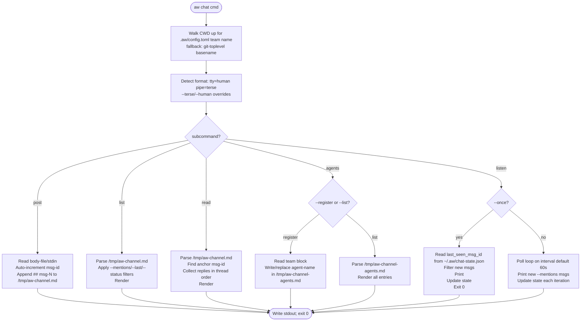

# Score Chat

## Schema: data shapes
<!-- type: schema lang: yaml -->

```yaml
$id: score-chat-schema
description: |
  Data shapes for the `aw chat` verb. The channel file at
  /tmp/aw-channel.md is a plain Markdown file of consecutive ## msg-NNN
  blocks. The agents registry at /tmp/aw-channel-agents.md is a
  plain Markdown file of consecutive ## agent-<name> blocks each containing
  a YAML document. Listen state is persisted in ~/.aw/chat-state.json.
  Team identity is read from [team] in .aw/config.toml (walk-up from CWD).

definitions:
  ChannelMessage:
    $id: "#/definitions/ChannelMessage"
    type: object
    description: |
      One message block inside /tmp/aw-channel.md.
      Serialised as a ## msg-NNN Markdown heading followed by a YAML
      frontmatter block (---) then the body text.
    required: [id, from, timestamp, body]
    properties:
      id:
        type: integer
        description: Auto-incremented message number (1-based). Heading is ## msg-{id}.
      from:
        type: string
        description: Sending team name. Auto-filled from [team] name in .aw/config.toml.
      to:
        type: array
        items:
          type: string
        description: |
          Addressee team names. Comma-separated on the CLI flag; stored as
          YAML sequence. Empty means broadcast. @me resolves to caller team.
      re:
        type: integer
        nullable: true
        description: Anchor msg-id for reply threading. Null on root messages.
      timestamp:
        type: string
        format: date-time
        description: ISO-8601 UTC timestamp written at post time.
      body:
        type: string
        description: Free-form message body. Read from --body-file or stdin.

  AgentRegistration:
    $id: "#/definitions/AgentRegistration"
    type: object
    description: |
      One entry in /tmp/aw-channel-agents.md. Stored as a
      Markdown heading named agent-{name} followed by a YAML document. `aw chat
      agents --register` writes or replaces the caller's entry (idempotent).
    required: [name, wt_path, branch, capabilities]
    properties:
      name:
        type: string
        description: Stable team identifier. Matches [team] name in .aw/config.toml.
      display:
        type: string
        nullable: true
        description: Human-friendly label for UI rendering.
      wt_path:
        type: string
        description: Absolute filesystem path of the worktree root.
      branch:
        type: string
        description: Current git branch for the worktree.
      capabilities:
        type: array
        items:
          type: string
        description: Free-form capability tags declared in [team] capabilities.
      last_seen:
        type: string
        format: date-time
        description: Timestamp written at --register time.

  ListenState:
    $id: "#/definitions/ListenState"
    type: object
    description: |
      ~/.aw/chat-state.json. A map keyed by team name (the caller's own
      identity) containing the last-seen message id and last-polled timestamp.
      Updated by `aw chat listen` after each successful poll.
    additionalProperties:
      type: object
      properties:
        last_seen_msg_id:
          type: integer
          description: Highest msg-id printed in the previous poll. 0 if never polled.
        last_polled_at:
          type: string
          format: date-time
          description: ISO-8601 UTC timestamp of the last poll.

  TeamConfig:
    $id: "#/definitions/TeamConfig"
    type: object
    description: |
      [team] block in .aw/config.toml. Provides the stable agent identity
      used as the `from:` field in posted messages and as the key in ListenState.
    required: [name]
    properties:
      name:
        type: string
        description: Stable identifier. Used as `from:` in ChannelMessage.
      display:
        type: string
        nullable: true
        description: Human-friendly label shown in --human output.
      capabilities:
        type: array
        items:
          type: string
        nullable: true
        description: Capability tags written to AgentRegistration on --register.

  ChatArgs:
    $id: "#/definitions/ChatArgs"
    type: object
    description: Top-level args for `aw chat`. Mirrors IssuesArgs pattern.
    required: [command]
    properties:
      command:
        type: object
        x-rust-type: ChatCommand
        x-clap-command: subcommand
        description: The selected subcommand.
    x-rust-struct:
      derive: [Debug, Args]

  ChatCommand:
    $id: "#/definitions/ChatCommand"
    type: string
    description: Available subcommands for `aw chat`.
    enum: [Post, List, Read, Agents, Listen]
    x-rust-enum:
      derive: [Debug, Subcommand]
      variants:
        - name: Post
          kind: tuple
          doc: Post a new message to the shared channel.
          fields:
            - { rust_type: PostArgs }
        - name: List
          kind: tuple
          doc: List messages from the shared channel.
          fields:
            - { rust_type: ListArgs }
        - name: Read
          kind: tuple
          doc: Read a message thread by anchor msg-id.
          fields:
            - { rust_type: ReadArgs }
        - name: Agents
          kind: tuple
          doc: Register or list agent capabilities.
          fields:
            - { rust_type: AgentsArgs }
        - name: Listen
          kind: tuple
          doc: Poll for new messages addressed to the caller team.
          fields:
            - { rust_type: ListenArgs }

  PostArgs:
    $id: "#/definitions/PostArgs"
    type: object
    description: Args for `aw chat post`.
    properties:
      to:
        type: array
        items:
          type: string
        description: Comma-separated addressee team names. Stored in ChannelMessage.to.
      re:
        type: integer
        nullable: true
        description: Anchor msg-id to reply to. Written as ChannelMessage.re.
      body_file:
        type: string
        description: Path to body file. Use - for stdin.
      terse:
        type: boolean
        description: Force terse (token-efficient) output regardless of TTY.
      human:
        type: boolean
        description: Force human (markdown) output regardless of TTY.

  ListArgs:
    $id: "#/definitions/ListArgs"
    type: object
    description: Args for `aw chat list`.
    properties:
      mentions:
        type: string
        nullable: true
        description: Filter to messages whose to: includes this team. @me resolves to caller.
      last:
        type: integer
        nullable: true
        description: Limit to the N most recent messages.
      status:
        type: string
        enum: [open, all]
        description: Message status filter. Default is open.
      terse:
        type: boolean
        description: Force terse output.
      human:
        type: boolean
        description: Force human output.

  ReadArgs:
    $id: "#/definitions/ReadArgs"
    type: object
    description: Args for `aw chat read`.
    required: [re]
    properties:
      re:
        type: integer
        description: Anchor msg-id. Returns anchor + all replies in thread order.
      full:
        type: boolean
        description: Include full body. Default shows first-line summary only.
      terse:
        type: boolean
        description: Force terse output.
      human:
        type: boolean
        description: Force human output.

  AgentsArgs:
    $id: "#/definitions/AgentsArgs"
    type: object
    description: Args for `aw chat agents`.
    properties:
      register:
        type: boolean
        description: Write or replace caller's AgentRegistration in /tmp/aw-channel-agents.md.
      list:
        type: boolean
        description: Print all registered agents from /tmp/aw-channel-agents.md.
      terse:
        type: boolean
        description: Force terse output.
      human:
        type: boolean
        description: Force human output.

  ListenArgs:
    $id: "#/definitions/ListenArgs"
    type: object
    description: Args for `aw chat listen`.
    properties:
      once:
        type: boolean
        description: Single poll fire, then exit 0. Cron-friendly.
      interval:
        type: integer
        description: Poll interval in seconds. Default 60.
      mentions:
        type: string
        nullable: true
        description: Filter printed messages to @me (caller team) or @all (broadcast).
      terse:
        type: boolean
        description: Force terse output.
      human:
        type: boolean
        description: Force human output.
```
## Logic: chat dispatch
<!-- type: logic lang: mermaid -->


## Changes
<!-- type: changes lang: yaml -->

```yaml
changes:
  - path: crates/score/cli/src/chat.rs
    action: create
    section: logic
    impl_mode: hand-written
    description: |
      New file, ~750-900 LOC. Hand-written. Contains:
      - ChatArgs / ChatCommand Clap structures (5 subcommands: Post, List,
        Read, Agents, Listen). Mirrors IssuesArgs/IssuesCommand pattern.
      - run_chat() top-level dispatch function.
      - detect_team_identity(cwd: &Path) -> String: walks up directory tree
        for .aw/config.toml; reads [team] name if present; falls back to
        git-toplevel directory basename.
      - detect_output_format(terse: bool, human: bool) -> OutputFormat: TTY
        detection via is_tty(); --terse/--human flags override.
      - parse_channel(path: &Path) -> Vec<ChannelMessage>: minimal Markdown
        parser splitting on ## msg-NNN headings; YAML frontmatter parsed via
        serde_yaml.
      - format_terse(msgs: &[ChannelMessage]) -> String: token-efficient
        single-line-per-message format (id from to re timestamp body-first-line).
      - format_human(msgs: &[ChannelMessage]) -> String: full Markdown
        rendering with headings, metadata block, and body.
      - run_post(args: PostArgs): reads body from --body-file or stdin;
        appends ## msg-{N} block to /tmp/aw-channel.md.
      - run_list(args: ListArgs): parses channel; applies --mentions,
        --last, --status filters; renders.
      - run_read(args: ReadArgs): finds anchor by --re, collects replies;
        renders thread.
      - run_agents_register(args: AgentsArgs): reads [team] block; writes
        or replaces ## agent-{name} entry in /tmp/aw-channel-agents.md.
      - run_agents_list(args: AgentsArgs): parses agents file; renders.
      - run_listen(args: ListenArgs): reads ~/.aw/chat-state.json;
        polls /tmp/aw-channel.md; prints new msgs; updates state; loops
        or exits if --once.
      - All file I/O is best-effort (no locking); concurrent appends
        tolerated per R18.

  - path: crates/score/cli/src/lib.rs
    action: modify
    section: logic
    impl_mode: hand-written
    description: |
      Wire `chat` subcommand into the top-level CLI dispatcher. Mirror
      how `issues` and `td` are wired (~5-10 LOC). Add `mod chat;` module
      declaration, `Chat(chat::ChatArgs)` variant to the top-level Command
      enum, and `Command::Chat(args) => chat::run_chat(args)` arm in the
      match dispatcher.

  - path: .aw/config.toml
    action: modify
    section: schema
    impl_mode: hand-written
    description: |
      Add [team] block after [project]:

        [team]
        name = "agentic-workflow"
        display = "Score Team"
        capabilities = ["SDD lifecycle", "codegen pipeline", "score development"]

      This block is used by `aw chat` commands to identify the score
      worktree agent in cross-WT messaging.
  - action: annotate
    section: unit-test
    impl_mode: hand-written
    description: "Traceability metadata edge for the unit-test section."

```
## Tests
<!-- type: tests lang: yaml -->

```yaml
tests:
  - id: T1
    name: post_writes_message
    kind: manual
    description: Verify that `aw chat post` writes a message to the channel file.
    steps:
      - run: "rm -f /tmp/aw-channel.md"
      - run: "echo 'hello from score' | aw chat post --to mamba --body-file -"
      - run: "grep '## msg-1' /tmp/aw-channel.md"
    expected: |
      /tmp/aw-channel.md is created. The file contains a `## msg-1` heading
      block with `from: score`, `to: [mamba]`, a UTC timestamp, and the body
      `hello from score`. Exit code 0.

  - id: T2
    name: list_terse_non_tty
    kind: manual
    description: Verify that `aw chat list` on a non-tty pipe renders terse format.
    steps:
      - run: "aw chat list --terse"
    expected: |
      Output is one line per message: `msg-1 | score -> mamba | <timestamp> | hello from score`.
      Token count is substantially less than the human format. Exit code 0.

  - id: T3
    name: read_thread
    kind: manual
    description: Verify that `aw chat read --re 1` returns the anchor plus replies.
    steps:
      - run: "echo 'ack' | aw chat post --re 1 --body-file -"
      - run: "aw chat read --re 1 --human"
    expected: |
      Output shows `## msg-1` block followed by the reply block (`re: 1`), in
      thread order. Both messages include full body content. Exit code 0.

  - id: T4
    name: agents_register_and_list
    kind: manual
    description: Verify that `--register` writes the agent entry and `--list` retrieves it.
    steps:
      - run: "rm -f /tmp/aw-channel-agents.md"
      - run: "aw chat agents --register"
      - run: "aw chat agents --list"
    expected: |
      After `--register`, `/tmp/aw-channel-agents.md` contains a
      `## agent-score` heading with a YAML block including `name: score`,
      `wt_path`, `branch`, `capabilities`, and `last_seen`. Running `--list`
      prints the entry in human or terse format. A second `--register` is
      idempotent (replaces the prior entry, no duplicate headings). Exit code 0.

  - id: T5
    name: listen_once_poll
    kind: manual
    description: Verify that `aw chat listen --once` prints new messages and updates state.
    steps:
      - run: "rm -f ~/.aw/chat-state.json"
      - run: "aw chat listen --once --mentions @me"
    expected: |
      On first run: all messages in `/tmp/aw-channel.md` addressed to the
      caller team (or all messages if none specifically addressed) are printed;
      `~/.aw/chat-state.json` is created with `last_seen_msg_id` set to
      the highest msg-id seen; exit code 0. On a second run with no new
      messages, nothing is printed and `last_seen_msg_id` is unchanged.
```

# Reviews

## Review 1
<!-- type: review lang: markdown -->

**Verdict:** approved

- [schema] `TeamConfig` definition does not include a `wt_path` property, yet `AgentRegistration` requires `wt_path` and the `run_agents_register` description says it reads that value from the `[team]` block. The `.aw/config.toml` snippet in `[changes]` also omits `wt_path`. The implementation can derive `wt_path` from the CWD/git-toplevel at runtime without needing it in config, so this is not a blocker — but consider adding a note to `AgentRegistration.wt_path` clarifying it is derived from runtime CWD rather than read from `[team]` config.
