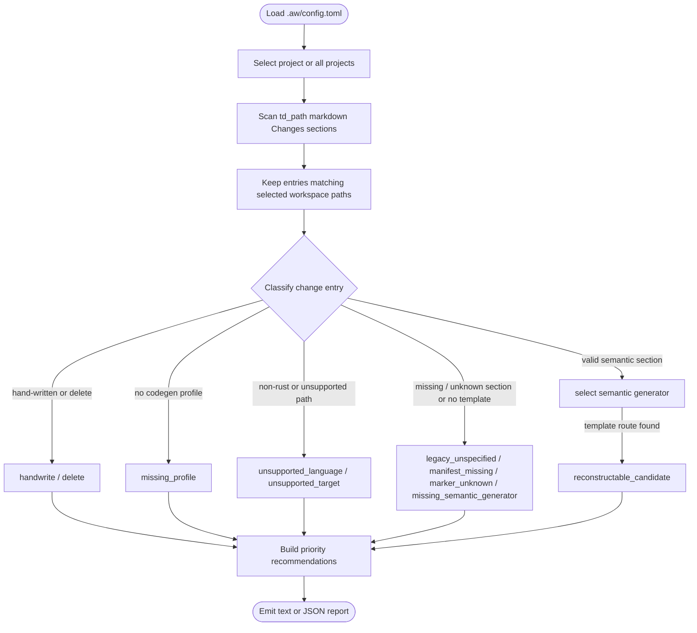

# Score Gen Reconstructability

## Cli
<!-- type: cli lang: yaml -->

```yaml
command: score gen reconstructability
args:
  project:
    kind: positional
    required: false
    description: Project name from .aw/config.toml. When omitted, report every configured project.
  json:
    kind: flag
    spelling: --json
    description: Emit the full machine-readable report instead of the text summary.
```

## Schema
<!-- type: schema lang: yaml -->

```yaml
definitions:
  ReconstructabilityReport:
    type: object
    required: [project, td_path, workspaces, totals, semantic_coverage, recommendations, entries]
    properties:
      project: { type: string }
      td_path: { type: string }
      workspaces:
        type: array
        items: { $ref: "#/definitions/WorkspaceReport" }
      totals:
        type: object
        additionalProperties: { type: integer }
      semantic_coverage:
        $ref: "#/definitions/SemanticCoverage"
      recommendations:
        type: array
        items: { $ref: "#/definitions/ReconstructabilityRecommendation" }
      entries:
        type: array
        items: { $ref: "#/definitions/ReconstructabilityEntry" }

  WorkspaceReport:
    type: object
    required: [name, paths]
    properties:
      name: { type: string }
      paths: { type: array, items: { type: string } }
      target: { type: string }
      codegen_profile: { type: string }

  SemanticCoverage:
    type: object
    required:
      - codegen_entries
      - reconstructable_entries
      - non_reconstructable_entries
      - handwrite_entries
      - percent
      - by_section
      - by_generation_basis
    properties:
      codegen_entries:
        type: integer
        description: >
          Denominator for semantic reconstructability. Counts TD Changes
          entries whose impl_mode is codegen, not source files or marker
          blocks.
      reconstructable_entries: { type: integer }
      non_reconstructable_entries: { type: integer }
      handwrite_entries: { type: integer }
      percent: { type: number }
      by_section:
        type: array
        items: { $ref: "#/definitions/SectionCoverage" }
      by_generation_basis:
        type: array
        items: { $ref: "#/definitions/GenerationBasisCoverage" }

  SectionCoverage:
    type: object
    required:
      - section
      - codegen_entries
      - reconstructable_entries
      - non_reconstructable_entries
      - percent
    properties:
      section:
        type: string
        description: Semantic section type from TD Changes, or `(missing)`.
      codegen_entries: { type: integer }
      reconstructable_entries: { type: integer }
      non_reconstructable_entries: { type: integer }
      percent: { type: number }

  GenerationBasisCoverage:
    type: object
    required:
      - basis
      - codegen_entries
      - reconstructable_entries
      - non_reconstructable_entries
      - percent
    properties:
      basis:
        type: string
        enum:
          - source-template
          - section-template
          - test-template
          - typed-payload-generator
          - mermaid-structured-generator
          - structured-generator
          - legacy-language-template
          - semantic-generator
          - (unrouted)
        description: >
          How the generator reconstructs the entry. Source-template is whole
          source replay, section-template is still template-backed but keyed by
          semantic TD section content, test-template is template-backed test
          source emission, typed-payload-generator consumes parsed TD AST
          payloads such as schema/cli/config/rpc-api, mermaid-structured-generator
          consumes structured Mermaid Plus payloads, structured-generator is a
          non-source template generator such as manifest emission,
          legacy-language-template is a backward-compatible language-specific
          route, and semantic-generator is reserved for richer AST/model-driven
          generators.
      codegen_entries: { type: integer }
      reconstructable_entries: { type: integer }
      non_reconstructable_entries: { type: integer }
      percent: { type: number }

  ReconstructabilityRecommendation:
    type: object
    required: [priority, classification, count, title, action, examples]
    properties:
      priority: { type: integer, minimum: 1 }
      classification: { type: string }
      count: { type: integer, minimum: 1 }
      title: { type: string }
      action: { type: string }
      examples:
        type: array
        items: { $ref: "#/definitions/ReconstructabilityExample" }

  ReconstructabilityExample:
    type: object
    required: [spec, path]
    properties:
      spec: { type: string }
      path: { type: string }
      section: { type: string }
      semantic_generator:
        type: string
        description: >
          Profile-selected generator/template route, e.g.
          `rust/score-crate:source-template:logic`. This keeps the TD
          section type semantic while putting language-specific details in the
          workspace profile mapping.

  ReconstructabilityEntry:
    type: object
    required:
      - spec
      - path
      - action
      - impl_mode
      - classification
      - reason
    properties:
      spec: { type: string }
      path: { type: string }
      action: { type: string }
      section: { type: string }
      impl_mode: { type: string }
      workspace: { type: string }
      workspace_target: { type: string }
      codegen_profile: { type: string }
      semantic_generator:
        type: string
        description: >
          The selected semantic generator/template route. It is derived from
          `codegen_profile`, workspace target, target path, and semantic
          section type. Absence means the section is valid but the profile has
          no template for that path/section pair.
      generation_basis:
        type: string
        description: >
          Maturity layer for the selected route: source-template,
          section-template, test-template, typed-payload-generator,
          mermaid-structured-generator, structured-generator,
          legacy-language-template, or semantic-generator. This keeps the
          language-neutral section type separate from the generator implementation
          strategy.
      classification:
        type: string
        enum:
          - reconstructable_candidate
          - legacy_unspecified_section
          - manifest_missing_section
          - marker_only_or_unknown_section
          - missing_semantic_generator
          - unsupported_target
          - unsupported_language
          - missing_profile
          - outside_workspace
          - handwrite
          - delete
      reason: { type: string }
```

## Logic
<!-- type: logic lang: mermaid -->



## Changes
<!-- type: changes lang: yaml -->

```yaml
changes:
  - path: projects/agentic-workflow/src/cli/commands.rs
    action: modify
    section: cli
    impl_mode: codegen
    description: |
      Add `score gen reconstructability [project] [--json]` to the clap command surface.
  - path: projects/agentic-workflow/src/cli/codegen.rs
    action: modify
    section: schema
    impl_mode: codegen
    description: |
      Add serializable report, workspace, semantic coverage, recommendation, example,
      and entry structs. Semantic coverage uses codegen Changes entries as the
      denominator and reports per-section reconstructability.
  - path: projects/agentic-workflow/src/cli/codegen.rs
    action: modify
    section: logic
    impl_mode: hand-written
    description: |
      Implement config loading, TD Changes scanning, workspace filtering, classification,
      recommendation building, and text/JSON output.
  - path: projects/agentic-workflow/src/cli/codegen.rs
    action: modify
    section: logic
    impl_mode: codegen
    description: |
      Add semantic_generator selection to reconstructability entries and examples.
      The selector maps broad section types such as source/schema/logic/cli/tests plus
      workspace codegen.profile and target path onto language-specific template
      routes. Do not add Rust-only section types for every declaration shape;
      extend the profile mapping instead.
  - path: projects/agentic-workflow/src/cli/codegen.rs
    action: modify
    section: logic
    impl_mode: codegen
    description: |
      Compute semantic_coverage from classified Changes entries. The denominator is
      the count of impl_mode: codegen entries, not file-marker coverage; hand-written
      entries are reported separately so the report can distinguish managed wrapper
      coverage from fully semantic codegen coverage.
  - path: projects/agentic-workflow/src/cli/codegen.rs
    action: modify
    section: logic
    impl_mode: codegen
    description: |
      Add generation_basis reporting so reconstructability distinguishes whole-source
      template replay, section-keyed template generation, test templates,
      typed-payload generators, Mermaid structured generators, and future semantic/
      AST-backed generators. Keep legacy Rust-specific aliases in a separate
      legacy-language-template bucket. This lets TD section content and generator
      maturity evolve together without making section types language-specific.
  - path: projects/agentic-workflow/src/cli/codegen.rs
    action: modify
    section: logic
    impl_mode: codegen
    description: |
      Restrict reconstructability Changes scanning to top-level `## Changes`
      TD sections. Indented Markdown inside source fixtures, examples, or raw
      strings must not create phantom TD entries or recommendation noise.
  - path: projects/agentic-workflow/src/cli/codegen.rs
    action: modify
    section: logic
    impl_mode: codegen
    description: |
      Treat `section: source` as a cross-language raw-source replay route for
      common source/document files (`.rs`, `.ts`, `.tsx`, `.js`, `.jsx`,
      `.json`, `.html`, `.css`, `.md`, `.sh`). This keeps TD section types semantic
      while allowing the profile/template selector to cover Rust and
      TypeScript source files plus Score hook/template artifacts without
      inventing language-specific sections.
  - path: projects/agentic-workflow/src/cli/codegen.rs
    action: modify
    section: logic
    impl_mode: codegen
    description: |
      Exclude delete actions from semantic reconstructability coverage and from
      the first-blocker list. Deletes are useful lifecycle entries, but they do
      not require a generator to reconstruct source content.
  - action: annotate
    section: unit-test
    impl_mode: hand-written
    description: "Traceability metadata edge for the unit-test section."

```

## Test Plan

```mermaid
---
id: score_gen_reconstructability_test_plan
requirements:
  r1_classification_matrix:
    id: R1
    text: "Unit tests cover candidate, missing profile, legacy unspecified section, manifest missing section, missing semantic generator, semantic coverage denominator, generation basis including legacy language templates, and recommendation priority ordering"
    kind: functional
    risk: high
    verify: test
  r2_command_registration:
    id: R2
    text: "cargo build -p agentic-workflow compiles the command registration into the aw binary"
    kind: interface
    risk: medium
    verify: build
  r3_text_report:
    id: R3
    text: "target/debug/score gen reconstructability sdd parses real config and emits a prioritized text summary"
    kind: integration
    risk: medium
    verify: command
  r4_json_report:
    id: R4
    text: "target/debug/score gen reconstructability sdd --json emits the full machine-readable report"
    kind: integration
    risk: medium
    verify: command
elements:
  unit_reconstructability:
    kind: test
    type: "cargo test -p agentic-workflow reconstructability -- --nocapture"
  build_score:
    kind: build
    type: "cargo build -p agentic-workflow"
  run_text_report:
    kind: command
    type: "./target/debug/score gen reconstructability sdd"
  run_json_report:
    kind: command
    type: "./target/debug/score gen reconstructability sdd --json"
relations:
  - {from: unit_reconstructability, verifies: r1_classification_matrix}
  - {from: build_score, verifies: r2_command_registration}
  - {from: run_text_report, verifies: r3_text_report}
  - {from: run_json_report, verifies: r4_json_report}
---
requirementDiagram
    requirement R1 {
      id: R1
      text: "classification matrix and recommendation ordering covered"
      risk: high
      verifymethod: test
    }
    requirement R2 {
      id: R2
      text: "command registration compiles into score"
      risk: medium
      verifymethod: test
    }
    requirement R3 {
      id: R3
      text: "text report works against real SDD config and specs"
      risk: medium
      verifymethod: test
    }
    requirement R4 {
      id: R4
      text: "JSON report serializes full ReconstructabilityReport"
      risk: medium
      verifymethod: test
    }
    element unit_reconstructability {
      type: "cargo test -p agentic-workflow reconstructability -- --nocapture"
    }
    element build_score {
      type: "cargo build -p agentic-workflow"
    }
    element run_text_report {
      type: "./target/debug/score gen reconstructability sdd"
    }
    element run_json_report {
      type: "./target/debug/score gen reconstructability sdd --json"
    }
    unit_reconstructability - verifies -> R1
    build_score - verifies -> R2
    run_text_report - verifies -> R3
    run_json_report - verifies -> R4
```

<!-- type: test-plan lang: mermaid -->


