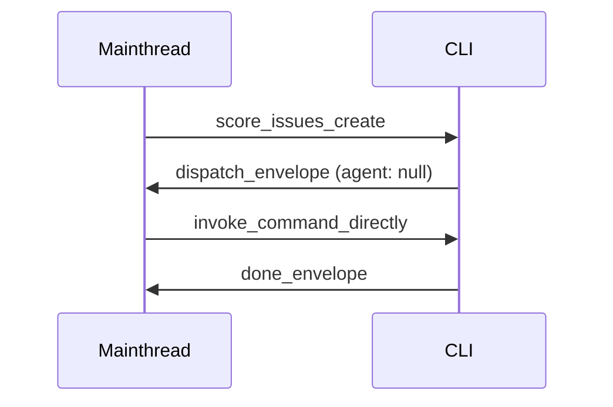

## Interaction: mainthread-direct dispatch
<!-- type: interaction lang: mermaid -->


## Changes
<!-- type: changes lang: yaml -->

```yaml
# Phase 1: rewrite all dispatch envelope builders to emit agent: null
# Each entry is impl_mode: hand-written (direct field edit, no codegen)

changes:
  - path: projects/agentic-workflow/src/cli/issues.rs
    action: modify
    impl_mode: hand-written
    description: |
      Nine dispatch emit sites:
      1. fn issues_create (line ~1072): IssueEnvelope::Dispatch { agent: Some("score-issue-author"), ... }
         → agent: None
      2. fn run_fill_section (line ~1146): LifecycleMetrics { agent: Some("score-issue-author".to_string()), ... }
         → agent: None  [Note: LifecycleMetrics.agent is a metadata field, not the envelope agent; set to None]
      3. fn validate (reviewer dispatch, line ~1498): IssueEnvelope::Dispatch { agent: Some("score-issue-reviewer".to_string()), ... }
         → agent: None
      4. fn validate (all-sections complete, line ~2269): IssueEnvelope::Dispatch { agent: Some("score-issue-reviewer"), ... }
         → agent: None
      5. fn validate (needs-revision verdict, line ~2469): IssueEnvelope::Dispatch { agent: Some("score-issue-reviser"), ... }
         → agent: None
      6. fn validate (post-revise reviewer, line ~2580): IssueEnvelope::Dispatch { agent: Some("score-issue-reviewer"), ... }
         → agent: None
      7. fn issues_idle (td stalled, line ~3173): IssueEnvelope::Dispatch { agent: Some("score-td-author"), ... }
         → agent: None
      8. fn issues_idle (issue stalled, line ~3396): IssueEnvelope::Dispatch { agent: Some("score-issue-author"), ... }
         → agent: None
      9. fn issues_idle (td stalled string, line ~3859): envelope builder agent: Some("score-td-author".to_string())
         → agent: None
      Before: agent: Some("score-issue-author" | "score-issue-reviewer" | "score-issue-reviser" | "score-td-author")
      After:  agent: None

  - path: projects/agentic-workflow/src/cli/td.rs
    action: modify
    impl_mode: hand-written
    description: |
      Three dispatch emit sites using TdEnvelope::Dispatch { agent: Some(...), ... }:
      1. fn td_create brief emit (line ~1065): agent: Some("score-td-author")  → agent: None
      2. fn validate reviewer dispatch (line ~1676): agent: Some("score-td-reviewer") → agent: None
      3. fn validate reviser dispatch (line ~1769): agent: Some("score-td-reviser")  → agent: None
      4. fn validate post-revise reviewer (line ~1876): agent: Some("score-td-reviewer") → agent: None
      Before: agent: Some("score-td-author" | "score-td-reviewer" | "score-td-reviser")
      After:  agent: None

  - path: projects/agentic-workflow/src/cli/cb_fill.rs
    action: modify
    impl_mode: hand-written
    description: |
      One dispatch emit site using serde_json::json! macro (line ~311):
        "agent": "score-cb-handwriter"
      → "agent": null
      Before: "agent": "score-cb-handwriter"
      After:  "agent": null  (serde_json::Value::Null or JSON null literal)

  - path: projects/agentic-workflow/src/cli/cb_review.rs
    action: modify
    impl_mode: hand-written
    description: |
      Two dispatch emit sites using serde_json::json! macro:
      1. Brief dispatch (line ~111): "agent": "score-cb-reviewer" → "agent": null
      2. NeedsRevision dispatch (line ~321): "agent": "score-cb-reviser" → "agent": null
      Note: score-cb-reviewer agent definition does not exist under .claude/agents/;
      setting agent: null here is a correctness fix, not just deprecation.
      Before: "agent": "score-cb-reviewer" | "score-cb-reviser"
      After:  "agent": null

  - path: projects/agentic-workflow/src/cli/cb_revise.rs
    action: modify
    impl_mode: hand-written
    description: |
      One dispatch emit site using serde_json::json! macro:
      1. Brief dispatch (line ~113): "agent": "score-cb-reviser" → "agent": null
      Note: same pattern as cb_review.rs; score-cb-reviser agent definition does not
      exist under .claude/agents/; setting agent: null is a correctness fix.
      Before: "agent": "score-cb-reviser"
      After:  "agent": null

  ### Test Plan

  Existing tests that must continue passing after all envelope-builder edits:
  - projects/agentic-workflow/tests/cb_fill_test.rs — full cb-fill workflow tests
  - Any td_test.rs / issues_test.rs in projects/agentic-workflow/tests/ that exercise
    create, validate, or review flows

  New assertions to add (inline or in a dedicated test):
  - Run `aw wi create --title 'x' --json` in a temp worktree;
    parse stdout as JSON; assert envelope["agent"] == null (or is absent).
  - Run `aw cb review <slug> --json` in a temp worktree (after a cb fill);
    parse stdout as JSON; assert envelope["agent"] == null. This covers the
    serde_json::json! macro emit paths in cb_review.rs and cb_revise.rs where
    the grep criterion alone does not verify serialized runtime output.

  Acceptance criteria (grep-level):
  - grep -rE '"agent":\s*Some\("score-' projects/agentic-workflow/src/cli/ → 0 matches
  - grep -rE '"agent":\s*"score-' projects/agentic-workflow/src/cli/ → 0 matches
  - cargo build -p agentic-workflow → exit 0
  - cargo test -p agentic-workflow --tests → exit 0
  - action: annotate
    section: interaction
    impl_mode: hand-written
    description: "Traceability metadata edge for the interaction section."

```

# Reviews

## Review 1
<!-- type: review lang: markdown -->

**Verdict:** needs-revision

- [changes] (item 6) `cb_revise.rs` is missing from the `## Changes` list entirely. `projects/agentic-workflow/src/cli/cb_revise.rs:113` contains `"agent": "score-cb-reviser"` in a `serde_json::json!` dispatch envelope — confirmed by grep. This is the same pattern as the two sites covered in `cb_review.rs`. Without this file in the changes list, the acceptance criterion `grep -rE '"agent":\s*"score-' projects/agentic-workflow/src/cli/ → 0 matches` will still fail after the spec is fully implemented. Add a `cb_revise.rs` entry under `changes` with the same pattern as the `cb_review.rs` entry (one site, line ~113, `"agent": "score-cb-reviser"` → `"agent": null`).

- [changes] (item 5) The `issues.rs` description covers 9 emit sites but the spec says "Three dispatch emit sites" in the header line for that file (the prose opens with "Three dispatch emit sites:" despite listing items 1–9). This is a counting error in the description but does not affect correctness since all 9 are enumerated and matched by grep. Noted as a nit — not blocking; the grep-level acceptance criterion and the explicit list cover the actual sites correctly.

- [changes] (item 3) The test plan adds a new assertion for `aw wi create --json` checking `envelope["agent"] == null`, but provides no analogous check for `cb_fill`, `cb_review`, or `cb_revise` flows. Because those files use `serde_json::json!` macros (not typed structs), the grep acceptance criterion alone does not verify the serialized JSON output at runtime. The test plan should add at minimum one assertion that a `aw cb fill` or `aw cb review` command emits `"agent": null` (not the string literal) in its stdout envelope, to confirm the `serde_json::json!` edit serializes correctly.

## Review 2
<!-- type: review lang: markdown -->

**Verdict:** approved

- [changes] All three Round-1 findings are addressed: (1) `cb_revise.rs` entry is present with one emit site at line ~113 (`"agent": "score-cb-reviser"` → `"agent": null`), matching the blocking finding's requested fix. (2) `issues.rs` header now correctly reads "Nine dispatch emit sites:". (3) Test plan now includes a `aw cb review <slug> --json` runtime assertion covering the `serde_json::json!` macro paths in `cb_review.rs` and `cb_revise.rs`.

- [changes] Nit (non-blocking): `td.rs` description header still reads "Three dispatch emit sites" but enumerates four items (1–4). The four sites are all correctly listed and match the acceptance grep, so implementation is unambiguous. No revision required.

## Traceability Changes
<!-- type: changes lang: yaml -->

```yaml
# aw-traceability-repair-1780398547209
changes:
  - action: annotate
    section: interaction
    impl_mode: hand-written
    description: "Traceability metadata edge for the interaction section."
```
