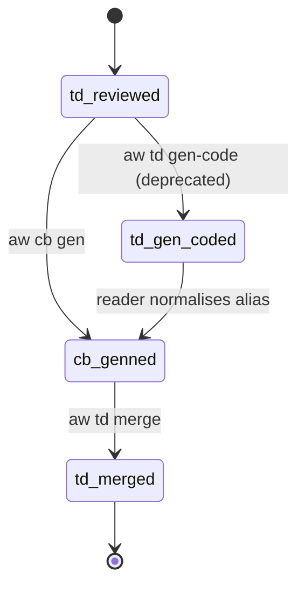
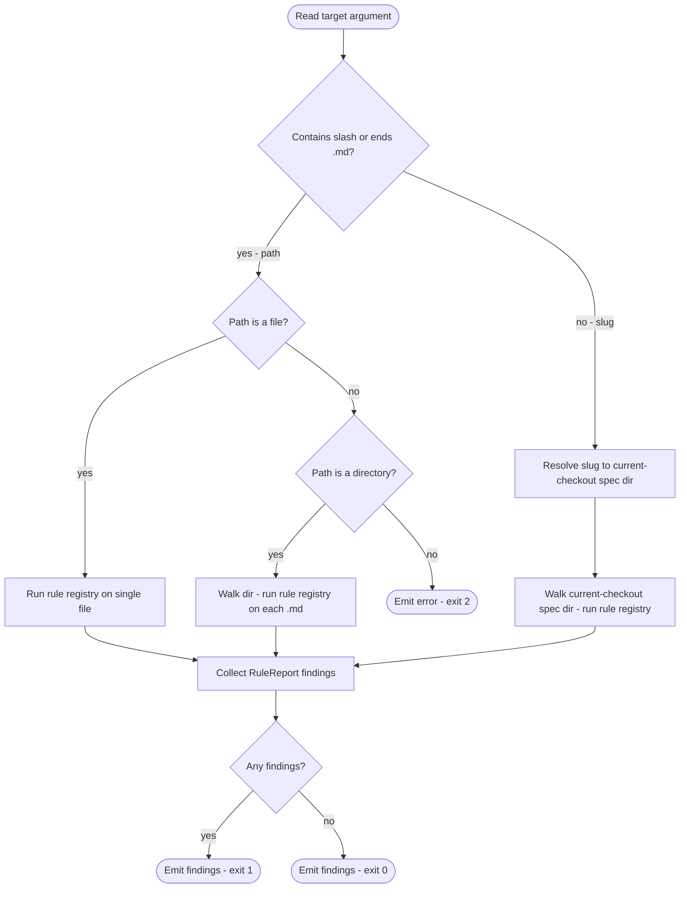

# Score Namespaces — Phase 1

> **Phase C root note.** Current `aw td` and `aw cb` commands resolve
> their filesystem root via `find_project_root()` from the CLI process CWD and
> operate in that checkout. Lifecycle idle scanners and per-slug Score
> workspaces are removed from the public command surface.

## CLI: score-namespaces
<!-- type: cli lang: yaml -->

```yaml
$schema: "https://json-schema.org/draft/2020-12/schema"
$id: score-namespaces#cli
title: Score Namespace Registry — Phase 1
description: >
  Introduces the `cb` top-level namespace and the `td check` subcommand.
  All seven deprecated aliases are registered as transparent stubs that
  print one stderr deprecation line and delegate to the canonical verb.
  No behaviour is changed — moves and aliases only.

commands:
  cb:
    description: "Code-artifact verbs (codegen, audit). New top-level namespace."
    subcommands:
      gen:
        description: >
          Generate implementation code. Slug mode generates from an approved
          TD spec, advances phase to `cb_genned`, commits
          `Lifecycle-Stage: Cb-Gen`, and emits a dispatch envelope.
          `--force-regen --project <project>` scans that project's configured
          `path` / `workspaces.paths` source scope, reads each codegen-owned
          file's `SPEC-MANAGED` managed ref, and replays the `section: source`
          entries from those canonical TD specs under the configured `td_path`.
          It does not update issue phase, commit, or dispatch lifecycle.
          `--verify` performs that same replay in a temporary checkout copy
          and byte-compares the generated project source scope against the
          current checkout without mutating the current checkout. It also
          emits deterministic conformance counts for SPEC-MANAGED ownership,
          CODEGEN blocks, AST parseability, source-template provenance, and
          codegen audit status. It also reports public API semantic
          conformance by comparing AST public symbols against structured TD
          schema/logic sections plus machine-readable Overview symbol tables
          and public-signature fences, so target-derived source templates can
          expose exactly which public symbols still need structured TD coverage.
          Verify mode fails when any supported source file lacks CODEGEN
          ownership or public API semantic conformance is incomplete; a
          successful verify therefore proves byte-equivalent replay, 100%
          source-file CODEGEN coverage, and 100% public-symbol TD coverage for
          the checked project scope.
          Minified viewer assets under `assets/*.min.js` are reported as
          ignored asset files, not unmanaged source gaps.
          `--sync-public-api` is a mutating `--force-regen` helper that
          refreshes AST-derived Overview public API manifests in each canonical
          source TD before replaying source. It is intentionally rejected with
          `--verify`, because verify mode is read-only.
          `--semantic-sample RATIO` prints a stable
          sample of target-derived source sections that still require agent
          semantic review.
          Replaces `aw td gen-code` for slug mode.
        args:
          - name: slug
            required: false
            type: string
            description: "Issue slug identifying the approved tech-design. Omit with --force-regen."
        flags:
          - name: force-regen
            type: boolean
            default: false
            description: "Replay canonical SPEC-MANAGED TD source entries for files under the configured project source scope."
          - name: project
            type: string
            required: false
            description: "Required with --force-regen; selects the configured project td_path and source scope."
          - name: dry-run
            type: boolean
            default: false
            description: "Preview --force-regen replay without writing files."
          - name: verify
            type: boolean
            default: false
            description: "Replay canonical source TD entries in a temporary copy and fail unless project sources are byte-equivalent afterward."
          - name: semantic-sample
            type: float
            required: false
            description: "With --verify, print a deterministic sample of source sections that still require agent semantic review; use a ratio such as 0.15."
          - name: sync-public-api
            type: boolean
            default: false
            description: "With --force-regen, update AST-derived Overview public API manifests in source TD specs before replaying source. Mutating; rejected with --verify."
        exit_codes:
          0: "Pipeline succeeded; slug mode emits envelope, force-regen mode prints replay summary."
          1: "Validation or codegen error."
          2: "Invocation error (slug not found, wrong phase, or neither slug nor --force-regen supplied)."

      check:
        description: >
          Audit code-space files for CODEGEN drift, MarkerGap, and
          Uncovered items. Replaces `aw td audit`.
          `--group-by gap` subsumes deprecated `score sdd coverage`.
        args:
          - name: target
            required: true
            type: string
            description: "Issue slug or file/directory path to audit."
        flags:
          - name: group-by
            type: string
            enum: [gap, file, status]
            default: status
            description: "Aggregate audit findings by gap, file, or status."
          - name: json
            type: boolean
            default: false
            description: "Emit JSON instead of human text."
        exit_codes:
          0: "No findings."
          1: "Findings present."
          2: "Invocation error."

      claim:
        description: >
          Adopt existing code via the fillback pipeline. Writes generated
          TD spec to `.aw/tech-design/<group>/`; inside an initialized git checkout
          commits `Lifecycle-Stage: Cb-Claim`. Phase 2 recovery verb.
        args:
          - name: code-path
            required: true
            type: string
        flags:
          - name: init
            type: boolean
            default: false
          - name: issue-stub
            type: boolean
            default: false
          - name: group
            type: string
          - name: json
            type: boolean
            default: false

            default: true

      # Phase 3 marker-fill verb. See projects/agentic-workflow/tech-design/surface/specs/score-cb-fill-workflow.md for full schema.
      # @spec projects/agentic-workflow/tech-design/surface/specs/score-cb-fill-workflow.md#cli
      fill:
        description: >
          Phase 3: fill HANDWRITE-BEGIN/END marker blocks in generated
          code. Brief mode (default) emits a dispatch envelope to
          `score-cb-handwriter` with the marker list and approved TD
          spec path. `--apply --marker <id>` mode merges
          `.aw/payloads/<slug>/<id>.md` into the matching block; on
          the last marker, runs `cb check` as a gate, commits
          `Lifecycle-Stage: Cb-Fill`, advances phase to `cb_filled`,
          and dispatches `aw td merge`.
        args:
          - name: slug
            required: true
            type: string
        flags:
          - name: apply
            type: boolean
            default: false
          - name: marker
            type: string
          - name: json
            type: boolean
            default: false
          - name: force
            type: boolean
            default: false

  td:
    description: "Tech-design lifecycle verbs. Receives new `check` subcommand."
    subcommands:
      check:
        description: >
          Read-only rule-registry check against `.aw/tech-design/` files.
          Accepts a slug (resolved in the current checkout), a single file path,
          or a directory. Runs R3*/R6a/R6b/R7a-R7f rules. No commit, no
          phase advance, no envelope. Exits non-zero on any violation.
          Absorbs deprecated `aw validate-spec-structure` and
          `aw check-alignment`.
        args:
          - name: target
            required: true
            type: string
            description: "Issue slug, spec file path, or directory to check."
        flags:
          - name: json
            type: boolean
            default: false
            description: "Emit findings as JSON array."
        exit_codes:
          0: "No violations found."
          1: "One or more rule violations found."
          2: "Invocation error (target not resolvable)."

      gen-code:
        description: "DEPRECATED. Transparent alias → `aw cb gen <slug>`."
        deprecated: true
        deprecated_message: "deprecated: use 'aw cb gen' instead"
        delegates_to: "aw cb gen"
        args:
          - name: slug
            required: true
            type: string

      audit:
        description: "DEPRECATED. Transparent alias → `aw cb check <path>`."
        deprecated: true
        deprecated_message: "deprecated: use 'aw cb check' instead"
        delegates_to: "aw cb check"
        args:
          - name: target
            required: true
            type: string
        flags:
          - name: group-by
            type: string
            enum: [gap, file, status]

      validate:
        description: >
          CHANGED. Slug-only after Phase 1.
          Path-mode and `--check` flag removed; use `td check` instead.
        notes:
          - "Path argument containing '/' or ending in '.md' → route to td check (Phase 1 compat shim)."
          - "`--check` flag removed; if present, print deprecation and route to td check."

      claim:
        description: >
          Adopt an on-disk TD spec into the score lifecycle. Uses the
          current project branch; only activates `td-<slug>` from `main`.
          Sets phase `td_reviewed` (bypass CRRR),
          commits `Lifecycle-Stage: Td-Claim` + `Claim-Source:` sub-trailer,
          dispatches `aw cb gen`. Idempotent unless `--force-rebase`.
          Phase 2 recovery verb.
        args:
          - name: slug
            required: true
            type: string
        flags:
          - name: from-path
            type: string
          - name: force-rebase
            type: boolean
            default: false
          - name: json
            type: boolean
            default: false

  validate-spec-structure:
    description: "DEPRECATED. Transparent alias → `aw td check`."
    deprecated: true
    deprecated_message: "deprecated: use 'aw td check' instead"
    delegates_to: "aw td check"
    args:
      - name: path
        required: false
        type: string
    flags:
      - name: all
        type: boolean

  check-alignment:
    description: "DEPRECATED. Transparent alias → `aw td check`."
    deprecated: true
    deprecated_message: "deprecated: use 'aw td check' instead"
    delegates_to: "aw td check"
    args:
      - name: path
        required: false
        type: string
    flags:
      - name: json
        type: boolean

  sdd:
    description: "SDD audit verbs (retained; `coverage` is deprecated)."
    subcommands:
      coverage:
        description: "DEPRECATED. Transparent alias → `aw cb check --group-by gap`."
        deprecated: true
        deprecated_message: "deprecated: use 'aw cb check --group-by gap' instead"
        delegates_to: "aw cb check --group-by gap"
        flags:
          - name: workspace-root
            type: string
            description: "Root directory to audit."

deprecation_contract:
  stderr_format: "deprecated: use 'score <new>' instead"
  exit_code_parity: true
  stdout_parity: true
  window: one_release
  removal_trigger: "next minor release bump"

aliases:
  - old: "aw td gen-code <slug>"
    new: "aw cb gen <slug>"
    trailer_rename: "Td-GenCode → Cb-Gen"
  - old: "aw td audit <path>"
    new: "aw cb check <path>"
    trailer_rename: ~
  - old: "aw td validate <path>"
    new: "aw td check <path>"
    trailer_rename: ~
  - old: "aw td validate <slug> --check"
    new: "aw td check <slug>"
    trailer_rename: ~
  - old: "aw validate-spec-structure"
    new: "aw td check"
    trailer_rename: ~
  - old: "aw check-alignment"
    new: "aw td check"
    trailer_rename: ~
  - old: "score sdd coverage"
    new: "aw cb check --group-by gap"
    trailer_rename: ~
```
## State Machine: cb-gen phase lifecycle
<!-- type: state-machine lang: mermaid -->


## Logic: td-check path resolution
<!-- type: logic lang: mermaid -->


## Schema
<!-- type: schema lang: yaml -->

```yaml
"$schema": "https://json-schema.org/draft/2020-12/schema"
$id: score-namespaces#schema
definitions:
  IssuePhase:
    type: string
    description: >
      Issue phase enum. Phase 1 adds `cb_genned` as the canonical post-gencode
      phase. `td_gen_coded` is accepted as a reader alias for one release;
      all new writes use `cb_genned`.
    enum:
      - td_inited
      - td_created
      - td_reviewed
      - td_revised
      - cb_genned
      - td_gen_coded
      - td_merged
    x-rust-enum:
      derive: [Debug, Clone, Copy, PartialEq, Eq, Serialize, Deserialize]
      variants:
        - name: TdInited
          rename: "td_inited"
          doc: "Tech-design branch activated."
        - name: TdCreated
          rename: "td_created"
          doc: "Spec authored."
        - name: TdReviewed
          rename: "td_reviewed"
          doc: "Spec reviewed and approved."
        - name: TdRevised
          rename: "td_revised"
          doc: "Flagged sections revised."
        - name: CbGenned
          rename: "cb_genned"
          doc: "Code generated via `aw cb gen`. Canonical Phase 1+ phase."
        - name: TdGenCoded
          rename: "td_gen_coded"
          doc: "Legacy alias for CbGenned. Accepted by readers for one release; never written."
        - name: TdMerged
          rename: "td_merged"
          doc: "Spec merged to main."

  LifecycleTrailer:
    type: string
    description: >
      Git commit trailer values for Lifecycle-Stage.
      Phase 1 adds `Cb-Gen`; `Td-GenCode` is recognised by readers for one release.
    enum:
      - TdInit
      - TdCreate
      - TdValidate
      - TdReview
      - TdRevise
      - CbGen
      - TdGenCode
      - TdMerge
    x-rust-enum:
      derive: [Debug, Clone, Copy, PartialEq, Eq, Serialize, Deserialize]
      variants:
        - name: TdInit
          rename: "Td-Init"
          doc: "Worktree initialised."
        - name: TdCreate
          rename: "Td-Create"
          doc: "Spec authored."
        - name: TdValidate
          rename: "Td-Validate"
          doc: "Spec validated."
        - name: TdReview
          rename: "Td-Review"
          doc: "Spec reviewed."
        - name: TdRevise
          rename: "Td-Revise"
          doc: "Spec revised."
        - name: CbGen
          rename: "Cb-Gen"
          doc: "Code generated (canonical Phase 1+ trailer)."
        - name: TdGenCode
          rename: "Td-GenCode"
          doc: "Legacy trailer alias for Cb-Gen. Recognised by readers for one release."
        - name: TdMerge
          rename: "Td-Merge"
          doc: "Spec merged."

  DeprecationAuditFinding:
    type: object
    description: >
      Record emitted when a deprecated verb is invoked.
      Written to stderr; does not affect exit code or stdout.
    required: [old_verb, new_verb, stderr_line]
    properties:
      old_verb:
        type: string
        description: "The deprecated verb that was called."
      new_verb:
        type: string
        description: "The canonical replacement verb."
      stderr_line:
        type: string
        description: "Exact string printed to stderr: 'deprecated: use \\'score <new>\\' instead'."
      trailer_rename:
        type: string
        nullable: true
        description: "Git trailer rename if applicable (e.g. 'Td-GenCode → Cb-Gen'), else null."
```
## Test Plan

```mermaid
---
id: score-namespaces-test-plan
requirements:
  r1_cb_namespace:
    id: R1
    text: "aw cb gen and aw cb check are registered as top-level subcommands"
    kind: functional
    risk: high
    verify: test
  r2_cb_gen_behaviour:
    id: R2
    text: "aw cb gen <slug> replicates td gen-code behaviour: phase advance, Cb-Gen trailer, dispatch envelope"
    kind: functional
    risk: high
    verify: test
  r2a_cb_gen_all_behaviour:
    id: R2a
    text: "aw cb gen --force-regen --project PROJECT scans the configured source scope, replays each file's canonical SPEC-MANAGED TD source entry under the configured project td_path, and avoids lifecycle phase updates, commits, or dispatch envelopes"
    kind: functional
    risk: high
    verify: test
  r2b_cb_gen_verify_behaviour:
    id: R2b
    text: "aw cb gen --force-regen --project PROJECT --verify replays canonical source TD entries in a temporary checkout copy, fails unless the generated project source scope is byte-equivalent to the current checkout, fails unless every supported source file has CODEGEN ownership, reports deterministic conformance counts separately from agent semantic review units, fails unless AST public-symbol coverage by structured TD schema/logic sections plus Overview symbol tables/signature fences is complete, and treats minified viewer assets as ignored non-source files"
    kind: functional
    risk: high
    verify: test
  r2c_cb_gen_verify_semantic_sample:
    id: R2c
    text: "aw cb gen --force-regen --project PROJECT --verify --semantic-sample RATIO prints a deterministic sample of target-derived source sections that require agent semantic review"
    kind: functional
    risk: high
    verify: test
  r2d_cb_gen_sync_public_api:
    id: R2d
    text: "aw cb gen --force-regen --project PROJECT --sync-public-api updates AST-derived Overview public API manifests before source replay and is rejected in read-only verify mode"
    kind: functional
    risk: high
    verify: test
  r3_cb_check_behaviour:
    id: R3
    text: "aw cb check <path> replicates td audit output schema and --group-by flag"
    kind: functional
    risk: high
    verify: test
  r4_td_check:
    id: R4
    text: "aw td check exits non-zero on rule violation and zero on no violation"
    kind: functional
    risk: high
    verify: test
  r5_validate_slug_only:
    id: R5
    text: "aw td validate rejects path arguments and --check flag after Phase 1"
    kind: functional
    risk: high
    verify: test
  r6_phase_alias:
    id: R6
    text: "Phase reader accepts both td_gen_coded and cb_genned; writer always emits cb_genned"
    kind: functional
    risk: medium
    verify: test
  r7_deprecation_stderr:
    id: R7
    text: "Each deprecated alias prints exactly one stderr deprecation line matching the contract format"
    kind: functional
    risk: high
    verify: test
  r7_exit_parity:
    id: R7b
    text: "Deprecated aliases preserve exit-code and stdout parity with their canonical replacement"
    kind: functional
    risk: high
    verify: test
  r8_skill_templates:
    id: R8
    text: "score-td-init/SKILL.md and score-td-create/SKILL.md reference aw cb gen not aw td gen-code"
    kind: interface
    risk: medium
    verify: inspection
  r9_existing_tests:
    id: R9
    text: "All pre-existing tests pass; deprecation stderr does not cause non-zero exit"
    kind: functional
    risk: high
    verify: test
elements:
  test_cb_gen_registered:
    kind: test
    type: "rs/#[test]"
  test_cb_check_registered:
    kind: test
    type: "rs/#[test]"
  test_cb_gen_phase_advance:
    kind: test
    type: "rs/#[test]"
  test_cb_gen_trailer:
    kind: test
    type: "rs/#[test]"
  test_cb_gen_envelope:
    kind: test
    type: "rs/#[test]"
  test_cb_check_group_by:
    kind: test
    type: "rs/#[test]"
  test_td_check_slug_mode:
    kind: test
    type: "rs/#[test]"
  test_td_check_path_mode:
    kind: test
    type: "rs/#[test]"
  test_td_check_dir_mode:
    kind: test
    type: "rs/#[test]"
  test_td_check_exit_nonzero:
    kind: test
    type: "rs/#[test]"
  test_td_validate_slug_only:
    kind: test
    type: "rs/#[test]"
  test_phase_reader_accepts_legacy:
    kind: test
    type: "rs/#[test]"
  test_phase_writer_emits_canonical:
    kind: test
    type: "rs/#[test]"
  test_depr_td_gen_code_stderr:
    kind: test
    type: "rs/#[test]"
  test_depr_td_audit_stderr:
    kind: test
    type: "rs/#[test]"
  test_depr_td_validate_path_stderr:
    kind: test
    type: "rs/#[test]"
  test_depr_td_validate_check_flag_stderr:
    kind: test
    type: "rs/#[test]"
  test_depr_validate_spec_structure_stderr:
    kind: test
    type: "rs/#[test]"
  test_depr_check_alignment_stderr:
    kind: test
    type: "rs/#[test]"
  test_depr_sdd_coverage_stderr:
    kind: test
    type: "rs/#[test]"
  test_depr_exit_parity:
    kind: test
    type: "rs/#[test]"
  test_existing_suite_passes:
    kind: test
    type: "rs/cargo-test"
  inspect_skill_td_init:
    kind: inspection
    type: "grep/score-td-init/SKILL.md"
  inspect_skill_td_create:
    kind: inspection
    type: "grep/score-td-create/SKILL.md"
relations:
  - from: test_cb_gen_registered
    verifies: r1_cb_namespace
  - from: test_cb_check_registered
    verifies: r1_cb_namespace
  - from: test_cb_gen_phase_advance
    verifies: r2_cb_gen_behaviour
  - from: test_cb_gen_trailer
    verifies: r2_cb_gen_behaviour
  - from: test_cb_gen_envelope
    verifies: r2_cb_gen_behaviour
  - from: test_cb_check_group_by
    verifies: r3_cb_check_behaviour
  - from: test_td_check_slug_mode
    verifies: r4_td_check
  - from: test_td_check_path_mode
    verifies: r4_td_check
  - from: test_td_check_dir_mode
    verifies: r4_td_check
  - from: test_td_check_exit_nonzero
    verifies: r4_td_check
  - from: test_td_validate_slug_only
    verifies: r5_validate_slug_only
  - from: test_phase_reader_accepts_legacy
    verifies: r6_phase_alias
  - from: test_phase_writer_emits_canonical
    verifies: r6_phase_alias
  - from: test_depr_td_gen_code_stderr
    verifies: r7_deprecation_stderr
  - from: test_depr_td_audit_stderr
    verifies: r7_deprecation_stderr
  - from: test_depr_td_validate_path_stderr
    verifies: r7_deprecation_stderr
  - from: test_depr_td_validate_check_flag_stderr
    verifies: r7_deprecation_stderr
  - from: test_depr_validate_spec_structure_stderr
    verifies: r7_deprecation_stderr
  - from: test_depr_check_alignment_stderr
    verifies: r7_deprecation_stderr
  - from: test_depr_sdd_coverage_stderr
    verifies: r7_deprecation_stderr
  - from: test_depr_exit_parity
    verifies: r7_exit_parity
  - from: inspect_skill_td_init
    verifies: r8_skill_templates
  - from: inspect_skill_td_create
    verifies: r8_skill_templates
  - from: test_existing_suite_passes
    verifies: r9_existing_tests
---
requirementDiagram
    requirement R1 {
      id: R1
      text: "aw cb gen and aw cb check registered as top-level subcommands"
      risk: high
      verifymethod: test
    }
    requirement R2 {
      id: R2
      text: "aw cb gen replicates td gen-code: phase, trailer, envelope"
      risk: high
      verifymethod: test
    }
    requirement R2a {
      id: R2a
      text: "aw cb gen --force-regen --project direct project TD replay"
      risk: high
      verifymethod: test
    }
    requirement R3 {
      id: R3
      text: "aw cb check replicates td audit output schema and --group-by"
      risk: high
      verifymethod: test
    }
    requirement R4 {
      id: R4
      text: "aw td check: exit non-zero on violation, zero on clean"
      risk: high
      verifymethod: test
    }
    requirement R5 {
      id: R5
      text: "aw td validate slug-only after Phase 1"
      risk: high
      verifymethod: test
    }
    requirement R6 {
      id: R6
      text: "Phase reader accepts td_gen_coded and cb_genned; writer emits cb_genned"
      risk: medium
      verifymethod: test
    }
    requirement R7 {
      id: R7
      text: "Each deprecated alias prints exactly one stderr deprecation line"
      risk: high
      verifymethod: test
    }
    requirement R7b {
      id: R7b
      text: "Deprecated aliases preserve exit-code and stdout parity"
      risk: high
      verifymethod: test
    }
    requirement R8 {
      id: R8
      text: "SKILL.md files reference aw cb gen"
      risk: medium
      verifymethod: inspection
    }
    requirement R9 {
      id: R9
      text: "All pre-existing tests pass"
      risk: high
      verifymethod: test
    }
    element test_cb_gen_registered {
      type: "rs/#[test]"
    }
    element test_cb_check_registered {
      type: "rs/#[test]"
    }
    element test_cb_gen_phase_advance {
      type: "rs/#[test]"
    }
    element test_cb_gen_trailer {
      type: "rs/#[test]"
    }
    element test_cb_gen_envelope {
      type: "rs/#[test]"
    }
    element test_cb_check_group_by {
      type: "rs/#[test]"
    }
    element test_td_check_slug_mode {
      type: "rs/#[test]"
    }
    element test_td_check_path_mode {
      type: "rs/#[test]"
    }
    element test_td_check_dir_mode {
      type: "rs/#[test]"
    }
    element test_td_check_exit_nonzero {
      type: "rs/#[test]"
    }
    element test_td_validate_slug_only {
      type: "rs/#[test]"
    }
    element test_phase_reader_accepts_legacy {
      type: "rs/#[test]"
    }
    element test_phase_writer_emits_canonical {
      type: "rs/#[test]"
    }
    element test_depr_td_gen_code_stderr {
      type: "rs/#[test]"
    }
    element test_depr_td_audit_stderr {
      type: "rs/#[test]"
    }
    element test_depr_td_validate_path_stderr {
      type: "rs/#[test]"
    }
    element test_depr_td_validate_check_flag_stderr {
      type: "rs/#[test]"
    }
    element test_depr_validate_spec_structure_stderr {
      type: "rs/#[test]"
    }
    element test_depr_check_alignment_stderr {
      type: "rs/#[test]"
    }
    element test_depr_sdd_coverage_stderr {
      type: "rs/#[test]"
    }
    element test_depr_exit_parity {
      type: "rs/#[test]"
    }
    element test_existing_suite_passes {
      type: "rs/cargo-test"
    }
    element inspect_skill_td_init {
      type: "grep/score-td-init/SKILL.md"
    }
    element inspect_skill_td_create {
      type: "grep/score-td-create/SKILL.md"
    }
    test_cb_gen_registered - verifies -> R1
    test_cb_check_registered - verifies -> R1
    test_cb_gen_phase_advance - verifies -> R2
    test_cb_gen_trailer - verifies -> R2
    test_cb_gen_envelope - verifies -> R2
    test_cb_check_group_by - verifies -> R3
    test_td_check_slug_mode - verifies -> R4
    test_td_check_path_mode - verifies -> R4
    test_td_check_dir_mode - verifies -> R4
    test_td_check_exit_nonzero - verifies -> R4
    test_td_validate_slug_only - verifies -> R5
    test_phase_reader_accepts_legacy - verifies -> R6
    test_phase_writer_emits_canonical - verifies -> R6
    test_depr_td_gen_code_stderr - verifies -> R7
    test_depr_td_audit_stderr - verifies -> R7
    test_depr_td_validate_path_stderr - verifies -> R7
    test_depr_td_validate_check_flag_stderr - verifies -> R7
    test_depr_validate_spec_structure_stderr - verifies -> R7
    test_depr_check_alignment_stderr - verifies -> R7
    test_depr_sdd_coverage_stderr - verifies -> R7
    test_depr_exit_parity - verifies -> R7b
    inspect_skill_td_init - verifies -> R8
    inspect_skill_td_create - verifies -> R8
    test_existing_suite_passes - verifies -> R9
```

<!-- type: test-plan lang: mermaid -->


## Changes
<!-- type: changes lang: yaml -->

```yaml
changes:
  # ── New files ────────────────────────────────────────────────────────
  - path: projects/agentic-workflow/src/cli/cb.rs
    action: create
    section: cli
    impl_mode: hand-written
    description: >
      New module introducing the `cb` top-level namespace.
      Defines `CbArgs`, `CbCommand` enum with two variants:
        - `Gen(CbGenArgs)` — slug mode delegates to run_gen (moved from
          td.rs::run_gen_code); `--force-regen --project <project>` mode
          scans the configured source scope, replays each codegen-managed file's
          canonical SPEC-MANAGED TD source entry under the configured project
          td_path, and writes in the current checkout without issue phase,
          commit, or dispatch side effects. `--verify` runs the same replay in
          a temporary checkout copy and byte-compares the generated project
          source scope against the current checkout without mutating it, then
          reports deterministic conformance counts for source ownership,
          CODEGEN blocks, AST parseability, source-template provenance, and
          audit status. It also reports public API semantic conformance by
          comparing AST public symbols against structured TD schema/logic
          sections plus Overview symbol tables/signature fences, while
          ignoring minified viewer assets as non-source files.
          Verify mode fails if any supported source file lacks CODEGEN blocks or
          public API semantic conformance is not 100%, so successful
          verification proves complete source-file ownership and complete
          structured coverage.
          `--sync-public-api` refreshes those AST-derived Overview public API
          manifests in canonical source TDs before replay and is rejected with
          read-only `--verify`.
          `--semantic-sample` prints a stable sample of
          target-derived source sections for agent semantic review.
        - `Check(CbCheckArgs)` — delegates to run_check (moved from td.rs::run_audit).
      `run_gen` advances phase to `cb_genned`, commits `Lifecycle-Stage: Cb-Gen`,
      and emits a dispatch envelope. `run_check` accepts a slug or path and
      delegates to the audit pipeline with `--group-by` support.

  - path: projects/agentic-workflow/tests/cb_namespace_test.rs
    action: create
    section: test-plan
    impl_mode: hand-written
    description: >
      Integration tests for the `cb` namespace:
        - test_cb_gen_registered: score help output contains "cb gen".
        - test_cb_check_registered: score help output contains "cb check".
        - test_cb_gen_phase_advance: gen-code on a td_reviewed slug advances to cb_genned.
        - test_cb_gen_trailer: commit trailer is "Cb-Gen".
        - test_cb_gen_envelope: stdout is valid dispatch envelope JSON.
        - test_cb_gen_force_regen_dry_run: `aw cb gen --force-regen --project score --dry-run` replays current SPEC-MANAGED managed specs without writing files.
        - test_cb_gen_force_regen_verify: `aw cb gen --force-regen --project score --verify` fails on byte mismatch, fails unmanaged source files, fails deterministic conformance gaps, fails incomplete public API semantic conformance, and passes when TD replay is byte-equivalent and deterministic/public API units pass.
        - test_cb_gen_force_regen_public_api_semantic_conformance: verifier public-symbol coverage compares AST public symbols with structured TD schema/logic sections and reports missing public symbols in semantic review reasons.
        - test_cb_gen_force_regen_semantic_sample: `aw cb gen --force-regen --project score --verify --semantic-sample 0.15` prints a stable sample of target-derived source sections for agent semantic review.
        - test_cb_gen_force_regen_sync_public_api: `aw cb gen --force-regen --project score --sync-public-api` parses without slug and is constrained to mutating force-regeneration.
        - test_cb_gen_force_regen_public_api_manifest_upsert: AST-derived public symbols update the TD Overview symbol table and add `overview` to `fill_sections`.
        - test_cb_check_group_by: --group-by gap produces gap-grouped output.

  - path: projects/agentic-workflow/tests/td_check_test.rs
    action: create
    section: test-plan
    impl_mode: hand-written
    description: >
      Integration tests for `aw td check`:
        - test_td_check_slug_mode: resolves slug to current-checkout spec dir, runs rules.
        - test_td_check_path_mode: accepts a file path, runs rules on it.
        - test_td_check_dir_mode: walks a directory, runs rules on each .md.
        - test_td_check_exit_nonzero: exits 1 when violations found.

  - path: projects/agentic-workflow/tests/deprecation_alias_test.rs
    action: create
    section: test-plan
    impl_mode: hand-written
    description: >
      Tests for all seven deprecated aliases:
        - test_depr_td_gen_code_stderr: `aw td gen-code` prints expected stderr line.
        - test_depr_td_audit_stderr: `aw td audit` prints expected stderr line.
        - test_depr_td_validate_path_stderr: `aw td validate <path>` prints stderr.
        - test_depr_td_validate_check_flag_stderr: `aw td validate --check` prints stderr.
        - test_depr_validate_spec_structure_stderr: `aw validate-spec-structure` stderr.
        - test_depr_check_alignment_stderr: `aw check-alignment` stderr.
        - test_depr_sdd_coverage_stderr: `score sdd coverage` stderr.
        - test_depr_exit_parity: each alias exits with the same code as its canonical.

  - path: projects/agentic-workflow/tests/phase_migration_test.rs
    action: create
    section: test-plan
    impl_mode: hand-written
    description: >
      Tests for the phase-enum reader compatibility:
        - test_phase_reader_accepts_legacy: issue file with `phase: td_gen_coded` parses
          without error and `IssuePhase::from_str("td_gen_coded")` returns `CbGenned`.
        - test_phase_writer_emits_canonical: `aw cb gen` writes `phase: cb_genned`.

  # ── Modified files ───────────────────────────────────────────────────
  - path: projects/agentic-workflow/src/cli/commands.rs
    action: modify
    section: cli
    impl_mode: hand-written
    description: >
      1. Import `crate::cb` module.
      2. Add `Cb(crate::cb::CbArgs)` variant to `Commands` enum between
         `Td` and `Sdd`.
      3. Add dispatch arm `Commands::Cb(args) => crate::cb::run(args).await?`
         in `run_command`.
      4. Update `Commands::ValidateSpecStructure` deprecation message to match
         new canonical: "use 'aw td check' instead".
      5. Update `Commands::CheckAlignment` deprecation message similarly.

  - path: projects/agentic-workflow/src/cli/td.rs
    action: modify
    section: cli
    impl_mode: hand-written
    description: >
      1. Remove `TdCommand::GenCode` variant (delegated to `cb.rs::run_gen`).
      2. Remove `TdCommand::Audit` variant (delegated to `cb.rs::run_check`).
      3. Add `TdCommand::Check(CheckArgs)` variant with `target: String` and
         `--json` flag.
      4. Add `run_check(args: CheckArgs)` that resolves target to spec path(s)
         and runs `validate::run_rules` in read-only mode; exits non-zero on findings.
      5. In `run_validate`: strip path-mode detection and `--check` flag.
         Add Phase 1 compat shim: if target contains '/' or ends '.md', print
         deprecation stderr and call run_check instead.
      6. Remove `run_gen_code` and `run_audit` functions (moved to cb.rs).
      7. Add `TdCommand::GenCode(GenCodeArgs)` deprecated stub that prints
         "deprecated: use 'aw cb gen' instead" and delegates to `cb::run_gen`.
      8. Add `TdCommand::Audit(AuditArgs)` deprecated stub that prints
         "deprecated: use 'aw cb check' instead" and delegates to `cb::run_check`.

  - path: projects/agentic-workflow/src/cli/validate_spec_structure.rs
    action: modify
    section: cli
    impl_mode: hand-written
    description: >
      Convert to a thin deprecation stub: retain the public API surface but
      delegate all logic to `td::run_check`. Update the stderr deprecation
      message to: "deprecated: use 'aw td check' instead".

  - path: projects/agentic-workflow/src/cli/check_alignment.rs
    action: modify
    section: cli
    impl_mode: hand-written
    description: >
      Convert to a thin deprecation stub: retain the public API surface but
      delegate all logic to `td::run_check`. Update the stderr deprecation
      message to: "deprecated: use 'aw td check' instead".

  - path: projects/agentic-workflow/src/cli/sdd.rs
    action: modify
    section: cli
    impl_mode: hand-written
    description: >
      Update `run_coverage` deprecation message to:
      "deprecated: use 'aw cb check --group-by gap' instead".
      Delegate to `cb::run_check` with `group_by: GroupBy::Gap`.

  - path: projects/agentic-workflow/src/issues/types.rs
    action: modify
    section: schema
    impl_mode: hand-written
    description: >
      Add `CbGenned` variant to `IssuePhase` enum.
      Add `TdGenCoded` variant as a reader-only alias (deserialized from
      "td_gen_coded"; serialized as "cb_genned" — i.e., `TdGenCoded` maps
      to `CbGenned` on read; the enum's serde repr always writes "cb_genned").
      One approach: custom `Deserialize` that maps "td_gen_coded" to `CbGenned`.

  - path: projects/agentic-workflow/src/issues/lifecycle.rs
    action: modify
    section: state-machine
    impl_mode: hand-written
    description: >
      Add `CbGen` variant to `LifecycleTrailer` enum (serialised as "Cb-Gen").
      Retain `TdGenCode` variant (serialised as "Td-GenCode") for reader
      compatibility. Reader MUST parse "Td-GenCode" as `CbGen` for one release.

  - path: projects/agentic-workflow/templates/mainthread/skills/score-td-init/SKILL.md
    action: modify
    section: logic
    impl_mode: hand-written
    description: >
      Replace every occurrence of `aw td gen-code` with `aw cb gen`
      in the post-merge flow diagram and any prose descriptions.

  - path: projects/agentic-workflow/templates/mainthread/skills/score-td-create/SKILL.md
    action: modify
    section: logic
    impl_mode: hand-written
    description: >
      Replace every occurrence of `aw td gen-code` with `aw cb gen`
      in the post-merge flow diagram and any prose descriptions.

  - path: .aw/tech-design/AUTHORING.md
    action: modify
    section: changes
    impl_mode: hand-written
    description: >
      Update the verb table in the "Score TD verbs" section:
        1. Replace the `aw td gen-code` row with `aw cb gen` (same description,
           updated command column).
        2. Replace the `aw td audit` row with `aw cb check` (same description,
           updated command column; note --group-by flag).
        3. Add a new row for `aw td check`: read-only rule-registry check against
           spec files; accepts slug, file path, or directory; exits non-zero on
           violations; no commit or phase advance.

  # ── Spec file (this document) ─────────────────────────────────────────
  - path: projects/agentic-workflow/tech-design/surface/specs/score-namespaces.md
    action: create
    section: logic
    impl_mode: hand-written
    description: "This spec file."
```

# Reviews

## Review 2
<!-- type: review lang: markdown -->

**Verdict:** approved

Both round-1 findings are resolved:

- [test-plan] (item 3) `test_existing_suite_passes` element added with `kind: test`, `type: "rs/cargo-test"`, relation wired to `r9_existing_tests`, and `test_existing_suite_passes - verifies -> R9` edge present in the Mermaid requirementDiagram. R9 is fully covered.
- [changes] (item 6) `.aw/tech-design/AUTHORING.md` modify entry added with concrete description of verb table updates (replace gen-code row, replace audit row, add td check row). Implementer has clear guidance.

No new substantive issues found. All six checklist items pass: design solves the moves-and-aliases-only Phase 1 problem; requirements are measurable; logic flowchart traces R4 completely; schema defines all new types referenced by Logic and Test Plan; error paths (unresolvable target, compat shim) are addressed; Changes decomposition is sound with appropriate file-level granularity.

## Review 1
<!-- type: review lang: markdown -->

**Verdict:** needs-revision

- [test-plan] (item 3) R9 ("All pre-existing tests pass") is declared in both the `requirements` block and the `requirementDiagram` but has zero entries in the `relations` block and zero `- verifies -> R9` edges in the Mermaid diagram. No test element covers it. An implementer generating test coverage from this spec would produce a suite with R9 verificationally orphaned — a regression in existing tests would pass spec-driven review undetected. Add a test element (e.g., `test_existing_suite_passes` with `kind: test`, `type: "rs/cargo-test"`) and wire it to `r9_existing_tests` in both `relations` and the Mermaid `requirementDiagram`.

- [changes] (item 6) The issue's Scope section explicitly lists updating the verb table in `.aw/tech-design/AUTHORING.md` as in scope (it is listed as NOT out of scope). The Changes list contains no entry for this file. An implementer following the spec alone would not know to update the AUTHORING.md verb table (replacing `aw td gen-code` → `aw cb gen`, `aw td audit` → `aw cb check`, adding a `aw td check` row). Add a `modify` entry for `.aw/tech-design/AUTHORING.md` describing the verb table updates required.
