# Score CB Claim Non-Interactive Mode

> **Phase C root note.** `aw cb claim` runs in the active checkout/branch
> selected by the caller's CWD. It must resolve `.aw/` from
> `find_project_root()` and must not switch storage to a sibling or primary
> checkout when invoked from a linked git checkout.

## CLI: score-recovery-verbs-non-interactive
<!-- type: cli lang: yaml -->

```yaml
$schema: "https://json-schema.org/draft/2020-12/schema"
$id: score-recovery-verbs-non-interactive#cli
title: Score CB Claim Non-Interactive Mode
description: >
  Adds a `--non-interactive` flag to `aw cb claim`.
  When set, the fillback pipeline runs without issuing any stdin read
  or terminal prompt; safe defaults are substituted for every
  clarification decision. Required for agent-dispatch contexts
  (non-TTY) and CI pipelines.

commands:
  cb:
    description: "Code-artifact verbs. Extends Phase 2 with --non-interactive on claim."
    subcommands:
      claim:
        description: >
          Adopt existing code into score by generating a TD spec via the
          fillback pipeline. The `--non-interactive` flag suppresses all
          stdin reads and interactive clarification prompts.
          When `--non-interactive` is set, the fillback pipeline runs to
          completion using safe defaults: all `pub` items are treated as
          public API, and the module group is inferred from the code path.
          On success, emits a `done` envelope on stdout with exit code 0.
        args:
          - name: code-path
            required: true
            type: string
            description: >
              Path to a source file or directory to analyse. Passed
              unchanged to the fillback pipeline.
        flags:
          - name: non-interactive
            type: boolean
            default: false
            description: >
              Suppress all interactive clarification prompts. When set,
              `fillback::run` must not issue any stdin read or terminal
              prompt. Safe defaults are used instead:
              treat all `pub` items as public API; infer module group
              from the code path. Required for non-TTY environments
              including agent dispatch contexts and CI pipelines.
          - name: init
            type: boolean
            default: false
            description: >
              Create `.aw/` workspace directory if it does not already
              exist. Without this flag the command exits 1 with a
              descriptive error when `.aw/` is absent.
          - name: issue-stub
            type: boolean
            default: false
            description: >
              Create a minimal issue stub in `.aw/issues/open/` using
              the derived slug inferred from the code path. Skipped when
              an open issue already exists for the same slug.
          - name: group
            type: string
            description: >
              Tech-design group name used to place the generated spec
              under `.aw/tech-design/<group>/`. Inferred from the
              code path when omitted.
            required: false
          - name: json
            type: boolean
            default: false
            description: "Emit result envelope as JSON."
        exit_codes:
          0: "Claim succeeded; spec file(s) written; done envelope or path list emitted."
          1: "Claim failed (code path not found; fillback pipeline error; .aw/ absent without --init)."
          2: "Invocation error (path malformed)."
```
## Logic: cb-claim-non-interactive-flow

```mermaid
---
id: cb-claim-non-interactive-flow
entry: read_args
nodes:
  read_args:
    kind: start
    label: "Read code-path and flags"
  check_score_dir:
    kind: decision
    label: ".aw/ dir exists?"
  check_init_flag:
    kind: decision
    label: "--init flag set?"
  create_score_dir:
    kind: process
    label: "Create .aw/ workspace"
  error_no_score:
    kind: terminal
    label: "Error: .aw/ missing; exit 1"
  check_non_interactive:
    kind: decision
    label: "--non-interactive flag set?"
  build_interactive_opts:
    kind: process
    label: "Build FillbackOpts: non_interactive=false (interactive mode)"
  build_non_interactive_opts:
    kind: process
    label: "Build FillbackOpts: non_interactive=true (apply safe defaults)"
  run_fillback:
    kind: process
    label: "Call fillback::run(code_path, opts)"
  fillback_success:
    kind: decision
    label: "fillback::run succeeded?"
  error_fillback:
    kind: terminal
    label: "Error: fillback pipeline failed; exit 1"
  check_git_checkout:
    kind: decision
    label: "Initialized git checkout?"
  commit_cb_claim_trailer:
    kind: process
    label: "Commit Lifecycle-Stage: Cb-Claim"
  write_spec_no_commit:
    kind: process
    label: "Write spec file(s); no trailer commit"
  emit_done_envelope:
    kind: terminal
    label: "Emit done envelope; exit 0"
edges:
  - from: read_args
    to: check_score_dir
  - from: check_score_dir
    to: check_non_interactive
    label: "yes"
  - from: check_score_dir
    to: check_init_flag
    label: "no"
  - from: check_init_flag
    to: create_score_dir
    label: "yes"
  - from: check_init_flag
    to: error_no_score
    label: "no"
  - from: create_score_dir
    to: check_non_interactive
  - from: check_non_interactive
    to: build_non_interactive_opts
    label: "yes"
  - from: check_non_interactive
    to: build_interactive_opts
    label: "no"
  - from: build_non_interactive_opts
    to: run_fillback
  - from: build_interactive_opts
    to: run_fillback
  - from: run_fillback
    to: fillback_success
  - from: fillback_success
    to: check_git_checkout
    label: "yes"
  - from: fillback_success
    to: error_fillback
    label: "no"
  - from: check_git_checkout
    to: commit_cb_claim_trailer
    label: "yes"
  - from: check_git_checkout
    to: write_spec_no_commit
    label: "no"
  - from: commit_cb_claim_trailer
    to: emit_done_envelope
  - from: write_spec_no_commit
    to: emit_done_envelope
---
flowchart TD
    read_args([Read code-path and flags]) --> check_score_dir{".aw/ dir exists?"}
    check_score_dir -->|yes| check_non_interactive{"--non-interactive flag set?"}
    check_score_dir -->|no| check_init_flag{"--init flag set?"}
    check_init_flag -->|yes| create_score_dir["Create .aw/ workspace"]
    check_init_flag -->|no| error_no_score(["Error: .aw/ missing — exit 1"])
    create_score_dir --> check_non_interactive
    check_non_interactive -->|yes| build_non_interactive_opts["Build FillbackOpts: non_interactive=true (safe defaults)"]
    check_non_interactive -->|no| build_interactive_opts["Build FillbackOpts: non_interactive=false (interactive)"]
    build_non_interactive_opts --> run_fillback["Call fillback::run(code_path, opts)"]
    build_interactive_opts --> run_fillback
    run_fillback --> fillback_success{"fillback::run succeeded?"}
    fillback_success -->|yes| check_git_checkout{"Initialized git checkout?"}
    fillback_success -->|no| error_fillback(["Error: fillback pipeline failed — exit 1"])
    check_git_checkout -->|yes| commit_cb_claim_trailer["Commit Lifecycle-Stage: Cb-Claim"]
    check_git_checkout -->|no| write_spec_no_commit["Write spec file(s); no trailer commit"]
    commit_cb_claim_trailer --> emit_done_envelope(["Emit done envelope — exit 0"])
    write_spec_no_commit --> emit_done_envelope
```

<!-- type: logic lang: mermaid -->


## Schema
<!-- type: schema lang: yaml -->

```yaml
"$schema": "https://json-schema.org/draft/2020-12/schema"
$id: score-recovery-verbs-non-interactive#schema
definitions:
  FillbackOpts:
    type: object
    description: >
      Options passed to `fillback::run`. The `non_interactive` field added
      by this spec disables clarification prompts and substitutes safe
      defaults so the command runs to completion in non-TTY environments.
    required: [non_interactive]
    properties:
      non_interactive:
        type: boolean
        default: false
        description: >
          When `true`, `fillback::run` and the underlying
          `CodeStrategy::execute` MUST NOT issue any stdin read or
          terminal prompt. Safe defaults are applied instead:
          all `pub` items are treated as public API; module group is
          inferred from the code path. Default `false` preserves the
          existing interactive behaviour for `score fillback-main-specs`.

  CodeStrategyConfig:
    type: object
    description: >
      Configuration for `CodeStrategy::execute`. The `non_interactive`
      field propagated from `FillbackOpts` gates the interactive
      clarification step. When `true`, the clarification step is skipped
      entirely; execution must not block on stdin.
    required: [non_interactive]
    properties:
      non_interactive:
        type: boolean
        default: false
        description: >
          Disables interactive clarification prompts in
          `CodeStrategy::execute`. When `true`, safe defaults replace
          every clarification decision: treat all `pub` items as public
          API; infer module group from the path. Propagated unchanged
          from `FillbackOpts.non_interactive`.

  CbClaimArgs:
    type: object
    description: >
      Clap argument struct for `aw cb claim` with a `non_interactive`
      boolean flag.
    required: [code_path, non_interactive, init, issue_stub, json]
    properties:
      code_path:
        type: string
        description: "Path to the source file or directory to analyse."
      non_interactive:
        type: boolean
        default: false
        description: >
          Clap flag `--non-interactive`. When set, all interactive
          clarification prompts in the fillback pipeline are suppressed.
          Visible in `aw cb claim --help`.
      init:
        type: boolean
        default: false
        description: "Create `.aw/` workspace when absent."
      issue_stub:
        type: boolean
        default: false
        description: "Create minimal issue stub from derived slug."
      group:
        type: string
        nullable: true
        description: "Tech-design group for spec placement."
      json:
        type: boolean
        default: false
        description: "Emit result envelope as JSON."
```
## Test Plan

```mermaid
---
id: score-recovery-verbs-non-interactive-test-plan
requirements:
  r1_non_interactive_flag:
    id: R1
    text: "aw cb claim --non-interactive suppresses all interactive prompts and substitutes safe defaults; command completes on non-TTY"
    kind: functional
    risk: high
    verify: test
  r2_no_stdin_read:
    id: R2
    text: "fillback::run and CodeStrategy::execute must not issue any stdin read or terminal prompt when non_interactive=true; violation detectable at test time (no hang)"
    kind: functional
    risk: high
    verify: test
  r3_clap_flag_visible:
    id: R3
    text: "--non-interactive is a clap boolean flag on CbClaimArgs; appears in aw cb claim --help output"
    kind: interface
    risk: high
    verify: test
  r4_fillback_opts_field:
    id: R4
    text: "FillbackOpts and CodeStrategyConfig accept non_interactive: bool; fillback::run propagates the field to CodeStrategy::execute"
    kind: functional
    risk: high
    verify: test
  r5_e2e_agent_dispatch:
    id: R5
    text: "aw cb claim --non-interactive <crate-path> invoked from agent dispatch context exits 0, writes TD spec under .aw/tech-design/, emits done envelope"
    kind: functional
    risk: high
    verify: test
  r6_integration_test:
    id: R6
    text: "Integration test test_cb_claim_non_interactive_writes_spec: exit code 0, spec file written, no interactive prompt blocks the process"
    kind: functional
    risk: high
    verify: test
  r7_legacy_unaffected:
    id: R7
    text: "score fillback-main-specs verb remains unaffected; interactive behaviour unchanged; non_interactive defaults false"
    kind: functional
    risk: medium
    verify: test
elements:
  test_non_interactive_flag_help:
    kind: test
    type: "rs/#[test]"
  test_non_interactive_no_stdin_read:
    kind: test
    type: "rs/#[test]"
  test_fillback_opts_non_interactive_field:
    kind: test
    type: "rs/#[test]"
  test_code_strategy_config_non_interactive_field:
    kind: test
    type: "rs/#[test]"
  test_cb_claim_non_interactive_writes_spec:
    kind: test
    type: "rs/integration"
  test_cb_claim_non_interactive_exit_zero:
    kind: test
    type: "rs/integration"
  test_cb_claim_non_interactive_done_envelope:
    kind: test
    type: "rs/integration"
  test_legacy_fillback_main_specs_unaffected:
    kind: test
    type: "rs/#[test]"
relations:
  - from: test_non_interactive_flag_help
    verifies: r3_clap_flag_visible
  - from: test_non_interactive_no_stdin_read
    verifies: r2_no_stdin_read
  - from: test_non_interactive_no_stdin_read
    verifies: r1_non_interactive_flag
  - from: test_fillback_opts_non_interactive_field
    verifies: r4_fillback_opts_field
  - from: test_code_strategy_config_non_interactive_field
    verifies: r4_fillback_opts_field
  - from: test_cb_claim_non_interactive_writes_spec
    verifies: r6_integration_test
  - from: test_cb_claim_non_interactive_writes_spec
    verifies: r5_e2e_agent_dispatch
  - from: test_cb_claim_non_interactive_exit_zero
    verifies: r5_e2e_agent_dispatch
  - from: test_cb_claim_non_interactive_exit_zero
    verifies: r6_integration_test
  - from: test_cb_claim_non_interactive_done_envelope
    verifies: r5_e2e_agent_dispatch
  - from: test_legacy_fillback_main_specs_unaffected
    verifies: r7_legacy_unaffected
---
requirementDiagram
    requirement R1 {
      id: R1
      text: "aw cb claim --non-interactive suppresses prompts; completes on non-TTY"
      risk: high
      verifymethod: test
    }
    requirement R2 {
      id: R2
      text: "fillback::run and CodeStrategy::execute must not read stdin when non_interactive=true"
      risk: high
      verifymethod: test
    }
    requirement R3 {
      id: R3
      text: "--non-interactive clap flag visible in aw cb claim --help"
      risk: high
      verifymethod: test
    }
    requirement R4 {
      id: R4
      text: "FillbackOpts and CodeStrategyConfig accept non_interactive: bool; propagated through"
      risk: high
      verifymethod: test
    }
    requirement R5 {
      id: R5
      text: "aw cb claim --non-interactive: exit 0, spec written, done envelope emitted"
      risk: high
      verifymethod: test
    }
    requirement R6 {
      id: R6
      text: "Integration test: exit 0, spec written, no interactive prompt blocks"
      risk: high
      verifymethod: test
    }
    requirement R7 {
      id: R7
      text: "score fillback-main-specs interactive behaviour unchanged; non_interactive defaults false"
      risk: medium
      verifymethod: test
    }
    element test_non_interactive_flag_help {
      type: "rs/#[test]"
    }
    element test_non_interactive_no_stdin_read {
      type: "rs/#[test]"
    }
    element test_fillback_opts_non_interactive_field {
      type: "rs/#[test]"
    }
    element test_code_strategy_config_non_interactive_field {
      type: "rs/#[test]"
    }
    element test_cb_claim_non_interactive_writes_spec {
      type: "rs/integration"
    }
    element test_cb_claim_non_interactive_exit_zero {
      type: "rs/integration"
    }
    element test_cb_claim_non_interactive_done_envelope {
      type: "rs/integration"
    }
    element test_legacy_fillback_main_specs_unaffected {
      type: "rs/#[test]"
    }
    test_non_interactive_flag_help - verifies -> R3
    test_non_interactive_no_stdin_read - verifies -> R2
    test_non_interactive_no_stdin_read - verifies -> R1
    test_fillback_opts_non_interactive_field - verifies -> R4
    test_code_strategy_config_non_interactive_field - verifies -> R4
    test_cb_claim_non_interactive_writes_spec - verifies -> R6
    test_cb_claim_non_interactive_writes_spec - verifies -> R5
    test_cb_claim_non_interactive_exit_zero - verifies -> R5
    test_cb_claim_non_interactive_exit_zero - verifies -> R6
    test_cb_claim_non_interactive_done_envelope - verifies -> R5
    test_legacy_fillback_main_specs_unaffected - verifies -> R7
```

<!-- type: test-plan lang: mermaid -->


## Changes
<!-- type: changes lang: yaml -->

```yaml
changes:
  # ── Modified source files ────────────────────────────────────────────────
  - path: projects/agentic-workflow/src/cli/cb.rs
    action: modify
    section: cli
    impl_mode: hand-written
    description: >
      Add `non_interactive: bool` field to `CbClaimArgs` struct,
      annotated as a clap `--non-interactive` boolean flag with
      `default_value = "false"`. Thread the field through the
      `run_claim` call by constructing `FillbackOpts { non_interactive:
      args.non_interactive, .. }` before invoking `fillback::run`.
      No changes to other `CbCommand` variants or to `run_idle`.

  - path: projects/agentic-workflow/src/cli/fillback.rs
    action: modify
    section: cli
    impl_mode: hand-written
    description: >
      Add `non_interactive: bool` parameter to `FillbackOpts` struct;
      default `false` so the existing `score fillback-main-specs` caller
      is unaffected (R7). Pass `non_interactive` into `CodeStrategyConfig`
      when constructing it inside `run()`. Extract the core logic into
      `pub fn run_core(path: &str, opts: FillbackOpts)` so `cb claim`
      can call it directly. The top-level `run(args)` becomes a thin
      wrapper around `run_core` with `non_interactive: false`.

  - path: projects/agentic-workflow/src/fillback/mod.rs
    action: modify
    section: logic
    impl_mode: hand-written
    description: >
      Add `non_interactive: bool` field to `CodeStrategyConfig`; default
      `false`. In `CodeStrategy::execute`, check `config.non_interactive`
      before the interactive clarification step: when `true`, skip the
      `stdin::readline` call entirely and substitute safe defaults —
      treat all `pub` items as public API and infer module group from the
      path. When `false`, existing interactive behaviour is unchanged.

  # ── New test file ────────────────────────────────────────────────────────
  - path: projects/agentic-workflow/tests/cb_claim_test.rs
    action: modify
    section: test-plan
    impl_mode: hand-written
    description: >
      Add `test_cb_claim_non_interactive_writes_spec` integration test.
      Synthesises a minimal tempdir crate with one `pub struct Foo {}`.
      Invokes `aw cb claim --non-interactive <tempdir>` as a subprocess
      with a non-TTY stdin (piped). Asserts: (a) exit code is 0;
      (b) a spec file is written under `.aw/tech-design/`;
      (c) the process exits without blocking (enforced by a 10-second
      timeout wrapping the subprocess wait).

  # ── Spec file ────────────────────────────────────────────────────────────
  - path: projects/agentic-workflow/tech-design/surface/specs/score-recovery-verbs-non-interactive.md
    action: create
    section: logic
    impl_mode: hand-written
    description: "This spec file."
  - action: annotate
    section: schema
    impl_mode: hand-written
    description: "Traceability metadata edge for the schema section."

```

# Reviews

## Review 1
<!-- type: review lang: markdown -->

**Verdict:** approved

- [logic] (item 5) Minor incoherence: the CLI section advertises exit code 2 for "path malformed" but the logic flowchart has no `validate_code_path` node — path-not-found errors would flow through `error_fillback` (exit 1) instead. Does not misdirect implementation because path validation is an internal fillback pipeline concern; noting for completeness.
- [changes] (item 6) `projects/agentic-workflow/tests/cb_claim_test.rs` is listed with `action: modify` but the description says this is a new integration test being added. Should be `action: create` if the file does not yet exist. Does not affect implementation soundness — the intent is clear.
