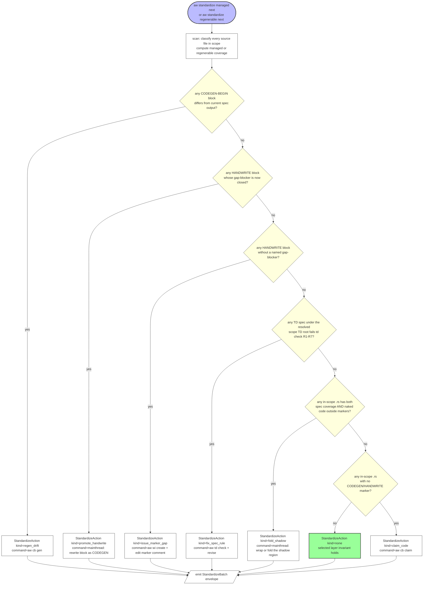
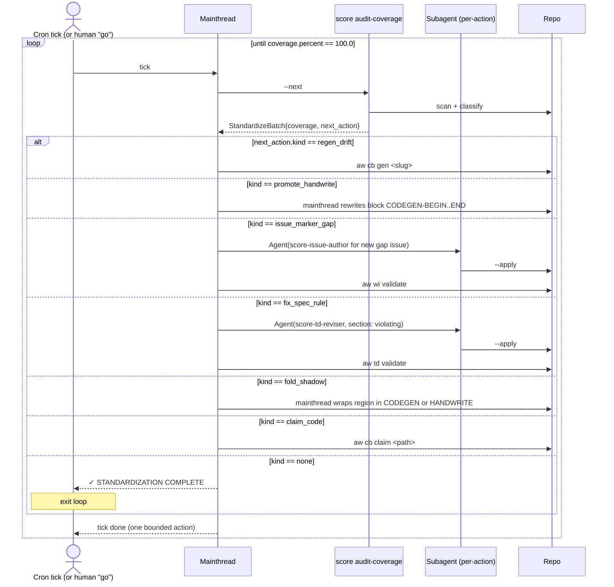

# Score Standardization

This is the **mission spec** for SDD/score's standardization workflow.
Every other TD that touches codegen / HANDWRITE markers / spec-quality
rules is downstream of the invariant defined here.

## Standardization Layers
<!-- type: doc lang: markdown -->

Standardization has production-gate layers and an optional automation-maturity
layer:

| Layer | CLI namespace | Exit condition |
|---|---|---|
| **Managed** | `aw standardize managed ...` | Every in-scope source file has `CODEGEN` or `HANDWRITE`. |
| **Semantic** | `aw standardize semantic ...` | Source behavior is covered by semantic TD and generator primitive gaps. |
| **Regenerable** | `aw standardize regenerable ...` | No next deterministic `HANDWRITE` to `CODEGEN` promotion remains; this is optional maturity unless a capability explicitly requires 100%. |

Legacy `aw standardize report|next|run` remains a compatibility alias
for the `managed` layer.

## Regenerability invariant (the mission)
<!-- type: doc lang: markdown -->

> **Regenerable** means: delete the entire codebase, re-run codegen on
> `.aw/tech-design/`, and the resulting tree is **byte-equivalent**
> to the deleted tree without replaying HANDWRITE payloads.

> **Managed** means: the tree is fully claimed by Score, but may still
> contain tracked HANDWRITE gaps that must be promoted before the
> regenerability invariant holds.

Implications:
- **Spec is the source of truth.** Code is a derived artifact.
- **HANDWRITE blocks are the only legitimate source-of-truth deviation**,
  and only because codegen does not yet cover that gap. Every HANDWRITE
  block names the gap-blocker (issue / primitive / generator) that will
  eventually retire it.
- **Closure**: when the gap-blocker lands, HANDWRITE → CODEGEN, and the
  project moves from managed toward regenerable.

## Two workflows (do not conflate)
<!-- type: doc lang: markdown -->

| Workflow | Drives | Direction | Termination |
|---|---|---|---|
| **正流程 (forward CRRR)** | One change at a time: issue → td → cb → merge | Forward, single-issue | Issue closes |
| **標準化 (managed/semantic/regenerable)** | Audit the whole repo + apply 1 fix per tick until required production gates hold; improve regenerability opportunistically | Loop, cross-issue | production gates pass; regenerable coverage is reported as maturity |

The two flows share primitives (a 標準化 fix often opens a 正流程 issue
to land the change). They are different workflows because:
- 正流程 ends with one issue closed; 標準化 ends only when the invariant
  holds across the entire scope.
- 正流程 is human-paced; 標準化 is loop-paced (cron / driver).
- 正流程 ROI is the feature; 標準化 ROI is regenerability debt reduction.

This spec defines 標準化. The 正流程 specs are
`issue-crrr-state-machine.md`, `aw-cb-fill-crrr.md`, etc.

## The 6 standardization actions
<!-- type: doc lang: markdown -->

Every fix during 標準化 falls into exactly one of these:

| # | Action | Input | Output | Today's CLI |
|---|---|---|---|---|
| 0 | **inventory** | repo scope | per-file classification + coverage % | none (this spec defines `score audit-coverage`) |
| 1 | **claim_code** — untracked in-scope code → write spec + wrap CODEGEN | unmarked `.rs` path | TD spec + CODEGEN-wrapped file | `aw cb claim` covers code→spec; CODEGEN wrap is manual |
| 2 | **fold_shadow** — spec exists but hand-written shadow code lives outside markers | spec + `.rs` | same `.rs` with no naked region (everything inside CODEGEN or HANDWRITE) | none — hardest gap |
| 3 | **fix_spec_rule** — in-scope TD spec violates R1–R7 → fix | spec | spec passes `td check` | `td check` reports; fix is manual or via CRRR `td revise` |
| 4 | **issue_marker_gap** — HANDWRITE without gap-blocker → file issue + update marker | HANDWRITE block | marker comment names the issue / primitive | manual |
| 5 | **regen_drift** — CODEGEN content drifted from spec output | spec + drifted CODEGEN block | block matches spec output | `aw cb gen` regenerates; drift detection in `cb check` |
| 6 | **promote_handwrite** — gap-blocker closed → HANDWRITE → CODEGEN | HANDWRITE block + closed issue | same region, now CODEGEN-wrapped, byte-equivalent | none — promotion is manual |

**Bottom-up gap analysis**: actions 0/2/4/6 have no CLI; 1/3 have
half-coverage; 5 has report+regen but no driver. The work this spec
authorizes is to land `score audit-coverage` (action 0) and
progressively close the rest.

## Loop pattern (one tick, one bounded action)
<!-- type: doc lang: markdown -->

Standardization is a long-running task — a real codebase needs hundreds
of ticks. CLI design must support this:

1. **Per-tick statelessness** — every driver tick rediscovers state from
   the repo (issue frontmatter, TD frontmatter, CODEGEN markers, git
   log trailers, file scan). The loop has no in-memory state.
2. **One bounded action per tick** — each `score audit-coverage --next`
   call returns at most one StandardizeAction. Cron / driver runs that
   action, waits for any subagent dispatch to settle, then ticks again.
3. **Idempotency** — re-running the same action on already-fixed state
   is a no-op (or refresh). Never destructive.
4. **Resumability** — crash / sleep / session-restart between ticks
   leaves the repo in a coherent state; next tick picks up where the
   previous left off.

This mirrors the explicit Score envelope contract, scaled to cross-namespace
+ cross-time. State lives in the repo, not the loop.

## Scope Resolution
<!-- type: overview lang: markdown -->

`aw standardize managed report|next|run`,
`aw standardize regenerable report|next|run`, and the legacy managed
aliases `aw standardize report|next|run` resolve their scan scope in
this order:

1. Explicit `--scope` values are authoritative and are returned unchanged.
2. Without explicit scopes, `[[projects.workspaces]].paths` from
   `.aw/config.toml` are used when their walk roots exist.
3. If a configured workspace path is stale because a project moved, the
   driver rediscovers projects from `{crates,projects,packages}/*` and
   replaces the stale scope with the same project name's discovered
   workspace paths.
4. If no usable config scopes remain, discovery provides the default scope.
5. If discovery also finds nothing, the fallback is `**`.

This prevents migration states like `sdd` moving from `projects/agentic-workflow` to
`projects/agentic-workflow` while config still says `projects/agentic-workflow/**` from reporting
`total_files: 0` and `percent: 100.0`. A stale configured path is not
evidence that the project is fully standardized.

## Schema
<!-- type: schema lang: yaml -->

```yaml
$schema: "https://json-schema.org/draft/2020-12/schema"
$defs:
  StandardizationCoverage:
    type: object
    required: [scope, total_files, managed_files, percent, by_marker]
    properties:
      scope: { type: array, items: { type: string }, description: "glob roots scanned" }
      total_files: { type: integer, minimum: 0 }
      managed_files: { type: integer, minimum: 0, description: "files with CODEGEN-BEGIN or HANDWRITE-BEGIN" }
      percent: { type: number, minimum: 0.0, maximum: 100.0 }
      by_marker:
        type: object
        properties:
          codegen: { type: integer, minimum: 0 }
          handwrite: { type: integer, minimum: 0 }
      uncovered_files:
        type: array
        items: { type: string }
        description: "repo-relative paths missing CODEGEN and HANDWRITE markers"

  RegenerabilityCoverage:
    type: object
    required: [scope, total_files, eligible_files, codegen_files, fully_codegen_files, handwrite_files, unmarked_files, percent, gap_files]
    properties:
      scope: { type: array, items: { type: string }, description: "glob roots scanned" }
      total_files: { type: integer, minimum: 0 }
      eligible_files: { type: integer, minimum: 0, description: "total source files in scope after ignoring minified asset bundles" }
      codegen_files: { type: integer, minimum: 0, description: "files containing any CODEGEN marker" }
      fully_codegen_files: { type: integer, minimum: 0, description: "files containing CODEGEN and no HANDWRITE marker" }
      handwrite_files: { type: integer, minimum: 0 }
      unmarked_files: { type: integer, minimum: 0 }
      percent: { type: number, minimum: 0.0, maximum: 100.0 }
      gap_files: { type: array, items: { type: string }, description: "files blocking full CODEGEN ownership" }

  StandardizeActionKind:
    type: string
    enum:
      - inventory
      - claim_code
      - fold_shadow
      - fix_spec_rule
      - issue_marker_gap
      - regen_drift
      - promote_handwrite
      - none

  StandardizeAction:
    type: object
    required: [kind, target, command, reason]
    properties:
      kind: { $ref: "#/$defs/StandardizeActionKind" }
      target: { type: string, description: "repo-relative path or slug the action operates on" }
      command: { type: string, description: "the score invocation to run (or `mainthread` for human-driven actions)" }
      reason: { type: string, description: "why this action was picked next" }
      blocker: { type: string, description: "if action requires another action first; nullable" }

  StandardizeBatch:
    type: object
    required: [layer, coverage, next_action]
    properties:
      layer: { type: string, enum: [managed, regenerable] }
      coverage:
        oneOf:
          - { $ref: "#/$defs/StandardizationCoverage" }
          - { $ref: "#/$defs/RegenerabilityCoverage" }
      next_action: { $ref: "#/$defs/StandardizeAction" }
```

## Logic: standardize-driver-tick
<!-- type: logic lang: mermaid -->



**Priority rationale**: regen_drift first (cheapest, full automation,
risks tightest); then promote_handwrite (mechanical, reduces marker
debt); then orphan markers (fast issue-create); then spec rule fixes;
then shadow folding (hardest but most invariant-critical); finally
sweep unmarked code (highest volume, lowest leverage per fix). Within
each category the driver picks deterministically (e.g., alphabetical)
to make ticks reproducible.

## Interaction: driver loop
<!-- type: interaction lang: mermaid -->



The driver is a thin loop: tick → audit-coverage → run command → tick.
All state lives in the repo. Crash / sleep / restart safe.

## Test Plan
<!-- type: test-plan lang: mermaid -->

```mermaid
---
id: standardization-test-plan
requirements:
  - id: r_invariant_definition
    statement: >
      The regenerability invariant is documented in this spec, in
      projects/agentic-workflow/CLAUDE.md, and referenced from the root CLAUDE.md
      "Constraints" section. All three references agree on wording.
  - id: r_inventory_coverage
    statement: >
      `score audit-coverage --report-only` emits a
      StandardizationCoverage JSON envelope with non-zero total_files
      and covered_files counts and percent in [0.0, 100.0]. The counts
      match an independent `find ... | grep -lE 'CODEGEN|HANDWRITE'`
      pipeline byte-for-byte.
  - id: r_one_action_per_tick
    statement: >
      `score audit-coverage --next` returns at most one StandardizeAction.
      kind=none iff all six scans return empty.
  - id: r_priority_order
    statement: >
      Action priority is regen_drift > promote_handwrite >
      issue_marker_gap > fix_spec_rule > fold_shadow > claim_code >
      none. Higher-priority kinds preempt lower.
  - id: r_scoped_td_rule_scan
    statement: >
      `aw standardize` checks TD rule violations only under the TD roots
      resolved from the active source scope. A bad spec under an unrelated
      project TD root must not block a scoped run such as
      `--scope projects/agentic-workflow/**`.
  - id: r_idempotent_actions
    statement: >
      Running the same returned action twice on the now-fixed state is
      a no-op. The second tick advances to a different action (or none).
  - id: r_resumable_after_crash
    statement: >
      Killing the driver between any two ticks leaves the repo in a
      coherent state (no partial writes, no broken HANDWRITE markers,
      no half-committed lifecycle trailers). The next tick continues.
  - id: r_stale_config_scope_recovery
    statement: >
      When `.aw/config.toml` contains a workspace scope whose walk
      root no longer exists, `aw standardize` replaces that stale
      scope with the same project name's discovered workspace paths
      before computing coverage. A moved project must not produce
      total_files=0 / percent=100 merely because config has an old path.

elements:
  - id: t_coverage_matches_find
    requirement: r_inventory_coverage
    kind: integration
    description: >
      Run `score audit-coverage --report-only`; compare its
      total_files / covered_files / by_marker counts against an
      external `find ... | grep` pipeline. Counts must match exactly.
  - id: t_no_double_action
    requirement: r_idempotent_actions
    kind: integration
    description: >
      Tick 1: get action A, run command. Tick 2: assert action != A
      (must advance). Run on a fixture with at least 3 known fixable
      items spanning ≥2 action kinds.
  - id: t_priority_short_circuit
    requirement: r_priority_order
    kind: unit
    description: >
      Seed both a CODEGEN drift and an unmarked file in the fixture.
      Assert next_action.kind == regen_drift, not claim_code.
  - id: t_terminal_none
    requirement: r_one_action_per_tick
    kind: integration
    description: >
      Run on a fixture where all 7 scans are empty; assert
      next_action.kind == none and coverage.percent == 100.0.
  - id: t_resumable
    requirement: r_resumable_after_crash
    kind: integration
    description: >
      SIGTERM the driver between ticks; verify git working tree is
      clean (no partial writes); next driver invocation continues
      cleanly.
  - id: t_stale_scope_replaced_by_same_project_discovery
    requirement: r_stale_config_scope_recovery
    kind: unit
    description: >
      Seed `.aw/config.toml` with project `sdd` using
      `projects/agentic-workflow/**`, create only `projects/agentic-workflow/Cargo.toml` and
      `projects/agentic-workflow/src/lib.rs`, then assert resolved scopes contain
      `projects/agentic-workflow/**` and not `projects/agentic-workflow/**`.
---
```

## Changes
<!-- type: changes lang: yaml -->

```yaml
changes:
  - path: projects/agentic-workflow/src/cli/standardize.rs
    action: modify
    section: interaction
    impl_mode: hand-written
    description: >
      Split `aw standardize` into explicit `managed` and `regenerable`
      layers. Keep legacy `aw standardize report|next|run` as managed
      aliases. Managed coverage counts CODEGEN/HANDWRITE ownership;
      regenerable coverage counts fully CODEGEN-owned files
      and emits HANDWRITE/unmarked gap files.

  - path: projects/agentic-workflow/src/cli/commands.rs
    action: modify
    section: interaction
    impl_mode: hand-written
    description: >
      Update the standardize command help text to describe managed adoption
      and regenerability instead of a single managed replayability layer.

  - path: projects/agentic-workflow/src/cli/init.rs
    action: modify
    section: interaction
    impl_mode: hand-written
    description: >
      Drop stale include/install references for retired Claude Code
      subagent templates and per-agent hooks, and install the current
      work-item skill. This keeps score buildable after the
      mainthread-only template cleanup.

  - path: projects/agentic-workflow/tests/standardize_test.rs
    action: modify
    section: test-plan
    impl_mode: hand-written
    description: >
      Add CLI registration and smoke coverage for `standardize managed`
      and `standardize regenerable`, including a regenerable next-action
      test that reports remaining HANDWRITE as `promote_handwrite`.

  - path: projects/agentic-workflow/templates/mainthread/skills/score-standardize-run/SKILL.md
    action: modify
    section: logic
    impl_mode: hand-written
    description: >
      Update the skill workflow to run the managed layer explicitly and
      point completed managed runs at `aw standardize regenerable next`.

  - path: projects/agentic-workflow/src/cli/standardize.rs
    action: modify
    section: interaction
    impl_mode: hand-written
    description: >
      Resolve default standardization scopes from config, but treat
      configured workspace roots that no longer exist as stale. For a
      stale project name, rediscover `{crates,projects,packages}/*`
      and substitute the same project's current workspace paths. This
      preserves explicit `--scope` semantics while preventing migrated
      projects such as sdd (`projects/agentic-workflow` -> `projects/agentic-workflow`) from
      reporting empty, falsely-complete coverage.

  - path: projects/agentic-workflow/src/cli/standardize.rs
    action: modify
    section: interaction
    impl_mode: hand-written
    description: >
      Add a unit regression for stale config scope recovery: config
      declares `sdd` at `projects/agentic-workflow/**`, the repo contains only
      `projects/agentic-workflow/**`, and default scope resolution returns
      `projects/agentic-workflow/**`.

  - path: projects/agentic-workflow/src/cli/standardize.rs
    action: modify
    section: interaction
    impl_mode: hand-written
    description: >
      Remove skip semantics from standardization. Managed coverage is binary
      CODEGEN/HANDWRITE ownership; regenerable coverage includes every
      in-scope source file and reports HANDWRITE as the remaining promotion
      gap. Minified asset bundles under `assets/*.min.js` are ignored as
      non-source assets rather than counted as HANDWRITE gaps.

  - path: projects/agentic-workflow/src/cli/audit_coverage.rs
    action: create
    section: interaction
    impl_mode: hand-written
    description: >
      New module implementing the 6-priority scan + envelope emission.
      Reuses primitives: `agentic_workflow::cli::cb::check::audit_file_unified` (for
      drift + shadow detection), `agentic_workflow::cli::cb::check::parse_handwrite_markers`
      (for marker enumeration), `td::check::run_rules` (for R1-R7),
      issue list reader (for closed-blocker promote_handwrite check),
      and a new `enumerate_unmarked_rs(scope)` helper. Emits
      StandardizeBatch JSON envelope per the spec.
      Carries @spec projects/agentic-workflow/tech-design/surface/specs/score-standardization.md#logic/standardize-driver-tick.

  - path: projects/agentic-workflow/src/cli/commands.rs
    action: modify
    section: interaction
    impl_mode: hand-written
    description: >
      Register `Commands::AuditCoverage { report_only: bool, scope: Option<Vec<PathBuf>> }`
      at top level (NOT under cb — this verb spans all three namespaces).
      Help text: "Audit standardization coverage and emit the next
      standardization action; --report-only skips action and emits
      coverage only."

  - path: projects/agentic-workflow/tests/audit_coverage_test.rs
    action: create
    section: test-plan
    impl_mode: hand-written
    description: >
      Cover requirements r_inventory_coverage, r_one_action_per_tick,
      r_priority_order, r_idempotent_actions, r_resumable_after_crash.
      Use tempdir fixtures seeded with known marker/spec/drift state.

  - path: projects/agentic-workflow/CLAUDE.md
    action: modify
    section: interaction
    impl_mode: hand-written
    description: >
      Replace the current 24-line scope-only doc with: (1) regenerability
      invariant verbatim from this spec, (2) two-workflow table (正流程
      vs 標準化), (3) the 6 standardization actions table with status,
      (4) keep existing Boundary section. CLAUDE.md becomes the
      methodology-layer index pointing here for the full contract.

  - path: projects/agentic-workflow/CLAUDE.md
    action: modify
    section: interaction
    impl_mode: hand-written
    description: >
      Add a "## Standardization workflow" section above "## Cross-project
      conventions". Map each of the 6 actions to its CLI verb, mark
      gaps as "missing — see projects/agentic-workflow/tech-design/surface/specs/score-standardization.md#changes". Add
      the loop pattern (per-tick statelessness, one bounded action,
      idempotency, resumability) as a sibling subsection.

  - path: CLAUDE.md
    action: modify
    section: interaction
    impl_mode: hand-written
    description: >
      Under "## Constraints" → "Hand-written exception protocol", add a
      one-line cross-reference: "see
      projects/agentic-workflow/tech-design/surface/specs/score-standardization.md
      for the full regenerability invariant and the 6-action loop
      contract." The six-step protocol stays unchanged; this spec is
      the higher-order WHY, the protocol is the per-region HOW.

  - path: .claude/skills/score-standardize-cron/SKILL.md
    action: create
    section: interaction
    impl_mode: hand-written
    description: >
      Promote the implicit cron skill (currently re-pasted verbatim into
      the cron prompt every fire) to a first-class slash command.
      Body: "tick → score audit-coverage --next → if next_action.kind
      != none run command → stop; let cron tick again." All policy
      lives in this spec; the skill is a thin driver wrapper.
  - action: annotate
    section: schema
    impl_mode: hand-written
    description: "Traceability metadata edge for the schema section."

```
