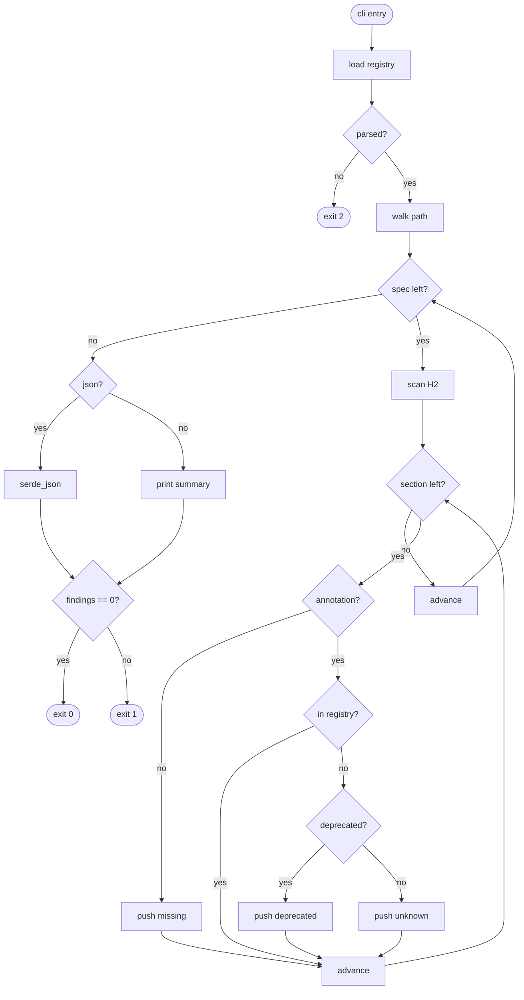

# Score TD Check — Section-Type Conformance

## Schema
<!-- type: schema lang: yaml -->

```yaml
"$schema": "https://json-schema.org/draft/2020-12/schema"
$id: score-td-check-section-type-conformance#schema
definitions:
  FindingKind:
    type: string
    enum: [unknown, deprecated, missing-type-annotation]
    description: >
      unknown: annotation's type field is not in the registry's section_types.const list.
      deprecated: annotation's type field matches a registry-flagged deprecated type
        (seed: overview, requirements, doc).
      missing-type-annotation: H2 heading has no `<!-- type: ... lang: ... -->`
        comment on the line immediately after.
  Finding:
    type: object
    required: [spec_path, section_heading, kind]
    properties:
      spec_path:
        type: string
        description: Path to the offending spec, relative to project root.
      section_heading:
        type: string
        description: The H2 heading text (without the leading `## `).
      kind:
        $ref: "#/definitions/FindingKind"
      annotation_type:
        type: string
        nullable: true
        description: >
          The `type:` value extracted from the annotation when present.
          Absent on missing-type-annotation findings.
      suggestion:
        type: string
        nullable: true
        description: >
          Optional fix hint surfaced to the user (e.g. "rename to 'logic'",
          "move to BRD", or "add `<!-- type: schema lang: yaml -->`").
  Report:
    type: object
    required: [findings, total_specs, total_findings]
    properties:
      findings:
        type: array
        items: { $ref: "#/definitions/Finding" }
      total_specs:
        type: integer
        minimum: 0
        description: Count of spec files scanned (with at least one H2 heading).
      total_findings:
        type: integer
        minimum: 0
  CheckArgs:
    type: object
    description: >
      CLI invocation surface for `aw td check --section-type-conformance [<path>]`.
      Mounted on the existing `aw td check` subcommand (no new top-level verb).
    required: [section_type_conformance]
    properties:
      section_type_conformance:
        type: boolean
        const: true
        description: Flag toggle that selects the conformance pass.
      path:
        type: string
        nullable: true
        description: >
          Positional. Default is the project root (`.`); narrow to a single file
          or directory. Resolved relative to current working directory.
      json:
        type: boolean
        default: false
        description: Emit Report as JSON on stdout instead of human summary.
```

## Logic
<!-- type: logic lang: mermaid -->



## Changes
<!-- type: changes lang: yaml -->

```yaml
changes:
  - path: projects/agentic-workflow/src/cli/td_check_section_type.rs
    action: create
    section: logic
    impl_mode: hand-written
    description: >
      New module hosting the conformance-check verb body. Public entry
      point `run(args: &CheckSectionTypeArgs) -> Result<()>` is called
      from `td.rs` via the existing `aw td check` clap subcommand.
      Internals: `load_registry(project_root) -> Registry` reads
      `projects/agentic-workflow/tech-design/surface/specs/score-section-type-registry.md`,
      strips the `## Schema` mermaid/yaml fence, parses with serde_yaml,
      and pulls `section_types[*].name` into a HashSet plus the
      registry's `deprecated:` list (seeded with overview / requirements
      / doc when absent). `scan_spec(path) -> Vec<H2Section>` walks the
      file, keeps every line beginning `## ` plus the next non-empty
      line as the candidate annotation, runs the regex
      `^<!-- type: ([\w-]+) lang: ([\w-]+) -->$` against it. Per H2:
      no comment match → push Finding(missing-type-annotation); type
      in registry.section_types → no finding; type in
      registry.deprecated → push Finding(deprecated); else
      push Finding(unknown). The verb body collects findings across
      all specs under the resolved scope (default project root walk
      via walkdir, single-file when path is a `*.md`), sorts by
      (spec_path, section_heading) for stable output, and emits the
      Report struct. JSON path uses serde_json::to_string_pretty;
      human path prints `<path>: <heading>: <kind>` lines plus a
      one-line totals footer. Exit code: 2 on any error returned from
      load_registry, 1 if total_findings > 0, 0 otherwise.
  - path: projects/agentic-workflow/src/cli/td.rs
    action: modify
    section: logic
    impl_mode: hand-written
    description: >
      Extend the existing `aw td check` clap subcommand args struct
      with two new fields: `section_type_conformance: bool` (matched on
      `--section-type-conformance`) and a positional `path:
      Option<PathBuf>`. Existing `--rule` / per-rule paths remain. The
      `run_check` dispatcher branches on `section_type_conformance`
      first; when true, calls
      `crate::td_check_section_type::run(...)` with the resolved path
      argument and the `--json` flag forwarded, then propagates its
      Result into the existing exit-code translator. Add `mod
      td_check_section_type;` near the existing `mod` declarations.
  - path: projects/agentic-workflow/tests/td_check_section_type.rs
    action: create
    section: logic
    impl_mode: hand-written
    description: >
      Integration test crate covering three cases against synthesised
      spec fixtures rooted at `tempfile::tempdir()`:
      (1) Conforming spec — H2 + valid annotation whose type appears
      in a stub registry — produces zero findings, exit 0.
      (2) Unknown-type spec — H2 carries `<!-- type: nope lang: yaml
      -->` — produces one Finding(kind=unknown), exit 1, JSON output
      round-trips through serde_json::from_str.
      (3) Missing-annotation spec — H2 with no comment line beneath —
      produces Finding(missing-type-annotation), exit 1.
      Each case writes a tiny inline registry fixture into the temp
      tree to avoid coupling to the real registry's contents.
  - action: annotate
    section: schema
    impl_mode: hand-written
    description: "Traceability metadata edge for the schema section."

```

# Reviews

## Review 1
<!-- type: review lang: markdown -->

**Verdict:** approved

- [schema] CheckArgs cleanly mirrors the actual clap-derive surface: a boolean flag toggle, an optional positional `path`, and a `--json` switch. FindingKind covers exactly the three failure modes called out in R1. Report.findings/total_specs/total_findings matches the R2 JSON schema verbatim.
- [logic] Entry through exit covers all paths: registry-load failure → exit 2; per-spec walk over the path glob; per-section dispatch through has_annotation → in_registry → is_deprecated; the dual exit_code terminals satisfy R3. The flowchart body matches the frontmatter node/edge graph 1:1.
- [changes] Three-file scope is right-sized: the verb logic in a new module under `td_check_section_type.rs`, the dispatch wire-up edit in the existing `td.rs` clap subcommand for `aw td check`, and an integration test crate. No collateral edits.
- [overall] Read-only verb with a self-contained input contract (the registry path is fixed and discovered at runtime). Exit code semantics align with the existing `aw td check` convention. No HANDWRITE region needed — the spec is fully describable by today's section types.
