# Score: td claim stub-placement fix

> **Historical root note.** This TD predates Phase C in-place lifecycle cleanup.
> Its `agentic_workflow::worktree::provision` and "project-root stub" wording describes the
> retired dedicated-worktree claim path. Current `aw td`/`aw cb` recovery
> verbs must resolve filesystem state from the current checkout root returned by
> `find_project_root()` and must not redirect linked-worktree invocations to a
> sibling or primary checkout.

## State Machine: run-claim-stub-placement

```mermaid
---
id: run-claim-stub-placement
initial: entry
nodes:
  entry:
    kind: initial
    label: "run_claim entry"
  leftover_check:
    kind: normal
    label: "Check for leftover project-root stub"
  leftover_detected:
    kind: normal
    label: "Leftover stub found: delete or error"
  resolve_issue:
    kind: normal
    label: "Resolve issue from project-root backend"
  issue_found:
    kind: normal
    label: "Issue resolved from project root"
  no_issue_no_path:
    kind: terminal
    label: "Error: no issue and no --from-path; exit 1"
  provision_worktree:
    kind: normal
    label: "Provision worktree (agentic_workflow::worktree::provision)"
  stub_in_wt_check:
    kind: normal
    label: "Check wt_backend.get(slug) for existing stub"
  stub_in_wt:
    kind: normal
    label: "Stub already in worktree (idempotent)"
  create_stub_in_wt:
    kind: normal
    label: "wt_backend.create(&stub) — stub written inside worktree"
  update_phase:
    kind: normal
    label: "wt_backend.update: set phase td_reviewed"
  commit_trailer:
    kind: normal
    label: "Commit Lifecycle-Stage: Td-Claim + Claim-Source"
  emit_dispatch:
    kind: terminal
    label: "Emit dispatch to aw cb gen; exit 0"
edges:
  - from: entry
    to: leftover_check
    event: start
  - from: leftover_check
    to: leftover_detected
    event: leftover_present
  - from: leftover_detected
    to: resolve_issue
    event: cleaned
  - from: leftover_check
    to: resolve_issue
    event: no_leftover
  - from: resolve_issue
    to: issue_found
    event: issue_exists
  - from: resolve_issue
    to: no_issue_no_path
    event: no_issue_and_no_from_path
  - from: issue_found
    to: provision_worktree
    event: proceed
  - from: resolve_issue
    to: provision_worktree
    event: from_path_given
  - from: provision_worktree
    to: stub_in_wt_check
    event: provisioned
  - from: stub_in_wt_check
    to: stub_in_wt
    event: stub_found
  - from: stub_in_wt_check
    to: create_stub_in_wt
    event: stub_missing
  - from: stub_in_wt
    to: update_phase
    event: skip_create
  - from: create_stub_in_wt
    to: update_phase
    event: created
  - from: update_phase
    to: commit_trailer
    event: phase_written
  - from: commit_trailer
    to: emit_dispatch
    event: committed
---
stateDiagram-v2
    [*] --> entry
    entry --> leftover_check: start
    leftover_check --> leftover_detected: leftover_present
    leftover_detected --> resolve_issue: cleaned
    leftover_check --> resolve_issue: no_leftover
    resolve_issue --> issue_found: issue_exists
    resolve_issue --> no_issue_no_path: no_issue_and_no_from_path
    no_issue_no_path --> [*]
    issue_found --> provision_worktree: proceed
    resolve_issue --> provision_worktree: from_path_given
    provision_worktree --> stub_in_wt_check: provisioned
    stub_in_wt_check --> stub_in_wt: stub_found
    stub_in_wt_check --> create_stub_in_wt: stub_missing
    stub_in_wt --> update_phase: skip_create
    create_stub_in_wt --> update_phase: created
    update_phase --> commit_trailer: phase_written
    commit_trailer --> emit_dispatch: committed
    emit_dispatch --> [*]
```

<!-- type: state-machine lang: mermaid -->


## Logic: run-claim-fixed-flow

```mermaid
---
id: run-claim-fixed-flow
entry: start
nodes:
  start:
    kind: start
    label: "run_claim(args)"
  check_leftover:
    kind: decision
    label: "project-root stub exists but not committed?"
  delete_or_error_leftover:
    kind: process
    label: "Delete matching leftover or print error"
  resolve_issue_opt:
    kind: process
    label: "project_root backend.get(slug)"
  branch_issue_from_path:
    kind: decision
    label: "(issue_opt, from_path)?"
  issue_exists_proceed:
    kind: process
    label: "(Some(_), _): use existing issue"
  no_path_error:
    kind: terminal
    label: "Error: issue not found, no --from-path; exit 1"
  build_stub:
    kind: process
    label: "(None, Some(path)): build Issue stub struct"
  check_trailer:
    kind: decision
    label: "worktree exists AND Td-Claim trailer committed?"
  noop_return:
    kind: terminal
    label: "No-op: already claimed; exit 0"
  check_force_rebase:
    kind: decision
    label: "--force-rebase AND worktree exists?"
  remove_worktree:
    kind: process
    label: "remove_worktree(project_root, worktree_rel)"
  provision:
    kind: process
    label: "agentic_workflow::worktree::provision(project_root, worktree_rel, branch)"
  partial_resume:
    kind: process
    label: "Worktree exists, no trailer: partial-claim resume"
  check_wt_stub:
    kind: decision
    label: "wt_backend.get(slug) returns Some?"
  check_from_path:
    kind: decision
    label: "from_path.is_some()?"
  create_wt_stub:
    kind: process
    label: "wt_backend.create(&stub)"
  copy_spec:
    kind: process
    label: "Copy --from-path spec into worktree tech_design dir"
  update_phase:
    kind: process
    label: "wt_backend.update(slug, patch{phase:td_reviewed})"
  commit_td_claim:
    kind: process
    label: "commit Lifecycle-Stage: Td-Claim + Claim-Source trailer"
  emit_dispatch:
    kind: terminal
    label: "Emit dispatch envelope to aw cb gen; exit 0"
edges:
  - from: start
    to: check_leftover
  - from: check_leftover
    to: delete_or_error_leftover
    label: "yes"
  - from: check_leftover
    to: resolve_issue_opt
    label: "no"
  - from: delete_or_error_leftover
    to: resolve_issue_opt
  - from: resolve_issue_opt
    to: branch_issue_from_path
  - from: branch_issue_from_path
    to: issue_exists_proceed
    label: "(Some, _)"
  - from: branch_issue_from_path
    to: build_stub
    label: "(None, Some)"
  - from: branch_issue_from_path
    to: no_path_error
    label: "(None, None)"
  - from: issue_exists_proceed
    to: check_trailer
  - from: build_stub
    to: check_trailer
  - from: check_trailer
    to: noop_return
    label: "yes and no --force-rebase"
  - from: check_trailer
    to: check_force_rebase
    label: "no"
  - from: check_trailer
    to: check_force_rebase
    label: "yes and --force-rebase"
  - from: check_force_rebase
    to: remove_worktree
    label: "yes"
  - from: check_force_rebase
    to: provision
    label: "no, worktree absent"
  - from: check_force_rebase
    to: partial_resume
    label: "no, worktree present, no trailer"
  - from: remove_worktree
    to: provision
  - from: provision
    to: check_wt_stub
  - from: partial_resume
    to: check_wt_stub
  - from: check_wt_stub
    to: check_from_path
    label: "yes (stub exists, skip create)"
  - from: check_wt_stub
    to: create_wt_stub
    label: "no (None, Some path)"
  - from: check_from_path
    to: copy_spec
    label: "yes (from_path supplied)"
  - from: check_from_path
    to: update_phase
    label: "no (from_path None; stub already placed)"
  - from: create_wt_stub
    to: copy_spec
  - from: copy_spec
    to: update_phase
  - from: update_phase
    to: commit_td_claim
  - from: commit_td_claim
    to: emit_dispatch
---
flowchart TD
    start([run_claim args]) --> check_leftover{project-root stub exists\nbut not committed?}
    check_leftover -->|yes| delete_or_error_leftover[Delete matching leftover\nor print error]
    check_leftover -->|no| resolve_issue_opt
    delete_or_error_leftover --> resolve_issue_opt[project_root backend.get slug]
    resolve_issue_opt --> branch_issue_from_path{issue_opt, from_path?}
    branch_issue_from_path -->|"Some, _"| issue_exists_proceed[use existing issue]
    branch_issue_from_path -->|"None, Some"| build_stub[build Issue stub struct]
    branch_issue_from_path -->|"None, None"| no_path_error([Error: no issue\nno from-path; exit 1])
    issue_exists_proceed --> check_trailer{worktree exists AND\nTd-Claim trailer committed?}
    build_stub --> check_trailer
    check_trailer -->|"yes, no --force-rebase"| noop_return([No-op: already claimed; exit 0])
    check_trailer -->|no or --force-rebase| check_force_rebase{--force-rebase AND\nworktree exists?}
    check_force_rebase -->|yes| remove_worktree[remove_worktree]
    check_force_rebase -->|"no, worktree absent"| provision
    check_force_rebase -->|"no, worktree present\nno trailer"| partial_resume[partial-claim resume]
    remove_worktree --> provision[agentic_workflow::worktree::provision]
    provision --> check_wt_stub{wt_backend.get slug\nreturns Some?}
    partial_resume --> check_wt_stub
    check_wt_stub -->|"yes: skip create"| check_from_path{from_path.is_some?}
    check_wt_stub -->|"no: None,Some path"| create_wt_stub[wt_backend.create stub]
    check_from_path -->|"yes: path supplied"| copy_spec[copy --from-path spec\ninto worktree tech_design]
    check_from_path -->|"no: stub already placed"| update_phase
    create_wt_stub --> copy_spec
    copy_spec --> update_phase[wt_backend.update\nphase: td_reviewed]
    update_phase --> commit_td_claim[commit Td-Claim\n+ Claim-Source trailer]
    commit_td_claim --> emit_dispatch([emit dispatch to cb gen; exit 0])
```

<!-- type: logic lang: mermaid -->


## Test Plan

```mermaid
---
id: score-td-claim-stub-placement-fix-test-plan
requirements:
  r1_stub_in_worktree:
    id: R1
    text: "stub creation uses wt_backend.create after provision; wt_backend.update succeeds on fresh --from-path claim"
    kind: functional
    risk: high
    verify: test
  r2_existing_issue_unchanged:
    id: R2
    text: "committed issue path (Some(_), _) reaches wt_backend.update unchanged; no regression"
    kind: functional
    risk: high
    verify: test
  r3_idempotent_partial_claim:
    id: R3
    text: "re-running td claim --from-path on partial-claim worktree (stub present, no trailer) converges without error"
    kind: functional
    risk: high
    verify: test
  r4_leftover_stub_detection:
    id: R4
    text: "leftover project-root stub from a failed run is detected and removed or surfaced as actionable error"
    kind: functional
    risk: medium
    verify: test
  r5_error_message_disambiguation:
    id: R5
    text: "wt_backend.update failure message includes worktree path, distinguishing it from project-root missing-issue error"
    kind: interface
    risk: medium
    verify: test
  r6_b2_regression_test_active:
    id: R6
    text: "B2 end-to-end test in td_claim_test.rs is active (no #[ignore]), exercises --from-path happy path, asserts phase td_reviewed and Td-Claim trailer in git log"
    kind: functional
    risk: high
    verify: test
elements:
  test_from_path_fresh_slug_e2e:
    kind: test
    type: "rs/integration"
  test_existing_issue_no_regression:
    kind: test
    type: "rs/#[test]"
  test_idempotent_partial_claim:
    kind: test
    type: "rs/integration"
  test_leftover_stub_removed:
    kind: test
    type: "rs/integration"
  test_wt_update_error_message:
    kind: test
    type: "rs/#[test]"
  test_b2_e2e_active:
    kind: test
    type: "rs/integration"
relations:
  - from: test_from_path_fresh_slug_e2e
    verifies: r1_stub_in_worktree
  - from: test_existing_issue_no_regression
    verifies: r2_existing_issue_unchanged
  - from: test_idempotent_partial_claim
    verifies: r3_idempotent_partial_claim
  - from: test_leftover_stub_removed
    verifies: r4_leftover_stub_detection
  - from: test_wt_update_error_message
    verifies: r5_error_message_disambiguation
  - from: test_b2_e2e_active
    verifies: r6_b2_regression_test_active
---
requirementDiagram
    requirement R1 {
      id: R1
      text: "stub creation uses wt_backend.create after provision"
      risk: high
      verifymethod: test
    }
    requirement R2 {
      id: R2
      text: "existing committed issue path reaches wt_backend.update unchanged"
      risk: high
      verifymethod: test
    }
    requirement R3 {
      id: R3
      text: "re-running on partial-claim worktree converges without error"
      risk: high
      verifymethod: test
    }
    requirement R4 {
      id: R4
      text: "leftover project-root stub detected and removed or surfaced"
      risk: medium
      verifymethod: test
    }
    requirement R5 {
      id: R5
      text: "wt_backend.update error includes worktree path"
      risk: medium
      verifymethod: test
    }
    requirement R6 {
      id: R6
      text: "B2 e2e test active: --from-path happy path asserts phase + trailer"
      risk: high
      verifymethod: test
    }
    element test_from_path_fresh_slug_e2e {
      type: "rs/integration"
    }
    element test_existing_issue_no_regression {
      type: "rs/#[test]"
    }
    element test_idempotent_partial_claim {
      type: "rs/integration"
    }
    element test_leftover_stub_removed {
      type: "rs/integration"
    }
    element test_wt_update_error_message {
      type: "rs/#[test]"
    }
    element test_b2_e2e_active {
      type: "rs/integration"
    }
    test_from_path_fresh_slug_e2e - verifies -> R1
    test_existing_issue_no_regression - verifies -> R2
    test_idempotent_partial_claim - verifies -> R3
    test_leftover_stub_removed - verifies -> R4
    test_wt_update_error_message - verifies -> R5
    test_b2_e2e_active - verifies -> R6
```

<!-- type: test-plan lang: mermaid -->


# Reviews

## Review 1
<!-- type: review lang: markdown -->

**Verdict:** needs-revision

- [logic] (item 3) The `check_wt_stub` "yes" edge goes unconditionally to `copy_spec`, but `copy_spec` copies the `--from-path` file into the worktree. On a partial-resume re-run where the stub already exists in the worktree but the caller does not supply `--from-path` again (a valid and expected scenario — the agent just retries `td claim <slug>` without the path flag), `copy_spec` has no source to copy from and will panic or return an error. R3 requires convergence "without error" on a partial-claim worktree; the current flowchart violates this for the no-`from_path` partial-resume case. Fix: add a decision node between `check_wt_stub` "yes" and `copy_spec` that checks `from_path.is_some()`, skipping `copy_spec` when `from_path` is `None` (stub + spec already placed; proceed straight to `update_phase`).

## Review 2
<!-- type: review lang: markdown -->

**Verdict:** approved

- [logic] (item 3) Round 1 finding addressed: the reviser inserted a `check_from_path` decision node on the `check_wt_stub` "yes" path. The "no" edge now bypasses `copy_spec` and routes directly to `update_phase`, satisfying R3 for the partial-resume-without-path case. The `create_wt_stub → copy_spec` edge is safe because `create_wt_stub` is only reachable via the `(None, Some)` branch of `branch_issue_from_path`, which guarantees `from_path` is Some at that point.

## Changes
<!-- type: changes lang: yaml -->

```yaml
changes:
  - path: projects/agentic-workflow/src/cli/td.rs
    action: modify
    section: logic
    impl_mode: hand-written
    description: >
      Fix run_claim: defer stub creation to after agentic_workflow::worktree::provision returns.

      Specific changes to run_claim:
        - R1: Move the (None, Some(_)) stub-build block to AFTER provision.
          Replace `backend.create(&stub)` with `wt_backend.create(&stub)` so
          the stub is written inside the worktree, not the project root.
        - R2: Branch post-provision flow on (issue_opt, args.from_path):
          only the (None, Some(_)) arm calls wt_backend.create; the (Some(_), _)
          arm proceeds straight to wt_backend.update unchanged.
        - R3: Add idempotency guard: call wt_backend.get(slug) before create;
          skip create when it returns Some(_). The existing trailer_present
          check handles the fully-claimed early-exit.
        - R4: At entry to run_claim, check whether the project-root stub exists
          despite no committed issue. If content matches the would-be-generated
          stub, delete it silently; otherwise print an actionable error.
        - R5: Wrap wt_backend.update call with
          `.with_context(|| format!("issue file missing in worktree {}", worktree_abs.display()))`
          to disambiguate worktree vs project-root missing-file errors.

  - path: projects/agentic-workflow/tests/td_claim_test.rs
    action: modify
    section: test-plan
    impl_mode: hand-written
    description: >
      Activate the #[ignore]'d B2 regression test test_td_claim_e2e_phase_advance.
      Populate it with a tmpdir-based aw init + write stub issue file + write
      a minimal spec file on disk + run `aw td claim --from-path <spec>` subprocess.
      Assert:
        - frontmatter phase == td_reviewed in the worktree issue file
        - `git log --grep "Lifecycle-Stage: Td-Claim"` returns a commit

  - path: projects/agentic-workflow/tech-design/surface/specs/score-recovery-verbs.md
    action: modify
    section: logic
    impl_mode: hand-written
    description: >
      Update the logic section (td-claim-and-idle-resolution flowchart) to reflect
      the new stub-placement ordering:
        - The create_issue_stub node now appears AFTER provision_worktree, not before.
        - Add a wt_stub_check decision node (wt_backend.get returns Some?) between
          provision_worktree and the existing set_phase_td_reviewed node.
      No changes to state-machine, schema, test-plan, cli, or changes sections.
  - action: annotate
    section: state-machine
    impl_mode: hand-written
    description: "Traceability metadata edge for the state-machine section."

```
