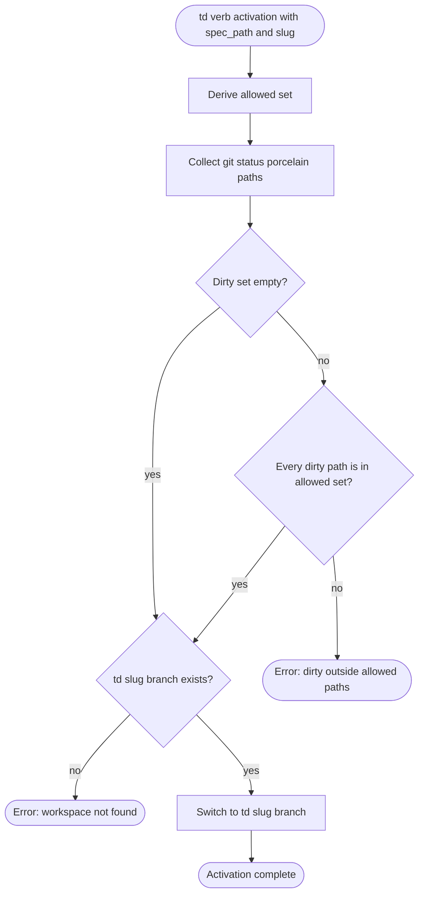

# Score TD Dirty-Gate — Extend to Canonical Issue File

Extends `score-td-review-allow-dirty-spec` so the in-place td verb dirty-tree
check permits TWO known lifecycle-state files dirty: the `--spec-path`
payload AND the canonical issue file at `.aw/issues/{open,closed}/<slug>.md`.
The current single-path allowance breaks the `td create --apply → td validate`
dispatch hand-off because the issue file's `phase` frontmatter is rewritten
between the two verbs without a commit, leaving it dirty when `td validate`
re-enters the activation gate. See bug #2209.

Shape: extend `ensure_clean_or_only_dirty_path` to accept a slice of allowed
paths and update its single caller (`td_activate_inplace_allowing_dirty_spec_path`)
to derive the canonical issue path from the slug and pass both. The structural
fix (don't leave the issue file dirty) is deferred to a follow-up issue.

## Logic: td-dirty-gate-multi-allowed
<!-- type: logic lang: mermaid -->



## Test Plan

```mermaid
---
id: score-td-extend-dirty-allow-issue-file-test-plan
requirements:
  r1_accept_both_dirty:
    id: R1
    text: "td validate accepts both the spec path AND the canonical issue file dirty on the td slug branch"
    kind: functional
    risk: high
    verify: test
  r2_reject_third_dirty:
    id: R2
    text: "td validate rejects when an unrelated third file is dirty even though spec_path and issue file are also dirty"
    kind: functional
    risk: high
    verify: test
  r3_preserve_single_dirty:
    id: R3
    text: "td create --apply still accepts only the spec path dirty when the issue file is clean (no regression of the existing single-dirty allowance)"
    kind: regression
    risk: high
    verify: test
  r4_round_trip:
    id: R4
    text: "End-to-end: wi validate then td create --apply then td validate dispatch chain completes on a fresh td branch with no manual git intervention"
    kind: integration
    risk: high
    verify: test
elements:
  test_dirty_gate_accepts_spec_and_issue:
    kind: test
    type: "rs/integration"
  test_dirty_gate_rejects_third_dirty:
    kind: test
    type: "rs/integration"
  test_dirty_gate_accepts_spec_only:
    kind: test
    type: "rs/integration"
  test_td_dispatch_chain_round_trip:
    kind: test
    type: "rs/integration"
relations:
  - from: test_dirty_gate_accepts_spec_and_issue
    verifies: r1_accept_both_dirty
  - from: test_dirty_gate_rejects_third_dirty
    verifies: r2_reject_third_dirty
  - from: test_dirty_gate_accepts_spec_only
    verifies: r3_preserve_single_dirty
  - from: test_td_dispatch_chain_round_trip
    verifies: r4_round_trip
---
requirementDiagram
    requirement R1 {
      id: R1
      text: "dirty gate accepts spec and issue file"
      risk: high
      verifymethod: test
    }
    requirement R2 {
      id: R2
      text: "dirty gate rejects third dirty file"
      risk: high
      verifymethod: test
    }
    requirement R3 {
      id: R3
      text: "dirty gate still accepts spec only (regression guard)"
      risk: high
      verifymethod: test
    }
    requirement R4 {
      id: R4
      text: "end-to-end wi-validate then td-create-apply then td-validate round trip"
      risk: high
      verifymethod: test
    }
    element test_dirty_gate_accepts_spec_and_issue {
      type: "rs/integration"
    }
    element test_dirty_gate_rejects_third_dirty {
      type: "rs/integration"
    }
    element test_dirty_gate_accepts_spec_only {
      type: "rs/integration"
    }
    element test_td_dispatch_chain_round_trip {
      type: "rs/integration"
    }
    test_dirty_gate_accepts_spec_and_issue - verifies -> R1
    test_dirty_gate_rejects_third_dirty - verifies -> R2
    test_dirty_gate_accepts_spec_only - verifies -> R3
    test_td_dispatch_chain_round_trip - verifies -> R4
```

<!-- type: test-plan lang: mermaid -->



## Changes
<!-- type: changes lang: yaml -->

```yaml
changes:
  - path: projects/agentic-workflow/src/cli/td.rs
    action: modify
    section: logic
    impl_mode: hand-written
    description: >
      Widen ensure_clean_or_only_dirty_path to accept a slice of allowed
      checkout-relative paths instead of one. Reject when the dirty set is
      non-empty and contains any path outside the allowed set. Update
      td_activate_inplace_allowing_dirty_spec_path (the sole caller) to
      derive the canonical issue file path from the slug — checking both
      .aw/issues/open/<slug>.md and .aw/issues/closed/<slug>.md —
      and pass both spec_path and the resolved issue path as allowed.
      Update the bail message to list all dirty paths and the allowed set.
      Keep td_activate_inplace_if_present unchanged (no spec path in that
      flow; clean tree is still required).
  - path: projects/agentic-workflow/tests/inplace_mode_test.rs
    action: modify
    section: test-plan
    impl_mode: hand-written
    description: >
      Add three integration cases covering R1 (both dirty accepted), R2
      (third dirty rejected), and R3 (spec-only dirty still accepted —
      regression guard). The existing tests for the previous single-path
      allowance must continue to pass with no edits to their assertions.
  - path: projects/agentic-workflow/tests/td_dispatch_chain_test.rs
    action: create
    section: test-plan
    impl_mode: hand-written
    description: >
      New integration test covering R4 end-to-end: provision a wi, run
      fill-section sections then review then validate to promote it, run
      td create then --apply on a sample spec, then td validate, asserting
      that each step's envelope is a non-error dispatch or done and that
      `git status --porcelain` is empty after the chain completes.
```

# Reviews

### Review 1
**Verdict:** approved

- [logic] Multi-allowed flowchart is correct and narrow: it preserves the empty-clean fast path, only branches into the subset check when dirty paths exist, and keeps the missing-branch guard downstream of the dirty check (so a missing-branch error never gets masked by a dirty-tree error). Bail message extension (list all dirty paths and the allowed set) is the right operator-facing affordance.
- [test-plan] R1/R2/R3 give tight axis coverage of the allowance: both-dirty accept, third-dirty reject, single-dirty regression. R4 is the load-bearing test — note for the implementer: the R4 setup MUST explicitly mutate the issue file (e.g. rewrite its `phase` frontmatter) between the simulated `Td-Init` commit and `td validate` to reproduce the wedge; if the setup leaves the issue file clean (as observed during this TD's authoring run, where the bug did not always trigger), R4 will pass for the wrong reason. Recommend a brief comment in the test body anchoring this invariant.
- [changes] Surface is correct (one function widen + one call site + tests). `td_activate_inplace_if_present` deliberately untouched is the right call — that path has no spec, and its dirty-clean contract should stay strict. Suggestion to author: also tighten the doc comment on `ensure_clean_or_only_dirty_path` to name "lifecycle-state files" so future verbs that need to add more allowed paths (e.g. cb verbs) follow the pattern rather than re-inventing a single-path allowance.

