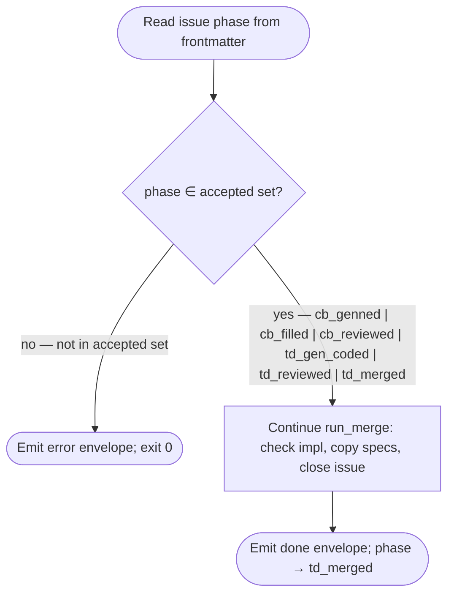

# Score TD Merge — Accept cb_reviewed Phase

Fixes the one-line gap in the `aw td merge` accepted-phase guard: after
`aw cb review --apply` advances phase to `cb_reviewed` and dispatches
`aw td merge`, the guard previously rejected `cb_reviewed` because it was
never added to the accepted set. This spec adds `cb_reviewed` to the guard,
updates the comment, and adds a regression test.

## Schema: td-merge-accepted-phases
<!-- type: schema lang: yaml -->

```yaml
"$schema": "https://json-schema.org/draft/2020-12/schema"
$id: score-td-merge-accepts-cb-reviewed#schema
title: "TD Merge — Accepted Pre-Merge Phases"
description: >
  Defines the exhaustive set of issue phases that `aw td merge` will accept
  before proceeding. Any phase not in this set causes the guard to emit an error
  envelope and exit without merging.
  @spec projects/agentic-workflow/tech-design/surface/specs/score-cb-fill-workflow.md#schema IssuePhase for the full IssuePhase enum.
  @spec projects/agentic-workflow/tech-design/surface/specs/score-cb-review-revise-crrr.md#cli for the `cb_reviewed` phase advance.
definitions:
  TdMergeAcceptedPhase:
    type: string
    description: >
      The set of IssuePhase values that pass the guard in `run_merge`
      (projects/agentic-workflow/src/cli/td.rs). Each value listed here is a distinct
      pre-merge terminal state that legitimately precedes `td_merged`.
    enum:
      - cb_genned
      - cb_filled
      - cb_reviewed
      - td_gen_coded
      - td_reviewed
      - td_merged
    x-enum-descriptions:
      cb_genned: "Code generated (canonical Phase 1+); no HANDWRITE markers present."
      cb_filled: "All HANDWRITE markers filled via aw cb fill (Phase 3)."
      cb_reviewed: "Filled code approved by aw cb review --apply (Phase 4). Added by this fix."
      td_gen_coded: "Legacy reader alias for cb_genned. Accepted for one release."
      td_reviewed: "No-codegen path: spec approved but no gen-code step performed."
      td_merged: "Retry after partial merge failure."
    additionalProperties: false
```
## Logic: td-merge-phase-guard
<!-- type: logic lang: mermaid -->


## Test Plan: td-merge-accepts-cb-reviewed

```mermaid
---
id: td-merge-accepts-cb-reviewed-test-plan
requirements:
  r1_cb_reviewed_merges:
    id: R1
    text: "aw td merge accepts cb_reviewed phase and proceeds to td_merged without error"
    kind: functional
    risk: high
    verify: test
  r2_existing_phases_unchanged:
    id: R2
    text: "All previously accepted phases (cb_genned, cb_filled, td_gen_coded, td_reviewed, td_merged) still pass the guard without regression"
    kind: functional
    risk: high
    verify: test
  r3_comment_updated:
    id: R3
    text: "Guard comment at td.rs:2516-2519 documents cb_reviewed as an accepted phase"
    kind: interface
    risk: medium
    verify: inspection
  r4_end_to_end_chain:
    id: R4
    text: "cb gen → cb fill → cb review → td merge chain completes end-to-end when phase is cb_reviewed"
    kind: functional
    risk: high
    verify: test
elements:
  test_cb_reviewed_merge_succeeds:
    kind: test
    type: "rs/#[test]"
  test_cb_genned_still_accepted:
    kind: test
    type: "rs/#[test]"
  test_cb_filled_still_accepted:
    kind: test
    type: "rs/#[test]"
  test_td_reviewed_still_accepted:
    kind: test
    type: "rs/#[test]"
  test_td_merged_still_accepted:
    kind: test
    type: "rs/#[test]"
  test_unknown_phase_rejected:
    kind: test
    type: "rs/#[test]"
  inspect_guard_comment:
    kind: inspection
    type: "grep/td.rs/cb_reviewed"
relations:
  - from: test_cb_reviewed_merge_succeeds
    verifies: r1_cb_reviewed_merges
  - from: test_cb_reviewed_merge_succeeds
    verifies: r4_end_to_end_chain
  - from: test_cb_genned_still_accepted
    verifies: r2_existing_phases_unchanged
  - from: test_cb_filled_still_accepted
    verifies: r2_existing_phases_unchanged
  - from: test_td_reviewed_still_accepted
    verifies: r2_existing_phases_unchanged
  - from: test_td_merged_still_accepted
    verifies: r2_existing_phases_unchanged
  - from: test_unknown_phase_rejected
    verifies: r2_existing_phases_unchanged
  - from: inspect_guard_comment
    verifies: r3_comment_updated
---
requirementDiagram
    requirement R1 {
      id: R1
      text: "aw td merge accepts cb_reviewed phase; proceeds to td_merged"
      risk: high
      verifymethod: test
    }
    requirement R2 {
      id: R2
      text: "Existing accepted phases still pass guard without regression"
      risk: high
      verifymethod: test
    }
    requirement R3 {
      id: R3
      text: "Guard comment updated to document cb_reviewed"
      risk: medium
      verifymethod: inspection
    }
    requirement R4 {
      id: R4
      text: "cb gen → cb fill → cb review → td merge chain completes end-to-end"
      risk: high
      verifymethod: test
    }
    element test_cb_reviewed_merge_succeeds {
      type: "rs/#[test]"
    }
    element test_cb_genned_still_accepted {
      type: "rs/#[test]"
    }
    element test_cb_filled_still_accepted {
      type: "rs/#[test]"
    }
    element test_td_reviewed_still_accepted {
      type: "rs/#[test]"
    }
    element test_td_merged_still_accepted {
      type: "rs/#[test]"
    }
    element test_unknown_phase_rejected {
      type: "rs/#[test]"
    }
    element inspect_guard_comment {
      type: "grep/td.rs/cb_reviewed"
    }
    test_cb_reviewed_merge_succeeds - verifies -> R1
    test_cb_reviewed_merge_succeeds - verifies -> R4
    test_cb_genned_still_accepted - verifies -> R2
    test_cb_filled_still_accepted - verifies -> R2
    test_td_reviewed_still_accepted - verifies -> R2
    test_td_merged_still_accepted - verifies -> R2
    test_unknown_phase_rejected - verifies -> R2
    inspect_guard_comment - verifies -> R3
```

<!-- type: test-plan lang: mermaid -->


## Changes
<!-- type: changes lang: yaml -->

```yaml
changes:
  - path: projects/agentic-workflow/src/cli/td.rs
    action: modify
    section: logic
    impl_mode: hand-written
    description: >
      Add `cb_reviewed` to the accepted-phase guard in `run_merge` at lines
      2520-2532. Extend the multi-condition if-check with `&& phase != "cb_reviewed"`.
      Update the comment block at lines 2516-2519 to document `cb_reviewed` as
      a valid accepted phase produced by `aw cb review --apply` (Phase 4).
      The @spec annotation on line 2519 is extended to reference this spec:
      @spec projects/agentic-workflow/tech-design/surface/specs/score-td-merge-accepts-cb-reviewed.md#schema (R1, R3).

  - path: projects/agentic-workflow/tests/cb_review_to_merge_test.rs
    action: create
    section: test-plan
    impl_mode: hand-written
    description: >
      New regression test file exercising the `cb_reviewed → td_merged` path
      and asserting the guard accepts all valid pre-merge phases without regression
      (R1, R2, R4). Tests:
        - test_cb_reviewed_merge_succeeds: set up a minimal worktree fixture with
          phase=cb_reviewed, call run_merge, assert exit 0 and phase advances to
          td_merged.
        - test_cb_genned_still_accepted: phase=cb_genned proceeds through guard
          without error envelope (R2).
        - test_cb_filled_still_accepted: phase=cb_filled proceeds through guard
          without error envelope (R2).
        - test_td_reviewed_still_accepted: phase=td_reviewed proceeds through
          guard without error envelope (R2).
        - test_td_merged_still_accepted: phase=td_merged proceeds through guard
          (retry path) without error envelope (R2).
        - test_unknown_phase_rejected: phase=some_unknown_phase causes guard to
          emit error envelope and return Ok without merging (R2).

  - path: projects/agentic-workflow/tech-design/surface/specs/score-cb-fill-workflow.md
    action: modify
    section: logic
    impl_mode: hand-written
    description: >
      Update the `IssuePhase` enum in the Schema section to add the
      `cb_reviewed` variant (serialised as "cb_reviewed"; doc: "Filled code
      approved by aw cb review --apply. Merge-eligible terminal phase.").
      Update the `LifecycleTrailer` enum to add `CbReview` (serialised as
      "Cb-Review") if not already present from projects/agentic-workflow/tech-design/surface/specs/score-cb-review-revise-crrr.md.
      Update the Logic section (`cb-fill-control-flow`) to annotate the
      `emit_dispatch_td_merge` terminal with a note that the caller may also
      arrive here from `cb_reviewed` phase (dispatched by aw cb review --apply).
      Update the Changes section entry for `td.rs` to reference
      @spec projects/agentic-workflow/tech-design/surface/specs/score-td-merge-accepts-cb-reviewed.md#logic for the guard fix.

  - path: projects/agentic-workflow/tech-design/surface/specs/score-td-merge-accepts-cb-reviewed.md
    action: create
    section: logic
    impl_mode: hand-written
    description: >
      This spec file. Defines the authoritative accepted-phase set for
      `aw td merge` (TdMergeAcceptedPhase schema), the logic flowchart
      for the guard, the test plan, and the file change list.
  - action: annotate
    section: schema
    impl_mode: hand-written
    description: "Traceability metadata edge for the schema section."

```

# Reviews

## Review 1
<!-- type: review lang: markdown -->

**Verdict:** approved

- The schema enumerates exactly the six pre-merge phases the guard at `td.rs:2520-2532` should accept (cb_genned, cb_filled, cb_reviewed, td_gen_coded, td_reviewed, td_merged). `cb_reviewed`'s description correctly identifies it as the missing variant, and `additionalProperties: false` matches the constants-only nature of the change.
- The Logic flowchart faithfully renders the guard control flow with the `yes` edge label enumerating all six accepted phases. The Mermaid Plus frontmatter delimiters use real `---` (not `%%---`) — matches AUTHORING.md AP-002.
- Test Plan covers R1 (cb_reviewed merges), R2 (no regression on existing phases via 5 element tests + unknown-phase rejection), R3 (comment inspection), R4 (end-to-end chain). The element-to-requirement mapping is complete and the requirementDiagram syntax is well-formed.
- Changes section names exactly four files with crisp deltas: one-line guard fix in `td.rs`, six-test regression file, owning-spec update for `score-cb-fill-workflow.md`, and this new spec. Spec-ref annotations on the `td.rs` change point back to `#schema (R1, R3)` correctly.
- No flagged sections; bias toward approval is justified by the surgical scope (one-line code + comment + test + spec text).
