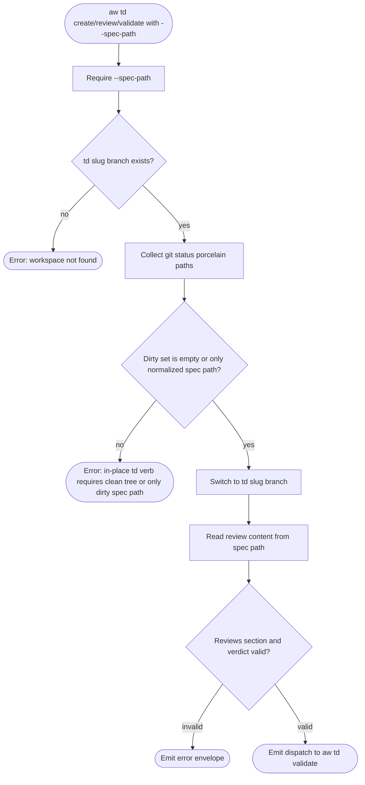

# Score TD Spec-Path Dirty Gate

TD verbs that consume a `--spec-path` payload accept the in-place spec edit only
when the current branch is `td-<slug>` and the matching `--spec-path` is the sole
dirty file. Unrelated dirty files remain hard failures.

## Logic: td-review-apply-activation
<!-- type: logic lang: mermaid -->



## Test Plan

```mermaid
---
id: score-td-review-allow-dirty-spec-test-plan
requirements:
  r1_accept_dirty_spec:
    id: R1
    text: "aw td review --apply accepts the matching dirty spec path on td slug branch and emits aw td validate"
    kind: functional
    risk: high
    verify: test
  r2_reject_unrelated_dirty:
    id: R2
    text: "aw td review --apply rejects an unrelated dirty file even when the spec path is also dirty"
    kind: functional
    risk: high
    verify: test
  r3_validate_dirty_spec:
    id: R3
    text: "aw td validate accepts the matching dirty spec path and commits the review lifecycle"
    kind: functional
    risk: high
    verify: test
  r4_preserve_missing_branch_guard:
    id: R4
    text: "aw td review --apply still refuses missing td slug branches"
    kind: regression
    risk: medium
    verify: test
elements:
  test_td_review_apply_accepts_dirty_spec_on_td_branch:
    kind: test
    type: "rs/integration"
  test_td_review_apply_rejects_unrelated_dirty_file:
    kind: test
    type: "rs/integration"
  test_inplace_verb_bails_without_init:
    kind: test
    type: "rs/integration"
relations:
  - from: test_td_review_apply_accepts_dirty_spec_on_td_branch
    verifies: r1_accept_dirty_spec
  - from: test_td_review_apply_rejects_unrelated_dirty_file
    verifies: r2_reject_unrelated_dirty
  - from: test_td_review_apply_accepts_dirty_spec_on_td_branch
    verifies: r3_validate_dirty_spec
  - from: test_inplace_verb_bails_without_init
    verifies: r4_preserve_missing_branch_guard
---
requirementDiagram
    requirement R1 {
      id: R1
      text: "review apply accepts matching dirty spec on td branch"
      risk: high
      verifymethod: test
    }
    requirement R2 {
      id: R2
      text: "review apply rejects unrelated dirty file"
      risk: high
      verifymethod: test
    }
    requirement R3 {
      id: R3
      text: "td validate accepts matching dirty spec"
      risk: high
      verifymethod: test
    }
    requirement R4 {
      id: R4
      text: "review apply still refuses missing td branch"
      risk: medium
      verifymethod: test
    }
    element test_td_review_apply_accepts_dirty_spec_on_td_branch {
      type: "rs/integration"
    }
    element test_td_review_apply_rejects_unrelated_dirty_file {
      type: "rs/integration"
    }
    element test_inplace_verb_bails_without_init {
      type: "rs/integration"
    }
    test_td_review_apply_accepts_dirty_spec_on_td_branch - verifies -> R1
    test_td_review_apply_rejects_unrelated_dirty_file - verifies -> R2
    test_td_review_apply_accepts_dirty_spec_on_td_branch - verifies -> R3
    test_inplace_verb_bails_without_init - verifies -> R4
```

<!-- type: test-plan lang: mermaid -->



## Changes
<!-- type: changes lang: yaml -->

```yaml
changes:
  - path: projects/agentic-workflow/src/cli/td.rs
    action: modify
    section: logic
    impl_mode: hand-written
    description: >
      Add a td activation path for spec-path payload verbs that allows exactly
      one dirty path: the normalized checkout-relative spec path passed via
      --spec-path. Use it for td create --apply, td review --apply, and td
      validate when --spec-path is present. Reuse the existing clean branch
      activation for other mutating td verbs, and keep missing td branch errors
      unchanged.
  - path: projects/agentic-workflow/tests/inplace_mode_test.rs
    action: modify
    section: test-plan
    impl_mode: hand-written
    description: >
      Add integration coverage for review apply accepting the expected dirty
      spec, validate committing that dirty spec, and review apply rejecting
      unrelated dirty files. Keep the existing missing-branch activation test as
      the guard for unprovisioned td branches.
```

# Reviews

## Review 1
<!-- type: review lang: markdown -->

**Verdict:** approved

- [logic] The activation flow is narrow: it preserves the missing-branch guard, accepts only an empty dirty set or the normalized spec path, and rejects unrelated dirty files before switching branches.
- [test-plan] Coverage maps the core regression paths: review apply accepts the dirty spec, validate commits the dirty spec, unrelated dirty files are rejected, and the existing missing-branch test remains the guard for unprovisioned TD branches.
- [changes] The change list is scoped to `td.rs` and the in-place lifecycle integration tests, matching the implementation surface needed for #1280.
