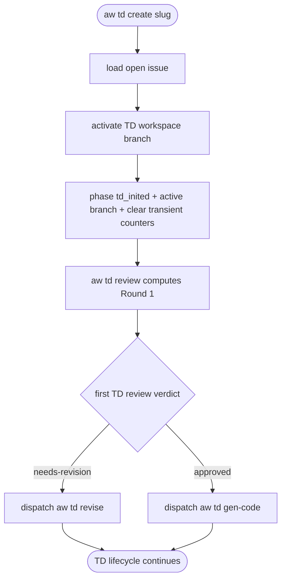

# TD Review Counter Reset

## Logic
<!-- type: logic lang: mermaid -->



## Test Plan
<!-- type: test-plan lang: mermaid -->

```mermaid
---
id: score-td-review-counter-reset-tests
requirements:
  td_init_resets_issue_review_count:
    id: TD-RC-1
    text: "aw td create clears an inherited issue review_count while preserving phase and branch"
    kind: functional
    risk: high
    verify: test
  td_init_resets_review_labels:
    id: TD-RC-2
    text: "serialized lifecycle issue file after TD init no longer carries review_count, flagged_sections, or fill_retry_count"
    kind: functional
    risk: medium
    verify: inspection
  first_td_review_starts_at_one:
    id: TD-RC-3
    text: "first TD review round is derived from the reset TD state, not the prior issue CRRR state"
    kind: functional
    risk: high
    verify: test
elements:
  inplace_mode_test:
    kind: test
    type: "rs/cargo-test"
relations:
  - { from: inplace_mode_test, verifies: td_init_resets_issue_review_count }
  - { from: inplace_mode_test, verifies: td_init_resets_review_labels }
  - { from: inplace_mode_test, verifies: first_td_review_starts_at_one }
---
requirementDiagram
    requirement td_init_resets_issue_review_count {
        id: TD-RC-1
        text: "aw td create clears an inherited issue review_count while preserving phase and branch"
        risk: high
        verifymethod: test
    }

    requirement td_init_resets_review_labels {
        id: TD-RC-2
        text: "serialized lifecycle issue file after TD init no longer carries review_count, flagged_sections, or fill_retry_count"
        risk: medium
        verifymethod: inspection
    }

    requirement first_td_review_starts_at_one {
        id: TD-RC-3
        text: "first TD review round is derived from the reset TD state, not the prior issue CRRR state"
        risk: high
        verifymethod: test
    }

    element inplace_mode_test {
        type: file
    }

    td_init_resets_issue_review_count - satisfies -> inplace_mode_test
    td_init_resets_review_labels - satisfies -> inplace_mode_test
    first_td_review_starts_at_one - satisfies -> inplace_mode_test
```

## Changes
<!-- type: changes lang: yaml -->

```yaml
changes:
  - path: projects/agentic-workflow/src/cli/td.rs
    action: modify
    section: logic
    impl_mode: hand-written
    description: Clear transient issue CRRR fields when provisioning TD workspace state.
  - path: projects/agentic-workflow/tests/inplace_mode_test.rs
    action: modify
    section: test-plan
    impl_mode: hand-written
    description: Cover TD init with an inherited issue review_count and assert the active branch lifecycle issue file resets it.
```

# Reviews

### Review 1
**Verdict:** approved

- [logic] TD init reset is the correct lifecycle boundary because the bug is inherited issue CRRR transient state leaking into TD review routing.
- [test-plan] The proposed in-place lifecycle regression should reproduce the issue by seeding review_count before `aw td create`, then asserting the active branch lifecycle issue file has no inherited review counter.
