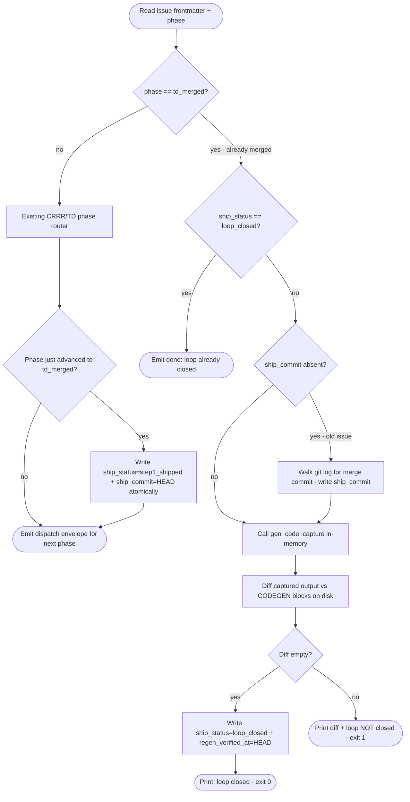

# Score TD Validate Lifecycle Extension

## Schema
<!-- type: schema lang: yaml -->

```yaml
"$schema": "https://json-schema.org/draft/2020-12/schema"
$id: score-td-validate-lifecycle-extension#schema
definitions:
  ShipStatus:
    type: string
    enum: [not_started, step1_shipped, loop_closed, rejected]
    description: >
      Tracks the ship lifecycle of a merged issue.
      not_started: no td_merged yet.
      step1_shipped: validate advanced phase to td_merged and recorded the merge commit.
      loop_closed: validate verified that gen-code output is byte-equivalent to current source.
      rejected: issue was closed without merging.
  Issue:
    type: object
    description: >
      Existing Issue struct (projects/agentic-workflow/src/issues/types.rs).
      These three fields are additive; existing issues without them parse as None.
    properties:
      ship_status:
        $ref: "#/definitions/ShipStatus"
        description: >
          Current ship lifecycle status.
          Absent or null is equivalent to not_started.
      ship_commit:
        type: string
        nullable: true
        description: >
          Git commit hash written by validate when phase first advances to td_merged.
          Absent means step1_shipped has not been set yet.
          R8: backfilled from git log when first encountered on an old issue.
      regen_verified_at:
        type: string
        nullable: true
        description: >
          Git commit hash recorded when validate confirmed regen byte-equivalence.
          Absent means loop_closed has not been confirmed yet.
  ValidateOutcome:
    type: object
    description: Per-call outcome of aw td validate (slug mode).
    properties:
      action:
        type: string
        enum: [advanced, loop_closed, loop_blocked, error]
        description: >
          advanced: phase was advanced (including writing step1_shipped on td_merged).
          loop_closed: already-merged issue regen verified byte-equivalent; ship_status set to loop_closed.
          loop_blocked: regen diff non-empty; exit code 1.
          error: unexpected phase or validation failure.
      previous_phase:
        type: string
        description: Issue phase before this validate call.
      current_phase:
        type: string
        description: Issue phase after this validate call.
      ship_status_set:
        type: string
        nullable: true
        description: New ship_status value written this call, or null if unchanged.
      regen_diff_files:
        type: array
        items:
          type: string
        description: >
          File paths whose CODEGEN blocks differed (loop_blocked case).
          Empty for all other outcomes.
```
## Logic: validate lifecycle extension
<!-- type: logic lang: mermaid -->


## Changes
<!-- type: changes lang: yaml -->

```yaml
changes:
  - path: projects/agentic-workflow/src/issues/types.rs
    action: modify
    section: schema
    impl_mode: hand-written
    description: >
      Extend the Issue struct with three optional serde-default fields:
      ship_status (Option<ShipStatus>), ship_commit (Option<String>),
      regen_verified_at (Option<String>). All use #[serde(default,
      skip_serializing_if = "Option::is_none")] so existing issues without
      these fields parse without error (R1, R2, R3, R9).
      Add ShipStatus enum with four variants: NotStarted, Step1Shipped,
      LoopClosed, Rejected. Serialized as snake_case strings.
      Extend IssuePatch with matching optional fields.
      Extend IssuePatch::apply to write the new fields when set.
      The stable frontmatter fields and ShipStatus enum are folded into
      `projects/agentic-workflow/tech-design/core/issues/types.md#schema` so the primary
      issue type CODEGEN block stays replayable.

  - path: projects/agentic-workflow/src/cli/td.rs
    action: modify
    section: logic
    impl_mode: hand-written
    description: >
      Extension points (exact function: run_validate):

      R4 — after existing routing advances phase to td_merged, write
      ship_status=step1_shipped and ship_commit=HEAD in the same atomic
      commit via IssuePatch before emitting the dispatch envelope.

      R5/R7 — the "td_merged" arm in the phase match (currently emits a
      bare done envelope) is replaced with a loop-close path:
        1. If ship_status == loop_closed, emit done immediately.
        2. Otherwise call gen_code_capture(spec_path) as a direct fn call
           (no subprocess), capturing output in-memory.
        3. Diff captured output against current CODEGEN-BEGIN/END blocks
           on disk via diff_codegen_blocks(regen_output, project_root).
        4. Byte-equivalent: write ship_status=loop_closed +
           regen_verified_at=HEAD atomically; print "loop closed"; exit 0.
        5. Diff non-empty: print diff + "loop NOT closed: regen produces
           different output. Files: <list>"; exit 1.

      R8 — before the loop-close path, if issue.ship_commit is None,
      walk git log --grep "Lifecycle-Stage: Merge" --first-parent for
      the slug in the worktree to find the merge commit SHA; write it
      as ship_commit via IssuePatch in a backfill commit; then proceed
      to the loop-close path. One-shot retroactive fix for old issues.

  - path: projects/agentic-workflow/src/cli/codegen.rs
    action: modify
    section: logic
    impl_mode: hand-written
    description: >
      Extract or expose gen_code_capture(spec_path: &Path) ->
      Result<HashMap<PathBuf, String>> as a pub(crate) library function
      callable from td.rs without spawning a subprocess. Returns a map
      from file path to generated content string (not written to disk).
      The existing run_gen_code path may delegate to this fn and then
      write the returned map to disk.

  - path: projects/agentic-workflow/tech-design/surface/specs/score-td-validate-lifecycle-extension.md
    action: create
    section: logic
    impl_mode: hand-written
    description: This spec file.
```

# Reviews

## Review 1
<!-- type: review lang: markdown -->

**Verdict:** approved

- [overview] Accurate and complete: correctly describes the two-step ship rule, the no-new-verbs constraint (R10), and the backfill path (R8) in unambiguous prose.
- [schema] All three new Issue fields (`ship_status`, `ship_commit`, `regen_verified_at`) and the `ValidateOutcome` outcome type are fully specified with nullability and absence semantics; implementable as written.
- [logic] Mermaid flowchart covers all requirement paths (R4, R5, R7, R8) with correct branching. Minor label nit: `write_step1_shipped` node cites R3 instead of R4, but the flowchart edge semantics are correct and unambiguous.
- [changes] Three target files (`types.rs`, `td.rs`, `codegen.rs`) are identified with exact function names and precise impl guidance; sufficient for implementation without further clarification.
