# Score UI Complexity Budgets

## Schema
<!-- type: schema lang: yaml -->

```yaml
definitions:
  SectionMeta:
    type: object
    required: [section_type]
    properties:
      section_type:
        type: string
        x-rust-type: "SectionType"
      lang:
        type: string
      attributes:
        type: object
        additionalProperties:
          type: string
        default: {}
        description: "Optional attr-style metadata excluding core type/lang keys."
  SectionAnnotation:
    type: object
    required: [section_type, lang]
    properties:
      section_type: { type: string }
      lang: { type: string }
      attributes:
        type: object
        additionalProperties:
          type: string
        default: {}
  UiComplexityProfile:
    type: object
    required: [task_budgets]
    properties:
      task_budgets:
        type: object
        additionalProperties:
          type: integer
          minimum: 0
  UiComplexityTask:
    type: object
    required: [id, class, metrics]
    properties:
      id: { type: string }
      class: { type: string }
      metrics:
        type: object
        additionalProperties:
          type: integer
          minimum: 0
  UiComplexityFinding:
    type: object
    required: [kind, task_id, task_class]
    properties:
      kind:
        type: string
        enum: [unknown_workspace, missing_profile, missing_budget, budget_exceeded]
      task_id: { type: string }
      task_class: { type: string }
      score: { type: integer }
      budget: { type: integer }
requirements:
  - id: UI-BUDGET-1
    text: "Parser accepts legacy `type: ... lang: ...` and attr-style `score-section type=\"...\" lang=\"...\"` annotations."
    verify: parser_unit_tests
  - id: UI-BUDGET-2
    text: "Parser preserves optional workspace, surface, and role attributes."
    verify: parser_unit_tests
  - id: UI-BUDGET-3
    text: "Config supports workspace `ui_profile` and `ui_profiles.<name>.task_budgets`."
    verify: section_format_unit_tests
  - id: UI-BUDGET-4
    text: "TD check compares UI task metric sums to the matching task-class budget."
    verify: section_format_unit_tests
  - id: UI-BUDGET-5
    text: "Existing legacy annotations and absent UI profile config remain compatible."
    verify: section_format_unit_tests
```

## Logic

```mermaid
---
id: score-ui-complexity-budget-logic
entry: start
nodes:
  start: { kind: start, label: "aw td check spec" }
  parse_sections: { kind: process, label: "parse section annotations" }
  legacy_or_attr: { kind: decision, label: "legacy or score-section attr style?" }
  preserve_attrs: { kind: process, label: "store optional attributes map" }
  ui_section: { kind: decision, label: "section type is UI budget capable?" }
  has_workspace: { kind: decision, label: "workspace attr present?" }
  load_config: { kind: process, label: "read .aw/config.toml" }
  resolve_workspace: { kind: process, label: "find projects[].workspaces[].name" }
  resolve_profile: { kind: process, label: "load workspace ui_profile and task budgets" }
  extract_tasks: { kind: process, label: "parse YAML tasks or complexity.tasks" }
  score_tasks: { kind: process, label: "sum numeric metrics per task" }
  compare_budget: { kind: decision, label: "score <= class budget?" }
  emit_finding: { kind: process, label: "append validation finding" }
  pass: { kind: terminal, label: "no UI budget finding" }
edges:
  - { from: start, to: parse_sections, label: "file content" }
  - { from: parse_sections, to: legacy_or_attr, label: "comment line" }
  - { from: legacy_or_attr, to: preserve_attrs, label: "valid annotation" }
  - { from: preserve_attrs, to: ui_section, label: "section metadata" }
  - { from: ui_section, to: pass, label: "no" }
  - { from: ui_section, to: has_workspace, label: "yes" }
  - { from: has_workspace, to: pass, label: "no target attr" }
  - { from: has_workspace, to: load_config, label: "workspace target" }
  - { from: load_config, to: resolve_workspace, label: "config found" }
  - { from: resolve_workspace, to: resolve_profile, label: "workspace found" }
  - { from: resolve_profile, to: extract_tasks, label: "profile found" }
  - { from: extract_tasks, to: score_tasks, label: "tasks with metrics" }
  - { from: score_tasks, to: compare_budget, label: "per task class" }
  - { from: compare_budget, to: pass, label: "yes" }
  - { from: compare_budget, to: emit_finding, label: "no" }
  - { from: emit_finding, to: pass, label: "reported" }
---
flowchart TD
    start([aw td check]) --> parse_sections[parse annotations]
    parse_sections --> legacy_or_attr{legacy or attr style}
    legacy_or_attr --> preserve_attrs[preserve optional attrs]
    preserve_attrs --> ui_section{UI budget capable type}
    ui_section -- no --> pass([pass])
    ui_section -- yes --> has_workspace{workspace attr}
    has_workspace -- no --> pass
    has_workspace -- yes --> load_config[read config]
    load_config --> resolve_workspace[resolve workspace]
    resolve_workspace --> resolve_profile[resolve ui_profile budgets]
    resolve_profile --> extract_tasks[parse tasks]
    extract_tasks --> score_tasks[sum numeric metrics]
    score_tasks --> compare_budget{score <= budget}
    compare_budget -- yes --> pass
    compare_budget -- no --> emit_finding[emit finding]
    emit_finding --> pass
```

<!-- type: logic lang: mermaid -->



## Config
<!-- type: config lang: yaml -->

```yaml
ui_profiles:
  owner-frontoffice:
    task_budgets:
      intake: 8
      review: 12
      approve: 10
      configure: 12
      operate: 14
      recover: 10
projects:
  - name: cue
    workspaces:
      - name: cue-artifact-studio
        ui_profile: owner-frontoffice
```

## Test Plan

```mermaid
---
id: score-ui-complexity-budget-tests
requirements:
  legacy_annotation:
    id: T1
    text: "legacy annotation still parses"
    kind: interface
    risk: high
    verify: test
  attr_annotation:
    id: T2
    text: "score-section annotation parses and preserves workspace surface role"
    kind: interface
    risk: high
    verify: test
  missing_workspace:
    id: T3
    text: "workspace attr referencing an unknown workspace emits a finding"
    kind: functional
    risk: medium
    verify: test
  over_budget:
    id: T4
    text: "task metrics exceeding configured budget emit a finding"
    kind: functional
    risk: high
    verify: test
  under_budget:
    id: T5
    text: "task metrics within configured budget pass"
    kind: functional
    risk: high
    verify: test
elements:
  parser_unit_tests:
    kind: test
    type: "rs/unit"
  section_format_unit_tests:
    kind: test
    type: "rs/unit"
relations:
  - { from: parser_unit_tests, verifies: legacy_annotation }
  - { from: parser_unit_tests, verifies: attr_annotation }
  - { from: section_format_unit_tests, verifies: missing_workspace }
  - { from: section_format_unit_tests, verifies: over_budget }
  - { from: section_format_unit_tests, verifies: under_budget }
---
requirementDiagram
    requirement legacy_annotation {
        id: T1
        text: "legacy annotation still parses"
        risk: high
        verifymethod: test
    }
    requirement attr_annotation {
        id: T2
        text: "score-section annotation preserves attrs"
        risk: high
        verifymethod: test
    }
    requirement missing_workspace {
        id: T3
        text: "unknown workspace emits finding"
        risk: medium
        verifymethod: test
    }
    requirement over_budget {
        id: T4
        text: "over-budget task emits finding"
        risk: high
        verifymethod: test
    }
    requirement under_budget {
        id: T5
        text: "under-budget task passes"
        risk: high
        verifymethod: test
    }
    element parser_unit_tests {
        type: "rs/unit"
    }
    element section_format_unit_tests {
        type: "rs/unit"
    }
    parser_unit_tests - verifies -> legacy_annotation
    parser_unit_tests - verifies -> attr_annotation
    section_format_unit_tests - verifies -> missing_workspace
    section_format_unit_tests - verifies -> over_budget
    section_format_unit_tests - verifies -> under_budget
```

<!-- type: test-plan lang: mermaid -->



## Changes
<!-- type: changes lang: yaml -->

```yaml
changes:
  - path: .aw/tech-design/AUTHORING.md
    action: modify
    section: changes
    impl_mode: hand-written
    description: Document attr-style score-section annotations, optional target attrs, UI profile config, and metric scoring.
  - path: projects/agentic-workflow/tech-design/core/interfaces/models/section.md
    action: modify
    section: schema
    impl_mode: hand-written
    description: Extend the SectionMeta contract to include optional annotation attributes.
  - path: projects/agentic-workflow/tech-design/core/interfaces/spec_alignment/models.md
    action: modify
    section: schema
    impl_mode: hand-written
    description: Extend SectionAnnotation schema with preserved optional attributes.
  - path: projects/agentic-workflow/src/models/section.rs
    action: modify
    section: schema
    impl_mode: hand-written
    description: Parse legacy and score-section attr-style comments and preserve optional attributes in SectionMeta.
  - path: projects/agentic-workflow/src/spec_alignment/models.rs
    action: modify
    section: schema
    impl_mode: hand-written
    description: Add SectionAnnotation attributes map for parser consumers.
  - path: projects/agentic-workflow/src/spec_alignment/parser.rs
    action: modify
    section: logic
    impl_mode: hand-written
    description: Parse both annotation styles and expose non-core attributes.
  - path: projects/agentic-workflow/src/generate/frontmatter.rs
    action: modify
    section: schema
    impl_mode: hand-written
    description: Recognize attr-style annotation comments while extracting Mermaid Plus section type metadata.
  - path: projects/agentic-workflow/src/validate/rules/section_format.rs
    action: modify
    section: logic
    impl_mode: hand-written
    description: Accept attr-style annotation lines and validate UI complexity metrics against workspace profile budgets.
  - path: projects/agentic-workflow/src/validate/rules/r7a_missing_section_annotation.rs
    action: modify
    section: logic
    impl_mode: hand-written
    description: Treat score-section attr-style comments as valid section annotations and update user-facing finding text.
  - action: annotate
    section: config
    impl_mode: hand-written
    description: "Traceability metadata edge for the config section."

  - action: annotate
    section: unit-test
    impl_mode: hand-written
    description: "Traceability metadata edge for the unit-test section."

```

# Reviews

### Review 1
**Verdict:** approved

- [schema] The data model covers parser-visible metadata, profile budgets, task metrics, and explicit finding kinds while keeping type/lang backward compatible.
- [logic] The validation flow clearly separates annotation parsing from UI-specific budget enforcement and preserves the no-workspace compatibility path.
- [config] The config shape matches the issue's generic task-class vocabulary and keeps workspace names outside section type definitions.
- [test-plan] Coverage includes legacy annotation compatibility, attr-style metadata preservation, missing workspace, over-budget, and under-budget cases.
- [changes] The touched files map directly to parser/model updates, validation behavior, authoring documentation, and existing spec contracts.
