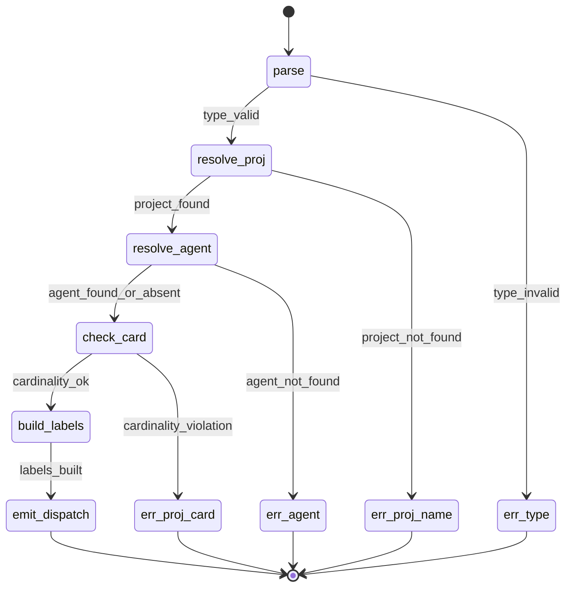
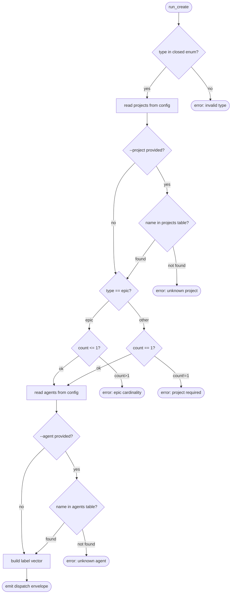

# Score WI CLI Redesign

## Current Public Surface
<!-- type: doc lang: markdown -->

`aw wi` is the canonical public work-item command. `aw wi` and
`aw wi` remain transition aliases that route to the same handler and
must preserve byte-identical envelope output. For compatibility with existing
automation, envelope `invoke.command` strings may continue to say
`aw wi ...`; consumers run those literal commands while human-facing
documentation and prompts use `aw wi ...`.

## Scenarios
<!-- type: scenarios lang: yaml -->

```yaml
id: wi-create-scenarios
scenarios:
  - id: S1
    title: "known --project resolves to scoped label"
    given:
      - "[[projects]] in .aw/config.toml contains name=score label=project::score"
    when:
      - "aw wi create --type enhancement --project score"
    then:
      - "labels vector = [type::enhancement, project::score]"
      - "dispatch envelope emitted on stdout"

  - id: S2
    title: "unknown --project rejected before backend call"
    given:
      - "[[projects]] has no entry with name=unknown-x"
    when:
      - "aw wi create --type bug --project unknown-x"
    then:
      - "error envelope emitted listing valid names from [[projects]]"
      - "no backend API call made"

  - id: S3
    title: "aw wi and aw wi aliases produce byte-identical envelopes"
    given:
      - "aw wi create --type enhancement --project score emits envelope E"
    when:
      - "aw wi create --type enhancement --project score"
      - "aw wi create --type enhancement --project score"
    then:
      - "both emit envelope byte-identical to E"

  - id: S4
    title: "epic type allows 0 --project flags"
    given:
      - "--type epic specified with no --project"
    when:
      - "aw wi create --type epic"
    then:
      - "labels vector = [type::epic]"
      - "dispatch envelope emitted"

  - id: S5
    title: "epic type allows exactly 1 --project flag"
    given:
      - "--type epic and --project score"
    when:
      - "aw wi create --type epic --project score"
    then:
      - "labels vector = [type::epic, project::score]"
      - "dispatch envelope emitted"

  - id: S6
    title: "non-epic type missing --project is rejected"
    given:
      - "--type bug with no --project"
    when:
      - "aw wi create --type bug"
    then:
      - "error envelope emitted naming both the offending type and observed count"
      - "no backend call made"

  - id: S7
    title: "non-epic type with 2 --project flags is rejected"
    given:
      - "--type enhancement with --project score --project sdd"
    when:
      - "aw wi create --type enhancement --project score --project sdd"
    then:
      - "error envelope emitted naming offending type and observed count (2)"
      - "no backend call made"

  - id: S8
    title: "known --agent resolves to scoped label"
    given:
      - "[[agents]] contains name=claude-code label=agent::claude-code"
    when:
      - "aw wi create --type enhancement --project score --agent claude-code"
    then:
      - "labels vector = [type::enhancement, project::score, agent::claude-code]"
      - "dispatch envelope emitted"

  - id: S9
    title: "unknown --agent rejected before backend call"
    given:
      - "[[agents]] has no entry with name=gpt-x"
    when:
      - "aw wi create --type enhancement --project score --agent gpt-x"
    then:
      - "error envelope emitted listing valid names from [[agents]]"
      - "no backend call made"

  - id: S10
    title: "optional --priority emits scoped label"
    given:
      - "--priority p1 specified"
    when:
      - "aw wi create --type bug --project score --priority p1"
    then:
      - "labels vector = [type::bug, project::score, priority::p1]"

  - id: S11
    title: "label vector order is stable: type, project, priority, agent"
    given:
      - "all four flags provided"
    when:
      - "aw wi create --type enhancement --project score --priority p2 --agent claude-code"
    then:
      - "labels = [type::enhancement, project::score, priority::p2, agent::claude-code]"
      - "order invariant regardless of flag input order"
```

## State Machine
<!-- type: state-machine lang: mermaid -->



## Logic
<!-- type: logic lang: mermaid -->



## CLI
<!-- type: cli lang: yaml -->

```yaml
id: score-wi-cli
binary: score
commands:
  - path: [wi]
    aliases: [iss, issues]
    summary: "Work-item lifecycle (alias: iss, issues)"
    subcommands:
      - path: [wi, create]
        summary: "Create a new work-item with closed-vocabulary typed flags"
        args:
          - name: title
            kind: positional
            required: true
            type: string
          - name: type
            kind: option
            long: --type
            required: true
            type: enum
            values: [bug, enhancement, refactor, test, epic]
            emits_label: "type::<value>"
          - name: project
            kind: option
            long: --project
            required: false
            repeatable: true
            type: string
            resolves_against: ".aw/config.toml [[projects]].name"
            emits_label: "project::<config-resolved-label-suffix>"
            cardinality:
              when_type_is_epic: "0 or 1"
              when_type_is_other: "exactly 1"
          - name: priority
            kind: option
            long: --priority
            required: false
            type: enum
            values: [p0, p1, p2, p3]
            emits_label: "priority::<value>"
          - name: agent
            kind: option
            long: --agent
            required: false
            type: string
            resolves_against: ".aw/config.toml [[agents]].name"
            emits_label: "agent::<config-resolved-label-suffix>"
            cardinality: "0 or 1"
        emits_envelope:
          on_success: "dispatch (existing run_create envelope shape)"
          on_failure: "error (action=error, slug, message)"
        removed_args:
          - "--label (was repeatable, free-form)"
          - "remote/backend selector (backend selection comes from .aw/config.toml)"
          - "--repo (backend repository comes from .aw/config.toml)"
      - path: [wi, list]
        summary: "List open work-items by default; on project-<name> branches, default to that project's label; pass --state closed to show closed work-items."
      - path: [wi, show]
        summary: "Show one work-item (passthrough)"
      - path: [wi, update]
        summary: "Update a work-item body (passthrough; --label retained)"
      - path: [wi, fill-section]
        summary: "Fill / merge a section payload (passthrough)"
      - path: [wi, validate]
        summary: "Validate and advance phase (passthrough)"
      - path: [wi, review]
        summary: "Append reviewer bullet (passthrough)"
      - path: [wi, revise]
        summary: "Revise flagged sections (passthrough)"
      - path: [wi, merge]
        summary: "Merge approved work-item (passthrough)"
      - path: [wi, arbitrate]
        summary: "Escalate to human after 2nd needs-revision (passthrough)"
      - path: [wi, verify]
        summary: "Read-only drift check (passthrough)"
      - path: [wi, idle]
        summary: "Scan stalled work-item branches (passthrough)"
alias_contract:
  - "Both `iss` and `issues` registered via clap `alias` on the `wi` subcommand"
  - "All three forms dispatch to the same handler functions in projects/agentic-workflow/src/cli/issues.rs"
  - "Envelopes emitted by the three forms are byte-identical"
```

## Test Plan

```mermaid
---
id: wi-create-test-plan
requirements:
  type_valid:
    id: TC1
    text: "all 5 valid type values produce expected type::<v> label"
    kind: functional
    risk: low
    verify: test
  type_invalid:
    id: TC2
    text: "invalid type value rejected at parse time with error envelope"
    kind: functional
    risk: low
    verify: test
  project_known:
    id: TC3
    text: "known project name resolves to project::<config-label> from [[projects]]"
    kind: functional
    risk: medium
    verify: test
  project_unknown:
    id: TC4
    text: "unknown project name returns error envelope listing valid names"
    kind: functional
    risk: medium
    verify: test
  project_card_epic_0:
    id: TC5
    text: "epic with 0 --project succeeds; labels = [type::epic]"
    kind: functional
    risk: low
    verify: test
  project_card_epic_1:
    id: TC6
    text: "epic with 1 --project succeeds; labels = [type::epic, project::<v>]"
    kind: functional
    risk: low
    verify: test
  project_card_epic_2:
    id: TC7
    text: "epic with 2 --project rejected with cardinality error envelope"
    kind: functional
    risk: medium
    verify: test
  project_card_non_epic_0:
    id: TC8
    text: "non-epic with 0 --project rejected with cardinality error envelope"
    kind: functional
    risk: medium
    verify: test
  project_card_non_epic_1:
    id: TC9
    text: "non-epic with 1 --project succeeds"
    kind: functional
    risk: low
    verify: test
  project_card_non_epic_2:
    id: TC10
    text: "non-epic with 2 --project rejected"
    kind: functional
    risk: medium
    verify: test
  priority_opt:
    id: TC11
    text: "--priority p0..p3 emits priority::<v>; absent emits no priority label"
    kind: functional
    risk: low
    verify: test
  agent_known:
    id: TC12
    text: "known agent name resolves to agent::<config-label> from [[agents]]"
    kind: functional
    risk: medium
    verify: test
  agent_unknown:
    id: TC13
    text: "unknown agent name returns error envelope listing valid names"
    kind: functional
    risk: medium
    verify: test
  label_order:
    id: TC14
    text: "label vector order stable: type, project, priority, agent regardless of flag input order"
    kind: functional
    risk: low
    verify: test
  alias_byte_equal:
    id: TC15
    text: "aw wi create and aw wi create produce byte-identical envelopes to aw wi create"
    kind: interface
    risk: medium
    verify: test
  envelope_error_shape:
    id: TC16
    text: "all parse-time errors emit {action:error, slug, message} envelope on stdout, no panic"
    kind: interface
    risk: medium
    verify: test
elements:
  unit_create_args:
    kind: test
    type: "rs/#[test]"
  unit_resolve_project:
    kind: test
    type: "rs/#[test]"
  unit_resolve_agent:
    kind: test
    type: "rs/#[test]"
  unit_cardinality:
    kind: test
    type: "rs/#[test]"
  unit_label_vector:
    kind: test
    type: "rs/#[test]"
  unit_alias_byte_equal:
    kind: test
    type: "rs/#[test]"
relations:
  - { from: unit_create_args,       verifies: type_valid }
  - { from: unit_create_args,       verifies: type_invalid }
  - { from: unit_resolve_project,   verifies: project_known }
  - { from: unit_resolve_project,   verifies: project_unknown }
  - { from: unit_cardinality,       verifies: project_card_epic_0 }
  - { from: unit_cardinality,       verifies: project_card_epic_1 }
  - { from: unit_cardinality,       verifies: project_card_epic_2 }
  - { from: unit_cardinality,       verifies: project_card_non_epic_0 }
  - { from: unit_cardinality,       verifies: project_card_non_epic_1 }
  - { from: unit_cardinality,       verifies: project_card_non_epic_2 }
  - { from: unit_create_args,       verifies: priority_opt }
  - { from: unit_resolve_agent,     verifies: agent_known }
  - { from: unit_resolve_agent,     verifies: agent_unknown }
  - { from: unit_label_vector,      verifies: label_order }
  - { from: unit_alias_byte_equal,  verifies: alias_byte_equal }
  - { from: unit_create_args,       verifies: envelope_error_shape }
---
requirementDiagram
    requirement type_valid {
      id: TC1
      text: "all 5 valid type values produce expected type::<v> label"
      risk: low
      verifymethod: test
    }
    requirement project_known {
      id: TC3
      text: "known project name resolves to project::<config-label>"
      risk: medium
      verifymethod: test
    }
    requirement agent_known {
      id: TC12
      text: "known agent name resolves to agent::<config-label>"
      risk: medium
      verifymethod: test
    }
    requirement label_order {
      id: TC14
      text: "label vector order stable across flag input order"
      risk: low
      verifymethod: test
    }
    requirement alias_byte_equal {
      id: TC15
      text: "iss/issues aliases produce byte-identical envelopes"
      risk: medium
      verifymethod: test
    }
    element unit_create_args {
      type: "rs/#[test]"
    }
    element unit_resolve_project {
      type: "rs/#[test]"
    }
    element unit_resolve_agent {
      type: "rs/#[test]"
    }
    element unit_label_vector {
      type: "rs/#[test]"
    }
    element unit_alias_byte_equal {
      type: "rs/#[test]"
    }
    unit_create_args - verifies -> type_valid
    unit_resolve_project - verifies -> project_known
    unit_resolve_agent - verifies -> agent_known
    unit_label_vector - verifies -> label_order
    unit_alias_byte_equal - verifies -> alias_byte_equal
```

<!-- type: test-plan lang: mermaid -->



## Changes
<!-- type: changes lang: yaml -->

```yaml
id: score-wi-cli-redesign-changes
changes:
  - path: projects/agentic-workflow/src/cli/issues.rs
    action: modify
    impl_mode: hand-written
    section: source
    summary: "Refactor CreateArgs: drop --label, add --project (repeatable, gated), --priority, --agent. Build label vector from typed flags using GitLab scoped-label syntax. Promote read_known_project_labels to hard resolver. Add read_known_agent_labels. Replace check_project_labels warning with parse-time cardinality validator."
    spec_refs: [requirements#R3, requirements#R4, requirements#R5, requirements#R6, requirements#R7, requirements#R10, requirements#R12, logic, state-machine]

  - path: projects/agentic-workflow/src/cli/lib.rs
    action: modify
    impl_mode: hand-written
    section: source
    summary: "Add `wi` top-level subcommand with clap aliases [iss, issues]; all three forms dispatch to existing issues handler module."
    spec_refs: [requirements#R1, requirements#R2, cli]

  - path: .aw/config.toml
    action: precursor
    section: logic
    impl_mode: hand-written
    summary: "[[agents]] registry already added on score branch (claude-code, codex). This change wires the CLI to consume it."
    spec_refs: [requirements#R12]

  - path: CLAUDE.md
    action: patch
    section: cli
    impl_mode: hand-written
    summary: "Update `## Issue Labels` table: remove `crate:{name}` row; add `project::{name}` row (sourced from .aw/config.toml [[projects]].label) and `agent::{name}` row (sourced from [[agents]].label). Update `## Issues` block examples to `aw wi create --type <t> --project <p> [--priority <pN>] [--agent <name>]`."
    spec_refs: [requirements#R8, requirements#R9]

  - path: projects/agentic-workflow/templates/mainthread/skills/score-issue/SKILL.md
    action: patch
    impl_mode: hand-written
    section: source
    summary: "Rewrite Usage block and CRRR mainthread loop examples to use `aw wi create --type <t> --project <p> [--priority <pN>] [--agent <name>]`."
    spec_refs: [requirements#R9]

  - path: .claude/skills/score-issue/SKILL.md
    action: patch
    section: cli
    impl_mode: hand-written
    summary: "Mirror the template change in the deployed skill copy."
    spec_refs: [requirements#R9]

  - path: projects/agentic-workflow/tech-design/surface/issues_top.md
    action: patch
    section: logic
    impl_mode: hand-written
    summary: "Extend CreateArgs schema: drop --label; add --project (cardinality gated by type), --priority, --agent. Note WiCommand alias contract."
    spec_refs: [cli, requirements#R1, requirements#R2]

  - path: projects/agentic-workflow/tech-design/surface/specs/issue-cli-envelope.md
    action: patch
    section: cli
    impl_mode: hand-written
    summary: "Note that envelope `invoke.command` strings continue to use `aw wi` while `aw wi` is the documented surface; alias contract preserves byte-identical output."
    spec_refs: [requirements#R2]
  - action: annotate
    section: scenarios
    impl_mode: hand-written
    description: "Traceability metadata edge for the scenarios section."

  - action: annotate
    section: state-machine
    impl_mode: hand-written
    description: "Traceability metadata edge for the state-machine section."

  - action: annotate
    section: unit-test
    impl_mode: hand-written
    description: "Traceability metadata edge for the unit-test section."

```

# Reviews

## Review 3
<!-- type: review lang: markdown -->

**Verdict:** approved

- [scenarios] S1-S11 cover the full design surface: project resolution (known/unknown), alias byte-equivalence, epic 0/1 cardinality, non-epic exactly-1 enforcement, agent resolution (known/unknown), priority emission, label-vector ordering. Every R-id from the issue body has at least one scenario.
- [state-machine] Flag-validation FSM is acyclic, single-entry, terminal-only sinks; error states map 1:1 to the four reject paths called out in scenarios. Codegen-ready Mermaid Plus frontmatter present.
- [logic] run_create flowchart matches the FSM's branch structure (validate_type → resolve_proj → check_card → resolve_agent → build_vec → emit_ok). Decision nodes are all binary; no dead edges.
- [cli] Command tree captures the wi/iss/issues alias contract, all four typed flags with closed-vocabulary enums, cardinality rules, and removed_args explicitly listing `--label` so the diff is unambiguous. Passthrough subcommands enumerated for completeness.
- [test-plan] 16 test cases cover every requirement family with at least one element binding. Element kinds are all `rs/#[test]`; relations form a complete bipartite graph requirement → test.
- [changes] Eight file actions with explicit spec_refs back to requirements + section types. Note: `action: precursor` for `.aw/config.toml` documents that the `[[agents]]` registry was already added on the score branch — flagging this for the reviewer's awareness, not as a concern.
- Cleared for `aw cb gen` / implementation.
