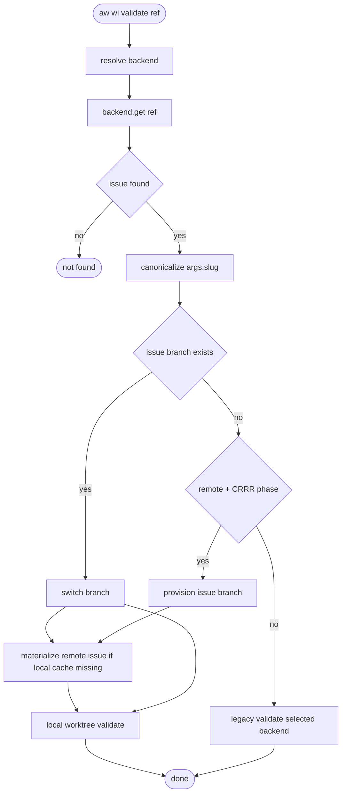

# WI Validate Remote Backend

## Logic
<!-- type: logic lang: mermaid -->



## CLI
<!-- type: cli lang: yaml -->

```yaml
commands:
  - path: [wi, validate]
    aliases:
      - [issues, validate]
      - [iss, validate]
    args:
      - name: slug
        kind: positional
        required: true
      - name: json
        kind: flag
        long: json
      - name: backend
        kind: option
        long: backend
        values: [local, github, gitlab, jira]
      - name: repo
        kind: option
        long: repo
    behavior:
      backend_resolution: "same as wi list/show"
      canonical_slug: "backend issue slug wins after lookup"
      remote_crrr_materialization: "remote issue with phase label enters issue-<id> branch and local worktree validate"
```

## Test Plan
<!-- type: test-plan lang: mermaid -->

```mermaid
---
id: score-wi-validate-remote-backend-tests
requirements:
  validate_accepts_backend_flags:
    id: WI-VAL-1
    text: "aw wi validate accepts --backend and --repo like list/show"
    kind: interface
    risk: high
    verify: test
  validate_local_regression:
    id: WI-VAL-2
    text: "local-only validate behavior remains unchanged"
    kind: functional
    risk: high
    verify: test
  validate_remote_materialization:
    id: WI-VAL-3
    text: "remote CRRR issue lookup canonicalizes id and materializes onto issue branch"
    kind: functional
    risk: high
    verify: test
elements:
  score_process_tests:
    kind: test
    type: "rs/cargo-test"
relations:
  - { from: score_process_tests, verifies: validate_accepts_backend_flags }
  - { from: score_process_tests, verifies: validate_local_regression }
  - { from: score_process_tests, verifies: validate_remote_materialization }
---
requirementDiagram
    requirement validate_accepts_backend_flags {
        id: WI-VAL-1
        text: "aw wi validate accepts --backend and --repo like list/show"
        risk: high
        verifymethod: test
    }
    requirement validate_local_regression {
        id: WI-VAL-2
        text: "local-only validate behavior remains unchanged"
        risk: high
        verifymethod: test
    }
    requirement validate_remote_materialization {
        id: WI-VAL-3
        text: "remote CRRR issue lookup canonicalizes id and materializes onto issue branch"
        risk: high
        verifymethod: test
    }
    element score_process_tests {
        type: "rs/cargo-test"
    }
    score_process_tests - verifies -> validate_accepts_backend_flags
    score_process_tests - verifies -> validate_local_regression
    score_process_tests - verifies -> validate_remote_materialization
```

## Changes
<!-- type: changes lang: yaml -->

```yaml
changes:
  - path: projects/agentic-workflow/src/cli/issues.rs
    action: modify
    section: cli
    impl_mode: hand-written
    description: Resolve validate backend from CLI/config, canonicalize remote slugs, and materialize remote CRRR issues before worktree validate.
  - path: projects/agentic-workflow/tests/inplace_mode_test.rs
    action: modify
    section: test-plan
    impl_mode: hand-written
    description: Add local-regression coverage for validate backend flag parsing and issue branch behavior.
  - action: annotate
    section: logic
    impl_mode: hand-written
    description: "Traceability metadata edge for the logic section."

```

# Reviews

### Review 1
**Verdict:** approved

- [logic] The design preserves the existing checkout-local commit path while allowing GitHub/GitLab to be the source lookup and label update backend.
- [cli] Adding `--backend` and `--repo` to validate aligns it with list/show without changing existing positional usage.
- [test-plan] Tests should cover local regression and at least the parse/materialization branch selection without relying on live GitHub in unit tests.
