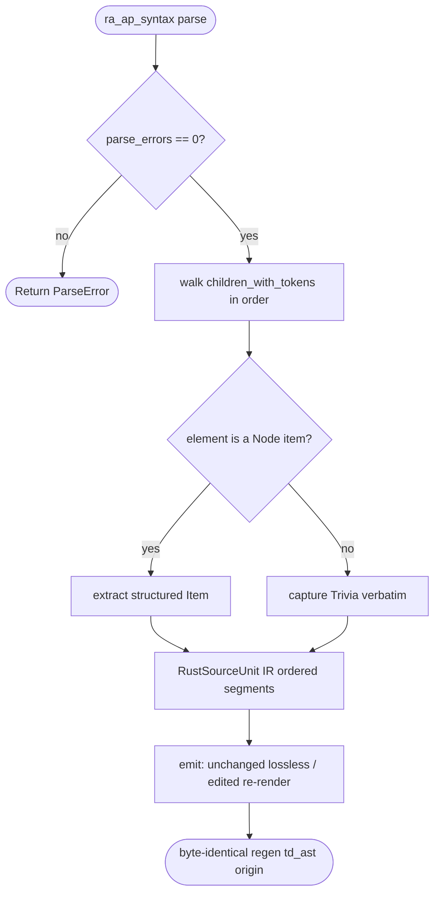

# Tech Design: rust-source-unit IR

Captures a Rust source unit as a structured, editable item-tree AST and emits it
byte-identically — the foundation for moving Rust units off source-replay to td_ast.

## Logic
<!-- type: logic lang: mermaid -->

# Reviews

### Review 1
**Verdict:** approved

- [logic] Contract logic is a valid Mermaid Plus block (id rust-source-unit-roundtrip). The flow is a complete, deterministic contract: parse via ra_ap_syntax (Edition2021) -> reject on parse_errors -> walk children_with_tokens in order -> classify each element as Item (structured: kind/name/attrs/doc/sig-or-fields/body-CST) or Trivia (verbatim whitespace/comments) -> assemble ordered RustSourceUnit IR -> emit per segment (unchanged = lossless CST byte-identical, edited = re-render) -> byte-identical regen on the td_ast origin band. Every node is reachable, every decision has both branches, and the contract matches the proven POC pipeline (/tmp/ast-poc: byte-exact reassembly + surgical single-item edit on a real 7.4KB file). Scope is correct for this atomic library unit — it owns parse->IR->emit only; cb-gen dispatch wiring and the td_ast_codegen_percent health metric are downstream consumers, out of scope here.
