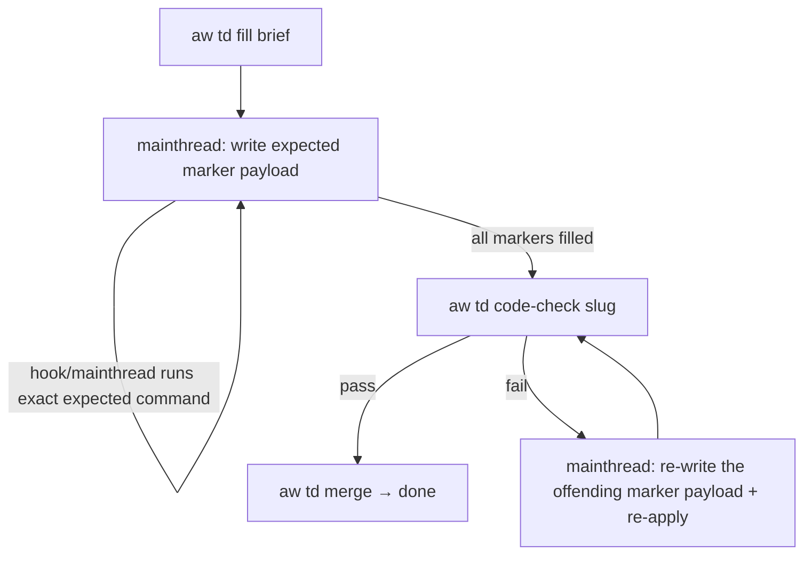

# /aw:cb:fill

Fills HANDWRITE-BEGIN/END marker blocks emitted by `aw td gen` for a
tech-design slug, then drives the td-fill lifecycle: brief → mainthread
per-marker fill loop → `aw td code-check` → `aw td merge`.

> **Mainthread-only model (post Phase-2).** The `aw-cb-handwriter`
> subagent has been removed atomically with this skill rewrite.
> Mainthread now owns the marker-fill loop directly. `aw td fill <slug>`
> records the next expected marker payload and exact apply command in the WI
> projection. Mainthread writes only that payload, then the hook or mainthread
> runs the exact command. Each marker apply validates, updates WI projection,
> and writes deterministic git trailers. There is no `Agent(subagent_type=...)`
> dispatch anywhere in this loop.

@spec projects/agentic-workflow/tech-design/surface/specs/aw-cb-fill-crrr.md
@spec projects/agentic-workflow/tech-design/surface/specs/aw-mainthread-only-execution.md
@spec projects/agentic-workflow/tech-design/surface/specs/aw-mainthread-phase-2-skill-rewrite-and-agent-delete.md

## Usage

```
/aw:cb:fill <slug>
```

## Flow

1. Run `aw td fill <slug>` to emit the brief envelope.
2. Read the JSON dispatch envelope and the WI `aw:workflow-state` block.
   The projection carries `expected_payload`, `expected_command`, current
   marker, and remaining markers.
3. **Enter the mainthread per-marker loop** below.



### Mainthread loop (per envelope)

The envelope protocol is `dispatch/done/error` — see `CLAUDE.md § AW envelope`.

For each envelope:

- **dispatch with `agent: null` and `command: "aw td fill"`** —
  write the projection's `expected_payload` and run its `expected_command` if
  the hook did not run it. The CLI emits a partial-progress dispatch for the
  next marker or, after the last marker, a dispatch to `aw td code-check <slug>`.

- **dispatch with `agent: null` and `command: "aw td code-check"`** — run
  from mainthread directly. On pass it advances phase to `cb_filled` and emits
  the next dispatch (`aw td merge`). On fail it emits an `error` envelope;
  mainthread re-writes the offending marker payload and re-applies.

- **dispatch with `agent: null` and `command: "aw td merge"`** — run
  from mainthread; merges the approved branch, closes the issue, and
  cleans up lifecycle state.

- **dispatch with `agent: ...` non-null** — legacy compatibility. Treat
  as if `agent` were `null` and run `invoke.command` directly. The
  agents referenced by these envelopes have been removed.

- **done** — print summary; end.

- **error** — surface `message`. If the message indicates a fixable
  defect (placeholder leftover, drift inside a marker block), re-write
  the offending marker payload and re-apply. Otherwise end.

### Threading slug + spec_path

Every envelope after the brief carries `slug` and (where applicable)
`spec_path` in `invoke.args`. Always pass `--slug` and `--spec-path` to
follow-on CLI calls.

### Sole-commit gate failure rollback

If `aw td code-check <slug>` fails (drift, marker still empty,
placeholder leftover), the CLI emits an `error` envelope and leaves the
current checkout untouched (no `Lifecycle-Stage: Cb-Fill` commit). Mainthread:

1. Read the check report from the error envelope.
2. Identify the offending marker(s) from the report.
3. Re-write the marker payload(s) and re-run
   `aw td fill <slug> --apply --marker <id>` until clean.
4. Re-run `aw td code-check <slug>`.

The two-phase apply ≠ commit pattern guarantees no half-finished
commits land in the current checkout.

### Inherited-marker bypass (known td-fill gate pollution)

`aw td code-check` counts ALL HANDWRITE markers in the current checkout,
including markers inherited from earlier branch state that pre-dates this
spec. If your TD spec produced 0 codegen blocks (all changes are
`impl_mode: hand-written`) and `td fill` returns inherited markers
unrelated to your changes, the gate will not pass cleanly. Bypass:
mainthread commits `Lifecycle-Stage: Cb-Fill` directly via
`git commit --allow-empty -m "Lifecycle-Stage: Cb-Fill\n\nNo new HANDWRITE markers introduced by this spec."`,
manually advances `phase: cb_genned → cb_filled` in the issue
frontmatter, then runs `aw td merge` to finish.

### What `aw td fill` does

- **Brief mode** (default): walks the current checkout for HANDWRITE-BEGIN/END
  blocks, builds a fill brief, prints the brief to stdout, and emits
  a dispatch envelope with `agent: null` and a marker list. Zero-marker
  fast-path emits a direct dispatch to `aw td merge`.
- **Apply mode** (`--apply --marker <id>`): merges the expected marker payload
  into the matching HANDWRITE block, commits the marker and WI projection, then
  locks the next marker or dispatches `aw td code-check <slug>`.

Generator-learning is not part of `td fill`. If a filled HANDWRITE block
reveals a deterministic pattern, open/continue a `aw standardize
regenerable` gap so a future `aw td gen` can replace it.
