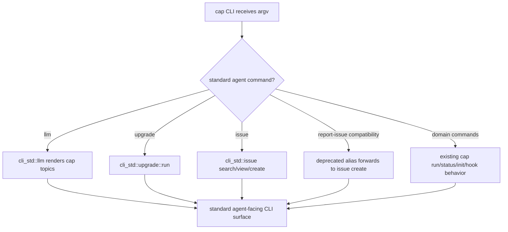

# Adopt CLI Convention Llm Upgrade Issue Via Cli Std

## Logic
<!-- type: logic lang: mermaid -->

The current repository contract names the mandatory issue surface `issue`, not
the older `report-issue` spelling still present in this WI body. Cap should
therefore make `llm`, `upgrade`, and `issue` visible in `cap --help` and route
their behavior through `cli-std`. A deprecated `report-issue` compatibility
entrypoint may remain for the issue's old acceptance text, but it must not
replace the current `issue search/view/create` surface.

`llm` is offline and owns only agent-facing cap topics. `upgrade` and `issue`
use `cli_std::ToolInfo` for release asset identity, build provenance, repo
routing, diagnostics, and the `project:cap` issue label. Existing cap domain
commands (`run`, passthrough wrapping, daemon, status, init, hook, config,
ping, wait) keep their current behavior and parse precedence.
