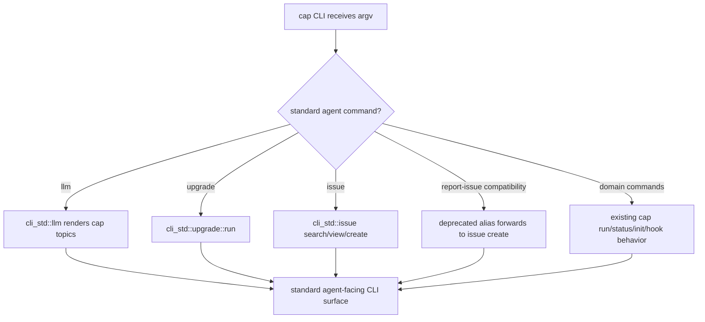

# Adopt CLI Convention Llm Upgrade Issue Via Cli Std

## Logic
<!-- type: logic lang: mermaid -->



Cap adopts the current repo-wide CLI convention through `cli-std`: `llm`,
`upgrade`, and `issue search/view/create` are the primary standard surface.
The older `report-issue` spelling in the WI body is implemented only as a
deprecated compatibility entrypoint that forwards to the same diagnostics-rich
create path. Existing cap domain commands and passthrough wrapping keep their
current parse behavior.
## Unit Test
<!-- type: unit-test lang: mermaid -->

```mermaid
---
id: cap-cli-std-convention-tests
requirements:
  help_surface:
    id: CLI-STD-UT-1
    text: "cap --help lists llm, upgrade, and issue as standard agent-facing commands."
    kind: functional
    risk: high
    verify: test
  llm_offline:
    id: CLI-STD-UT-2
    text: "cap llm renders cap-specific offline docs through cli_std::llm and includes the standard-command footer."
    kind: functional
    risk: medium
    verify: test
  issue_create:
    id: CLI-STD-UT-3
    text: "cap issue create --dry-run builds a diagnostics-rich issue body tagged project:cap without network submission."
    kind: functional
    risk: high
    verify: test
  legacy_report_issue:
    id: CLI-STD-UT-4
    text: "cap report-issue --dry-run remains a deprecated compatibility entrypoint for the stale WI acceptance text."
    kind: compatibility
    risk: medium
    verify: test
  build_features:
    id: CLI-STD-UT-5
    text: "cap builds in the default offline configuration and with the online release feature that enables cli-std network paths."
    kind: functional
    risk: medium
    verify: test
elements:
  cli_unit_tests:
    kind: test
    type: "cargo test -p cap cli_std_convention"
  cap_package_tests:
    kind: test
    type: "cargo test -p cap"
  cap_online_build:
    kind: test
    type: "cargo build -p cap --features release"
relations:
  - { from: cli_unit_tests, verifies: help_surface }
  - { from: cli_unit_tests, verifies: llm_offline }
  - { from: cli_unit_tests, verifies: issue_create }
  - { from: cli_unit_tests, verifies: legacy_report_issue }
  - { from: cap_package_tests, verifies: help_surface }
  - { from: cap_online_build, verifies: build_features }
---
requirementDiagram
  requirement help_surface {
    id: CLI-STD-UT-1
    text: "help lists llm upgrade issue"
    risk: high
    verifymethod: test
  }
  requirement llm_offline {
    id: CLI-STD-UT-2
    text: "llm uses cli_std offline renderer"
    risk: medium
    verifymethod: test
  }
  requirement issue_create {
    id: CLI-STD-UT-3
    text: "issue create dry-run emits diagnostics and project label"
    risk: high
    verifymethod: test
  }
  requirement legacy_report_issue {
    id: CLI-STD-UT-4
    text: "report-issue dry-run compatibility remains"
    risk: medium
    verifymethod: test
  }
  requirement build_features {
    id: CLI-STD-UT-5
    text: "default and release feature builds work"
    risk: medium
    verifymethod: test
  }
```

## Changes
<!-- type: changes lang: yaml -->

```yaml
changes:
  - path: projects/cap/Cargo.toml
    action: modify
    section: dependencies
    impl_mode: hand-written
    description: >
      Add cli-std with default features disabled and expose a release feature
      that enables cli-std/online for upgrade and issue network paths.

  - path: projects/cap/build.rs
    action: create
    section: build-provenance
    impl_mode: hand-written
    description: >
      Stamp CAP_TARGET, CAP_GIT_SHA, and CAP_BUILT_AT for cli_std::ToolInfo
      release asset and diagnostics metadata.

  - path: projects/cap/src/cli.rs
    action: modify
    section: cli-surface
    impl_mode: hand-written
    description: >
      Register and dispatch llm, upgrade, issue search/view/create, and a
      deprecated report-issue compatibility entrypoint through cli-std while
      preserving existing cap domain command behavior.

  - path: projects/cap/README.md
    action: modify
    section: cli-convention
    impl_mode: hand-written
    description: >
      Document the standard agent-facing commands and clarify that issue is the
      current surface while report-issue is legacy compatibility.

  - path: projects/cap/tech-design/semantic/cap-src.md
    action: modify
    section: source-metadata
    impl_mode: hand-written
    description: >
      Keep the semantic source manifest aligned with cap's CLI exports and any
      newly introduced build provenance script.
```
