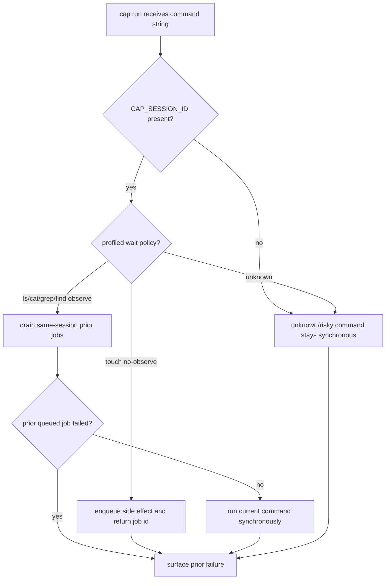

# Add Per-Session Queue With Observe Command Barriers

## Logic
<!-- type: logic lang: mermaid -->

The first slice is deliberately opt-in through `CAP_SESSION_ID`; without an
explicit session id, `cap run` keeps existing synchronous behavior. The initial
profile set is conservative: `touch <path...>` may queue as a no-observe side
effect, while `ls`, `cat`, `grep`, and `find` act as observe barriers. All other
commands remain synchronous until profiled. Queue state is local and per-session,
not distributed, and observe barriers must report prior queued-job failures
before running the current observation command.
