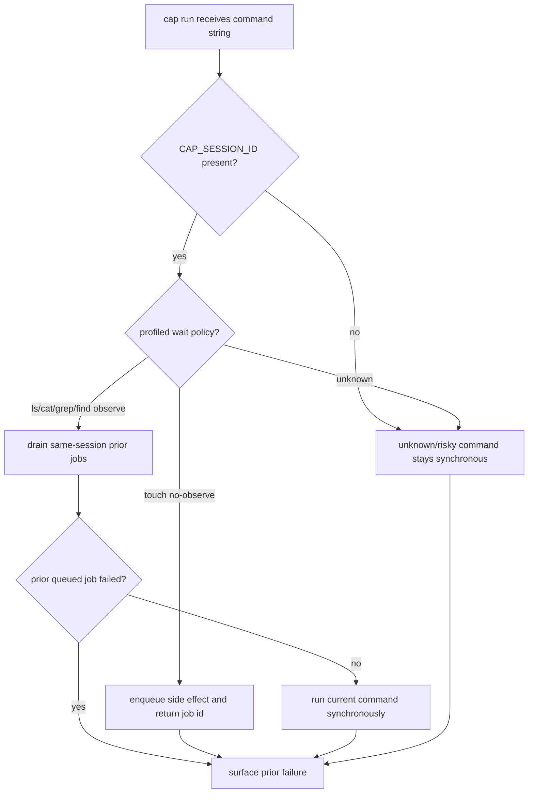

# Add Per-Session Queue With Observe Command Barriers

## Logic
<!-- type: logic lang: mermaid -->



The first slice is deliberately opt-in through `CAP_SESSION_ID`; without an
explicit session id, `cap run` keeps existing synchronous behavior. The initial
profile set is conservative: `touch <path...>` may queue as a no-observe side
effect, while `ls`, `cat`, `grep`, and `find` act as observe barriers. All other
commands remain synchronous until profiled. Queue state is local and per-session,
not distributed, and observe barriers must report prior queued-job failures
before running the current observation command.

## Unit Test
<!-- type: unit-test lang: mermaid -->

```mermaid
---
id: cap-session-queue-observe-barriers-tests
requirements:
  queued_side_effect:
    id: SQ-UT-1
    text: "With CAP_SESSION_ID set, a profiled no-observe touch command returns queued job metadata before an observe command."
    kind: functional
    risk: high
    verify: test
  observe_barrier:
    id: SQ-UT-2
    text: "A following observe command drains prior same-session jobs before returning output."
    kind: functional
    risk: high
    verify: test
  prior_failure:
    id: SQ-UT-3
    text: "A prior queued job failure is reported at the observe barrier with the failed job id and stderr."
    kind: functional
    risk: high
    verify: test
  unknown_sync:
    id: SQ-UT-4
    text: "Unknown command strings remain synchronous unless a profile opts them into queue behavior."
    kind: functional
    risk: medium
    verify: test
elements:
  session_queue_unit_tests:
    kind: test
    type: "cargo test -p cap session_queue"
relations:
  - { from: session_queue_unit_tests, verifies: queued_side_effect }
  - { from: session_queue_unit_tests, verifies: observe_barrier }
  - { from: session_queue_unit_tests, verifies: prior_failure }
  - { from: session_queue_unit_tests, verifies: unknown_sync }
---
requirementDiagram
  requirement queued_side_effect {
    id: SQ-UT-1
    text: "no-observe touch returns job metadata"
    risk: high
    verifymethod: test
  }
  requirement observe_barrier {
    id: SQ-UT-2
    text: "observe command drains prior same-session jobs"
    risk: high
    verifymethod: test
  }
  requirement prior_failure {
    id: SQ-UT-3
    text: "observe barrier reports prior queued failure"
    risk: high
    verifymethod: test
  }
  requirement unknown_sync {
    id: SQ-UT-4
    text: "unknown command remains synchronous"
    risk: medium
    verifymethod: test
  }
```

## Changes
<!-- type: changes lang: yaml -->

```yaml
changes:
  - path: projects/cap/src/session_queue.rs
    action: create
    section: logic
    impl_mode: hand-written
    description: >
      Add the first opt-in per-session queue. CAP_SESSION_ID enables local
      session state, profiled no-observe commands enqueue background jobs, and
      observe commands drain prior same-session jobs.

  - path: projects/cap/src/session_queue.rs
    action: create
    section: unit-test
    impl_mode: hand-written
    description: >
      Cover queued touch metadata, observe barrier draining, prior failure
      reporting, and unknown-command synchronous behavior.

  - path: projects/cap/src/cli.rs
    action: modify
    section: logic
    impl_mode: hand-written
    description: >
      Let command-string cap run consult the session queue before resident shell
      execution. Queue handling is opt-in and argv mode remains unchanged.

  - path: projects/cap/src/lib.rs
    action: modify
    section: logic
    impl_mode: hand-written
    description: >
      Export the session queue module inside the cap crate.

  - path: projects/cap/tech-design/semantic/cap-src.md
    action: modify
    section: exports
    impl_mode: hand-written
    description: >
      Keep semantic export metadata aligned with the new session_queue module.

  - path: projects/cap/README.md
    action: modify
    section: overview
    impl_mode: hand-written
    description: >
      Document the opt-in per-session queue, observe barriers, conservative
      default synchronous behavior, and prior-failure reporting.
```
