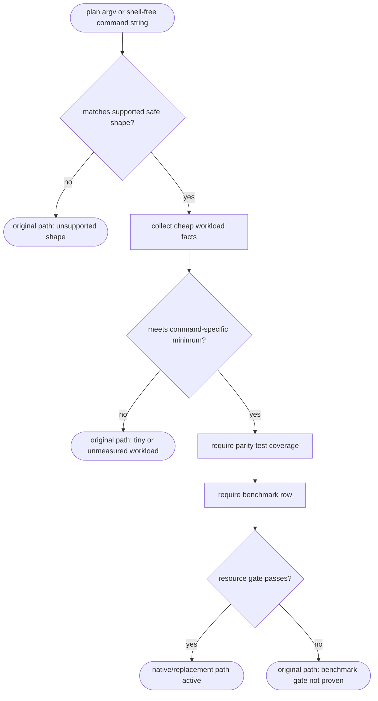

# TD: cap workload-sensitive native command gates

## Logic
<!-- type: logic lang: mermaid -->

```mermaid
---
id: cap-workload-sensitive-native-gates-contract
entry: start
nodes:
  start: { kind: start, label: "plan argv or shell-free command string" }
  shape: { kind: decision, label: "matches supported safe shape?" }
  fallback_shape: { kind: terminal, label: "original path: unsupported shape" }
  probe: { kind: process, label: "collect cheap workload facts without executing command output" }
  classify: { kind: decision, label: "meets command-specific minimum?" }
  fallback_small: { kind: terminal, label: "original path: tiny or unmeasured workload" }
  parity: { kind: process, label: "require parity test coverage for this shape" }
  bench: { kind: process, label: "require benchmark row for representative large workload" }
  promote: { kind: decision, label: "resource gate passes?" }
  native: { kind: terminal, label: "native/replacement path active" }
  fallback_gate: { kind: terminal, label: "original path: benchmark gate not proven" }
edges:
  - { from: start, to: shape }
  - { from: shape, to: fallback_shape, label: "no" }
  - { from: shape, to: probe, label: "yes" }
  - { from: probe, to: classify }
  - { from: classify, to: fallback_small, label: "no" }
  - { from: classify, to: parity, label: "yes" }
  - { from: parity, to: bench }
  - { from: bench, to: promote }
  - { from: promote, to: native, label: "dual-win or approved RSS-fallback" }
  - { from: promote, to: fallback_gate, label: "not proven" }
thresholds:
  ls:
    shape: "simple -1/-a/-A over one existing directory"
    minimum: "directory entry count >= 1024"
  sort:
    shape: "one regular file"
    minimum: "file size >= 1048576 bytes"
  grep:
    shape: "recursive literal grep -R pattern root"
    minimum: "root contains >= 64 regular files or estimated text bytes >= 1048576"
  find:
    shape: "root -type f -name pattern"
    minimum: "root contains >= 512 directory entries before full traversal finishes"
  sed_print:
    shape: "sed -n start,endp file"
    minimum: "regular file size >= 1048576 bytes or requested span >= 1024 lines"
fallback_rule: "Any probe error, symlink ambiguity, unsupported flag, shell control syntax, or below-threshold workload preserves the original command path."
---
flowchart TD
    start([plan argv or shell-free command string]) --> shape{matches supported safe shape?}
    shape -- no --> fallback_shape([original path: unsupported shape])
    shape -- yes --> probe[collect cheap workload facts]
    probe --> classify{meets command-specific minimum?}
    classify -- no --> fallback_small([original path: tiny or unmeasured workload])
    classify -- yes --> parity[require parity test coverage]
    parity --> bench[require benchmark row]
    bench --> promote{resource gate passes?}
    promote -- yes --> native([native/replacement path active])
    promote -- no --> fallback_gate([original path: benchmark gate not proven])
```
## Unit Test
<!-- type: unit-test lang: mermaid -->

```mermaid
---
id: cap-workload-sensitive-native-gates-tests
requirements:
  tiny_workloads_fallback:
    id: R1
    text: "Tiny or unknown workloads for candidate commands stay on the original command path when cap overhead would dominate."
    kind: functional
    risk: high
    verify: test
  large_workloads_gate_native:
    id: R2
    text: "Large workloads for supported subsets can use native fast paths only after cheap threshold classification and resource-gate evidence."
    kind: functional
    risk: high
    verify: test
  shell_semantics_preserved:
    id: R3
    text: "Shell-sensitive strings, unsupported flags, and unsafe shapes keep bash/original fallback semantics instead of partial native execution."
    kind: functional
    risk: high
    verify: test
  benchmark_matrix_covers_size:
    id: R4
    text: "Resource benchmarks include representative small and large scenarios with expected planner decisions for promoted candidates."
    kind: functional
    risk: high
    verify: test
  parity_still_required:
    id: R5
    text: "Every promoted native path keeps stdout, stderr, and exit-status parity with the original command."
    kind: functional
    risk: high
    verify: test
elements:
  planner_tiny_workloads_use_original:
    kind: test
    type: "rs/#[test]"
  planner_large_workloads_use_native_after_threshold:
    kind: test
    type: "rs/#[test]"
  planner_shell_or_unsupported_shapes_fallback:
    kind: test
    type: "rs/#[test]"
  command_resource_bench_small_large_matrix:
    kind: benchmark
    type: "cargo bench"
  active_replacements_match_success_and_error_behavior:
    kind: test
    type: "cargo test"
relations:
  - { from: planner_tiny_workloads_use_original, verifies: tiny_workloads_fallback }
  - { from: planner_large_workloads_use_native_after_threshold, verifies: large_workloads_gate_native }
  - { from: planner_shell_or_unsupported_shapes_fallback, verifies: shell_semantics_preserved }
  - { from: command_resource_bench_small_large_matrix, verifies: benchmark_matrix_covers_size }
  - { from: active_replacements_match_success_and_error_behavior, verifies: parity_still_required }
---
requirementDiagram
    requirement R1 {
      id: R1
      text: "tiny or unknown workloads fall back"
      risk: high
      verifymethod: test
    }
    requirement R2 {
      id: R2
      text: "large workloads need threshold and gate evidence"
      risk: high
      verifymethod: test
    }
    requirement R3 {
      id: R3
      text: "shell and unsupported shapes preserve fallback semantics"
      risk: high
      verifymethod: test
    }
    requirement R4 {
      id: R4
      text: "benchmarks cover small and large scenarios"
      risk: high
      verifymethod: test
    }
    requirement R5 {
      id: R5
      text: "promoted native paths preserve parity"
      risk: high
      verifymethod: test
    }
    element planner_tiny_workloads_use_original {
      type: "rs/#[test]"
    }
    element planner_large_workloads_use_native_after_threshold {
      type: "rs/#[test]"
    }
    element planner_shell_or_unsupported_shapes_fallback {
      type: "rs/#[test]"
    }
    element command_resource_bench_small_large_matrix {
      type: "cargo bench"
    }
    element active_replacements_match_success_and_error_behavior {
      type: "cargo test"
    }
```
