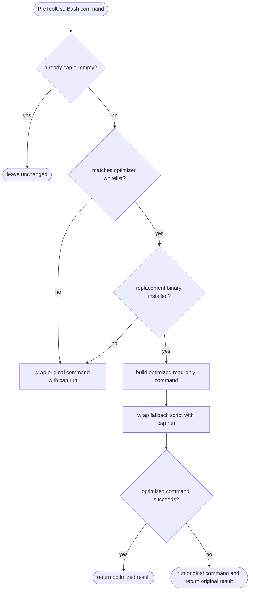

# Cap Hook Auto Command Optimizer Whitelist

## Logic
<!-- type: logic lang: mermaid -->


## Changes
<!-- type: changes lang: yaml -->

```yaml
changes:
  - path: projects/cap/src/hook.rs
    action: modify
    section: logic
    impl_mode: hand-written
    description: >
      Add a conservative command optimizer step before maybe_rewrite builds the
      cap-run shell payload. The optimizer uses a hardcoded whitelist, checks
      that the replacement tool exists, keeps the cap label equal to the
      original command, and emits a fallback shell payload that runs the
      original command if the optimized command exits unsuccessfully. Initial
      whitelist scope is simple recursive grep forms that can use rg.

  - path: projects/cap/src/hook.rs
    action: modify
    section: unit-test
    impl_mode: hand-written
    description: >
      Extend hook rewrite tests to cover optimized rg payload construction,
      missing replacement tool fallback to the original payload, unsupported
      grep forms staying unchanged, pipeline grep staying unchanged, and the
      runtime fallback script shape.

  - path: projects/cap/README.md
    action: modify
    section: docs
    impl_mode: hand-written
    description: >
      Document that cap hook may automatically optimize a small whitelist of
      read-only commands when the faster replacement is installed, and that any
      optimizer miss or optimized-command failure falls back to the original
      command semantics.
```
## E2E Test
<!-- type: e2e-test lang: yaml -->

```yaml
e2e_tests: []
```
