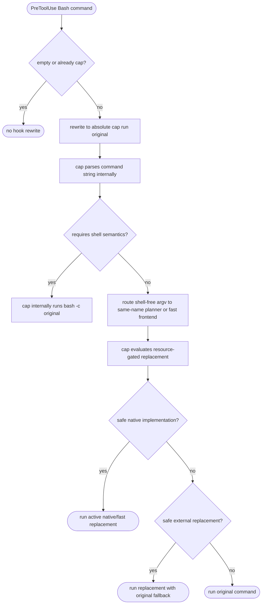

# Cap Same-Name Command Planner

## Logic
<!-- type: logic lang: mermaid -->


## Changes
<!-- type: changes lang: yaml -->

```yaml
changes:
  - path: projects/cap/src/hook.rs
    action: modify
    section: logic
    impl_mode: hand-written
    description: >
      Change the Bash hook rewrite adapter so every non-recursive Bash command
      is wrapped as absolute-path cap run original-command-string. The hook
      stays thin and only owns empty-command handling, cap recursion
      prevention, absolute cap path selection, and safe single-quote escaping.
      It must not decide which commands are replacements.

  - path: projects/cap/src/command_planner.rs
    action: add
    section: logic
    impl_mode: hand-written
    description: >
      Add a cap-side planner for cap <cmd> argv and cap run command strings.
      Shell-free strings are parsed into argv and routed through the same
      replacement planner; strings requiring shell semantics fall back to
      bash -c internally. The planner chooses native implementations only for
      safe commands that satisfy a resource gate. The preferred dual-win gate
      requires lower original-command CPU time and peak RSS. An RSS-fallback
      gate is allowed when a tiny command is obstructed by platform
      process-floor CPU cost but still lowers peak RSS enough to justify the
      CPU regression.
      The current dual-win replacements are simple high-entry-count ls, large
      single-file sort, bounded sed -n range reads, recursive literal grep -R
      searches, find -type f -name walks, du -sk stdout-discard runs, large
      regular-file cat, and uniq stdout-discard runs over large
      adjacent-duplicate files. There are no current default RSS-fallback
      replacements. true, false, pwd, basename, dirname, head, tail, mkdir,
      touch, awk, xargs, and pipe-shaped shell commands remain scout-only
      candidates until their resource benchmark reaches the dual-win gate or a
      material RSS-fallback gate.

  - path: projects/cap/src/cli.rs
    action: modify
    section: logic
    impl_mode: hand-written
    description: >
      Route cap passthrough and cap run commands through the planner before
      execution. Add cap explain -- <cmd> to show the original command,
      implementation choice, run command, reason, and fallback.

  - path: projects/cap/src/hook.rs
    action: modify
    section: unit-test
    impl_mode: hand-written
    description: >
      Update hook tests to assert thin cap run original-string wrapping for
      simple commands, scout-only commands, and shell-sensitive commands, with
      no hook-level optimizer behavior.

  - path: projects/cap/src/command_planner.rs
    action: add
    section: unit-test
    impl_mode: hand-written
    description: >
      Add planner tests for resource-gated replacements, original-command
      fallback, inactive tiny-command fallback, and unsupported command
      fallback.

  - path: projects/cap/src/command_planner.rs
    action: modify
    section: logic
    impl_mode: hand-written
    description: >
      Keep inactive native candidate code out of the active dispatch path so
      only resource-gated replacements are claimed.

  - path: projects/cap/src/cap_frontend.c
    action: modify
    section: logic
    impl_mode: hand-written
    description: >
      Preserve original-command error behavior for public frontend direct
      dispatch. Active replacements must return matching nonzero exits and
      useful stderr diagnostics instead of silently failing. Provide a direct
      run-string cat path so hook-emitted cap run cat keeps the dual-win gate.

  - path: projects/cap/src/cap_fast_frontend.c
    action: modify
    section: logic
    impl_mode: hand-written
    description: >
      Preserve success and error behavior for active C replacement paths,
      including missing-path diagnostics, grep no-match exit behavior, and du
      missing-root behavior that reports an error without printing a synthetic
      zero summary. Parse shell-free cap run command strings for active
      replacement commands and dispatch them to the same fast implementation
      family as cap <cmd>.

  - path: projects/cap/Cargo.toml
    action: modify
    section: e2e-test
    impl_mode: hand-written
    description: >
      Register a custom command_resources benchmark target for same-name
      command CPU-time and peak-RSS comparisons.

  - path: projects/cap/benches/command_resources.rs
    action: add
    section: e2e-test
    impl_mode: hand-written
    description: >
      Add a child-rusage benchmark harness that compares the actual cap
      same-name CLI surface and the hook-emitted cap run command-string surface
      against original system commands. Report median user+system CPU time and
      platform-normalized peak RSS, fail when any gated replacement does not
      satisfy its dual-win or RSS-fallback policy, and optionally print
      candidate rows for incomplete command shapes, including mkdir, touch,
      awk, xargs, and representative shell pipes.

  - path: projects/cap/tests/behavior_cap_command_replacement_parity.rs
    action: add
    section: e2e-test
    impl_mode: hand-written
    description: >
      Add an integration parity test that builds the real installed binary
      shape, cap plus cap-fast plus cap-full, and compares active same-name and
      cap run command-string replacements with system commands for stdout, exit
      codes, quiet nonzero cases, and missing-path stderr behavior.

  - path: projects/cap/BENCHMARKS.md
    action: add
    section: e2e-test
    impl_mode: hand-written
    description: >
      Record the latest resource benchmark baseline and call out which
      commands currently win or lose against the bare original-command
      comparison contract.

  - path: projects/cap/README.md
    action: modify
    section: overview
    impl_mode: hand-written
    description: >
      Document same-name cap routing, cap-side planner ownership, native and
      replacement examples, complex-shell fallback, cap explain, and the
      tested-but-not-replaced command list.
```
## E2E Test
<!-- type: e2e-test lang: yaml -->

```yaml
e2e_tests:
  - id: cap-hook-auto-command-optimizer-whitelist
    name: "cap same-name command planner"
    capability_id: agent-hook-installation
    claim_id: hook-payload-rewrite-adapters
    contract_id: hook-payload-rewrite-adapters
    category: behavior
    command: "env CC=/Applications/Xcode.app/Contents/Developer/Toolchains/XcodeDefault.xctoolchain/usr/bin/cc SDKROOT=/Applications/Xcode.app/Contents/Developer/Platforms/MacOSX.platform/Developer/SDKs/MacOSX.sdk PATH=/Users/chrischeng/.rustup/toolchains/stable-aarch64-apple-darwin/bin:/usr/bin:/bin:/usr/sbin:/sbin:/opt/homebrew/bin cargo test -p cap hook -- --nocapture && env CC=/Applications/Xcode.app/Contents/Developer/Toolchains/XcodeDefault.xctoolchain/usr/bin/cc SDKROOT=/Applications/Xcode.app/Contents/Developer/Platforms/MacOSX.platform/Developer/SDKs/MacOSX.sdk PATH=/Users/chrischeng/.rustup/toolchains/stable-aarch64-apple-darwin/bin:/usr/bin:/bin:/usr/sbin:/sbin:/opt/homebrew/bin cargo test -p cap command_planner -- --nocapture && env CC=/Applications/Xcode.app/Contents/Developer/Toolchains/XcodeDefault.xctoolchain/usr/bin/cc SDKROOT=/Applications/Xcode.app/Contents/Developer/Platforms/MacOSX.platform/Developer/SDKs/MacOSX.sdk PATH=/Users/chrischeng/.rustup/toolchains/stable-aarch64-apple-darwin/bin:/usr/bin:/bin:/usr/sbin:/sbin:/opt/homebrew/bin cargo test -p cap active_replacements_match_success_and_error_behavior -- --nocapture && env CC=/Applications/Xcode.app/Contents/Developer/Toolchains/XcodeDefault.xctoolchain/usr/bin/cc SDKROOT=/Applications/Xcode.app/Contents/Developer/Platforms/MacOSX.platform/Developer/SDKs/MacOSX.sdk PATH=/Users/chrischeng/.rustup/toolchains/stable-aarch64-apple-darwin/bin:/usr/bin:/bin:/usr/sbin:/sbin:/opt/homebrew/bin cargo bench -p cap --bench command_resources"
    assertions:
      - "the Bash hook rewrites non-recursive commands to cap run original-command-string and does not expose same-name replacement decisions"
      - "cap run command-string parsing routes shell-free active replacements to the same fast implementation family as cap <cmd>"
      - "complex shell commands keep shell semantics by falling back internally to bash -c original"
      - "simple high-entry-count ls, large single-file sort, bounded sed, recursive literal grep, find, du, cat, and uniq satisfy the dual-win cap replacement gate for both cap <cmd> and cap run command-string surfaces"
      - "active replacements match original-command success output, missing-path error behavior, and quiet nonzero behavior"
      - "true, false, pwd, basename, dirname, head, tail, mkdir, touch, awk, xargs, and shell pipes remain scout-only or compatibility-fallback candidates until they beat the dual-win gate or a material RSS-fallback gate"
      - "gated replacements fail the benchmark when their dual-win or RSS-fallback resource policy is not satisfied"
```

# Reviews

### Review 1
**Verdict:** approved

- [logic] Contract keeps the hook thin while cap owns command-string parsing, same-name replacement routing, and bash fallback.
- [changes] Contract identifies implementation touch points for hook wrapping, planner dispatch, public fast frontends, tests, benchmarks, and README updates.
- [e2e-test] Focused hook, planner, installed-shape parity, and resource benchmark gates cover the command replacement slice.
