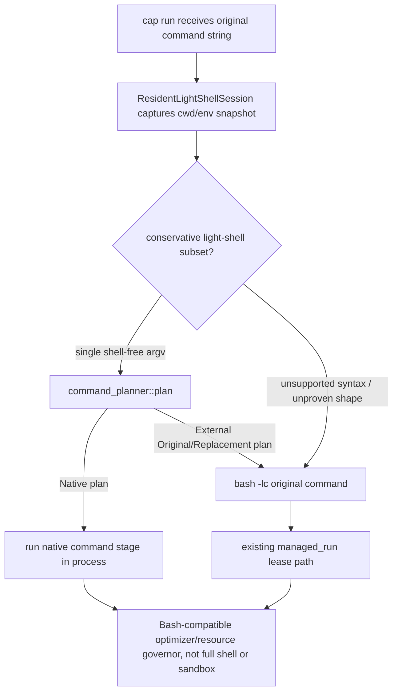

# Design Resident Light Shell With Dynamic Bash Fallback

## Logic
<!-- type: logic lang: mermaid -->



The resident-light-shell design belongs in this TD because it changes the
`cap run "<command string>"` execution boundary. The first implementation slice
is intentionally narrow: a per-invocation `ResidentLightShellSession` owns the
current cwd/env snapshot, attempts one conservative native stage using the
existing planner/native runner, and returns a structured fallback for every
unsupported form. This keeps the daemon/client resource-protection path intact
for Bash fallback while making an observable in-process native path available
for future resident/session reuse.

## Unit Test
<!-- type: unit-test lang: mermaid -->

```mermaid
---
id: cap-resident-light-shell-contract-tests
requirements:
  native_path:
    id: RLS-UT-1
    text: "A shell-free command string with a workload-qualified native plan runs through ResidentLightShellSession without spawning Bash."
    kind: functional
    risk: medium
    verify: test
  fallback_path:
    id: RLS-UT-2
    text: "Unsupported shell syntax returns a Bash fallback plan that preserves the original command string exactly."
    kind: functional
    risk: high
    verify: test
  parity:
    id: RLS-UT-3
    text: "The first resident native path and the Bash fallback path both preserve stdout, stderr, and exit status against the original command."
    kind: functional
    risk: high
    verify: test
  product_boundary:
    id: RLS-UT-4
    text: "README/TD state that cap is a Bash-compatible optimizer and resource governor, not a sandbox or full replacement shell."
    kind: functional
    risk: medium
    verify: test
elements:
  resident_shell_unit_tests:
    kind: test
    type: "cargo test -p cap resident_light_shell"
  resident_run_parity:
    kind: test
    type: "cargo test -p cap resident_light_shell_run_parity"
  readme_boundary_smoke:
    kind: test
    type: "cargo test -p cap docs"
relations:
  - { from: resident_shell_unit_tests, verifies: native_path }
  - { from: resident_shell_unit_tests, verifies: fallback_path }
  - { from: resident_run_parity, verifies: parity }
  - { from: readme_boundary_smoke, verifies: product_boundary }
---
requirementDiagram
  requirement native_path {
    id: RLS-UT-1
    text: "A shell-free command string with a workload-qualified native plan runs through ResidentLightShellSession without spawning Bash."
    risk: medium
    verifymethod: test
  }
  requirement fallback_path {
    id: RLS-UT-2
    text: "Unsupported shell syntax returns a Bash fallback plan that preserves the original command string exactly."
    risk: high
    verifymethod: test
  }
  requirement parity {
    id: RLS-UT-3
    text: "The first resident native path and the Bash fallback path both preserve stdout, stderr, and exit status against the original command."
    risk: high
    verifymethod: test
  }
  requirement product_boundary {
    id: RLS-UT-4
    text: "README/TD state that cap is a Bash-compatible optimizer and resource governor, not a sandbox or full replacement shell."
    risk: medium
    verifymethod: inspection
  }
```

The applicability proof requires unit coverage on the resident session's
planning boundary plus behavior coverage through the public `cap run` path. A
minimal test fixture can use a threshold-sized `ls -1 <dir>` native path because
#117 made the workload gate explicit; fallback parity can use a pipe or `cd &&
pwd` shape that must remain under Bash semantics.

## Changes
<!-- type: changes lang: yaml -->

```yaml
changes:
  - path: projects/cap/src/resident_shell.rs
    action: create
    section: logic
    impl_mode: hand-written
    description: >
      Add the first resident light-shell session boundary. The session captures
      cwd/env, plans a command string through the existing command planner, runs
      native command stages in process, and returns a Bash fallback plan for
      unsupported or unproven command strings.

  - path: projects/cap/src/resident_shell.rs
    action: create
    section: unit-test
    impl_mode: hand-written
    description: >
      Cover the native observable path and dynamic Bash fallback path with
      byte-for-byte stdout/stderr/exit parity checks against original system
      commands.

  - path: projects/cap/src/command_planner.rs
    action: modify
    section: logic
    impl_mode: hand-written
    description: >
      Expose the native runner's capture helper inside the crate so the
      resident shell can verify native-stage output without spawning a second
      cap process.

  - path: projects/cap/src/cli.rs
    action: modify
    section: logic
    impl_mode: hand-written
    description: >
      Route `cap run "<command string>"` through ResidentLightShellSession
      before falling back to the existing external managed_run path. Keep argv
      mode behavior unchanged.

  - path: projects/cap/src/lib.rs
    action: modify
    section: logic
    impl_mode: hand-written
    description: >
      Export the resident shell module inside the cap crate.

  - path: projects/cap/README.md
    action: modify
    section: overview
    impl_mode: hand-written
    description: >
      Document that cap is adding a resident light-shell optimizer layer with
      dynamic Bash fallback, while remaining a resource governor rather than a
      sandbox or full shell replacement.
```
