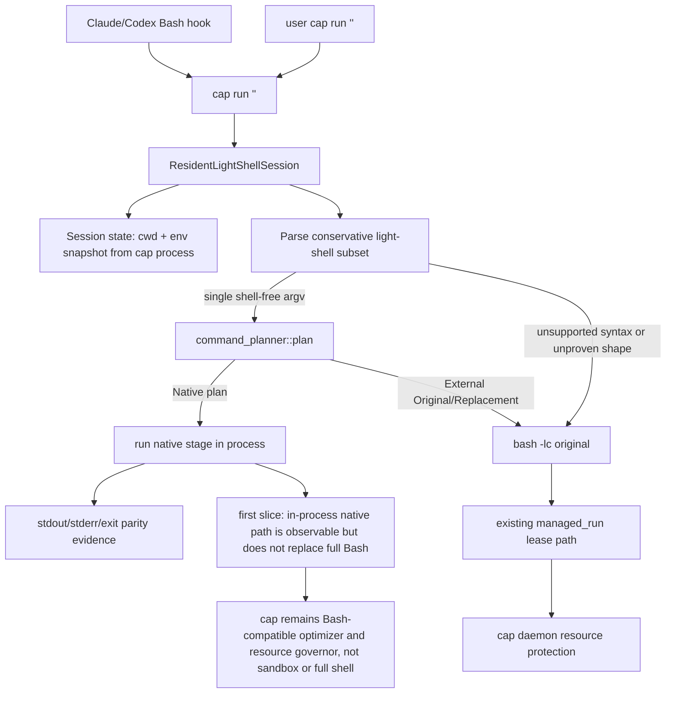

# Design Resident Light Shell With Dynamic Bash Fallback

## Logic
<!-- type: logic lang: mermaid -->



The resident-light-shell design belongs in this TD because it changes the
`cap run "<command string>"` execution boundary. The first implementation slice
is intentionally narrow: a per-invocation `ResidentLightShellSession` owns the
current cwd/env snapshot, attempts one conservative native stage using the
existing planner/native runner, and returns a structured fallback for every
unsupported form. This keeps the daemon/client resource-protection path intact
for Bash fallback while making an observable in-process native path available
for future resident/session reuse.
```
