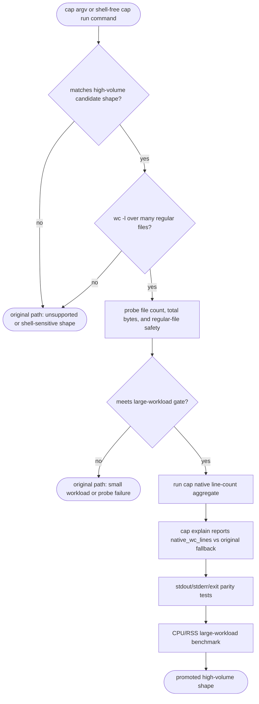

# Expand High-Volume Native Command Coverage

## Logic
<!-- type: logic lang: mermaid -->

```mermaid
---
id: cap-high-volume-native-command-coverage-logic
entry: start
nodes:
  start: { kind: start, label: "cap argv or shell-free cap run command" }
  classify: { kind: decision, label: "matches high-volume candidate shape?" }
  fallback_shape: { kind: terminal, label: "original path: unsupported or shell-sensitive shape" }
  wc_shape: { kind: decision, label: "wc -l over many regular files?" }
  probe_files: { kind: process, label: "probe file count, total bytes, and regular-file safety" }
  threshold: { kind: decision, label: "meets large-workload gate?" }
  fallback_small: { kind: terminal, label: "original path: small workload or probe failure" }
  native_wc: { kind: process, label: "run cap native line-count aggregate" }
  explain: { kind: process, label: "cap explain reports native_wc_lines vs original fallback" }
  parity: { kind: process, label: "parity tests cover stdout/stderr/exit behavior" }
  bench: { kind: process, label: "benchmark proves CPU/RSS large-workload win" }
  done: { kind: terminal, label: "promoted high-volume shape" }
edges:
  - { from: start, to: classify }
  - { from: classify, to: fallback_shape, label: "no" }
  - { from: classify, to: wc_shape, label: "yes" }
  - { from: wc_shape, to: fallback_shape, label: "no" }
  - { from: wc_shape, to: probe_files, label: "yes" }
  - { from: probe_files, to: threshold }
  - { from: threshold, to: fallback_small, label: "no" }
  - { from: threshold, to: native_wc, label: "yes" }
  - { from: native_wc, to: explain }
  - { from: explain, to: parity }
  - { from: parity, to: bench }
  - { from: bench, to: done }
thresholds:
  wc_lines:
    shape: "wc -l FILE... with no byte/word/char/max-line options and every operand a regular file"
    minimum: "file count >= 64 or total regular-file bytes >= 1048576"
    fallback: "missing files, directories, stdin operands, unsupported flags, or below-threshold workloads preserve the original command"
scout_next:
  - "find ... -type f ... | xargs wc -l can be promoted later by reusing the native wc_lines aggregate after a conservative pipeline parser exists."
  - "grep -R ... | head ... remains scout-only until early-close stderr/exit behavior has parity and benchmark evidence."
---
flowchart TD
    start([cap argv or shell-free cap run command]) --> classify{matches high-volume candidate shape?}
    classify -- no --> fallback_shape([original path: unsupported or shell-sensitive shape])
    classify -- yes --> wc_shape{wc -l over many regular files?}
    wc_shape -- no --> fallback_shape
    wc_shape -- yes --> probe_files[probe file count, total bytes, and regular-file safety]
    probe_files --> threshold{meets large-workload gate?}
    threshold -- no --> fallback_small([original path: small workload or probe failure])
    threshold -- yes --> native_wc[run cap native line-count aggregate]
    native_wc --> explain[cap explain reports native_wc_lines vs original fallback]
    explain --> parity[stdout/stderr/exit parity tests]
    parity --> bench[CPU/RSS large-workload benchmark]
    bench --> done([promoted high-volume shape])
```
