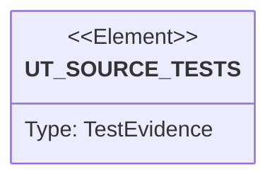

# Semantic TD: cap/benches

## Schema
<!-- type: schema lang: yaml -->

```yaml
semantic_domain:
  key: "cap/benches"
  source_group: "projects/cap/benches"
  coverage_kind: semantic
  evidence:
    source_units:
      - path: "projects/cap/benches/command_resources.rs"
        language: "rust"
        ownership_state: "codegen"
        generator_primitives: ["config_surface", "data_model", "service_method"]
        symbols:
          - name: "DEFAULT_ROUNDS"
            kind: "constant"
            public: false
          - name: "DEFAULT_WARMUPS"
            kind: "constant"
            public: false
          - name: "Scenario"
            kind: "struct"
            public: false
          - name: "Gate"
            kind: "enum"
            public: false
          - name: "Measurement"
            kind: "struct"
            public: false
          - name: "ScenarioReport"
            kind: "struct"
            public: false
          - name: "BenchReport"
            kind: "struct"
            public: false
          - name: "main"
            kind: "function"
            public: false
          - name: "env_usize"
            kind: "function"
            public: false
          - name: "cap_binary"
            kind: "function"
            public: false
          - name: "measure_median"
            kind: "function"
            public: false
          - name: "compare_measurement"
            kind: "function"
            public: false
          - name: "measure_once"
            kind: "function"
            public: false
          - name: "timeval_us"
            kind: "function"
            public: false
          - name: "exit_code"
            kind: "function"
            public: false
          - name: "maxrss_bytes"
            kind: "function"
            public: false
          - name: "maxrss_bytes"
            kind: "function"
            public: false
          - name: "write_reports"
            kind: "function"
            public: false
          - name: "report_markdown"
            kind: "function"
            public: false
          - name: "ratio"
            kind: "function"
            public: false
          - name: "us_to_ms"
            kind: "function"
            public: false
          - name: "bytes_to_mib"
            kind: "function"
            public: false
          - name: "render_command"
            kind: "function"
            public: false
          - name: "Fixture"
            kind: "struct"
            public: false
          - name: "create"
            kind: "function"
            public: false
          - name: "scenarios"
            kind: "function"
            public: false
          - name: "write_repeated"
            kind: "function"
            public: false
          - name: "path_string"
            kind: "function"
            public: false
          - name: "strings"
            kind: "function"
            public: false
        source_evidence_node:
          layer: "backend"
          ecosystem: "rust"
          role: "source"
          section_type: "schema"
          domain: "projects/cap/benches"
```

## Unit Test
<!-- type: unit-test lang: mermaid -->



## Changes
<!-- type: changes lang: yaml -->

```yaml
coverage_kind: semantic
changes:
  - path: "projects/cap/benches/command_resources.rs"
    action: modify
    section: schema
    description: |
      Existing source behavior is covered by this feature/domain semantic TD.
      The benchmark schema carries a resource gate for each scenario:
      dual-win, RSS fallback, or candidate.
    impl_mode: hand-written
  - path: "projects/cap/benches/command_resources.rs"
    action: modify
    section: unit-test
    description: |
      The custom benchmark target doubles as executable resource-test evidence
      for the same-name command planner when run with low smoke-test rounds.
    impl_mode: hand-written
```
