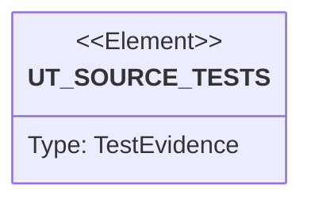

# Semantic TD: cap/src

## Schema
<!-- type: schema lang: yaml -->

```yaml
semantic_domain:
  key: "cap/src"
  source_group: "projects/cap/src"
  coverage_kind: semantic
  evidence:
    source_units:
      - path: "projects/cap/src/hook.rs"
        language: "rust"
        ownership_state: "handwrite"
        generator_primitives: ["config_surface", "data_model", "enum_model", "service_method"]
        symbols:
          - name: "PASSTHROUGH_WRAPPERS"
            kind: "constant"
            public: false
          - name: "HookAgent"
            kind: "enum"
            public: true
          - name: "HookInput"
            kind: "struct"
            public: false
          - name: "ToolInput"
            kind: "struct"
            public: false
          - name: "HookOutput"
            kind: "struct"
            public: false
          - name: "HookSpecific"
            kind: "struct"
            public: false
          - name: "ModifiedInput"
            kind: "struct"
            public: false
          - name: "run_bash_hook"
            kind: "function"
            public: true
          - name: "resolve_agent"
            kind: "function"
            public: false
          - name: "hook_specific_for_rewrite"
            kind: "function"
            public: false
          - name: "maybe_rewrite"
            kind: "function"
            public: false
          - name: "shell_quote_arg"
            kind: "function"
            public: false
          - name: "first_program_is_cap"
            kind: "function"
            public: false
          - name: "is_var_assignment"
            kind: "function"
            public: false
          - name: "basename"
            kind: "function"
            public: false
          - name: "SHELLS"
            kind: "constant"
            public: false
          - name: "effective_program"
            kind: "function"
            public: true
          - name: "script_main_program"
            kind: "function"
            public: false
          - name: "shell_single_quote"
            kind: "function"
            public: false
          - name: "tests"
            kind: "module"
            public: false
        source_evidence_node:
          layer: "backend"
          ecosystem: "rust"
          role: "source"
          section_type: "schema"
          domain: "projects/cap/src"
      - path: "projects/cap/src/eventlog.rs"
        language: "rust"
        ownership_state: "handwrite"
        generator_primitives: ["data_model", "service_method"]
        symbols:
          - name: "RunRecord"
            kind: "struct"
            public: true
          - name: "EventLog"
            kind: "struct"
            public: true
          - name: "new"
            kind: "function"
            public: true
          - name: "append"
            kind: "function"
            public: true
          - name: "try_append"
            kind: "function"
            public: false
          - name: "tests"
            kind: "module"
            public: false
        source_evidence_node:
          layer: "backend"
          ecosystem: "rust"
          role: "source"
          section_type: "schema"
          domain: "projects/cap/src"
      - path: "projects/cap/src/reap.rs"
        language: "rust"
        ownership_state: "handwrite"
        generator_primitives: ["config_surface", "data_model", "service_method"]
        symbols:
          - name: "REAP_ALLOWLIST"
            kind: "constant"
            public: true
          - name: "ReapedProcess"
            kind: "struct"
            public: true
          - name: "Reaper"
            kind: "struct"
            public: true
          - name: "new"
            kind: "function"
            public: true
          - name: "cooldown_elapsed"
            kind: "function"
            public: true
          - name: "scan_and_reap"
            kind: "function"
            public: true
          - name: "dry_scan"
            kind: "function"
            public: true
          - name: "_silence_pid_import"
            kind: "function"
            public: false
          - name: "default"
            kind: "function"
            public: false
          - name: "tests"
            kind: "module"
            public: false
        source_evidence_node:
          layer: "backend"
          ecosystem: "rust"
          role: "source"
          section_type: "schema"
          domain: "projects/cap/src"
      - path: "projects/cap/src/config.rs"
        language: "rust"
        ownership_state: "handwrite"
        generator_primitives: ["data_model", "service_method"]
        symbols:
          - name: "Config"
            kind: "struct"
            public: true
          - name: "Protect"
            kind: "struct"
            public: true
          - name: "Defaults"
            kind: "struct"
            public: true
          - name: "Log"
            kind: "struct"
            public: true
          - name: "default"
            kind: "function"
            public: false
          - name: "default"
            kind: "function"
            public: false
          - name: "default"
            kind: "function"
            public: false
          - name: "load"
            kind: "function"
            public: true
          - name: "save"
            kind: "function"
            public: true
          - name: "tests"
            kind: "module"
            public: false
        source_evidence_node:
          layer: "backend"
          ecosystem: "rust"
          role: "source"
          section_type: "schema"
          domain: "projects/cap/src"
      - path: "projects/cap/src/lib.rs"
        language: "rust"
        ownership_state: "handwrite"
        generator_primitives: ["source_unit"]
        symbols:
          - name: "is_running"
            kind: "function"
            public: true
          - name: "client"
            kind: "module"
            public: true
          - name: "cli"
            kind: "module"
            public: true
          - name: "config"
            kind: "module"
            public: true
          - name: "daemon"
            kind: "module"
            public: true
          - name: "eventlog"
            kind: "module"
            public: true
          - name: "hook"
            kind: "module"
            public: true
          - name: "hook_install"
            kind: "module"
            public: true
          - name: "managed_run"
            kind: "module"
            public: true
          - name: "paths"
            kind: "module"
            public: true
          - name: "protocol"
            kind: "module"
            public: true
          - name: "reap"
            kind: "module"
            public: true
          - name: "sampler"
            kind: "module"
            public: true
          - name: "supervisor"
            kind: "module"
            public: true
          - name: "throttle"
            kind: "module"
            public: true
        source_evidence_node:
          layer: "backend"
          ecosystem: "rust"
          role: "source"
          section_type: "schema"
          domain: "projects/cap/src"
      - path: "projects/cap/src/client.rs"
        language: "rust"
        ownership_state: "handwrite"
        generator_primitives: ["data_model", "service_method"]
        symbols:
          - name: "Client"
            kind: "struct"
            public: true
          - name: "connect"
            kind: "function"
            public: true
          - name: "connect_or_launch"
            kind: "function"
            public: true
          - name: "send"
            kind: "function"
            public: true
          - name: "recv"
            kind: "function"
            public: true
          - name: "request"
            kind: "function"
            public: true
        source_evidence_node:
          layer: "backend"
          ecosystem: "rust"
          role: "source"
          section_type: "schema"
          domain: "projects/cap/src"
      - path: "projects/cap/src/managed_run.rs"
        language: "rust"
        ownership_state: "handwrite"
        generator_primitives: ["data_model", "service_method"]
        symbols:
          - name: "ManagedOutcome"
            kind: "struct"
            public: true
          - name: "managed_run"
            kind: "function"
            public: true
          - name: "spawn_signal_forwarder"
            kind: "function"
            public: false
        source_evidence_node:
          layer: "backend"
          ecosystem: "rust"
          role: "source"
          section_type: "schema"
          domain: "projects/cap/src"
      - path: "projects/cap/src/paths.rs"
        language: "rust"
        ownership_state: "handwrite"
        generator_primitives: ["service_method"]
        symbols:
          - name: "home"
            kind: "function"
            public: true
          - name: "ensure_home"
            kind: "function"
            public: true
          - name: "socket_path"
            kind: "function"
            public: true
          - name: "pid_path"
            kind: "function"
            public: true
          - name: "log_path"
            kind: "function"
            public: true
          - name: "logs_dir"
            kind: "function"
            public: true
          - name: "lock_path"
            kind: "function"
            public: true
          - name: "config_path"
            kind: "function"
            public: true
        source_evidence_node:
          layer: "backend"
          ecosystem: "rust"
          role: "source"
          section_type: "schema"
          domain: "projects/cap/src"
      - path: "projects/cap/src/protocol.rs"
        language: "rust"
        ownership_state: "handwrite"
        generator_primitives: ["data_model", "enum_model"]
        symbols:
          - name: "LeaseId"
            kind: "type"
            public: true
          - name: "Request"
            kind: "enum"
            public: true
          - name: "AcquireRequest"
            kind: "struct"
            public: true
          - name: "Response"
            kind: "enum"
            public: true
          - name: "StatusSnapshot"
            kind: "struct"
            public: true
          - name: "LeaseState"
            kind: "enum"
            public: true
          - name: "KillClassification"
            kind: "enum"
            public: true
          - name: "LeaseSnapshot"
            kind: "struct"
            public: true
          - name: "LeaseBrief"
            kind: "struct"
            public: true
          - name: "Action"
            kind: "enum"
            public: true
          - name: "KillEnvelope"
            kind: "struct"
            public: true
        source_evidence_node:
          layer: "backend"
          ecosystem: "rust"
          role: "source"
          section_type: "schema"
          domain: "projects/cap/src"
      - path: "projects/cap/src/supervisor.rs"
        language: "rust"
        ownership_state: "handwrite"
        generator_primitives: ["data_model", "service_method"]
        symbols:
          - name: "SpawnOpts"
            kind: "struct"
            public: true
          - name: "SpawnSpec"
            kind: "struct"
            public: true
          - name: "new"
            kind: "function"
            public: true
          - name: "RunningChild"
            kind: "struct"
            public: true
          - name: "wait"
            kind: "function"
            public: true
          - name: "spawn"
            kind: "function"
            public: true
          - name: "apply_priority"
            kind: "function"
            public: false
        source_evidence_node:
          layer: "backend"
          ecosystem: "rust"
          role: "source"
          section_type: "schema"
          domain: "projects/cap/src"
      - path: "projects/cap/src/hook_install.rs"
        language: "rust"
        ownership_state: "handwrite"
        generator_primitives: ["enum_model", "service_method"]
        symbols:
          - name: "Agent"
            kind: "enum"
            public: true
          - name: "Scope"
            kind: "enum"
            public: true
          - name: "run"
            kind: "function"
            public: true
          - name: "install_claude"
            kind: "function"
            public: false
          - name: "claude_settings_path"
            kind: "function"
            public: false
          - name: "merge_claude"
            kind: "function"
            public: false
          - name: "pretool_has_cap_hook"
            kind: "function"
            public: false
          - name: "is_cap_hook_command"
            kind: "function"
            public: false
          - name: "install_codex"
            kind: "function"
            public: false
          - name: "codex_config_path"
            kind: "function"
            public: false
          - name: "merge_codex"
            kind: "function"
            public: false
          - name: "codex_pretool_has_cap_hook"
            kind: "function"
            public: false
          - name: "MergeStatus"
            kind: "enum"
            public: false
          - name: "describe"
            kind: "function"
            public: false
          - name: "tests"
            kind: "module"
            public: false
        source_evidence_node:
          layer: "backend"
          ecosystem: "rust"
          role: "source"
          section_type: "schema"
          domain: "projects/cap/src"
      - path: "projects/cap/src/throttle.rs"
        language: "rust"
        ownership_state: "handwrite"
        generator_primitives: ["data_model", "enum_model", "service_method", "ts_type_surface"]
        symbols:
          - name: "RssLookup"
            kind: "type"
            public: true
          - name: "Lease"
            kind: "struct"
            public: true
          - name: "State"
            kind: "struct"
            public: false
          - name: "Throttle"
            kind: "struct"
            public: true
          - name: "ReleaseOutcome"
            kind: "struct"
            public: true
          - name: "TickAction"
            kind: "enum"
            public: true
          - name: "new"
            kind: "function"
            public: true
          - name: "pause_floor_gb"
            kind: "function"
            public: true
          - name: "kill_floor_gb"
            kind: "function"
            public: true
          - name: "config"
            kind: "function"
            public: true
          - name: "register"
            kind: "function"
            public: true
          - name: "active_child_pids"
            kind: "function"
            public: true
          - name: "attach_pid"
            kind: "function"
            public: true
          - name: "release"
            kind: "function"
            public: true
          - name: "is_under_pause_pressure"
            kind: "function"
            public: true
          - name: "wait_for_capacity"
            kind: "function"
            public: true
          - name: "tick"
            kind: "function"
            public: true
          - name: "snapshot"
            kind: "function"
            public: true
          - name: "select_victim"
            kind: "function"
            public: false
          - name: "classify_kill"
            kind: "function"
            public: false
          - name: "send_signal"
            kind: "function"
            public: false
          - name: "bytes_to_gb"
            kind: "function"
            public: false
          - name: "build_run_record"
            kind: "function"
            public: false
          - name: "strategy_hint"
            kind: "function"
            public: false
          - name: "brief_others"
            kind: "function"
            public: false
          - name: "build_envelope"
            kind: "function"
            public: false
          - name: "classification_label"
            kind: "function"
            public: false
          - name: "action_next_step"
            kind: "function"
            public: false
          - name: "tests"
            kind: "module"
            public: false
        source_evidence_node:
          layer: "backend"
          ecosystem: "rust"
          role: "source"
          section_type: "schema"
          domain: "projects/cap/src"
      - path: "projects/cap/src/daemon.rs"
        language: "rust"
        ownership_state: "handwrite"
        generator_primitives: ["config_surface", "data_model", "service_method"]
        symbols:
          - name: "VERSION"
            kind: "constant"
            public: false
          - name: "SERVER_WAIT_CAP"
            kind: "constant"
            public: false
          - name: "is_under_pressure_now"
            kind: "function"
            public: false
          - name: "SingletonLock"
            kind: "struct"
            public: false
          - name: "acquire_singleton_lock"
            kind: "function"
            public: false
          - name: "run_foreground"
            kind: "function"
            public: true
          - name: "sampler_loop"
            kind: "function"
            public: false
          - name: "handle_conn"
            kind: "function"
            public: false
          - name: "write_resp"
            kind: "function"
            public: false
          - name: "is_running"
            kind: "function"
            public: true
          - name: "spawn_background"
            kind: "function"
            public: true
        source_evidence_node:
          layer: "backend"
          ecosystem: "rust"
          role: "source"
          section_type: "schema"
          domain: "projects/cap/src"
      - path: "projects/cap/src/sampler.rs"
        language: "rust"
        ownership_state: "handwrite"
        generator_primitives: ["data_model", "service_method"]
        symbols:
          - name: "MemorySampler"
            kind: "struct"
            public: true
          - name: "RssSampler"
            kind: "struct"
            public: true
          - name: "new"
            kind: "function"
            public: true
          - name: "rss_bytes"
            kind: "function"
            public: true
          - name: "default"
            kind: "function"
            public: false
          - name: "LoadSampler"
            kind: "struct"
            public: true
          - name: "new"
            kind: "function"
            public: true
          - name: "load_per_core"
            kind: "function"
            public: true
          - name: "default"
            kind: "function"
            public: false
          - name: "new"
            kind: "function"
            public: true
          - name: "free_gb"
            kind: "function"
            public: true
          - name: "total_gb"
            kind: "function"
            public: true
          - name: "available_bytes"
            kind: "function"
            public: false
          - name: "available_bytes"
            kind: "function"
            public: false
          - name: "default"
            kind: "function"
            public: false
          - name: "bytes_to_gb"
            kind: "function"
            public: false
        source_evidence_node:
          layer: "backend"
          ecosystem: "rust"
          role: "source"
          section_type: "schema"
          domain: "projects/cap/src"
      - path: "projects/cap/src/main.rs"
        language: "rust"
        ownership_state: "handwrite"
        generator_primitives: ["service_method"]
        symbols:
          - name: "main"
            kind: "function"
            public: false
        source_evidence_node:
          layer: "backend"
          ecosystem: "rust"
          role: "source"
          section_type: "schema"
          domain: "projects/cap/src"
      - path: "projects/cap/src/cli.rs"
        language: "rust"
        ownership_state: "handwrite"
        generator_primitives: ["config_surface", "data_model", "enum_model", "service_method"]
        symbols:
          - name: "Cli"
            kind: "struct"
            public: true
          - name: "Cmd"
            kind: "enum"
            public: true
          - name: "RunArgs"
            kind: "struct"
            public: true
          - name: "DaemonCmd"
            kind: "enum"
            public: true
          - name: "ConfigCmd"
            kind: "enum"
            public: true
          - name: "HookCmd"
            kind: "enum"
            public: true
          - name: "AgentArg"
            kind: "enum"
            public: true
          - name: "run"
            kind: "function"
            public: true
          - name: "init_tracing"
            kind: "function"
            public: false
          - name: "handle_daemon"
            kind: "function"
            public: false
          - name: "handle_status"
            kind: "function"
            public: false
          - name: "handle_config"
            kind: "function"
            public: false
          - name: "handle_hook"
            kind: "function"
            public: false
          - name: "handle_init"
            kind: "function"
            public: false
          - name: "handle_ping"
            kind: "function"
            public: false
          - name: "WAIT_TIMEOUT_EXIT"
            kind: "constant"
            public: false
          - name: "handle_wait"
            kind: "function"
            public: false
          - name: "handle_run"
            kind: "function"
            public: false
          - name: "run_unmanaged"
            kind: "function"
            public: false
          - name: "exit_code_from"
            kind: "function"
            public: false
        source_evidence_node:
          layer: "backend"
          ecosystem: "rust"
          role: "source"
          section_type: "schema"
          domain: "projects/cap/src"
```

## Unit Test
<!-- type: unit-test lang: mermaid -->



## Changes
<!-- type: changes lang: yaml -->

```yaml
coverage_kind: semantic
changes:
  - path: "projects/cap/src/hook.rs"
    action: modify
    section: schema
    description: |
      Generate this cap Rust source unit from the aggregate TD AST source group.
    impl_mode: codegen
    replaces:
      - "<whole-file>"
    rust_source: |
      //! Claude Code / Codex CLI `PreToolUse` hook adapter.
      //!
      //! Reads the hook event JSON from stdin, decides whether the
      //! `Bash` command should be wrapped with `cap`, and writes a
      //! agent-specific `hookSpecificOutput` JSON to stdout.
      //!
      //! Strategy: **wrap every external Bash command** so the daemon
      //! always sees the process group and can pause / kill it under
      //! memory pressure. Rewrite form is
      //! `cap run --label='<orig>' -- bash -c '<escaped>'`, which lets bash
      //! handle shell builtins (`cd`, `export`), pipes, redirections, `&&`
      //! chains, and heredocs — cap just sees one bash process group — while
      //! `--label` keeps the original command in the run log (otherwise every
      //! entry would read `bash -c …`).
      //!
      //! Per-invocation overhead: ~10 ms cap startup + ~5 ms extra
      //! bash layer. Imperceptible for any non-trivial command.
      //!
      //! Decision logic:
      //!
      //!   1. Not a Bash tool call → allow.
      //!   2. Empty command → allow.
      //!   3. Effective first token (after stripping `env`, `time`,
      //!      `nice`, `nohup`, `exec`, and leading `VAR=val`) is
      //!      already `cap` → allow (avoid recursive wrapping).
      //!   4. Anything else → allow + input rewrite command
      //!      `"cap run --label='<orig>' -- bash -c '<escaped original>'"`.
      //!
      //! Always exits 0 — a hook crash must never wedge the agent.
      
      use std::io::Read;
      
      use serde::{Deserialize, Serialize};
      
      /// Wrappers stripped while looking for the "real" first program.
      const PASSTHROUGH_WRAPPERS: &[&str] = &["env", "time", "nice", "nohup", "exec"];
      
      /// @spec projects/cap/tech-design/semantic/cap-src.md#schema
      #[derive(Debug, Clone, Copy, PartialEq, Eq)]
      pub enum HookAgent {
          Auto,
          Claude,
          Codex,
      }
      
      #[derive(Debug, Deserialize)]
      struct HookInput {
          turn_id: Option<String>,
          tool_name: Option<String>,
          tool_input: Option<ToolInput>,
          tool_use_id: Option<String>,
      }
      
      #[derive(Debug, Deserialize)]
      struct ToolInput {
          command: Option<String>,
      }
      
      #[derive(Debug, Serialize)]
      struct HookOutput {
          #[serde(rename = "hookSpecificOutput")]
          hook_specific_output: HookSpecific,
      }
      
      #[derive(Debug, Serialize)]
      struct HookSpecific {
          #[serde(rename = "hookEventName")]
          hook_event_name: &'static str,
          #[serde(rename = "permissionDecision")]
          permission_decision: &'static str,
          #[serde(rename = "modifiedInput", skip_serializing_if = "Option::is_none")]
          modified_input: Option<ModifiedInput>,
          #[serde(rename = "updatedInput", skip_serializing_if = "Option::is_none")]
          updated_input: Option<ModifiedInput>,
          #[serde(
              rename = "permissionDecisionReason",
              skip_serializing_if = "Option::is_none"
          )]
          permission_decision_reason: Option<String>,
      }
      
      #[derive(Debug, Serialize, Clone)]
      struct ModifiedInput {
          command: String,
      }
      
      /// Read JSON from stdin, decide, print JSON to stdout. Always
      /// returns Ok — the binary exits 0 even on malformed input.
      /// @spec projects/cap/tech-design/semantic/cap-src.md#schema
      pub fn run_bash_hook(agent: HookAgent) -> anyhow::Result<()> {
          let mut buf = String::new();
          std::io::stdin().read_to_string(&mut buf)?;
          let input: HookInput = match serde_json::from_str(&buf) {
              Ok(v) => v,
              Err(_) => return Ok(()),
          };
      
          let is_bash = input.tool_name.as_deref() == Some("Bash");
          let command = input
              .tool_input
              .as_ref()
              .and_then(|t| t.command.as_deref())
              .unwrap_or("");
      
          if !is_bash || command.is_empty() {
              return Ok(());
          }
      
          // Use the absolute path of THIS binary (the hook is `<abs>/cap hook
          // bash`, so `current_exe()` is the installed cap) rather than a bare
          // `cap`. The rewritten command runs in the agent's shell, whose PATH
          // we don't control — a bare `cap` would become "command not found"
          // and the agent's command would silently never run. Falls back to
          // `cap` only if the exe path can't be resolved.
          let cap_bin = std::env::current_exe()
              .ok()
              .and_then(|p| p.to_str().map(str::to_string))
              .unwrap_or_else(|| "cap".to_string());
      
          let Some(rewritten) = maybe_rewrite(command, &cap_bin) else {
              return Ok(());
          };
      
          let rewrite = ModifiedInput { command: rewritten };
          let agent = resolve_agent(agent, &input);
          let out = HookOutput {
              hook_specific_output: hook_specific_for_rewrite(agent, rewrite),
          };
          println!("{}", serde_json::to_string(&out)?);
          Ok(())
      }
      
      fn resolve_agent(agent: HookAgent, input: &HookInput) -> HookAgent {
          match agent {
              HookAgent::Auto if input.tool_use_id.is_some() || input.turn_id.is_some() => {
                  HookAgent::Codex
              }
              HookAgent::Auto => HookAgent::Claude,
              explicit => explicit,
          }
      }
      
      fn hook_specific_for_rewrite(agent: HookAgent, rewrite: ModifiedInput) -> HookSpecific {
          let (modified_input, updated_input) = match agent {
              HookAgent::Claude => (Some(rewrite), None),
              HookAgent::Codex => (None, Some(rewrite)),
              HookAgent::Auto => unreachable!("auto hook agent must be resolved before output"),
          };
      
          HookSpecific {
              hook_event_name: "PreToolUse",
              permission_decision: "allow",
              modified_input,
              updated_input,
              permission_decision_reason: Some(
                  "wrapped with cap so the daemon can throttle under memory pressure".into(),
              ),
          }
      }
      
      /// Returns the rewritten command, or None if no rewrite is needed.
      /// `cap_bin` is the path to invoke cap with — production passes the
      /// absolute path of the running binary; tests pass `"cap"` for stable
      /// expectations.
      fn maybe_rewrite(command: &str, cap_bin: &str) -> Option<String> {
          let trimmed = command.trim();
          if trimmed.is_empty() {
              return None;
          }
          if first_program_is_cap(trimmed) {
              return None;
          }
          // `cap run --label=<orig> -- bash -c <orig>`:
          //   * the `bash -c` layer is what actually runs (so cap sees one
          //     process group for the whole shell line — pipes, &&, builtins),
          //   * `--label` carries the original command verbatim so the run log
          //     records `ls -la | wc -l`, not `bash -c ls -la | wc -l`.
          // `--label=` (attached form) sidesteps clap treating a command that
          // starts with `-` as a flag.
          let quoted = shell_single_quote(command);
          Some(format!(
              "{} run --label={quoted} -- bash -c {quoted}",
              shell_quote_arg(cap_bin),
          ))
      }
      
      /// Quote the cap binary path for use as the first word of a shell
      /// command, but only when it actually needs it. A clean path
      /// (`cap`, `/home/u/.local/bin/cap`) is emitted verbatim so the
      /// rewrite stays readable; a path with spaces or shell metacharacters
      /// (e.g. `/Users/My Name/.local/bin/cap`) gets single-quoted.
      fn shell_quote_arg(s: &str) -> String {
          let safe = !s.is_empty()
              && s.chars()
                  .all(|c| c.is_ascii_alphanumeric() || matches!(c, '/' | '.' | '_' | '-'));
          if safe {
              s.to_string()
          } else {
              shell_single_quote(s)
          }
      }
      
      /// True iff the first non-wrapper, non-assignment token resolves
      /// to `cap` (or `/path/to/cap`).
      fn first_program_is_cap(command: &str) -> bool {
          for tok in command.split_whitespace() {
              if PASSTHROUGH_WRAPPERS.contains(&tok) {
                  continue;
              }
              if is_var_assignment(tok) {
                  continue;
              }
              return basename(tok) == "cap";
          }
          false
      }
      
      fn is_var_assignment(tok: &str) -> bool {
          let Some(eq) = tok.find('=') else {
              return false;
          };
          let name = &tok[..eq];
          if name.is_empty() {
              return false;
          }
          let mut chars = name.chars();
          let first = chars.next().unwrap();
          if !(first.is_ascii_alphabetic() || first == '_') {
              return false;
          }
          chars.all(|c| c.is_ascii_alphanumeric() || c == '_')
      }
      
      fn basename(p: &str) -> &str {
          p.rsplit('/').next().unwrap_or(p)
      }
      
      /// Shells whose `-c <script>` form we look through to find the real
      /// program (so a hook-wrapped `bash -c 'cargo test'` reports `cargo`,
      /// not `bash`).
      const SHELLS: &[&str] = &["bash", "sh", "zsh", "dash", "ksh"];
      
      /// Resolve the *effective* program for logging + kill-strategy hints.
      ///
      /// `cap run` is almost always invoked by the hook as `bash -c '<script>'`,
      /// so the literal `program` (`bash`) is useless — the meaningful tool is
      /// the first real token of the script. For a shell invocation we look
      /// inside `-c <script>`; otherwise we just take the basename. Returns a
      /// basename like `cargo` / `pytest` / `bash`.
      /// @spec projects/cap/tech-design/semantic/cap-src.md#schema
      pub fn effective_program(program: &str, args: &[String]) -> String {
          let base = basename(program);
          if SHELLS.contains(&base) {
              if let Some(pos) = args.iter().position(|a| a == "-c") {
                  if let Some(script) = args.get(pos + 1) {
                      if let Some(prog) = script_main_program(script) {
                          return prog;
                      }
                  }
              }
          }
          base.to_string()
      }
      
      /// Best-effort "what's the real program" for a shell script line.
      ///
      /// Splits on sequencing operators (`&&`, `||`, `;`, `|`) into segments,
      /// then returns the first segment's leading program (skipping env
      /// wrappers and `VAR=val` assignments) that isn't `cd`. So
      /// `cd foo && cargo test` and `cd a; cd b; pytest` both resolve past the
      /// `cd` prefixes. Not a real shell lexer — good enough for log labels
      /// and kill-strategy hints.
      fn script_main_program(script: &str) -> Option<String> {
          // Normalize every operator to one sentinel so a plain split isolates
          // segments regardless of surrounding whitespace (`a;b`, `a && b`).
          const SEP: char = '\u{1}';
          let norm = script
              .replace("&&", "\u{1}")
              .replace("||", "\u{1}")
              .replace([';', '|'], "\u{1}");
          for segment in norm.split(SEP) {
              let prog = segment
                  .split_whitespace()
                  .find(|t| !PASSTHROUGH_WRAPPERS.contains(t) && !is_var_assignment(t))
                  .map(basename);
              match prog {
                  Some("cd") => continue, // leading `cd <dir>` — keep looking
                  Some(p) => return Some(p.to_string()),
                  None => continue,
              }
          }
          None
      }
      
      /// Wrap `s` in POSIX-shell single quotes, escaping any embedded
      /// single quotes via the standard `'\''` pattern. The result is
      /// safe to splice directly after `bash -c `.
      fn shell_single_quote(s: &str) -> String {
          let mut out = String::with_capacity(s.len() + 2);
          out.push('\'');
          for ch in s.chars() {
              if ch == '\'' {
                  // Close the quote, emit an escaped single quote, reopen.
                  out.push_str("'\\''");
              } else {
                  out.push(ch);
              }
          }
          out.push('\'');
          out
      }
      
      #[cfg(test)]
      mod tests {
          use super::*;
          use serde_json::Value;
      
          fn input_with_agent_ids(turn_id: Option<&str>, tool_use_id: Option<&str>) -> HookInput {
              HookInput {
                  turn_id: turn_id.map(str::to_string),
                  tool_name: Some("Bash".to_string()),
                  tool_input: Some(ToolInput {
                      command: Some("pwd".to_string()),
                  }),
                  tool_use_id: tool_use_id.map(str::to_string),
              }
          }
      
          #[test]
          fn auto_detects_codex_hook_payload() {
              let input = input_with_agent_ids(Some("turn-1"), Some("tool-1"));
              assert_eq!(resolve_agent(HookAgent::Auto, &input), HookAgent::Codex);
          }
      
          #[test]
          fn auto_defaults_to_claude_hook_payload() {
              let input = input_with_agent_ids(None, None);
              assert_eq!(resolve_agent(HookAgent::Auto, &input), HookAgent::Claude);
          }
      
          #[test]
          fn codex_output_uses_updated_input_only() {
              let output = HookOutput {
                  hook_specific_output: hook_specific_for_rewrite(
                      HookAgent::Codex,
                      ModifiedInput {
                          command: "cap run -- bash -c pwd".to_string(),
                      },
                  ),
              };
      
              let value: Value = serde_json::to_value(output).unwrap();
              let hook_specific = value.get("hookSpecificOutput").unwrap();
              assert!(hook_specific.get("updatedInput").is_some());
              assert!(hook_specific.get("modifiedInput").is_none());
          }
      
          #[test]
          fn claude_output_uses_modified_input_only() {
              let output = HookOutput {
                  hook_specific_output: hook_specific_for_rewrite(
                      HookAgent::Claude,
                      ModifiedInput {
                          command: "cap run -- bash -c pwd".to_string(),
                      },
                  ),
              };
      
              let value: Value = serde_json::to_value(output).unwrap();
              let hook_specific = value.get("hookSpecificOutput").unwrap();
              assert!(hook_specific.get("modifiedInput").is_some());
              assert!(hook_specific.get("updatedInput").is_none());
          }
      
          // Tests pin `cap_bin = "cap"` for stable expectations; production
          // passes the absolute path of the running binary (see
          // `absolute_cap_path_*` below for that path).
          fn rewrite(command: &str) -> Option<String> {
              maybe_rewrite(command, "cap")
          }
      
          #[test]
          fn wraps_plain_command() {
              assert_eq!(
                  rewrite("cargo test -p cap").unwrap(),
                  "cap run --label='cargo test -p cap' -- bash -c 'cargo test -p cap'"
              );
          }
      
          #[test]
          fn wraps_lightweight_command_too() {
              // The whole point — every external command goes through cap
              // so the daemon sees uniform process groups.
              assert_eq!(
                  rewrite("ls -la").unwrap(),
                  "cap run --label='ls -la' -- bash -c 'ls -la'"
              );
              assert_eq!(
                  rewrite("git status").unwrap(),
                  "cap run --label='git status' -- bash -c 'git status'"
              );
          }
      
          #[test]
          fn wraps_shell_pipeline() {
              assert_eq!(
                  rewrite("ls -la | wc -l").unwrap(),
                  "cap run --label='ls -la | wc -l' -- bash -c 'ls -la | wc -l'"
              );
              assert_eq!(
                  rewrite("cd projects/cap && cargo test").unwrap(),
                  "cap run --label='cd projects/cap && cargo test' -- bash -c 'cd projects/cap && cargo test'"
              );
          }
      
          #[test]
          fn label_carries_the_clean_command_for_the_run_log() {
              // The `--label=` segment must be the verbatim original command
              // (this is what the run log records as `command`).
              let got = rewrite("pytest -k foo").unwrap();
              assert!(
                  got.contains("--label='pytest -k foo'"),
                  "label must carry the clean original command, got {got}"
              );
              assert!(
                  got.ends_with("-- bash -c 'pytest -k foo'"),
                  "the bash -c payload is still the original command, got {got}"
              );
          }
      
          #[test]
          fn absolute_cap_path_clean_is_unquoted() {
              // A clean absolute path (the normal install case) is emitted
              // verbatim so the rewrite stays readable.
              assert_eq!(
                  maybe_rewrite("cargo test", "/home/u/.local/bin/cap").unwrap(),
                  "/home/u/.local/bin/cap run --label='cargo test' -- bash -c 'cargo test'"
              );
          }
      
          #[test]
          fn absolute_cap_path_with_spaces_is_quoted() {
              // A home dir with a space (common on macOS) must be quoted or
              // the shell would split it into two words.
              assert_eq!(
                  maybe_rewrite("cargo test", "/Users/My Name/.local/bin/cap").unwrap(),
                  "'/Users/My Name/.local/bin/cap' run --label='cargo test' -- bash -c 'cargo test'"
              );
          }
      
          #[test]
          fn already_wrapped_passes_through() {
              // Top-level cap invocation — don't double-wrap.
              assert!(rewrite("cap cargo test").is_none());
              assert!(rewrite("cap run -- cargo test").is_none());
              assert!(rewrite("cap status").is_none());
              assert!(rewrite("cap daemon start").is_none());
              // env-prefixed cap invocation.
              assert!(rewrite("FOO=1 cap cargo test").is_none());
              assert!(rewrite("env FOO=1 cap cargo test").is_none());
              assert!(rewrite("/usr/local/bin/cap cargo test").is_none());
          }
      
          #[test]
          fn empty_command_no_rewrite() {
              assert!(rewrite("").is_none());
              assert!(rewrite("   ").is_none());
          }
      
          #[test]
          fn single_quote_in_command_escaped() {
              let got = rewrite("echo 'hello world'").unwrap();
              // Both the label and the bash -c payload are escaped the same way.
              let q = "'echo '\\''hello world'\\'''";
              assert_eq!(got, format!("cap run --label={q} -- bash -c {q}"));
          }
      
          #[test]
          fn newline_preserved_in_quotes() {
              let got = rewrite("for i in 1 2 3\ndo echo $i\ndone").unwrap();
              // Single-quoted multi-line literal — bash handles it natively.
              let q = "'for i in 1 2 3\ndo echo $i\ndone'";
              assert_eq!(got, format!("cap run --label={q} -- bash -c {q}"));
          }
      
          #[test]
          fn effective_program_looks_through_bash_dash_c() {
              let ep = |args: &[&str]| {
                  let v: Vec<String> = args.iter().map(|s| s.to_string()).collect();
                  effective_program("bash", &v)
              };
              // Plain command.
              assert_eq!(ep(&["-c", "cargo test -p cap"]), "cargo");
              // Leading `cd <dir> &&` prefix (the common agent pattern).
              assert_eq!(ep(&["-c", "cd projects/cap && cargo test"]), "cargo");
              // Chained cd, semicolon separator.
              assert_eq!(ep(&["-c", "cd a; cd b; pytest -k foo"]), "pytest");
              // env wrapper + assignment skipped.
              assert_eq!(ep(&["-c", "env FOO=1 pytest"]), "pytest");
              // Pipeline → first real token.
              assert_eq!(ep(&["-c", "ls -la | wc -l"]), "ls");
              // Path-qualified program in the script → basename.
              assert_eq!(ep(&["-c", "/usr/local/bin/cargo build"]), "cargo");
          }
      
          #[test]
          fn effective_program_non_shell_is_basename() {
              // Direct `cap run -- cargo test` (no shell layer) → basename.
              assert_eq!(
                  effective_program("/usr/bin/cargo", &["test".into()]),
                  "cargo"
              );
              // A shell with no `-c` falls back to the shell name.
              assert_eq!(effective_program("bash", &["script.sh".into()]), "bash");
          }
      
          #[test]
          fn var_assignment_detector() {
              assert!(is_var_assignment("FOO=bar"));
              assert!(is_var_assignment("_FOO=bar"));
              assert!(is_var_assignment("FOO123=bar"));
              assert!(!is_var_assignment("foo"));
              assert!(!is_var_assignment("=bar"));
              assert!(!is_var_assignment("1FOO=bar"));
          }
      
          #[test]
          fn shell_quote_handles_specials() {
              // Inside single quotes, EVERYTHING is literal except `'`.
              assert_eq!(shell_single_quote("foo"), "'foo'");
              assert_eq!(shell_single_quote("$HOME"), "'$HOME'");
              assert_eq!(shell_single_quote("a\\b"), "'a\\b'");
              assert_eq!(shell_single_quote("a'b"), "'a'\\''b'");
          }
      }
  - path: "projects/cap/src/eventlog.rs"
    action: modify
    section: schema
    description: |
      Generate this cap Rust source unit from the aggregate TD AST source group.
    impl_mode: codegen
    replaces:
      - "<whole-file>"
    rust_source: |
      //! Per-command run log.
      //!
      //! Every command that actually ran through cap (reached the `Spawned`
      //! stage) gets one JSON line appended to
      //! `~/.cap/logs/events-YYYY-MM-DD.jsonl` when it finishes. The daily
      //! file is chosen at write time, so a long-lived daemon rolls over at
      //! midnight without any explicit rotation step.
      //!
      //! Writing is best-effort: a failure to log never affects the command's
      //! exit status (the log is observability, not control). Concurrent
      //! appends from different `cap run` connections are safe — each record
      //! is a single sub-4 KB `write_all` to an `O_APPEND` handle, which the
      //! kernel places at EOF atomically.
      
      use std::io::Write;
      use std::path::PathBuf;
      
      use serde::Serialize;
      
      use crate::paths;
      use crate::protocol::KillClassification;
      
      /// One completed command. Field names are the JSONL schema — keep them
      /// stable; downstream tooling/agents parse this.
      /// @spec projects/cap/tech-design/semantic/cap-src.md#schema
      #[derive(Debug, Clone, Serialize)]
      pub struct RunRecord {
          /// RFC 3339 timestamp when the command finished (record write time).
          pub ts: String,
          /// RFC 3339 timestamp when the command was submitted to cap (the
          /// `Acquire`, i.e. before any queue wait).
          pub started_at: String,
          pub lease: u64,
          /// Full command line as shown in `cap status` (program + args).
          pub command: String,
          /// argv[0] basename (`cargo`, `pytest`, …).
          pub program: String,
          pub cwd: String,
          pub client_pid: i32,
          pub child_pid: Option<i32>,
          /// Time the command waited between submission and actually starting
          /// — i.e. how long cap's Acquire backpressure held it back.
          pub queue_ms: u64,
          /// Wall-clock run time from spawn to exit.
          pub duration_ms: u64,
          /// Total time the command spent SIGSTOPped by cap during its run.
          pub paused_ms: u64,
          /// Peak resident memory of the lease *leader* process observed
          /// across the run. NOTE: leader only, not the whole process group —
          /// for `cargo`/`pytest` the heavy children (rustc, workers) are not
          /// summed in. Treat as a lower bound on true peak usage.
          pub peak_rss_gb: f64,
          /// System free memory at the moment the command started running.
          pub free_gb_at_start: Option<f64>,
          /// Child exit code, or null if it was terminated by a signal
          /// (including a cap SIGKILL).
          pub exit_code: Option<i32>,
          /// `"completed"` if the command exited on its own, `"killed"` if cap
          /// evicted it under memory pressure.
          pub outcome: &'static str,
          /// Why cap killed it, when `outcome == "killed"`.
          pub kill_classification: Option<KillClassification>,
      }
      
      /// Appends [`RunRecord`]s to the daily JSONL file. Cheap to clone-share
      /// across daemon connection tasks (just an enable flag + dir path).
      /// @spec projects/cap/tech-design/semantic/cap-src.md#schema
      #[derive(Debug, Clone)]
      pub struct EventLog {
          enabled: bool,
          dir: Option<PathBuf>,
      }
      
      /// @spec projects/cap/tech-design/semantic/cap-src.md#schema
      impl EventLog {
          pub fn new(enabled: bool) -> Self {
              // Resolve the dir once; if it can't be resolved we just disable
              // logging rather than erroring on every command.
              let dir = paths::logs_dir().ok();
              Self {
                  enabled: enabled && dir.is_some(),
                  dir,
              }
          }
      
          /// Best-effort append. Logs a warning on failure but never returns
          /// an error — run logging must not be able to fail a command.
          pub fn append(&self, rec: &RunRecord) {
              if !self.enabled {
                  return;
              }
              if let Err(e) = self.try_append(rec) {
                  tracing::warn!(error = %e, "failed to write run log");
              }
          }
      
          fn try_append(&self, rec: &RunRecord) -> std::io::Result<()> {
              let dir = self
                  .dir
                  .as_ref()
                  .ok_or_else(|| std::io::Error::other("no logs dir"))?;
              std::fs::create_dir_all(dir)?;
              let date = chrono::Local::now().format("%Y-%m-%d");
              let path = dir.join(format!("events-{date}.jsonl"));
              let mut line = serde_json::to_string(rec).map_err(std::io::Error::other)?;
              line.push('\n');
              let mut f = std::fs::OpenOptions::new()
                  .create(true)
                  .append(true)
                  .open(&path)?;
              f.write_all(line.as_bytes())
          }
      }
      
      #[cfg(test)]
      mod tests {
          use super::*;
      
          fn sample() -> RunRecord {
              RunRecord {
                  ts: "2026-05-29T14:23:01.123+08:00".into(),
                  started_at: "2026-05-29T14:22:58.001+08:00".into(),
                  lease: 7,
                  command: "cargo test -p cap".into(),
                  program: "cargo".into(),
                  cwd: "/tmp/proj".into(),
                  client_pid: 111,
                  child_pid: Some(222),
                  queue_ms: 350,
                  duration_ms: 3122,
                  paused_ms: 0,
                  peak_rss_gb: 1.83,
                  free_gb_at_start: Some(5.9),
                  exit_code: Some(0),
                  outcome: "completed",
                  kill_classification: None,
              }
          }
      
          #[test]
          fn record_serializes_to_one_json_line() {
              let s = serde_json::to_string(&sample()).unwrap();
              assert!(!s.contains('\n'), "a record must fit on one JSONL line");
              // Spot-check the schema the way a downstream parser would.
              let v: serde_json::Value = serde_json::from_str(&s).unwrap();
              assert_eq!(v["command"], "cargo test -p cap");
              assert_eq!(v["queue_ms"], 350);
              assert_eq!(v["outcome"], "completed");
              assert_eq!(v["kill_classification"], serde_json::Value::Null);
          }
      
          #[test]
          fn killed_record_emits_snake_case_classification() {
              let mut r = sample();
              r.outcome = "killed";
              r.exit_code = None;
              r.kill_classification = Some(KillClassification::Oversize);
              let v: serde_json::Value =
                  serde_json::from_str(&serde_json::to_string(&r).unwrap()).unwrap();
              assert_eq!(v["outcome"], "killed");
              assert_eq!(v["kill_classification"], "oversize");
              assert_eq!(v["exit_code"], serde_json::Value::Null);
          }
      
          #[test]
          fn disabled_log_appends_nothing() {
              // enabled=false short-circuits before touching the filesystem.
              let log = EventLog {
                  enabled: false,
                  dir: None,
              };
              log.append(&sample()); // must not panic / must be a no-op
          }
      
          #[test]
          fn writes_and_reads_back_a_line() {
              let tmp = tempfile::tempdir().unwrap();
              let log = EventLog {
                  enabled: true,
                  dir: Some(tmp.path().to_path_buf()),
              };
              log.append(&sample());
              log.append(&sample());
              let date = chrono::Local::now().format("%Y-%m-%d");
              let path = tmp.path().join(format!("events-{date}.jsonl"));
              let text = std::fs::read_to_string(path).unwrap();
              let lines: Vec<&str> = text.lines().collect();
              assert_eq!(lines.len(), 2, "two appends → two lines");
              for l in lines {
                  let _: serde_json::Value = serde_json::from_str(l).unwrap();
              }
          }
      }
  - path: "projects/cap/src/reap.rs"
    action: modify
    section: schema
    description: |
      Generate this cap Rust source unit from the aggregate TD AST source group.
    impl_mode: codegen
    replaces:
      - "<whole-file>"
    rust_source: |
      //! Reap allowlist — narrow carve-out from cap's "lease-only" model.
      //!
      //! cap's general philosophy is to never touch non-lease processes:
      //! free memory is observed, not attributed; the only things cap kills
      //! are commands users explicitly opted into. The reap path is the one
      //! exception, justified by a single property: every entry in
      //! [`REAP_ALLOWLIST`] is a process that the surrounding tool will
      //! transparently relaunch when missing (LSPs spawned by an editor,
      //! proc-macro servers spawned by rust-analyzer). Killing them is a
      //! free way to reclaim RAM without losing work.
      //!
      //! Three guards keep this safe:
      //!
      //! 1. **Hardcoded list** — only the names baked into this file are
      //!    candidates. Users cannot widen it via config (they can only
      //!    disable the feature wholesale via `reap_enabled = false`).
      //! 2. **Uptime gate** — `reap_min_uptime_secs` (default 60 s) must
      //!    have elapsed since the process started. This breaks the
      //!    pathological loop where cap kills an LSP, the editor relaunches
      //!    it, the next tick kills the relaunched copy, and so on.
      //! 3. **Cooldown** — `reap_cooldown_secs` (default 10 s) between
      //!    process-table scans. The scan is the most expensive thing cap
      //!    does per tick (sysinfo full refresh ≈ few ms on a quiet box, up
      //!    to ~100 ms on busy ones with 5 k processes); the cooldown bounds
      //!    its cost when free memory stays low for a while.
      
      use std::collections::HashSet;
      
      use sysinfo::{Pid, ProcessRefreshKind, ProcessesToUpdate, System};
      
      /// Process names cap is allowed to SIGTERM under kill-floor pressure.
      /// Every entry must be a tool the surrounding editor (VS Code, Neovim,
      /// Cursor, ...) automatically respawns when missing — otherwise the
      /// user loses work silently.
      ///
      /// Conservative on purpose: we only list native-named binaries because
      /// matching `node` or `python` is too broad (the user's own scripts
      /// often have those names). LSPs shipped as Node bundles (pyright,
      /// tsserver) are intentionally excluded for that reason.
      pub const REAP_ALLOWLIST: &[&str] = &[
          "rust-analyzer",
          "rust-analyzer-proc-macro-srv",
          "gopls",
          "clangd",
          "zls",
      ];
      
      /// One process the reap pass picked up. Surfaced in daemon logs and
      /// can be embedded in a follow-up KillEnvelope's note so the agent
      /// sees what cap did on its behalf.
      /// @spec projects/cap/tech-design/semantic/cap-src.md#schema
      #[derive(Debug, Clone)]
      pub struct ReapedProcess {
          pub pid: i32,
          pub name: String,
          pub rss_bytes: u64,
          pub uptime_secs: u64,
      }
      
      /// Stateful reaper: owns a sysinfo `System` so successive scans can
      /// reuse the internal process map (avoids re-allocating on every call)
      /// and remembers the last scan time so the daemon can debounce
      /// without a free-standing Instant.
      /// @spec projects/cap/tech-design/semantic/cap-src.md#schema
      pub struct Reaper {
          sys: System,
          last_scan: Option<std::time::Instant>,
      }
      
      /// @spec projects/cap/tech-design/semantic/cap-src.md#schema
      impl Reaper {
          pub fn new() -> Self {
              Self {
                  sys: System::new(),
                  last_scan: None,
              }
          }
      
          /// True iff the cooldown has elapsed since the last scan (or no
          /// scan has happened yet). Caller checks this before calling
          /// `scan_and_reap` so we don't pay the full-refresh cost every tick.
          pub fn cooldown_elapsed(&self, cooldown: std::time::Duration) -> bool {
              match self.last_scan {
                  None => true,
                  Some(t) => t.elapsed() >= cooldown,
              }
          }
      
          /// Walk the process table, SIGTERM any allowlisted process older
          /// than `min_uptime_secs` whose PID is not in `exclude_pids`
          /// (typically the cap-managed lease PIDs — we never want to reap
          /// our own children). Returns whatever we signaled, sorted RSS
          /// descending so logs surface the biggest hitter first.
          pub fn scan_and_reap(
              &mut self,
              min_uptime_secs: u64,
              exclude_pids: &[i32],
          ) -> Vec<ReapedProcess> {
              self.last_scan = Some(std::time::Instant::now());
              // Full process refresh — needed to enumerate everything that
              // could match the allowlist. `with_memory()` keeps the refresh
              // narrow (no disk/network).
              self.sys.refresh_processes_specifics(
                  ProcessesToUpdate::All,
                  true,
                  ProcessRefreshKind::new().with_memory(),
              );
              let exclude: HashSet<i32> = exclude_pids.iter().copied().collect();
              let mut found: Vec<ReapedProcess> = self
                  .sys
                  .processes()
                  .iter()
                  .filter_map(|(pid, proc_)| {
                      let pid_i32 = pid.as_u32() as i32;
                      if pid_i32 <= 0 || exclude.contains(&pid_i32) {
                          return None;
                      }
                      let name = proc_.name().to_str()?;
                      if !REAP_ALLOWLIST.contains(&name) {
                          return None;
                      }
                      let uptime = proc_.run_time();
                      if uptime < min_uptime_secs {
                          return None;
                      }
                      Some(ReapedProcess {
                          pid: pid_i32,
                          name: name.to_string(),
                          rss_bytes: proc_.memory(),
                          uptime_secs: uptime,
                      })
                  })
                  .collect();
              found.sort_by_key(|c| std::cmp::Reverse(c.rss_bytes));
              for c in &found {
                  // Leader-only SIGTERM (not the process group). The
                  // allowlist is curated so the parent process is the right
                  // target; killing the group could take down the entire
                  // editor pipeline if the LSP was spawned inline.
                  unsafe {
                      let _ = libc::kill(c.pid, libc::SIGTERM);
                  }
              }
              found
          }
      
          /// Returns the PIDs of allowlisted processes that *would* be
          /// reaped right now, without signaling them. Useful for tests and
          /// for dry-run / observability use cases.
          #[cfg(test)]
          pub fn dry_scan(&mut self, min_uptime_secs: u64, exclude_pids: &[i32]) -> Vec<ReapedProcess> {
              self.sys.refresh_processes_specifics(
                  ProcessesToUpdate::All,
                  true,
                  ProcessRefreshKind::new().with_memory(),
              );
              let exclude: HashSet<i32> = exclude_pids.iter().copied().collect();
              self.sys
                  .processes()
                  .iter()
                  .filter_map(|(pid, proc_)| {
                      let pid_i32 = pid.as_u32() as i32;
                      if pid_i32 <= 0 || exclude.contains(&pid_i32) {
                          return None;
                      }
                      let name = proc_.name().to_str()?;
                      if !REAP_ALLOWLIST.contains(&name) {
                          return None;
                      }
                      let uptime = proc_.run_time();
                      if uptime < min_uptime_secs {
                          return None;
                      }
                      Some(ReapedProcess {
                          pid: pid_i32,
                          name: name.to_string(),
                          rss_bytes: proc_.memory(),
                          uptime_secs: uptime,
                      })
                  })
                  .collect()
          }
      
          /// Suppress the implicit Pid type import for downstream callers.
          #[allow(dead_code)]
          fn _silence_pid_import(_: Pid) {}
      }
      
      /// @spec projects/cap/tech-design/semantic/cap-src.md#schema
      impl Default for Reaper {
          fn default() -> Self {
              Self::new()
          }
      }
      
      #[cfg(test)]
      mod tests {
          use super::*;
      
          #[test]
          fn allowlist_only_contains_native_named_binaries() {
              // Anything matching `node`, `python`, `java` etc. is too broad
              // — the user's own scripts often have those names. The
              // allowlist is intentionally narrow.
              for &n in REAP_ALLOWLIST {
                  assert!(
                      !matches!(n, "node" | "python" | "python3" | "java" | "ruby"),
                      "{n} is too generic for the allowlist"
                  );
              }
          }
      
          #[test]
          fn cooldown_elapsed_true_before_first_scan() {
              let r = Reaper::new();
              assert!(r.cooldown_elapsed(std::time::Duration::from_secs(10)));
          }
      
          #[tokio::test]
          async fn cooldown_blocks_immediately_after_scan() {
              let mut r = Reaper::new();
              // dry_scan still stamps last_scan via the helper-shared init,
              // but we want to test scan_and_reap. The call may match
              // nothing; we just care about the cooldown side-effect.
              let _ = r.scan_and_reap(60, &[]);
              assert!(!r.cooldown_elapsed(std::time::Duration::from_secs(10)));
              assert!(r.cooldown_elapsed(std::time::Duration::from_secs(0)));
          }
      
          #[test]
          fn dry_scan_excludes_lease_pids() {
              // Sanity-only: with no allowlisted process running on the test
              // box, dry_scan must return empty whether or not we exclude.
              // (If a developer happens to be running rust-analyzer locally,
              // this test is informational — there's no assertion to fail.)
              let mut r = Reaper::new();
              let _ = r.dry_scan(60, &[]);
              // The above must not panic; that's the contract this test
              // protects against (e.g. if sysinfo's process API changes).
          }
      }
  - path: "projects/cap/src/config.rs"
    action: modify
    section: schema
    description: |
      Generate this cap Rust source unit from the aggregate TD AST source group.
    impl_mode: codegen
    replaces:
      - "<whole-file>"
    rust_source: |
      use anyhow::{Context, Result};
      use serde::{Deserialize, Serialize};
      
      use crate::paths;
      
      /// @spec projects/cap/tech-design/semantic/cap-src.md#schema
      #[derive(Debug, Clone, Default, Serialize, Deserialize)]
      pub struct Config {
          #[serde(default)]
          pub protect: Protect,
          #[serde(default)]
          pub defaults: Defaults,
          #[serde(default)]
          pub log: Log,
      }
      
      /// @spec projects/cap/tech-design/semantic/cap-src.md#schema
      #[derive(Debug, Clone, Serialize, Deserialize)]
      #[serde(default)]
      pub struct Protect {
          /// Absolute floor for available memory (GB). Safety net for small
          /// machines — `max`'d against the derived percentage floors below.
          pub min_free_gb: f64,
          /// Memory pause floor as a percentage of total RAM in use
          /// (0..=100). Translated at daemon start to
          /// `pause_floor_gb = max(min_free_gb, total * (1 - pause_used_percent/100))`.
          /// Crossing this triggers SIGSTOP-newest and Acquire backpressure.
          /// Backward-compatible alias `max_used_percent` is accepted in
          /// existing config files.
          #[serde(alias = "max_used_percent")]
          pub pause_used_percent: u32,
          /// Memory kill floor as a percentage of total RAM in use
          /// (0..=100). Translated at daemon start to
          /// `kill_floor_gb = max(min_free_gb, total * (1 - kill_used_percent/100))`.
          /// Crossing this triggers victim selection + SIGTERM/SIGKILL.
          /// Must be strictly greater than `pause_used_percent`.
          pub kill_used_percent: u32,
          /// CPU pause floor as a percentage of nproc. Triggers SIGSTOP-newest
          /// (and Acquire backpressure) when
          /// `loadavg_1m > nproc * pause_load_percent/100`. CPU has no kill
          /// threshold (SIGSTOP fully releases CPU).
          ///
          /// Default 0 = **disabled**. loadavg(1m) lags the real instantaneous
          /// load by tens of seconds, so a sub-second control loop over it
          /// over-pauses, and a healthy parallel build legitimately drives
          /// load to ~1.0/core — exactly the work cap exists to let run. Memory
          /// is the OOM signal; CPU pause is opt-in. Values may exceed 100
          /// (e.g. 150 = "pause once load passes 1.5x nproc") since load
          /// routinely runs above core count on a busy box.
          pub pause_load_percent: u32,
          /// SIGTERM-to-SIGKILL grace window. cap sends SIGTERM to the lease
          /// leader first; if still alive after this many seconds, SIGKILL the
          /// whole process group. Set 0 to skip SIGTERM and SIGKILL immediately.
          pub kill_grace_secs: u64,
          /// Last-resort eviction: if still below the kill floor for this many
          /// consecutive ticks after a victim kill, SIGKILL every paused lease.
          pub kill_all_paused_after_ticks: u32,
          /// How often (ms) to sample system memory and load.
          pub sample_interval_ms: u64,
          /// How many consecutive sub-threshold samples must pass before
          /// pausing/killing. Prevents reacting to a single noisy reading.
          pub trigger_samples: u32,
          /// When under kill-floor pressure, may cap SIGTERM known
          /// auto-restarting non-lease processes (LSPs etc., see
          /// `reap::REAP_ALLOWLIST`)? Default: true. Set false to keep cap
          /// strictly hands-off non-lease processes.
          pub reap_enabled: bool,
          /// Minimum process uptime (seconds) before a reap candidate is
          /// eligible. Prevents cascade-kill loops with IDE-restarted LSPs:
          /// editor relaunches the LSP, cap waits this long before
          /// considering it again. Default: 60.
          pub reap_min_uptime_secs: u64,
          /// How often (seconds) the reap path is allowed to fire. The
          /// process-table scan is the only expensive call cap makes; this
          /// debounce keeps a sustained low-memory state from re-scanning
          /// every tick. Default: 10.
          pub reap_cooldown_secs: u64,
      }
      
      /// @spec projects/cap/tech-design/semantic/cap-src.md#schema
      #[derive(Debug, Clone, Serialize, Deserialize)]
      pub struct Defaults {
          /// Priority bump applied to children (higher = lower priority).
          pub nice: i32,
      }
      
      /// @spec projects/cap/tech-design/semantic/cap-src.md#schema
      #[derive(Debug, Clone, Serialize, Deserialize)]
      #[serde(default)]
      pub struct Log {
          /// Write a structured record of every command that ran through cap
          /// to `~/.cap/logs/events-YYYY-MM-DD.jsonl` (one JSON object per
          /// line). Set false to disable run logging entirely.
          pub enabled: bool,
      }
      
      /// @spec projects/cap/tech-design/semantic/cap-src.md#schema
      impl Default for Protect {
          fn default() -> Self {
              // 80% used = pause (back-pressure new submissions, SIGSTOP-newest).
              // 90% used = kill (victim eviction). Percentages auto-scale to
              // machine size; 2 GB absolute floor keeps small (≤10 GB) boxes
              // safe regardless of the percentage math.
              Self {
                  min_free_gb: 2.0,
                  pause_used_percent: 80,
                  kill_used_percent: 90,
                  // CPU pause off by default — see field doc. Memory is the
                  // protection that matters; loadavg is too laggy for a
                  // 500 ms loop and would throttle the agent's own builds.
                  pause_load_percent: 0,
                  kill_grace_secs: 3,
                  kill_all_paused_after_ticks: 5,
                  sample_interval_ms: 500,
                  trigger_samples: 2,
                  reap_enabled: true,
                  reap_min_uptime_secs: 60,
                  reap_cooldown_secs: 10,
              }
          }
      }
      
      /// @spec projects/cap/tech-design/semantic/cap-src.md#schema
      impl Default for Defaults {
          fn default() -> Self {
              Self { nice: 5 }
          }
      }
      
      /// @spec projects/cap/tech-design/semantic/cap-src.md#schema
      impl Default for Log {
          fn default() -> Self {
              Self { enabled: true }
          }
      }
      
      /// @spec projects/cap/tech-design/semantic/cap-src.md#schema
      impl Config {
          pub fn load() -> Result<Self> {
              let path = paths::config_path()?;
              if !path.exists() {
                  return Ok(Self::default());
              }
              let text = std::fs::read_to_string(&path)
                  .with_context(|| format!("reading {}", path.display()))?;
              let cfg: Self =
                  toml::from_str(&text).with_context(|| format!("parsing {}", path.display()))?;
              Ok(cfg)
          }
      
          pub fn save(&self) -> Result<()> {
              paths::ensure_home()?;
              let path = paths::config_path()?;
              let text = toml::to_string_pretty(self)?;
              std::fs::write(&path, text).with_context(|| format!("writing {}", path.display()))?;
              Ok(())
          }
      }
      
      #[cfg(test)]
      mod tests {
          use super::*;
      
          #[test]
          fn defaults_are_safe_and_ordered() {
              let p = Protect::default();
              assert!(
                  p.kill_used_percent > p.pause_used_percent,
                  "kill floor must trigger AFTER pause floor (kill_used_percent > pause_used_percent)"
              );
              assert!(p.pause_used_percent <= 100 && p.kill_used_percent <= 100);
              assert!(p.min_free_gb > 0.0);
          }
      
          #[test]
          fn legacy_max_used_percent_alias_accepted() {
              // Existing user configs only have `max_used_percent` — the
              // serde alias must accept it as `pause_used_percent`.
              let toml = r#"
                  min_free_gb = 1.5
                  max_used_percent = 70
                  kill_used_percent = 85
                  pause_load_percent = 75
                  kill_grace_secs = 5
                  kill_all_paused_after_ticks = 3
                  sample_interval_ms = 200
                  trigger_samples = 4
              "#;
              let cfg: Config = toml::from_str(&format!("[protect]\n{toml}")).unwrap();
              assert_eq!(cfg.protect.pause_used_percent, 70);
              assert_eq!(cfg.protect.kill_used_percent, 85);
              assert_eq!(cfg.protect.min_free_gb, 1.5);
          }
      
          #[test]
          fn new_pause_used_percent_key_accepted() {
              let toml = r#"
                  min_free_gb = 1.5
                  pause_used_percent = 70
                  kill_used_percent = 85
                  pause_load_percent = 75
                  kill_grace_secs = 5
                  kill_all_paused_after_ticks = 3
                  sample_interval_ms = 200
                  trigger_samples = 4
              "#;
              let cfg: Config = toml::from_str(&format!("[protect]\n{toml}")).unwrap();
              assert_eq!(cfg.protect.pause_used_percent, 70);
          }
      
          #[test]
          fn empty_protect_section_uses_defaults() {
              let cfg: Config = toml::from_str("[protect]\n").unwrap();
              let d = Protect::default();
              assert_eq!(cfg.protect.pause_used_percent, d.pause_used_percent);
              assert_eq!(cfg.protect.kill_used_percent, d.kill_used_percent);
              assert_eq!(cfg.protect.kill_grace_secs, d.kill_grace_secs);
          }
      
          #[test]
          fn legacy_only_falls_back_to_default_kill_floor() {
              // Realistic upgrade scenario: existing config has only
              // `max_used_percent`; `kill_used_percent` must take its default.
              let cfg: Config = toml::from_str(
                  r#"
                  [protect]
                  min_free_gb = 2.0
                  max_used_percent = 80
                  sample_interval_ms = 500
                  trigger_samples = 2
              "#,
              )
              .unwrap();
              assert_eq!(cfg.protect.pause_used_percent, 80);
              assert_eq!(cfg.protect.kill_used_percent, 90); // default
          }
      
          #[test]
          fn round_trip_serialize_deserialize() {
              let original = Protect::default();
              let text = toml::to_string(&Config {
                  protect: original.clone(),
                  defaults: Defaults::default(),
                  log: Log::default(),
              })
              .unwrap();
              let parsed: Config = toml::from_str(&text).unwrap();
              assert_eq!(
                  parsed.protect.pause_used_percent,
                  original.pause_used_percent
              );
              assert_eq!(parsed.protect.kill_used_percent, original.kill_used_percent);
              assert_eq!(parsed.protect.kill_grace_secs, original.kill_grace_secs);
              assert_eq!(
                  parsed.protect.pause_load_percent,
                  original.pause_load_percent
              );
              assert_eq!(
                  parsed.protect.kill_all_paused_after_ticks,
                  original.kill_all_paused_after_ticks
              );
          }
      }
  - path: "projects/cap/src/lib.rs"
    action: modify
    section: exports
    description: |
      Generate the cap crate facade from this aggregate TD AST source group:
      module docs and public submodule declarations.
    impl_mode: codegen
    replaces:
      - "<module-preamble>"
    preamble: |
      //! cap — local resource-protection daemon + CLI wrapper.
      //!
      //! Goal: stop heavy commands (`cargo test`, `uv run`, ...) from eating
      //! the whole machine. NOT about environment isolation — only about
      //! live memory pressure.
      //!
      //! Architecture:
      //!
      //! ```text
      //!   cap <cmd>              cap <cmd>             cap <cmd>
      //!       │                      │                     │
      //!       └──── Acquire ─────────┴──── Spawned ────────┘
      //!                                  │
      //!                                  ▼
      //!                            cap daemon
      //!                            (UDS RPC + sampler loop)
      //!                                  │
      //!               every sample_interval_ms:
      //!                 free = OS available_memory()
      //!                 free ≥ floor  → SIGCONT oldest paused
      //!                 free < floor  → SIGSTOP newest running
      //!                 only one left → SIGKILL it
      //! ```
      //!
      //! No declared budgets. No per-command estimates. The OS's idea of
      //! "free memory" is the only input.

      // Client-side primitives live in this crate so the daemon, CLI, and any cap
      // library consumers share the same wire protocol, state paths, and supervised
      // run helper.
    pub_uses:
      - "daemon::is_running"
    exports:
      - { module: "cli", symbols: [] }
      - { module: "client", symbols: [] }
      - { module: "config", symbols: [] }
      - { module: "daemon", symbols: [] }
      - { module: "eventlog", symbols: [] }
      - { module: "hook", symbols: [] }
      - { module: "hook_install", symbols: [] }
      - { module: "managed_run", symbols: [] }
      - { module: "paths", symbols: [] }
      - { module: "protocol", symbols: [] }
      - { module: "reap", symbols: [] }
      - { module: "sampler", symbols: [] }
      - { module: "supervisor", symbols: [] }
      - { module: "throttle", symbols: [] }
  - path: "projects/cap/src/hook_install.rs"
    action: modify
    section: schema
    description: |
      Generate this cap Rust source unit from the aggregate TD AST source group.
    impl_mode: codegen
    replaces:
      - "<whole-file>"
    rust_source: |
      //! Hook registration backend for `cap init` — wires the cap PreToolUse
      //! hook into Claude Code or Codex CLI.
      //!
      //! - Claude Code: merges `hooks.PreToolUse[]` into
      //!   `~/.claude/settings.json` (or `.claude/settings.json` with
      //!   `--project`).
      //! - Codex CLI:   merges `[[hooks.PreToolUse]]` into
      //!   `~/.codex/config.toml` (or `.codex/config.toml` with `--project`).
      //!
      //! Idempotent: if a PreToolUse entry already points at our cap
      //! binary it's left in place. Existing unrelated hooks are
      //! preserved.
      
      use std::path::{Path, PathBuf};
      
      use anyhow::{anyhow, Context, Result};
      use serde_json::{json, Value as JsonValue};
      
      /// @spec projects/cap/tech-design/semantic/cap-src.md#schema
      #[derive(Debug, Clone, Copy, PartialEq, Eq)]
      pub enum Agent {
          Claude,
          Codex,
      }
      
      /// @spec projects/cap/tech-design/semantic/cap-src.md#schema
      #[derive(Debug, Clone, Copy, PartialEq, Eq)]
      pub enum Scope {
          User,
          Project,
      }
      
      /// @spec projects/cap/tech-design/semantic/cap-src.md#schema
      pub fn run(agent: Agent, scope: Scope, print: bool) -> Result<()> {
          // Use the absolute path so the hook fires correctly even when
          // the parent process's PATH doesn't include cap's install dir.
          let cap = std::env::current_exe().context("locating cap binary")?;
          let cap_path = cap.to_string_lossy().to_string();
      
          match agent {
              Agent::Claude => install_claude(&cap_path, scope, print),
              Agent::Codex => install_codex(&cap_path, scope, print),
          }
      }
      
      // ---------------------------------------------------------------- Claude
      
      fn install_claude(cap_path: &str, scope: Scope, print: bool) -> Result<()> {
          let hook_cmd = format!("{cap_path} hook bash --claude-code");
          let snippet = json!({
              "hooks": {
                  "PreToolUse": [{
                      "matcher": "Bash",
                      "hooks": [{ "type": "command", "command": hook_cmd }]
                  }]
              }
          });
      
          if print {
              println!("{}", serde_json::to_string_pretty(&snippet)?);
              return Ok(());
          }
      
          let path = claude_settings_path(scope)?;
          let merged_status = merge_claude(&path, &hook_cmd)?;
          println!("{}: {}", merged_status.describe(), path.display());
          Ok(())
      }
      
      fn claude_settings_path(scope: Scope) -> Result<PathBuf> {
          match scope {
              Scope::User => {
                  let home = dirs::home_dir().ok_or_else(|| anyhow!("no $HOME"))?;
                  Ok(home.join(".claude").join("settings.json"))
              }
              Scope::Project => Ok(std::env::current_dir()?
                  .join(".claude")
                  .join("settings.json")),
          }
      }
      
      fn merge_claude(path: &Path, hook_cmd: &str) -> Result<MergeStatus> {
          if let Some(parent) = path.parent() {
              std::fs::create_dir_all(parent)
                  .with_context(|| format!("creating {}", parent.display()))?;
          }
      
          let mut root: JsonValue = if path.exists() {
              let text =
                  std::fs::read_to_string(path).with_context(|| format!("reading {}", path.display()))?;
              if text.trim().is_empty() {
                  JsonValue::Object(Default::default())
              } else {
                  serde_json::from_str(&text).with_context(|| format!("parsing {}", path.display()))?
              }
          } else {
              JsonValue::Object(Default::default())
          };
      
          let root_obj = root
              .as_object_mut()
              .ok_or_else(|| anyhow!("{}: root is not a JSON object", path.display()))?;
      
          let hooks = root_obj
              .entry("hooks".to_string())
              .or_insert_with(|| JsonValue::Object(Default::default()))
              .as_object_mut()
              .ok_or_else(|| anyhow!("{}: hooks is not an object", path.display()))?;
      
          let pretool = hooks
              .entry("PreToolUse".to_string())
              .or_insert_with(|| JsonValue::Array(vec![]))
              .as_array_mut()
              .ok_or_else(|| anyhow!("{}: PreToolUse is not an array", path.display()))?;
      
          if pretool_has_cap_hook(pretool) {
              return Ok(MergeStatus::AlreadyPresent);
          }
      
          pretool.push(json!({
              "matcher": "Bash",
              "hooks": [{ "type": "command", "command": hook_cmd }]
          }));
      
          let serialized = serde_json::to_string_pretty(&root)?;
          std::fs::write(path, serialized + "\n")
              .with_context(|| format!("writing {}", path.display()))?;
          Ok(MergeStatus::Installed)
      }
      
      fn pretool_has_cap_hook(entries: &[JsonValue]) -> bool {
          entries.iter().any(|entry| {
              entry
                  .get("hooks")
                  .and_then(|h| h.as_array())
                  .map(|arr| {
                      arr.iter().any(|h| {
                          h.get("command")
                              .and_then(|c| c.as_str())
                              .map(is_cap_hook_command)
                              .unwrap_or(false)
                      })
                  })
                  .unwrap_or(false)
          })
      }
      
      fn is_cap_hook_command(s: &str) -> bool {
          // Any command line that ends in `hook bash` (with optional flags)
          // and whose first token's basename is `cap` counts as ours.
          let mut tokens = s.split_whitespace();
          let prog = match tokens.next() {
              Some(p) => p,
              None => return false,
          };
          let base = prog.rsplit('/').next().unwrap_or(prog);
          if base != "cap" {
              return false;
          }
          let rest: Vec<&str> = tokens.collect();
          rest.windows(2).any(|w| w == ["hook", "bash"])
      }
      
      // ---------------------------------------------------------------- Codex
      
      fn install_codex(cap_path: &str, scope: Scope, print: bool) -> Result<()> {
          let hook_cmd = format!("{cap_path} hook bash --codex");
          let snippet = format!(
              "[[hooks.PreToolUse]]\n\
               matcher = \"^Bash$\"\n\n\
               [[hooks.PreToolUse.hooks]]\n\
               type = \"command\"\n\
               command = \"{}\"\n\
               timeout = 10\n",
              hook_cmd.replace('\\', "\\\\").replace('"', "\\\"")
          );
      
          if print {
              println!("{snippet}");
              return Ok(());
          }
      
          let path = codex_config_path(scope)?;
          let merged_status = merge_codex(&path, &hook_cmd)?;
          println!("{}: {}", merged_status.describe(), path.display());
          Ok(())
      }
      
      fn codex_config_path(scope: Scope) -> Result<PathBuf> {
          match scope {
              Scope::User => {
                  let home = dirs::home_dir().ok_or_else(|| anyhow!("no $HOME"))?;
                  Ok(home.join(".codex").join("config.toml"))
              }
              Scope::Project => Ok(std::env::current_dir()?.join(".codex").join("config.toml")),
          }
      }
      
      fn merge_codex(path: &Path, hook_cmd: &str) -> Result<MergeStatus> {
          if let Some(parent) = path.parent() {
              std::fs::create_dir_all(parent)
                  .with_context(|| format!("creating {}", parent.display()))?;
          }
      
          let mut root: toml::Value = if path.exists() {
              let text =
                  std::fs::read_to_string(path).with_context(|| format!("reading {}", path.display()))?;
              if text.trim().is_empty() {
                  toml::Value::Table(Default::default())
              } else {
                  text.parse::<toml::Value>()
                      .with_context(|| format!("parsing {}", path.display()))?
              }
          } else {
              toml::Value::Table(Default::default())
          };
      
          let root_tbl = root
              .as_table_mut()
              .ok_or_else(|| anyhow!("{}: root is not a TOML table", path.display()))?;
      
          let hooks_v = root_tbl
              .entry("hooks".to_string())
              .or_insert_with(|| toml::Value::Table(Default::default()));
          let hooks_tbl = hooks_v
              .as_table_mut()
              .ok_or_else(|| anyhow!("{}: hooks is not a table", path.display()))?;
      
          let pretool_v = hooks_tbl
              .entry("PreToolUse".to_string())
              .or_insert_with(|| toml::Value::Array(vec![]));
          let pretool = pretool_v
              .as_array_mut()
              .ok_or_else(|| anyhow!("{}: hooks.PreToolUse is not an array", path.display()))?;
      
          if codex_pretool_has_cap_hook(pretool) {
              return Ok(MergeStatus::AlreadyPresent);
          }
      
          let mut inner_hook = toml::value::Table::new();
          inner_hook.insert("type".into(), toml::Value::String("command".into()));
          inner_hook.insert("command".into(), toml::Value::String(hook_cmd.to_string()));
          inner_hook.insert("timeout".into(), toml::Value::Integer(10));
      
          let mut entry = toml::value::Table::new();
          entry.insert("matcher".into(), toml::Value::String("^Bash$".into()));
          entry.insert(
              "hooks".into(),
              toml::Value::Array(vec![toml::Value::Table(inner_hook)]),
          );
          pretool.push(toml::Value::Table(entry));
      
          let serialized = toml::to_string_pretty(&root)?;
          std::fs::write(path, serialized).with_context(|| format!("writing {}", path.display()))?;
          Ok(MergeStatus::Installed)
      }
      
      fn codex_pretool_has_cap_hook(entries: &[toml::Value]) -> bool {
          entries.iter().any(|entry| {
              let Some(tbl) = entry.as_table() else {
                  return false;
              };
              let Some(arr) = tbl.get("hooks").and_then(|h| h.as_array()) else {
                  return false;
              };
              arr.iter().any(|h| {
                  h.as_table()
                      .and_then(|t| t.get("command"))
                      .and_then(|c| c.as_str())
                      .map(is_cap_hook_command)
                      .unwrap_or(false)
              })
          })
      }
      
      // ---------------------------------------------------------------- shared
      
      enum MergeStatus {
          Installed,
          AlreadyPresent,
      }
      
      /// @spec projects/cap/tech-design/semantic/cap-src.md#schema
      impl MergeStatus {
          fn describe(&self) -> &'static str {
              match self {
                  MergeStatus::Installed => "installed cap hook into",
                  MergeStatus::AlreadyPresent => "cap hook already present in",
              }
          }
      }
      
      #[cfg(test)]
      mod tests {
          use super::*;
          use tempfile::TempDir;
      
          #[test]
          fn cap_command_detection() {
              assert!(is_cap_hook_command("cap hook bash"));
              assert!(is_cap_hook_command("/usr/local/bin/cap hook bash"));
              assert!(is_cap_hook_command("/abs/path/cap hook bash --foo"));
              assert!(!is_cap_hook_command("npm hook bash")); // wrong program
              assert!(!is_cap_hook_command("cap status")); // not the bash hook
              assert!(!is_cap_hook_command("")); // empty
          }
      
          #[test]
          fn claude_install_creates_new_file_then_idempotent() {
              let tmp = TempDir::new().unwrap();
              let path = tmp.path().join("settings.json");
              let cmd = "/usr/local/bin/cap hook bash";
      
              assert!(matches!(
                  merge_claude(&path, cmd).unwrap(),
                  MergeStatus::Installed
              ));
              assert!(path.exists());
              // Second call: idempotent.
              assert!(matches!(
                  merge_claude(&path, cmd).unwrap(),
                  MergeStatus::AlreadyPresent
              ));
      
              // Verify the structure round-trips.
              let v: JsonValue = serde_json::from_str(&std::fs::read_to_string(&path).unwrap()).unwrap();
              let pretool = v.pointer("/hooks/PreToolUse").unwrap().as_array().unwrap();
              assert_eq!(pretool.len(), 1);
              assert_eq!(
                  pretool[0]
                      .pointer("/hooks/0/command")
                      .unwrap()
                      .as_str()
                      .unwrap(),
                  cmd
              );
          }
      
          #[test]
          fn claude_install_preserves_existing_unrelated_hooks() {
              let tmp = TempDir::new().unwrap();
              let path = tmp.path().join("settings.json");
              // Seed an unrelated hook the user already had.
              let seed = json!({
                  "hooks": {
                      "PreToolUse": [{
                          "matcher": "Edit",
                          "hooks": [{ "type": "command", "command": "some-other-tool" }]
                      }],
                      "PostToolUse": []
                  },
                  "model": "claude-opus-4-7"
              });
              std::fs::write(&path, serde_json::to_string_pretty(&seed).unwrap()).unwrap();
      
              let cmd = "/abs/cap hook bash";
              merge_claude(&path, cmd).unwrap();
      
              let v: JsonValue = serde_json::from_str(&std::fs::read_to_string(&path).unwrap()).unwrap();
              assert_eq!(v.get("model").unwrap().as_str().unwrap(), "claude-opus-4-7");
              let pretool = v.pointer("/hooks/PreToolUse").unwrap().as_array().unwrap();
              assert_eq!(pretool.len(), 2, "unrelated hook must be preserved");
              // Existing entry intact.
              assert_eq!(
                  pretool[0]
                      .pointer("/hooks/0/command")
                      .unwrap()
                      .as_str()
                      .unwrap(),
                  "some-other-tool"
              );
              // Our entry appended.
              assert_eq!(
                  pretool[1]
                      .pointer("/hooks/0/command")
                      .unwrap()
                      .as_str()
                      .unwrap(),
                  cmd
              );
          }
      
          #[test]
          fn codex_install_creates_new_file_then_idempotent() {
              let tmp = TempDir::new().unwrap();
              let path = tmp.path().join("config.toml");
              let cmd = "/usr/local/bin/cap hook bash";
      
              assert!(matches!(
                  merge_codex(&path, cmd).unwrap(),
                  MergeStatus::Installed
              ));
              let text = std::fs::read_to_string(&path).unwrap();
              assert!(text.contains("[[hooks.PreToolUse]]"));
              assert!(text.contains(cmd));
      
              assert!(matches!(
                  merge_codex(&path, cmd).unwrap(),
                  MergeStatus::AlreadyPresent
              ));
          }
      
          #[test]
          fn codex_install_preserves_existing_keys() {
              let tmp = TempDir::new().unwrap();
              let path = tmp.path().join("config.toml");
              std::fs::write(&path, "model = \"gpt-5\"\n").unwrap();
      
              let cmd = "/abs/cap hook bash";
              merge_codex(&path, cmd).unwrap();
      
              let text = std::fs::read_to_string(&path).unwrap();
              assert!(text.contains("model = \"gpt-5\""), "existing key preserved");
              assert!(text.contains("[[hooks.PreToolUse]]"), "hook added");
              assert!(text.contains(cmd));
          }
      }
  - path: "projects/cap/src/throttle.rs"
    action: modify
    section: schema
    description: |
      Generate this cap Rust source unit from the aggregate TD AST source group.
    impl_mode: codegen
    replaces:
      - "<whole-file>"
    rust_source: |
      //! Live throttler: pauses / resumes / kills cap-managed children
      //! based on the OS's "available memory" reading and (Slice 5) load
      //! per CPU core.
      //!
      //! Two-threshold decision per tick:
      //!
      //! ```text
      //!   free ≥ pause_floor              → resume oldest paused
      //!   kill_floor ≤ free < pause_floor → pause newest running
      //!                                     (incl. solo; kept alive)
      //!   free < kill_floor               → select_victim (largest by RSS,
      //!                                     paused first then running),
      //!                                     SIGKILL with classification.
      //!                                     After N consecutive ticks
      //!                                     still below kill_floor →
      //!                                     SIGKILL every paused lease.
      //! ```
      //!
      //! RSS is supplied by the caller via a closure so tests can fake it;
      //! Slice 3 wires `sysinfo`'s `processes` feature for real readings.
      
      use std::collections::HashMap;
      use std::sync::Arc;
      use std::time::{Duration, Instant};
      
      use tokio::sync::{Mutex, Notify};
      
      use crate::config::Config;
      use crate::eventlog::RunRecord;
      use crate::protocol::{
          Action, KillClassification, KillEnvelope, LeaseBrief, LeaseId, LeaseSnapshot, LeaseState,
          StatusSnapshot,
      };
      
      /// Closure that returns per-process RSS in bytes, or `None` if the
      /// PID is unknown / dead. Slice 2 callers pass `|_| None`; Slice 3
      /// passes a `sysinfo`-backed lookup. `Send + Sync` is required so
      /// `tick()` can be awaited from the tokio sampler task.
      /// @spec projects/cap/tech-design/semantic/source/throttle.md#source
      pub type RssLookup<'a> = &'a (dyn Fn(i32) -> Option<u64> + Send + Sync);
      
      /// @spec projects/cap/tech-design/semantic/cap-src.md#schema
      #[derive(Debug)]
      pub struct Lease {
          pub id: LeaseId,
          pub client_pid: i32,
          pub child_pid: Option<i32>,
          /// Bare program name (argv[0], basename only) used to pick a
          /// strategy hint in the kill envelope. The `label` field is for
          /// human display and may carry the full argv.
          pub program: String,
          pub label: String,
          /// Working directory the command was launched in (for the run log).
          pub cwd: String,
          pub registered: Instant,
          /// Wall-clock submission time, for the run log's `started_at`.
          pub registered_wall: chrono::DateTime<chrono::Local>,
          /// When the client reported the child PID (the `Spawned` step). The
          /// gap `spawned_at - registered` is the queue time the run log
          /// reports. `None` until the command actually starts.
          pub spawned_at: Option<Instant>,
          pub state: LeaseState,
          /// Peak leader-process RSS seen across the run (run-log metric,
          /// updated each tick from the sampler's RSS lookup).
          pub peak_rss_bytes: u64,
          /// System free memory captured on the first tick after the child
          /// started — the run log's `free_gb_at_start`.
          pub free_gb_at_start: Option<f64>,
          /// Accumulated time this lease has spent SIGSTOPped, plus the start
          /// of the current pause if it's paused right now. Combined at
          /// release time into the run log's `paused_ms`.
          pub paused_total: Duration,
          pub paused_since: Option<Instant>,
          /// Set when the throttler kills the child. Surfaced to the
          /// client on Release so it can render a structured diagnostic.
          pub kill_envelope: Option<KillEnvelope>,
          /// When the throttler first sent SIGTERM (transition Running/Paused
          /// → Killing). Used by the grace-period escalator on subsequent
          /// ticks: once `elapsed >= kill_grace_secs`, escalate to a
          /// process-group SIGKILL. Uses `tokio::time::Instant` so tests can
          /// drive it via `tokio::time::pause + advance`.
          pub kill_started_at: Option<tokio::time::Instant>,
      }
      
      #[derive(Debug)]
      struct State {
          next_id: LeaseId,
          leases: HashMap<LeaseId, Lease>,
          /// Consecutive sub-pause-floor samples (debounce for pause path).
          sub_threshold_run: u32,
          /// Consecutive sub-kill-floor samples (debounce for kill +
          /// last-resort kill-all-paused path).
          kill_floor_run: u32,
          /// Whether the previous tick saw memory- or CPU-side pause pressure.
          /// Slice 5 uses the `true → false` edge to fire `headroom_ok.notify_waiters()`
          /// exactly once per recovery, so `cap wait` clients (and Acquire-time
          /// backpressure in daemon.rs) wake without polling.
          was_under_pressure: bool,
      }
      
      /// @spec projects/cap/tech-design/semantic/cap-src.md#schema
      pub struct Throttle {
          cfg: Config,
          /// Memory free-GB floor that triggers pause (back-pressure +
          /// SIGSTOP-newest). Derived from `pause_used_percent` and
          /// `min_free_gb` at daemon startup. Always > `kill_floor_gb`.
          pause_floor_gb: f64,
          /// Memory free-GB floor that triggers kill (victim eviction).
          /// Derived from `kill_used_percent` and `min_free_gb` at daemon
          /// startup. Always < `pause_floor_gb`.
          kill_floor_gb: f64,
          /// Total system RAM in GB, measured once at daemon startup. Used
          /// to compute `KillClassification::Oversize` (single-lease RSS
          /// exceeds total - kill_floor headroom).
          total_gb: f64,
          /// Edge-triggered notifier: fires `notify_waiters` once per clean
          /// transition from "under pause pressure" → "headroom OK", so
          /// `cap wait` (and Acquire-time backpressure in daemon.rs) can
          /// resume without polling. Not fired every tick — only on the edge.
          headroom_ok: Notify,
          state: Mutex<State>,
      }
      
      /// Result of releasing a lease: the kill diagnostic (if cap killed it)
      /// plus the run-log record (if the command ever actually started).
      /// @spec projects/cap/tech-design/semantic/cap-src.md#schema
      #[derive(Debug)]
      pub struct ReleaseOutcome {
          pub kill_envelope: Option<KillEnvelope>,
          pub record: Option<RunRecord>,
      }
      
      /// @spec projects/cap/tech-design/semantic/cap-src.md#schema
      #[derive(Debug, Clone)]
      pub enum TickAction {
          Idle,
          Resumed(LeaseId),
          /// Newest running lease was SIGSTOPped because free dipped below
          /// pause_floor. Slice 2 keeps the FIFO-newest policy even when RSS
          /// is known; victim selection by RSS only kicks in at kill time.
          PausedNewest(LeaseId),
          /// First-stage kill (Slice 4): SIGTERM sent to the lease leader
          /// (NOT the process group), state transitioned to `Killing`. The
          /// daemon waits `kill_grace_secs` then escalates to a group
          /// SIGKILL. The envelope was built at this step and stored on the
          /// lease so the client sees the same diagnostic regardless of
          /// which stage actually freed the RSS.
          TermedVictim {
              id: LeaseId,
              classification: KillClassification,
          },
          /// Grace-period escalation (Slice 4): kill_grace_secs elapsed
          /// since SIGTERM, process group SIGKILLed and state moved to
          /// `Killed`. Surfaces no new classification — the original kill
          /// envelope is still authoritative.
          EscalatedToKill {
              id: LeaseId,
          },
          /// One-shot SIGKILL (no grace) under kill-floor pressure. Selection
          /// order: largest paused by RSS → largest running by RSS. Reached
          /// when `kill_grace_secs == 0` (skip-grace config).
          KilledVictim {
              id: LeaseId,
              classification: KillClassification,
          },
          /// Last resort: still below kill_floor after
          /// `kill_all_paused_after_ticks` consecutive ticks even after
          /// per-tick victim kills. SIGKILL every paused lease in one shot —
          /// grace is intentionally skipped (host is at OOM imminence).
          KilledAllPaused(Vec<LeaseId>),
      }
      
      /// @spec projects/cap/tech-design/semantic/cap-src.md#schema
      impl Throttle {
          /// Build a throttler with both protection floors already resolved
          /// (daemon does the derivation from percentages + absolute floor).
          /// Returns an error if the invariant `kill_floor_gb < pause_floor_gb`
          /// is violated — the daemon should refuse to start in that case.
          // The negated comparisons below are deliberate: `!(a < b)` and
          // `!(x > 0.0)` also reject NaN floors (a plain `>=` / `<=` would let
          // a NaN through), so the daemon refuses to start on a degenerate
          // config instead of running with undefined thresholds.
          #[allow(clippy::neg_cmp_op_on_partial_ord)]
          pub fn new(
              cfg: Config,
              pause_floor_gb: f64,
              kill_floor_gb: f64,
              total_gb: f64,
          ) -> anyhow::Result<Arc<Self>> {
              if !(kill_floor_gb < pause_floor_gb) {
                  anyhow::bail!(
                      "kill_floor_gb ({kill_floor_gb:.2}) must be strictly less than \
                       pause_floor_gb ({pause_floor_gb:.2}); check kill_used_percent > \
                       pause_used_percent in config",
                  );
              }
              if !(total_gb > 0.0) {
                  anyhow::bail!("total_gb must be positive, got {total_gb}");
              }
              Ok(Arc::new(Self {
                  cfg,
                  pause_floor_gb,
                  kill_floor_gb,
                  total_gb,
                  headroom_ok: Notify::new(),
                  state: Mutex::new(State {
                      next_id: 1,
                      leases: HashMap::new(),
                      sub_threshold_run: 0,
                      kill_floor_run: 0,
                      was_under_pressure: false,
                  }),
              }))
          }
      
          pub fn pause_floor_gb(&self) -> f64 {
              self.pause_floor_gb
          }
      
          pub fn kill_floor_gb(&self) -> f64 {
              self.kill_floor_gb
          }
      
          pub fn config(&self) -> &Config {
              &self.cfg
          }
      
          /// Register a new lease in `Pending` state. Returns its id.
          /// `program` is the bare argv[0] (basename) — used at kill time to
          /// pick a strategy hint for the kill envelope. `label` is for human
          /// display (typically `program + args`).
          pub async fn register(
              &self,
              client_pid: i32,
              program: String,
              label: String,
              cwd: String,
          ) -> LeaseId {
              let mut st = self.state.lock().await;
              let id = st.next_id;
              st.next_id = st.next_id.wrapping_add(1).max(1);
              st.leases.insert(
                  id,
                  Lease {
                      id,
                      client_pid,
                      child_pid: None,
                      program,
                      label,
                      cwd,
                      registered: Instant::now(),
                      registered_wall: chrono::Local::now(),
                      spawned_at: None,
                      state: LeaseState::Pending,
                      peak_rss_bytes: 0,
                      free_gb_at_start: None,
                      paused_total: Duration::ZERO,
                      paused_since: None,
                      kill_envelope: None,
                      kill_started_at: None,
                  },
              );
              id
          }
      
          /// Snapshot of currently-live child PIDs (any state with a real
          /// `child_pid`). The sampler loop uses this to scope the per-tick
          /// RSS refresh to just our lease set.
          pub async fn active_child_pids(&self) -> Vec<i32> {
              let st = self.state.lock().await;
              st.leases
                  .values()
                  .filter_map(|l| l.child_pid)
                  .filter(|p| *p > 0)
                  .collect()
          }
      
          /// Client tells us the PID it just spawned. From this point on,
          /// the throttler may target the process with SIGSTOP / SIGCONT /
          /// SIGKILL.
          pub async fn attach_pid(&self, lease: LeaseId, child_pid: i32) {
              let mut st = self.state.lock().await;
              if let Some(l) = st.leases.get_mut(&lease) {
                  l.child_pid = Some(child_pid);
                  if l.spawned_at.is_none() {
                      l.spawned_at = Some(Instant::now());
                  }
                  if l.state == LeaseState::Pending {
                      l.state = LeaseState::Running;
                  }
              }
          }
      
          /// Drop a lease entirely. Returns the `kill_envelope` (if the
          /// throttler had killed the child, so the client can surface a
          /// structured diagnostic on stderr) plus a run-log record for the
          /// command, built from the lease's accumulated bookkeeping.
          /// `exit_code` is the child's exit status as the client observed it.
          pub async fn release(&self, lease: LeaseId, exit_code: Option<i32>) -> ReleaseOutcome {
              let mut st = self.state.lock().await;
              let Some(l) = st.leases.remove(&lease) else {
                  return ReleaseOutcome {
                      kill_envelope: None,
                      record: None,
                  };
              };
              let record = build_run_record(&l, exit_code);
              ReleaseOutcome {
                  kill_envelope: l.kill_envelope,
                  record,
              }
          }
      
          /// True if either axis (memory or CPU load) is in the pause zone.
          /// Pure function over the sampled scalars — no state access. Used
          /// by Acquire-time backpressure in daemon.rs to decide whether to
          /// block before registering a new lease, and by the tick body for
          /// edge-detecting headroom recovery.
          pub fn is_under_pause_pressure(&self, free_mem_gb: f64, load_per_core: f64) -> bool {
              // No upper clamp: load can legitimately exceed nproc, so a floor
              // above 100% (e.g. 150 = 1.5x cores) is a valid config.
              let load_pause_floor = self.cfg.protect.pause_load_percent as f64 / 100.0;
              free_mem_gb < self.pause_floor_gb
                  || (load_pause_floor > 0.0 && load_per_core > load_pause_floor)
          }
      
          /// Block until both memory and CPU are above their pause floors,
          /// or until `timeout` elapses. Returns `true` for capacity-ok,
          /// `false` for timeout. Server-side hard cap is enforced by the
          /// caller (daemon.rs) — this method honors the timeout it was
          /// given, no more.
          pub async fn wait_for_capacity(&self, timeout: Option<std::time::Duration>) -> bool {
              // Fast path: if a tick recently observed not-under-pressure,
              // return immediately. `was_under_pressure` is the freshest
              // signal we have; consult it before parking on the Notify.
              {
                  let st = self.state.lock().await;
                  if !st.was_under_pressure {
                      return true;
                  }
              }
              match timeout {
                  None => {
                      self.headroom_ok.notified().await;
                      true
                  }
                  Some(d) if d.is_zero() => {
                      // Non-blocking probe; we already saw "under pressure"
                      // above, so it's a timeout.
                      false
                  }
                  Some(d) => matches!(
                      tokio::time::timeout(d, self.headroom_ok.notified()).await,
                      Ok(())
                  ),
              }
          }
      
          /// Run one throttle tick against `free_mem_gb` and `load_per_core`.
          /// `rss_of` is used at kill time to pick the largest victim and to
          /// classify the kill; tests pass `&|_| None`, production code
          /// passes a sysinfo lookup (Slice 3). Returns the action taken so
          /// callers (tests, logs) can see what happened. CPU is pause-only
          /// — it never contributes to the kill path.
          pub async fn tick(
              &self,
              free_mem_gb: f64,
              load_per_core: f64,
              rss_of: RssLookup<'_>,
          ) -> TickAction {
              let pause_floor = self.pause_floor_gb;
              let kill_floor = self.kill_floor_gb;
              let load_pause_floor = self.cfg.protect.pause_load_percent as f64 / 100.0;
              let cpu_over = load_pause_floor > 0.0 && load_per_core > load_pause_floor;
              let trigger_samples = self.cfg.protect.trigger_samples.max(1);
              let kill_all_after = self.cfg.protect.kill_all_paused_after_ticks.max(1);
              let grace = std::time::Duration::from_secs(self.cfg.protect.kill_grace_secs);
              let under_pause_pressure = free_mem_gb < pause_floor || cpu_over;
              let mut st = self.state.lock().await;
      
              // Edge-trigger headroom_ok on every `under → ok` transition.
              // Done before any state mutation so the notify happens even on
              // the resume-path tick that wakes the oldest paused lease.
              let prev_under = st.was_under_pressure;
              st.was_under_pressure = under_pause_pressure;
              if prev_under && !under_pause_pressure {
                  self.headroom_ok.notify_waiters();
              }
      
              // ── Run-log bookkeeping ────────────────────────────────────
              // Track per-lease peak RSS and the free memory seen just after
              // each command started. Cheap (≤ a handful of live leases) and
              // feeds the JSONL record built at release time.
              for l in st.leases.values_mut() {
                  if let Some(pid) = l.child_pid {
                      if let Some(rss) = rss_of(pid) {
                          l.peak_rss_bytes = l.peak_rss_bytes.max(rss);
                      }
                      if l.free_gb_at_start.is_none() {
                          l.free_gb_at_start = Some(free_mem_gb);
                      }
                  }
              }
      
              // ── Grace-period escalator ─────────────────────────────────
              // Runs FIRST every tick, regardless of headroom, so we don't
              // leave SIGTERM'd leases hanging if pressure clears between
              // the SIGTERM and the SIGKILL. Pick the oldest expired
              // Killing lease — multiple-in-one-tick is rare, and surfacing
              // one per tick keeps logs readable.
              let now = tokio::time::Instant::now();
              let expired = st
                  .leases
                  .values()
                  .filter(|l| l.state == LeaseState::Killing)
                  .filter(|l| {
                      l.kill_started_at
                          .map(|t| now.duration_since(t) >= grace)
                          .unwrap_or(true) // defensive: missing timestamp → escalate
                  })
                  .min_by_key(|l| l.kill_started_at.unwrap_or(now))
                  .map(|l| (l.id, l.child_pid));
              if let Some((id, pid)) = expired {
                  if let Some(pid) = pid {
                      send_signal(pid, libc::SIGKILL); // process group, this time
                  }
                  if let Some(l) = st.leases.get_mut(&id) {
                      l.state = LeaseState::Killed;
                  }
                  return TickAction::EscalatedToKill { id };
              }
      
              // ── Above pause floor AND CPU ok: pressure clear ──────────
              if free_mem_gb >= pause_floor && !cpu_over {
                  st.sub_threshold_run = 0;
                  st.kill_floor_run = 0;
                  let oldest_paused = st
                      .leases
                      .values()
                      .filter(|l| l.state == LeaseState::Paused)
                      .min_by_key(|l| l.registered)
                      .map(|l| (l.id, l.child_pid));
                  if let Some((id, Some(pid))) = oldest_paused {
                      send_signal(pid, libc::SIGCONT);
                      if let Some(l) = st.leases.get_mut(&id) {
                          l.state = LeaseState::Running;
                          if let Some(since) = l.paused_since.take() {
                              l.paused_total += since.elapsed();
                          }
                      }
                      return TickAction::Resumed(id);
                  }
                  return TickAction::Idle;
              }
      
              // ── Under pause pressure: debounce noise ──────────────────
              st.sub_threshold_run = st.sub_threshold_run.saturating_add(1);
              if st.sub_threshold_run < trigger_samples {
                  return TickAction::Idle;
              }
      
              // ── Pause zone (mem ≥ kill_floor, OR CPU-only pressure) ───
              // CPU never reaches the kill path — load is too coarse and
              // SIGSTOP fully releases CPU, so pausing is sufficient.
              if free_mem_gb >= kill_floor {
                  // Sliding back out of the kill zone — reset the hard
                  // floor debounce so we don't carry stale counts.
                  st.kill_floor_run = 0;
                  st.sub_threshold_run = 0;
                  // Pause newest running lease (incl. solo). Pause-newest
                  // preserves FIFO finish order. Killing-state leases are
                  // excluded — they're already being torn down.
                  let mut running: Vec<(LeaseId, Option<i32>, Instant)> = st
                      .leases
                      .values()
                      .filter(|l| l.state == LeaseState::Running)
                      .map(|l| (l.id, l.child_pid, l.registered))
                      .collect();
                  if running.is_empty() {
                      return TickAction::Idle;
                  }
                  running.sort_by_key(|(_, _, t)| *t);
                  let (id, pid, _) = running.last().copied().unwrap();
                  if let Some(pid) = pid {
                      send_signal(pid, libc::SIGSTOP);
                  }
                  if let Some(l) = st.leases.get_mut(&id) {
                      l.state = LeaseState::Paused;
                      if l.paused_since.is_none() {
                          l.paused_since = Some(Instant::now());
                      }
                  }
                  return TickAction::PausedNewest(id);
              }
      
              // ── Kill zone (free < kill_floor) ─────────────────────────
              st.kill_floor_run = st.kill_floor_run.saturating_add(1);
      
              // Last-resort: been below kill_floor for too many ticks even
              // after per-tick victim kills. SIGKILL every paused lease in
              // one shot — they're all just sitting on RSS that's making
              // the host OOM. Memory comes back only when their pages are
              // freed.
              if st.kill_floor_run >= kill_all_after {
                  let paused: Vec<(LeaseId, Option<i32>, String, String)> = st
                      .leases
                      .values()
                      .filter(|l| l.state == LeaseState::Paused)
                      .map(|l| (l.id, l.child_pid, l.program.clone(), l.label.clone()))
                      .collect();
                  if !paused.is_empty() {
                      let run = st.kill_floor_run;
                      let total_gb = self.total_gb;
                      let other_briefs = brief_others(
                          &st,
                          &paused.iter().map(|(id, ..)| *id).collect::<Vec<_>>(),
                          rss_of,
                      );
                      let mut killed = Vec::with_capacity(paused.len());
                      for (id, pid, program, label) in paused {
                          if let Some(pid) = pid {
                              send_signal(pid, libc::SIGKILL);
                          }
                          let victim_rss_gb = pid.and_then(rss_of).map(bytes_to_gb).unwrap_or(0.0);
                          let envelope = build_envelope(
                              KillClassification::Competition,
                              &program,
                              &label,
                              victim_rss_gb,
                              free_mem_gb,
                              kill_floor,
                              total_gb,
                              other_briefs.clone(),
                              Some(format!(
                                  "last-resort kill-all-paused: free {free_mem_gb:.2} GB \
                                   below kill_floor {kill_floor:.2} GB for \
                                   {run} consecutive ticks",
                              )),
                          );
                          if let Some(l) = st.leases.get_mut(&id) {
                              l.state = LeaseState::Killed;
                              l.kill_envelope = Some(envelope);
                          }
                          killed.push(id);
                      }
                      st.kill_floor_run = 0;
                      st.sub_threshold_run = 0;
                      return TickAction::KilledAllPaused(killed);
                  }
                  // Nothing paused left — fall through to per-tick victim.
              }
      
              // Per-tick victim pick: largest paused by RSS first, then
              // largest running. Killing-state leases are excluded.
              let Some((victim_id, victim_pid, victim_rss)) = select_victim(&st, rss_of) else {
                  // No cap-managed lease to act on; pressure is fully
                  // external. Reset run so a recovered-then-relapsed
                  // pattern doesn't trip the last-resort path spuriously.
                  return TickAction::Idle;
              };
      
              // Classify BEFORE mutating state so the active count is
              // measured pre-kill (matches how the agent will read it).
              let active_lease_count = st
                  .leases
                  .values()
                  .filter(|l| {
                      matches!(
                          l.state,
                          LeaseState::Running | LeaseState::Paused | LeaseState::Killing
                      )
                  })
                  .count();
              let victim_rss_gb = victim_rss as f64 / 1024.0 / 1024.0 / 1024.0;
              let headroom_budget_gb = (self.total_gb - kill_floor).max(0.0);
              let classification = classify_kill(victim_rss_gb, headroom_budget_gb, active_lease_count);
      
              // Snapshot victim metadata + sibling briefs before we mutate
              // state — the mutable borrow below would otherwise conflict
              // with the immutable iteration `brief_others` needs.
              let (victim_program, victim_label) = st
                  .leases
                  .get(&victim_id)
                  .map(|l| (l.program.clone(), l.label.clone()))
                  .unwrap_or_default();
              let other_briefs = brief_others(&st, &[victim_id], rss_of);
              let envelope = build_envelope(
                  classification,
                  &victim_program,
                  &victim_label,
                  victim_rss_gb,
                  free_mem_gb,
                  kill_floor,
                  self.total_gb,
                  other_briefs,
                  None,
              );
      
              // Grace-period split (Slice 4):
              //   kill_grace_secs == 0  → SIGKILL whole group right now, one shot.
              //   kill_grace_secs >  0  → SIGTERM the leader only (give cargo /
              //                            pytest a chance to flush state), record
              //                            kill_started_at, transition to Killing.
              //                            Escalator at top of next tick promotes
              //                            it to a group SIGKILL once grace expires.
              let skip_grace = self.cfg.protect.kill_grace_secs == 0;
              // Don't reset kill_floor_run yet — successive ticks at kill
              // pressure should accumulate toward the last-resort path.
              st.sub_threshold_run = 0;
      
              if skip_grace {
                  if let Some(pid) = victim_pid {
                      send_signal(pid, libc::SIGKILL);
                  }
                  if let Some(l) = st.leases.get_mut(&victim_id) {
                      l.state = LeaseState::Killed;
                      l.kill_envelope = Some(envelope);
                  }
                  TickAction::KilledVictim {
                      id: victim_id,
                      classification,
                  }
              } else {
                  // SIGTERM the leader only — NOT the process group — so the
                  // leader (cargo, pytest) gets a chance to coordinate its
                  // children's cleanup before we escalate.
                  if let Some(pid) = victim_pid {
                      unsafe {
                          let _ = libc::kill(pid, libc::SIGTERM);
                      }
                  }
                  if let Some(l) = st.leases.get_mut(&victim_id) {
                      l.state = LeaseState::Killing;
                      l.kill_started_at = Some(tokio::time::Instant::now());
                      l.kill_envelope = Some(envelope);
                  }
                  TickAction::TermedVictim {
                      id: victim_id,
                      classification,
                  }
              }
          }
      
          pub async fn snapshot(&self, free_mem_gb: f64, load_per_core: f64) -> StatusSnapshot {
              let st = self.state.lock().await;
              let mut running = 0u32;
              let mut paused = 0u32;
              let mut leases: Vec<LeaseSnapshot> = st
                  .leases
                  .values()
                  .map(|l| {
                      match l.state {
                          LeaseState::Running => running += 1,
                          LeaseState::Paused => paused += 1,
                          _ => {}
                      }
                      LeaseSnapshot {
                          lease: l.id,
                          client_pid: l.client_pid,
                          child_pid: l.child_pid,
                          label: l.label.clone(),
                          state: l.state,
                          age_secs: l.registered.elapsed().as_secs(),
                      }
                  })
                  .collect();
              leases.sort_by_key(|l| l.lease);
              let load_pause_floor = self.cfg.protect.pause_load_percent as f64 / 100.0;
              StatusSnapshot {
                  free_mem_gb,
                  pause_floor_gb: self.pause_floor_gb,
                  kill_floor_gb: self.kill_floor_gb,
                  load_per_core,
                  load_pause_floor,
                  min_free_gb: self.pause_floor_gb,
                  running,
                  paused,
                  leases,
              }
          }
      }
      
      /// Pick the largest victim by RSS — paused leases first (they're
      /// already idle so killing them releases RSS without aborting useful
      /// work), then running. Returns `(lease_id, child_pid, rss_bytes)`,
      /// or `None` if there is no eligible victim. Excludes `Killing` /
      /// `Killed` / `Pending` states. When RSS is `None` for every
      /// candidate (Slice 2 with no real sysinfo), falls back to selecting
      /// the newest by `registered`.
      fn select_victim(st: &State, rss_of: RssLookup<'_>) -> Option<(LeaseId, Option<i32>, u64)> {
          let pick_max_rss = |target_state: LeaseState| -> Option<(LeaseId, Option<i32>, u64)> {
              let candidates: Vec<(&Lease, u64)> = st
                  .leases
                  .values()
                  .filter(|l| l.state == target_state)
                  .map(|l| {
                      let rss = l.child_pid.and_then(rss_of).unwrap_or(0);
                      (l, rss)
                  })
                  .collect();
              if candidates.is_empty() {
                  return None;
              }
              // If we have any non-zero RSS, prefer max RSS. Otherwise fall
              // back to newest by registered time (FIFO-newest-first).
              let any_rss = candidates.iter().any(|(_, r)| *r > 0);
              let chosen = if any_rss {
                  candidates.iter().max_by_key(|(_, r)| *r)
              } else {
                  candidates.iter().max_by_key(|(l, _)| l.registered)
              }?;
              Some((chosen.0.id, chosen.0.child_pid, chosen.1))
          };
          pick_max_rss(LeaseState::Paused).or_else(|| pick_max_rss(LeaseState::Running))
      }
      
      /// Classify a kill so the agent knows what to do next:
      /// - `Oversize`: a single lease's RSS exceeded the system's headroom
      ///   budget (`total_gb - kill_floor_gb`). Retrying the same command
      ///   will hit the same wall — agent must change strategy.
      /// - `External`: only one active cap lease, and its RSS is small —
      ///   so non-cap processes (LSPs, browsers) are the real pressure.
      ///   Agent should `cap wait` and let the system recover.
      /// - `Competition`: multiple cap leases were competing; the largest
      ///   was evicted to free room. Retry-after-wait works.
      fn classify_kill(
          victim_rss_gb: f64,
          headroom_budget_gb: f64,
          active_lease_count: usize,
      ) -> KillClassification {
          // 256 MB = "small"; below this we assume the victim isn't the
          // real cause of pressure (likely external load).
          const SMALL_RSS_GB: f64 = 0.25;
          if headroom_budget_gb > 0.0 && victim_rss_gb > headroom_budget_gb {
              return KillClassification::Oversize;
          }
          if active_lease_count <= 1 && victim_rss_gb < SMALL_RSS_GB {
              return KillClassification::External;
          }
          KillClassification::Competition
      }
      
      fn send_signal(pid: i32, sig: libc::c_int) {
          unsafe {
              // Negative pid = "send to process group PGID=pid". The
              // supervisor makes each child its own group leader via
              // setpgid(0, 0), so this hits the whole subtree (cargo test
              // → rustc → ...). EPERM / ESRCH are OK to ignore — child may
              // have already exited or be in mid-reap.
              let _ = libc::kill(-pid, sig);
          }
      }
      
      fn bytes_to_gb(b: u64) -> f64 {
          b as f64 / 1024.0 / 1024.0 / 1024.0
      }
      
      /// Build the JSONL run-log record for a finished lease, or `None` if the
      /// command never actually started (no `spawned_at` — e.g. the client
      /// died during Acquire backpressure). Durations are computed from the
      /// lease bookkeeping at release time.
      fn build_run_record(l: &Lease, exit_code: Option<i32>) -> Option<RunRecord> {
          let spawned_at = l.spawned_at?;
          let now = Instant::now();
          let queue = spawned_at.saturating_duration_since(l.registered);
          let duration = now.saturating_duration_since(spawned_at);
          let mut paused = l.paused_total;
          if let Some(since) = l.paused_since {
              // Still paused at release (e.g. killed while SIGSTOPped) — count
              // the in-flight pause too.
              paused += now.saturating_duration_since(since);
          }
          let killed = l.kill_envelope.is_some();
          Some(RunRecord {
              ts: chrono::Local::now().to_rfc3339(),
              started_at: l.registered_wall.to_rfc3339(),
              lease: l.id,
              command: l.label.clone(),
              program: l.program.clone(),
              cwd: l.cwd.clone(),
              client_pid: l.client_pid,
              child_pid: l.child_pid,
              queue_ms: queue.as_millis() as u64,
              duration_ms: duration.as_millis() as u64,
              paused_ms: paused.as_millis() as u64,
              peak_rss_gb: bytes_to_gb(l.peak_rss_bytes),
              free_gb_at_start: l.free_gb_at_start,
              exit_code,
              outcome: if killed { "killed" } else { "completed" },
              kill_classification: l.kill_envelope.as_ref().map(|e| e.classification),
          })
      }
      
      /// Strategy hint keyed by argv[0] basename. Phrased as a *suggestion*
      /// so agents who pipe `next_step` into an LLM are not given a directive.
      fn strategy_hint(program: &str) -> &'static str {
          // Strip path prefix if any — supervisors may pass /usr/bin/cargo.
          let base = std::path::Path::new(program)
              .file_name()
              .and_then(|s| s.to_str())
              .unwrap_or(program);
          match base {
              "cargo" => "lower `--jobs N` or build fewer crates",
              "pytest" => "run a subset with `-k <pattern>` or `--maxfail=N`",
              "npm" | "yarn" | "pnpm" => "lower `--max-parallel` or run scripts sequentially",
              "webpack" => "split build into smaller entry points or lower `--parallelism`",
              "tsc" => "use `--incremental` or split `tsconfig`",
              "go" => "lower `-p` (parallel package count) or build fewer packages",
              _ => "lower parallelism or split the workload",
          }
      }
      
      /// Snapshot of every lease *other than* the ones we're about to kill,
      /// at the moment of the kill. Used for `KillEnvelope::other_leases` so
      /// the agent can see who was competing for memory.
      fn brief_others(st: &State, exclude: &[LeaseId], rss_of: RssLookup<'_>) -> Vec<LeaseBrief> {
          st.leases
              .values()
              .filter(|l| !exclude.contains(&l.id))
              .filter(|l| {
                  matches!(
                      l.state,
                      LeaseState::Running | LeaseState::Paused | LeaseState::Killing
                  )
              })
              .map(|l| LeaseBrief {
                  lease: l.id,
                  label: l.label.clone(),
                  state: l.state,
                  rss_gb: l.child_pid.and_then(rss_of).map(bytes_to_gb).unwrap_or(0.0),
              })
              .collect()
      }
      
      #[allow(clippy::too_many_arguments)]
      fn build_envelope(
          classification: KillClassification,
          victim_program: &str,
          victim_label: &str,
          victim_rss_gb: f64,
          free_gb: f64,
          kill_floor_gb: f64,
          total_gb: f64,
          other_leases: Vec<LeaseBrief>,
          extra_note: Option<String>,
      ) -> KillEnvelope {
          let action = match classification {
              KillClassification::Competition => Action::WaitAndRetry {
                  suggested_secs: 30,
                  next_step: format!(
                      "cap wait && {victim_label}    # the largest sibling will finish first"
                  ),
              },
              KillClassification::Oversize => Action::ChangeStrategy {
                  hint: strategy_hint(victim_program).to_string(),
                  next_step: format!(
                      "# retrying as-is will hit the same wall — {}",
                      strategy_hint(victim_program)
                  ),
              },
              KillClassification::External => Action::InspectAndWait {
                  suggested_secs: 60,
                  next_step: format!(
                      "# non-cap RAM pressure; consider `ps -o rss,command -ax | sort -nr | head` \
                       then `cap wait && {victim_label}`"
                  ),
              },
          };
      
          let mut human = String::new();
          use std::fmt::Write as _;
          let _ = writeln!(
              human,
              "cap: killed `{victim_label}` — {label}",
              label = classification_label(classification),
          );
          let _ = writeln!(
              human,
              "  victim RSS {victim_rss_gb:.2} GB; free {free_gb:.2} GB; \
               kill_floor {kill_floor_gb:.2} GB; total {total_gb:.2} GB"
          );
          if !other_leases.is_empty() {
              let _ = writeln!(human, "  siblings at kill time:");
              for b in &other_leases {
                  let _ = writeln!(
                      human,
                      "    [{state:?}] {label}  RSS {rss:.2} GB",
                      state = b.state,
                      label = b.label,
                      rss = b.rss_gb,
                  );
              }
          }
          let _ = writeln!(human, "  next: {}", action_next_step(&action));
          if let Some(note) = &extra_note {
              let _ = writeln!(human, "  note: {note}");
          }
      
          KillEnvelope {
              classification,
              action,
              victim_label: victim_label.to_string(),
              victim_rss_gb,
              free_gb,
              kill_floor_gb,
              total_gb,
              other_leases,
              human_message: human,
          }
      }
      
      fn classification_label(c: KillClassification) -> &'static str {
          match c {
              KillClassification::Competition => "memory competition (other cap leases were running)",
              KillClassification::Oversize => "single-process oversize (RSS exceeded headroom budget)",
              KillClassification::External => {
                  "external pressure (non-cap processes are eating the budget)"
              }
          }
      }
      
      fn action_next_step(a: &Action) -> &str {
          match a {
              Action::WaitAndRetry { next_step, .. }
              | Action::ChangeStrategy { next_step, .. }
              | Action::InspectAndWait { next_step, .. } => next_step.as_str(),
          }
      }
      
      #[cfg(test)]
      mod tests {
          use super::*;
      
          fn cfg_with(min_free: f64, trigger: u32) -> Config {
              let mut c = Config::default();
              c.protect.min_free_gb = min_free;
              c.protect.trigger_samples = trigger;
              // Default-off grace: the bulk of throttle tests exercise the
              // immediate-SIGKILL path so they stay synchronous. Slice 4
              // grace tests construct a Config inline with grace > 0.
              c.protect.kill_grace_secs = 0;
              // CPU pause ships off-by-default; the CPU-path tests below want
              // an active floor (0.8 = 80% of nproc), so pin it here. The
              // `..._zero` test overrides this back to 0 explicitly.
              c.protect.pause_load_percent = 80;
              c
          }
      
          /// Test helper: pause_floor = min_free, kill_floor = min_free - 0.1
          /// (kept distinct so the invariant holds), total_gb = 16.0.
          fn throttle_with(min_free: f64, trigger: u32) -> Arc<Throttle> {
              Throttle::new(
                  cfg_with(min_free, trigger),
                  min_free,
                  (min_free - 0.1).max(0.01),
                  16.0,
              )
              .expect("test floors satisfy invariant")
          }
      
          /// No-op RSS lookup: every PID is unknown. Used by tests that
          /// don't care about victim selection beyond FIFO fallback.
          const NO_RSS: &(dyn Fn(i32) -> Option<u64> + Send + Sync) = &|_| None;
      
          async fn add_running(t: &Throttle, label: &str) -> LeaseId {
              let id = t
                  .register(1, label.into(), label.into(), String::new())
                  .await;
              // i32::MAX is virtually guaranteed not to exist; libc::kill
              // returns ESRCH which we ignore.
              t.attach_pid(id, i32::MAX).await;
              id
          }
      
          async fn add_running_pid(t: &Throttle, label: &str, pid: i32) -> LeaseId {
              let id = t
                  .register(1, label.into(), label.into(), String::new())
                  .await;
              t.attach_pid(id, pid).await;
              id
          }
      
          #[tokio::test]
          async fn no_action_when_pressure_ok() {
              let t = throttle_with(2.0, 1);
              let _ = add_running(&t, "a").await;
              let _ = add_running(&t, "b").await;
              assert!(matches!(t.tick(8.0, 0.0, NO_RSS).await, TickAction::Idle));
          }
      
          #[tokio::test]
          async fn pauses_newest_under_pressure() {
              let t = throttle_with(2.0, 1);
              let a = add_running(&t, "a").await;
              tokio::time::sleep(std::time::Duration::from_millis(5)).await;
              let b = add_running(&t, "b").await;
              // free=1.95 is in the pause zone (kill_floor=1.9, pause_floor=2.0).
              match t.tick(1.95, 0.0, NO_RSS).await {
                  TickAction::PausedNewest(id) => assert_eq!(id, b),
                  other => panic!("expected PausedNewest({b}), got {other:?}"),
              }
              let snap = t.snapshot(1.95, 0.0).await;
              let a_state = snap.leases.iter().find(|l| l.lease == a).unwrap().state;
              assert_eq!(a_state, LeaseState::Running);
          }
      
          #[tokio::test]
          async fn resumes_oldest_paused_when_pressure_clears() {
              let t = throttle_with(2.0, 1);
              let a = add_running(&t, "a").await;
              tokio::time::sleep(std::time::Duration::from_millis(5)).await;
              let b = add_running(&t, "b").await;
              // Force b → paused (pause zone).
              t.tick(1.95, 0.0, NO_RSS).await;
              // Pressure clears.
              match t.tick(8.0, 0.0, NO_RSS).await {
                  TickAction::Resumed(id) => assert_eq!(id, b),
                  other => panic!("expected Resumed({b}), got {other:?}"),
              }
              let _ = a;
          }
      
          #[tokio::test]
          async fn solo_runner_above_kill_floor_pauses_not_kills() {
              // Regression: old single-floor logic killed solo runners as
              // soon as free dropped below the floor. New: solo runner
              // above kill_floor is paused (back-pressure); only below
              // kill_floor does the daemon escalate to a kill.
              let t = Throttle::new(cfg_with(2.0, 1), 2.0, 1.0, 16.0).expect("invariant");
              let a = add_running(&t, "a").await;
              // free=1.5 is below pause_floor (2.0) but above kill_floor (1.0)
              // → must SIGSTOP, not SIGKILL (the bug we're guarding against).
              match t.tick(1.5, 0.0, NO_RSS).await {
                  TickAction::PausedNewest(id) => assert_eq!(id, a),
                  other => panic!("expected PausedNewest({a}), got {other:?}"),
              }
          }
      
          #[tokio::test]
          async fn kills_solo_runner_below_kill_floor() {
              let t = throttle_with(2.0, 1); // kill_floor=1.9
              let a = add_running(&t, "a").await;
              // free=0.5 is below kill_floor → victim kill.
              match t.tick(0.5, 0.0, NO_RSS).await {
                  TickAction::KilledVictim { id, classification } => {
                      assert_eq!(id, a);
                      // Solo lease + tiny RSS (NO_RSS → 0) → External.
                      assert_eq!(classification, KillClassification::External);
                  }
                  other => panic!("expected KilledVictim, got {other:?}"),
              }
              let outcome = t.release(a, None).await;
              assert!(
                  outcome.kill_envelope.is_some(),
                  "kill reason must be surfaced on release"
              );
              // The command ran (was spawned), so it must also yield a record,
              // flagged as killed.
              let rec = outcome.record.expect("killed command still gets a record");
              assert_eq!(rec.outcome, "killed");
              assert_eq!(rec.kill_classification, Some(KillClassification::External));
          }
      
          #[tokio::test]
          async fn trigger_samples_debounces_noise() {
              let t = throttle_with(2.0, 3);
              let _ = add_running(&t, "a").await;
              let _ = add_running(&t, "b").await;
              // First two pause-zone samples → no action.
              assert!(matches!(t.tick(1.95, 0.0, NO_RSS).await, TickAction::Idle));
              assert!(matches!(t.tick(1.95, 0.0, NO_RSS).await, TickAction::Idle));
              // Third triggers.
              assert!(matches!(
                  t.tick(1.95, 0.0, NO_RSS).await,
                  TickAction::PausedNewest(_)
              ));
          }
      
          // ── Slice 2 specific tests ────────────────────────────────────
      
          #[tokio::test]
          async fn kill_picks_largest_paused_by_rss() {
              // Three leases, two paused with different RSS. select_victim
              // must prefer the LARGEST PAUSED first (before any running).
              let t = Throttle::new(cfg_with(2.0, 1), 2.0, 1.0, 16.0).expect("invariant");
              let small_paused = add_running_pid(&t, "small_paused", 100).await;
              let big_paused = add_running_pid(&t, "big_paused", 200).await;
              let running = add_running_pid(&t, "running", 300).await;
              // Manually mark the first two as paused.
              {
                  let mut st = t.state.lock().await;
                  st.leases.get_mut(&small_paused).unwrap().state = LeaseState::Paused;
                  st.leases.get_mut(&big_paused).unwrap().state = LeaseState::Paused;
              }
              // RSS: small=200MB, big=4GB, running=8GB.
              let rss: &(dyn Fn(i32) -> Option<u64> + Send + Sync) = &|pid| match pid {
                  100 => Some(200 * 1024 * 1024),
                  200 => Some(4 * 1024 * 1024 * 1024),
                  300 => Some(8 * 1024 * 1024 * 1024),
                  _ => None,
              };
              match t.tick(0.5, 0.0, rss).await {
                  TickAction::KilledVictim { id, .. } => assert_eq!(
                      id, big_paused,
                      "expected largest paused (big_paused) to be victim, got {id}"
                  ),
                  other => panic!("expected KilledVictim, got {other:?}"),
              }
              let _ = running;
          }
      
          #[tokio::test]
          async fn kill_falls_back_to_largest_running_when_none_paused() {
              let t = Throttle::new(cfg_with(2.0, 1), 2.0, 1.0, 16.0).expect("invariant");
              let small = add_running_pid(&t, "small", 100).await;
              let big = add_running_pid(&t, "big", 200).await;
              let rss: &(dyn Fn(i32) -> Option<u64> + Send + Sync) = &|pid| match pid {
                  100 => Some(500 * 1024 * 1024),
                  200 => Some(6 * 1024 * 1024 * 1024),
                  _ => None,
              };
              match t.tick(0.5, 0.0, rss).await {
                  TickAction::KilledVictim { id, classification } => {
                      assert_eq!(id, big, "expected largest running to be victim");
                      // Multiple active leases → Competition (not External).
                      assert_eq!(classification, KillClassification::Competition);
                  }
                  other => panic!("expected KilledVictim, got {other:?}"),
              }
              let _ = small;
          }
      
          #[tokio::test]
          async fn last_resort_kills_all_paused_after_n_ticks() {
              // Two paused leases, free always below kill_floor, no running
              // leases. After kill_all_paused_after_ticks consecutive ticks
              // we must SIGKILL every paused.
              let mut cfg = cfg_with(2.0, 1);
              cfg.protect.kill_all_paused_after_ticks = 3;
              let t = Throttle::new(cfg, 2.0, 1.0, 16.0).expect("invariant");
              let p1 = add_running_pid(&t, "p1", 101).await;
              let p2 = add_running_pid(&t, "p2", 102).await;
              {
                  let mut st = t.state.lock().await;
                  st.leases.get_mut(&p1).unwrap().state = LeaseState::Paused;
                  st.leases.get_mut(&p2).unwrap().state = LeaseState::Paused;
              }
              // No running leases, all paused → select_victim picks paused
              // each tick, killing one per tick. After enough ticks at sub-
              // kill_floor, the last-resort branch kicks in.
              // tick1: kill_floor_run=1, victim=p1 (paused), kills p1.
              // tick2: kill_floor_run=2, victim=p2 (paused), kills p2.
              // (no paused leases left, no more kills)
              let a1 = t.tick(0.5, 0.0, NO_RSS).await;
              let a2 = t.tick(0.5, 0.0, NO_RSS).await;
              assert!(matches!(a1, TickAction::KilledVictim { .. }), "got {a1:?}");
              assert!(matches!(a2, TickAction::KilledVictim { .. }), "got {a2:?}");
              // The Vec<Killed> behaviour requires multiple PAUSED leases at
              // the moment the last-resort threshold trips. Re-set state
              // manually to exercise that path.
              let p3 = add_running_pid(&t, "p3", 103).await;
              let p4 = add_running_pid(&t, "p4", 104).await;
              {
                  let mut st = t.state.lock().await;
                  st.leases.get_mut(&p3).unwrap().state = LeaseState::Paused;
                  st.leases.get_mut(&p4).unwrap().state = LeaseState::Paused;
                  // Push kill_floor_run to the brink so the next tick trips.
                  st.kill_floor_run = 2; // next inc → 3 == kill_all_after.
              }
              let a3 = t.tick(0.5, 0.0, NO_RSS).await;
              match a3 {
                  TickAction::KilledAllPaused(ids) => {
                      assert!(
                          ids.contains(&p3) && ids.contains(&p4),
                          "expected p3 and p4 killed, got {ids:?}"
                      );
                  }
                  other => panic!("expected KilledAllPaused, got {other:?}"),
              }
          }
      
          #[tokio::test]
          async fn classify_oversize_when_victim_exceeds_headroom() {
              // total=16, kill_floor=1.0 → headroom_budget = 15. A 16 GB
              // single-lease RSS exceeds it.
              let c = classify_kill(16.0, 15.0, 1);
              assert_eq!(c, KillClassification::Oversize);
          }
      
          #[tokio::test]
          async fn classify_external_when_solo_lease_small_rss() {
              // total=16, kill_floor=1.0 → headroom=15. 100 MB victim, solo
              // lease → External (system pressure from non-cap procs).
              let c = classify_kill(0.1, 15.0, 1);
              assert_eq!(c, KillClassification::External);
          }
      
          #[tokio::test]
          async fn classify_competition_with_multiple_leases() {
              // Multiple leases competing, victim is mid-sized.
              let c = classify_kill(4.0, 15.0, 3);
              assert_eq!(c, KillClassification::Competition);
          }
      
          #[tokio::test]
          async fn killing_state_excluded_from_victim_selection() {
              // Use grace=10s so the Killing lease is genuinely mid-grace and
              // the escalator doesn't fire ahead of victim selection.
              let mut cfg = cfg_with(2.0, 1);
              cfg.protect.kill_grace_secs = 10;
              let t = Throttle::new(cfg, 2.0, 1.0, 16.0).expect("invariant");
              let killing = add_running_pid(&t, "killing", 100).await;
              let normal = add_running_pid(&t, "normal", 200).await;
              {
                  let mut st = t.state.lock().await;
                  // Simulate Slice 4 transition: killing is mid-grace, started just now.
                  let now = tokio::time::Instant::now();
                  let l = st.leases.get_mut(&killing).unwrap();
                  l.state = LeaseState::Killing;
                  l.kill_started_at = Some(now);
              }
              let rss: &(dyn Fn(i32) -> Option<u64> + Send + Sync) = &|pid| match pid {
                  100 => Some(10 * 1024 * 1024 * 1024), // biggest, but Killing
                  200 => Some(1 * 1024 * 1024 * 1024),
                  _ => None,
              };
              // With grace=10s, the per-tick victim path runs and picks
              // `normal`. SIGTERM is sent; we see TermedVictim (no kill yet).
              match t.tick(0.5, 0.0, rss).await {
                  TickAction::TermedVictim { id, .. } => assert_eq!(
                      id, normal,
                      "Killing-state lease must be excluded; expected `normal` victim"
                  ),
                  other => panic!("expected TermedVictim, got {other:?}"),
              }
          }
      
          // ── Slice 3: KillEnvelope generation + strategy hints ────────────
      
          #[tokio::test]
          async fn release_returns_envelope_after_kill() {
              let t = Throttle::new(cfg_with(2.0, 1), 2.0, 1.0, 16.0).expect("invariant");
              let a = t
                  .register(1, "cargo".into(), "cargo test".into(), String::new())
                  .await;
              t.attach_pid(a, 999).await;
              let _ = t.tick(0.5, 0.0, NO_RSS).await; // forces kill (External, solo)
              let env = t
                  .release(a, None)
                  .await
                  .kill_envelope
                  .expect("envelope must be set after kill");
              assert_eq!(env.classification, KillClassification::External);
              assert_eq!(env.victim_label, "cargo test");
              assert!(
                  env.human_message.contains("cargo test"),
                  "human_message must mention victim label"
              );
              assert!(
                  env.human_message.contains("kill_floor"),
                  "human_message must mention kill_floor for context"
              );
          }
      
          #[tokio::test]
          async fn envelope_action_for_oversize_is_change_strategy() {
              // total=16, kill_floor=1.0, headroom=15. Victim RSS=16 GB → Oversize.
              let t = Throttle::new(cfg_with(2.0, 1), 2.0, 1.0, 16.0).expect("invariant");
              let a = t
                  .register(1, "cargo".into(), "cargo build -j16".into(), String::new())
                  .await;
              t.attach_pid(a, 700).await;
              let rss: &(dyn Fn(i32) -> Option<u64> + Send + Sync) = &|pid| {
                  if pid == 700 {
                      Some(16 * 1024 * 1024 * 1024)
                  } else {
                      None
                  }
              };
              let _ = t.tick(0.5, 0.0, rss).await;
              let env = t
                  .release(a, None)
                  .await
                  .kill_envelope
                  .expect("envelope expected");
              assert_eq!(env.classification, KillClassification::Oversize);
              match env.action {
                  Action::ChangeStrategy { hint, next_step } => {
                      assert!(
                          hint.contains("--jobs"),
                          "cargo hint must mention --jobs, got {hint}"
                      );
                      assert!(
                          next_step.contains("--jobs"),
                          "next_step must echo the hint, got {next_step}"
                      );
                  }
                  other => panic!("expected ChangeStrategy, got {other:?}"),
              }
          }
      
          #[tokio::test]
          async fn envelope_action_for_competition_is_wait_and_retry() {
              let t = Throttle::new(cfg_with(2.0, 1), 2.0, 1.0, 16.0).expect("invariant");
              let a = t
                  .register(1, "cargo".into(), "cargo a".into(), String::new())
                  .await;
              t.attach_pid(a, 800).await;
              let b = t
                  .register(1, "cargo".into(), "cargo b".into(), String::new())
                  .await;
              t.attach_pid(b, 801).await;
              // Both running, biggest is a (8 GB RSS, fits in headroom=15)
              let rss: &(dyn Fn(i32) -> Option<u64> + Send + Sync) = &|pid| match pid {
                  800 => Some(8 * 1024 * 1024 * 1024),
                  801 => Some(2 * 1024 * 1024 * 1024),
                  _ => None,
              };
              let _ = t.tick(0.5, 0.0, rss).await;
              let env = t
                  .release(a, None)
                  .await
                  .kill_envelope
                  .expect("envelope expected for killed lease");
              assert_eq!(env.classification, KillClassification::Competition);
              assert!(matches!(env.action, Action::WaitAndRetry { .. }));
              // Sibling brief must include b.
              assert!(
                  env.other_leases.iter().any(|l| l.lease == b),
                  "sibling brief must list lease b"
              );
          }
      
          #[test]
          fn strategy_hint_matrix_covers_known_programs() {
              assert!(strategy_hint("cargo").contains("--jobs"));
              assert!(strategy_hint("pytest").contains("-k"));
              assert!(strategy_hint("npm").contains("max-parallel"));
              assert!(strategy_hint("yarn").contains("max-parallel"));
              assert!(strategy_hint("webpack").contains("entry"));
              assert!(strategy_hint("tsc").contains("incremental"));
              assert!(strategy_hint("go").contains("parallel"));
              assert!(strategy_hint("unknown_thing").contains("parallelism"));
              // Path-prefixed program name must still match basename.
              assert!(strategy_hint("/usr/local/bin/cargo").contains("--jobs"));
          }
      
          #[test]
          fn envelope_json_round_trip() {
              let env = KillEnvelope {
                  classification: KillClassification::Competition,
                  action: Action::WaitAndRetry {
                      suggested_secs: 30,
                      next_step: "cap wait && cargo test".into(),
                  },
                  victim_label: "cargo test".into(),
                  victim_rss_gb: 6.5,
                  free_gb: 0.8,
                  kill_floor_gb: 1.0,
                  total_gb: 16.0,
                  other_leases: vec![LeaseBrief {
                      lease: 7,
                      label: "pytest -q".into(),
                      state: LeaseState::Running,
                      rss_gb: 2.3,
                  }],
                  human_message: "cap: killed `cargo test`\n".into(),
              };
              let s = serde_json::to_string(&env).expect("serialize");
              let back: KillEnvelope = serde_json::from_str(&s).expect("deserialize");
              assert_eq!(back.classification, env.classification);
              assert_eq!(back.victim_label, env.victim_label);
              assert_eq!(back.other_leases.len(), 1);
              assert_eq!(back.other_leases[0].lease, 7);
              match back.action {
                  Action::WaitAndRetry { suggested_secs, .. } => {
                      assert_eq!(suggested_secs, 30);
                  }
                  other => panic!("action variant lost: {other:?}"),
              }
          }
      
          // ── Slice 4: grace-period kill (SIGTERM → wait → SIGKILL) ─────
      
          #[tokio::test(start_paused = true)]
          async fn grace_period_sigterm_then_escalate() {
              // Throttle with kill_grace_secs=3 (the default-style production
              // value). tokio::time::pause is on so we can advance virtual
              // time and watch the escalator without sleeping for real.
              let mut cfg = cfg_with(2.0, 1);
              cfg.protect.kill_grace_secs = 3;
              let t = Throttle::new(cfg, 2.0, 1.0, 16.0).expect("invariant");
              let a = t
                  .register(1, "cargo".into(), "cargo test".into(), String::new())
                  .await;
              t.attach_pid(a, i32::MAX).await;
      
              // Tick 1: free < kill_floor → SIGTERM, state becomes Killing.
              match t.tick(0.5, 0.0, NO_RSS).await {
                  TickAction::TermedVictim { id, .. } => assert_eq!(id, a),
                  other => panic!("expected TermedVictim, got {other:?}"),
              }
              {
                  let st = t.state.lock().await;
                  let l = st.leases.get(&a).unwrap();
                  assert_eq!(l.state, LeaseState::Killing);
                  assert!(
                      l.kill_started_at.is_some(),
                      "kill_started_at must be recorded on TermedVictim"
                  );
              }
      
              // Still mid-grace: another tick should NOT escalate.
              tokio::time::advance(std::time::Duration::from_secs(1)).await;
              match t.tick(0.5, 0.0, NO_RSS).await {
                  TickAction::Idle | TickAction::TermedVictim { .. } => {
                      // Either is acceptable — Idle if no new victim, or
                      // TermedVictim if select_victim picked some other lease.
                      // What matters: Killing-state `a` was NOT escalated yet.
                  }
                  TickAction::EscalatedToKill { .. } => {
                      panic!("escalated too early — grace was only 1s of 3s")
                  }
                  other => panic!("unexpected action mid-grace: {other:?}"),
              }
              {
                  let st = t.state.lock().await;
                  assert_eq!(
                      st.leases.get(&a).unwrap().state,
                      LeaseState::Killing,
                      "still in Killing while grace not yet elapsed"
                  );
              }
      
              // Push past grace: next tick should escalate.
              tokio::time::advance(std::time::Duration::from_secs(5)).await;
              match t.tick(0.5, 0.0, NO_RSS).await {
                  TickAction::EscalatedToKill { id } => assert_eq!(id, a),
                  other => panic!("expected EscalatedToKill, got {other:?}"),
              }
              {
                  let st = t.state.lock().await;
                  assert_eq!(
                      st.leases.get(&a).unwrap().state,
                      LeaseState::Killed,
                      "state must be Killed after escalation"
                  );
              }
          }
      
          #[tokio::test]
          async fn grace_zero_skips_sigterm_and_kills_immediately() {
              // grace=0 is the configured "skip SIGTERM" path. cfg_with sets
              // it to 0 already, so this is the cfg_with default behavior.
              let t = Throttle::new(cfg_with(2.0, 1), 2.0, 1.0, 16.0).expect("invariant");
              let a = add_running(&t, "a").await;
              match t.tick(0.5, 0.0, NO_RSS).await {
                  TickAction::KilledVictim { id, .. } => assert_eq!(id, a),
                  other => panic!("expected immediate KilledVictim, got {other:?}"),
              }
              let st = t.state.lock().await;
              assert_eq!(
                  st.leases.get(&a).unwrap().state,
                  LeaseState::Killed,
                  "no grace = direct Killed, no Killing intermediate state"
              );
          }
      
          #[tokio::test(start_paused = true)]
          async fn escalator_runs_even_when_pressure_clears() {
              // Failure mode this guards against: SIGTERM'd lease left in
              // Killing forever because free recovered before grace expired
              // and the kill-zone branch never ran again.
              let mut cfg = cfg_with(2.0, 1);
              cfg.protect.kill_grace_secs = 2;
              let t = Throttle::new(cfg, 2.0, 1.0, 16.0).expect("invariant");
              let a = t
                  .register(1, "cargo".into(), "cargo test".into(), String::new())
                  .await;
              t.attach_pid(a, i32::MAX).await;
              // Tick 1: kill zone → SIGTERM.
              let _ = t.tick(0.5, 0.0, NO_RSS).await;
              // Pressure recovers to "above pause_floor". Without the
              // escalator-runs-first rule, this would leave `a` in Killing
              // forever. Advance past grace and tick at high-free.
              tokio::time::advance(std::time::Duration::from_secs(5)).await;
              match t.tick(8.0, 0.0, NO_RSS).await {
                  TickAction::EscalatedToKill { id } => assert_eq!(id, a),
                  other => panic!("escalator must fire even at high free, got {other:?}"),
              }
          }
      
          // ── Slice 5: cap wait + Acquire backpressure + CPU pause ──────
      
          #[tokio::test]
          async fn is_under_pause_pressure_truth_table() {
              // pause_floor=2.0, pause_load_percent default=80 → load_pause_floor=0.8.
              let t = throttle_with(2.0, 1);
              // mem ok, cpu ok
              assert!(!t.is_under_pause_pressure(8.0, 0.5));
              // mem bad, cpu ok
              assert!(t.is_under_pause_pressure(1.5, 0.5));
              // mem ok, cpu bad
              assert!(t.is_under_pause_pressure(8.0, 1.2));
              // mem bad, cpu bad
              assert!(t.is_under_pause_pressure(1.5, 1.2));
          }
      
          #[tokio::test]
          async fn cpu_pressure_alone_pauses_newest() {
              // Memory fine, but load_per_core > pause floor → must SIGSTOP.
              // pause_load_percent default = 80 → threshold = 0.8.
              let t = throttle_with(2.0, 1);
              let _a = add_running(&t, "a").await;
              tokio::time::sleep(std::time::Duration::from_millis(5)).await;
              let b = add_running(&t, "b").await;
              match t.tick(8.0, 1.5, NO_RSS).await {
                  TickAction::PausedNewest(id) => assert_eq!(id, b),
                  other => panic!("expected PausedNewest({b}) under CPU pressure, got {other:?}"),
              }
          }
      
          #[tokio::test]
          async fn cpu_pause_disabled_when_load_pause_percent_zero() {
              // pause_load_percent=0 means "never pause for CPU" — even a
              // pegged load must not trigger a SIGSTOP.
              let mut cfg = cfg_with(2.0, 1);
              cfg.protect.pause_load_percent = 0;
              let t = Throttle::new(cfg, 2.0, 1.0, 16.0).expect("invariant");
              let _ = add_running(&t, "a").await;
              assert!(matches!(t.tick(8.0, 100.0, NO_RSS).await, TickAction::Idle));
          }
      
          #[tokio::test]
          async fn wait_for_capacity_returns_immediately_when_clear() {
              let t = throttle_with(2.0, 1);
              // No pressure has ever been recorded → fast path returns true.
              assert!(
                  t.wait_for_capacity(Some(std::time::Duration::from_secs(1)))
                      .await
              );
          }
      
          #[tokio::test(start_paused = true)]
          async fn wait_for_capacity_times_out_when_still_under_pressure() {
              let t = throttle_with(2.0, 1);
              // Drive a tick at sub-pause-floor to set was_under_pressure=true.
              let _ = add_running(&t, "a").await;
              let _ = t.tick(1.5, 0.0, NO_RSS).await;
              // Timeout is small; nothing will clear the pressure.
              let ok = t
                  .wait_for_capacity(Some(std::time::Duration::from_millis(200)))
                  .await;
              assert!(!ok, "wait must time out, not return ok");
          }
      
          #[tokio::test]
          async fn wait_for_capacity_wakes_on_headroom_recovery() {
              let t = throttle_with(2.0, 1);
              let _ = add_running(&t, "a").await;
              // First tick: under pressure → was_under_pressure := true.
              let _ = t.tick(1.5, 0.0, NO_RSS).await;
              // Concurrently park a waiter and trigger a recovery tick.
              let tc = t.clone();
              let waiter = tokio::spawn(async move {
                  tc.wait_for_capacity(Some(std::time::Duration::from_secs(5)))
                      .await
              });
              // Give the waiter a chance to actually park on the Notify.
              tokio::time::sleep(std::time::Duration::from_millis(50)).await;
              // Recovery tick: free above pause_floor, no CPU pressure →
              // edge fires notify_waiters().
              let _ = t.tick(8.0, 0.0, NO_RSS).await;
              let ok = waiter.await.expect("waiter task completed");
              assert!(ok, "waiter must wake on headroom recovery, not time out");
          }
      
          // ── Run-log record bookkeeping ───────────────────────────────
      
          #[tokio::test]
          async fn release_record_captures_queue_duration_and_peak_rss() {
              let t = throttle_with(2.0, 1);
              let id = t
                  .register(
                      7,
                      "cargo".into(),
                      "cargo test -p cap".into(),
                      "/tmp/proj".into(),
                  )
                  .await;
              // Queue time: the command waits before the client reports its PID.
              tokio::time::sleep(std::time::Duration::from_millis(20)).await;
              t.attach_pid(id, 4242).await;
              // A healthy-headroom tick records peak RSS + free-at-start.
              let rss: &(dyn Fn(i32) -> Option<u64> + Send + Sync) = &|pid| {
                  if pid == 4242 {
                      Some(3 * 1024 * 1024 * 1024)
                  } else {
                      None
                  }
              };
              let _ = t.tick(8.0, 0.0, rss).await;
              tokio::time::sleep(std::time::Duration::from_millis(20)).await;
      
              let rec = t
                  .release(id, Some(0))
                  .await
                  .record
                  .expect("a spawned command yields a run record");
              assert_eq!(rec.command, "cargo test -p cap");
              assert_eq!(rec.cwd, "/tmp/proj");
              assert_eq!(rec.exit_code, Some(0));
              assert_eq!(rec.outcome, "completed");
              assert!(rec.kill_classification.is_none());
              assert!(
                  rec.queue_ms >= 15,
                  "queue_ms reflects pre-spawn wait, got {}",
                  rec.queue_ms
              );
              assert!(
                  rec.duration_ms >= 15,
                  "duration_ms reflects run time, got {}",
                  rec.duration_ms
              );
              assert!(
                  (rec.peak_rss_gb - 3.0).abs() < 0.05,
                  "peak_rss_gb ~3.0, got {}",
                  rec.peak_rss_gb
              );
              assert_eq!(rec.free_gb_at_start, Some(8.0));
          }
      
          #[tokio::test]
          async fn release_record_is_none_when_never_spawned() {
              // A lease that registered but never reached Spawned (client died
              // during Acquire backpressure) didn't actually run → not logged.
              let t = throttle_with(2.0, 1);
              let id = t.register(7, "ls".into(), "ls".into(), String::new()).await;
              let out = t.release(id, None).await;
              assert!(
                  out.record.is_none(),
                  "never-spawned command must not be logged"
              );
          }
      
          #[tokio::test]
          async fn snapshot_reports_both_floors_and_load() {
              let t = throttle_with(2.0, 1);
              let snap = t.snapshot(1.5, 0.42).await;
              assert!((snap.pause_floor_gb - 2.0).abs() < 0.01);
              assert!(snap.kill_floor_gb < snap.pause_floor_gb);
              assert!((snap.load_per_core - 0.42).abs() < 0.01);
              // Default pause_load_percent = 80 → 0.8.
              assert!((snap.load_pause_floor - 0.8).abs() < 0.01);
          }
      }
  - path: "projects/cap/src/daemon.rs"
    action: modify
    section: schema
    description: |
      Generate this cap Rust source unit from the aggregate TD AST source group.
    impl_mode: codegen
    replaces:
      - "<whole-file>"
    rust_source: |
      //! Daemon process: owns the Throttle, runs the sampler loop, serves
      //! UDS connections.
      //!
      //! Wire format: each connection is a stream of newline-delimited JSON
      //! requests. The daemon associates the connection with at most one
      //! lease — on EOF, that lease's child (if any) is best-effort SIGKILLed
      //! and the lease is dropped, so a crashed client cannot leave an
      //! orphan paused process hanging around.
      
      use std::sync::Arc;
      
      use anyhow::{Context, Result};
      use tokio::io::{AsyncBufReadExt, AsyncWriteExt, BufReader};
      use tokio::net::{UnixListener, UnixStream};
      
      use crate::config::Config;
      use crate::eventlog::EventLog;
      use crate::paths;
      use crate::protocol::{LeaseId, Request, Response};
      use crate::reap::Reaper;
      use crate::sampler::{LoadSampler, MemorySampler, RssSampler};
      use crate::throttle::{Throttle, TickAction};
      
      const VERSION: &str = env!("CARGO_PKG_VERSION");
      
      /// Hard cap on how long any `wait_for_capacity` request can park a
      /// daemon connection. Even if the client asks for 1 h, we wake the
      /// connection at this point so it can decide whether to re-issue the
      /// wait or give up. 5 min was picked to match typical CI-step budgets.
      const SERVER_WAIT_CAP: std::time::Duration = std::time::Duration::from_secs(5 * 60);
      
      /// One-shot "are we currently under pause pressure?" sample, used by
      /// the Acquire backpressure path. Creates fresh samplers because the
      /// sampler loop's are owned by another task and `MemorySampler` /
      /// `LoadSampler` are cheap to spin up.
      fn is_under_pressure_now(throttle: &Throttle) -> bool {
          let mut mem = MemorySampler::new();
          let load = LoadSampler::new().load_per_core();
          throttle.is_under_pause_pressure(mem.free_gb(), load)
      }
      
      /// Hold an exclusive `flock` on `~/.cap/cap.lock` for the lifetime
      /// of the daemon. Drop = release. If another daemon already holds it,
      /// `acquire_singleton_lock` returns Ok(None) so the caller can exit
      /// cleanly without disturbing the live daemon's socket / pid file.
      struct SingletonLock {
          // Held only for its Drop — closing the fd releases the flock.
          _file: std::fs::File,
      }
      
      fn acquire_singleton_lock() -> Result<Option<SingletonLock>> {
          use std::os::unix::io::AsRawFd;
          paths::ensure_home()?;
          let path = paths::lock_path()?;
          let file = std::fs::OpenOptions::new()
              .create(true)
              .read(true)
              .write(true)
              // The lockfile is purely an flock handle — we never write to it,
              // so keep any existing content rather than truncating.
              .truncate(false)
              .open(&path)
              .with_context(|| format!("opening lockfile {}", path.display()))?;
          // LOCK_NB makes flock return EWOULDBLOCK instead of waiting when
          // another process holds the lock — we want to exit, not queue.
          let rc = unsafe { libc::flock(file.as_raw_fd(), libc::LOCK_EX | libc::LOCK_NB) };
          if rc == 0 {
              Ok(Some(SingletonLock { _file: file }))
          } else {
              let err = std::io::Error::last_os_error();
              if err.raw_os_error() == Some(libc::EWOULDBLOCK) {
                  Ok(None)
              } else {
                  Err(err).with_context(|| format!("flock {}", path.display()))
              }
          }
      }
      
      /// @spec projects/cap/tech-design/semantic/cap-src.md#schema
      pub async fn run_foreground() -> Result<()> {
          let _singleton = match acquire_singleton_lock()? {
              Some(l) => l,
              None => {
                  tracing::info!("another cap daemon is already running; exiting");
                  return Ok(());
              }
          };
          let cfg = Config::load()?;
          // Resolve TWO percentage caps into TWO absolute floors using
          // total RAM measured at startup. Take the larger of each pair so
          // small machines keep the explicit reserve and large machines
          // aren't forced to leave double-digit GB idle. Slice 1 plumbs
          // both floors through Throttle::new; Slice 2 introduces the
          // two-threshold tick logic that actually consults kill_floor.
          let mut probe = MemorySampler::new();
          let total_gb = probe.total_gb();
          let free_gb = probe.free_gb();
          let used_gb = (total_gb - free_gb).max(0.0);
          let absolute_floor = cfg.protect.min_free_gb;
          let pause_pct = cfg.protect.pause_used_percent.min(100) as f64;
          let kill_pct = cfg.protect.kill_used_percent.min(100) as f64;
          let derived_pause_floor = total_gb * (1.0 - pause_pct / 100.0);
          let derived_kill_floor = total_gb * (1.0 - kill_pct / 100.0);
          let pause_floor_gb = absolute_floor.max(derived_pause_floor);
          let kill_floor_gb = absolute_floor.max(derived_kill_floor);
          tracing::info!(
              total_gb = format!("{total_gb:.2}"),
              used_gb = format!("{used_gb:.2}"),
              free_gb = format!("{free_gb:.2}"),
              absolute_floor_gb = format!("{absolute_floor:.2}"),
              pause_used_percent = cfg.protect.pause_used_percent,
              kill_used_percent = cfg.protect.kill_used_percent,
              derived_pause_floor_gb = format!("{derived_pause_floor:.2}"),
              derived_kill_floor_gb = format!("{derived_kill_floor:.2}"),
              pause_floor_gb = format!("{pause_floor_gb:.2}"),
              kill_floor_gb = format!("{kill_floor_gb:.2}"),
              "memory floors resolved",
          );
          let eventlog = Arc::new(EventLog::new(cfg.log.enabled));
          let throttle = Throttle::new(cfg, pause_floor_gb, kill_floor_gb, total_gb)
              .context("invalid protect config: kill_used_percent must be > pause_used_percent")?;
          let socket = paths::socket_path()?;
          paths::ensure_home()?;
          let _ = std::fs::remove_file(&socket);
      
          let listener = UnixListener::bind(&socket)
              .with_context(|| format!("binding UDS at {}", socket.display()))?;
          tracing::info!(socket = %socket.display(), "cap daemon listening");
          std::fs::write(paths::pid_path()?, std::process::id().to_string())?;
      
          let (shutdown_tx, mut shutdown_rx) = tokio::sync::mpsc::channel::<()>(1);
      
          // Spawn the sampler loop.
          let sampler_throttle = throttle.clone();
          let sampler_handle = tokio::spawn(sampler_loop(sampler_throttle));
      
          loop {
              tokio::select! {
                  res = listener.accept() => {
                      match res {
                          Ok((stream, _)) => {
                              let t = throttle.clone();
                              let stx = shutdown_tx.clone();
                              let el = eventlog.clone();
                              tokio::spawn(async move {
                                  if let Err(e) = handle_conn(stream, t, stx, el).await {
                                      tracing::warn!(error = %e, "connection ended with error");
                                  }
                              });
                          }
                          Err(e) => tracing::error!(error = %e, "accept failed"),
                      }
                  }
                  _ = shutdown_rx.recv() => {
                      tracing::info!("shutdown requested");
                      break;
                  }
                  _ = tokio::signal::ctrl_c() => {
                      tracing::info!("ctrl-c received");
                      break;
                  }
              }
          }
      
          sampler_handle.abort();
          let _ = std::fs::remove_file(&socket);
          let _ = std::fs::remove_file(paths::pid_path()?);
          Ok(())
      }
      
      async fn sampler_loop(throttle: Arc<Throttle>) {
          let interval =
              std::time::Duration::from_millis(throttle.config().protect.sample_interval_ms.max(50));
          let mut sampler = MemorySampler::new();
          let mut rss_sampler = RssSampler::new();
          let load_sampler = LoadSampler::new();
          let mut reaper = Reaper::new();
          let kill_floor = throttle.kill_floor_gb();
          loop {
              let free = sampler.free_gb();
              let load = load_sampler.load_per_core();
              // Refresh RSS only for our active lease PIDs (typically ≤ 8).
              // sysinfo's `refresh_processes_specifics` skips the full table
              // scan, so this is cheap even on busy boxes.
              let pids = throttle.active_child_pids().await;
              let rss_map = rss_sampler.rss_bytes(&pids);
              let rss_lookup: &(dyn Fn(i32) -> Option<u64> + Send + Sync) =
                  &|pid| rss_map.get(&pid).copied();
              let action = throttle.tick(free, load, rss_lookup).await;
      
              // Reap path (Slice 6): when memory is below kill_floor and
              // configured, SIGTERM known auto-restarting non-lease
              // processes (LSPs, proc-macro servers). Runs in parallel to
              // the throttle tick — they target disjoint sets (lease PIDs
              // vs allowlisted non-lease PIDs). Cooldown bounds the
              // sysinfo full-refresh cost when memory stays low for long.
              let protect = &throttle.config().protect;
              if protect.reap_enabled
                  && free < kill_floor
                  && reaper.cooldown_elapsed(std::time::Duration::from_secs(protect.reap_cooldown_secs))
              {
                  let reaped = reaper.scan_and_reap(protect.reap_min_uptime_secs, &pids);
                  for r in &reaped {
                      tracing::warn!(
                          pid = r.pid,
                          name = %r.name,
                          rss_mb = r.rss_bytes / (1024 * 1024),
                          uptime_secs = r.uptime_secs,
                          free_gb = free,
                          "reaped allowlisted process (auto-restarting non-lease)"
                      );
                  }
              }
              match action {
                  TickAction::Idle => {}
                  TickAction::Resumed(id) => {
                      tracing::info!(lease = id, free_gb = free, "resumed");
                  }
                  TickAction::PausedNewest(id) => {
                      tracing::info!(
                          lease = id,
                          free_gb = free,
                          "paused-newest (memory pressure)"
                      );
                  }
                  TickAction::TermedVictim { id, classification } => {
                      tracing::warn!(
                          lease = id,
                          free_gb = free,
                          classification = ?classification,
                          grace_secs = throttle.config().protect.kill_grace_secs,
                          "termed-victim (sent SIGTERM, waiting grace)"
                      );
                  }
                  TickAction::EscalatedToKill { id } => {
                      tracing::warn!(
                          lease = id,
                          free_gb = free,
                          "escalated-to-kill (grace expired, SIGKILL group)"
                      );
                  }
                  TickAction::KilledVictim { id, classification } => {
                      tracing::warn!(
                          lease = id,
                          free_gb = free,
                          classification = ?classification,
                          "killed-victim (memory pressure, no grace)"
                      );
                  }
                  TickAction::KilledAllPaused(ids) => {
                      tracing::warn!(
                          free_gb = free,
                          leases = ?ids,
                          "killed-all-paused (last resort)"
                      );
                  }
              }
              tokio::time::sleep(interval).await;
          }
      }
      
      async fn handle_conn(
          stream: UnixStream,
          throttle: Arc<Throttle>,
          shutdown_tx: tokio::sync::mpsc::Sender<()>,
          eventlog: Arc<EventLog>,
      ) -> Result<()> {
          let (rx, mut tx) = stream.into_split();
          let mut reader = BufReader::new(rx);
          let mut line = String::new();
      
          // Lease (if any) owned by this connection. Released on EOF.
          let mut held_lease: Option<LeaseId> = None;
      
          loop {
              line.clear();
              let n = reader.read_line(&mut line).await?;
              if n == 0 {
                  break;
              }
              let req: Request = match serde_json::from_str(line.trim()) {
                  Ok(r) => r,
                  Err(e) => {
                      write_resp(
                          &mut tx,
                          &Response::Error {
                              message: format!("bad request: {e}"),
                          },
                      )
                      .await?;
                      continue;
                  }
              };
      
              match req {
                  Request::Ping => {
                      write_resp(
                          &mut tx,
                          &Response::Pong {
                              version: VERSION.into(),
                          },
                      )
                      .await?;
                  }
                  Request::Acquire(a) => {
                      let label = a.label.clone().unwrap_or_else(|| {
                          if a.args.is_empty() {
                              a.program.clone()
                          } else {
                              format!("{} {}", a.program, a.args.join(" "))
                          }
                      });
                      // Strategy hints in the kill envelope (and the run log's
                      // `program`) are keyed by the bare program basename. For
                      // hook-wrapped `bash -c '<script>'` invocations we look
                      // through the shell to the real tool (`cargo`, `pytest`),
                      // so hints fire and the log groups by the actual command.
                      let program = crate::hook::effective_program(&a.program, &a.args);
                      // Acquire-time backpressure: if the system is currently
                      // under pause pressure (memory OR CPU), wait for
                      // headroom before handing out the lease. Server-side
                      // hard cap of 5 min ensures we never hang a client
                      // forever. The client perceives this as `cap run`
                      // simply taking longer to start.
                      if is_under_pressure_now(&throttle) {
                          let _ = throttle.wait_for_capacity(Some(SERVER_WAIT_CAP)).await;
                      }
                      let lease = throttle.register(a.client_pid, program, label, a.cwd).await;
                      held_lease = Some(lease);
                      let nice = throttle.config().defaults.nice;
                      write_resp(&mut tx, &Response::Lease { lease, nice }).await?;
                  }
                  Request::Spawned { lease, child_pid } => {
                      throttle.attach_pid(lease, child_pid).await;
                      write_resp(&mut tx, &Response::SpawnedAck).await?;
                  }
                  Request::Release { lease, exit_code } => {
                      let outcome = throttle.release(lease, exit_code).await;
                      if let Some(rec) = &outcome.record {
                          eventlog.append(rec);
                      }
                      if held_lease == Some(lease) {
                          held_lease = None;
                      }
                      write_resp(
                          &mut tx,
                          &Response::Released {
                              lease,
                              kill_envelope: outcome.kill_envelope,
                          },
                      )
                      .await?;
                  }
                  Request::Status | Request::Ps => {
                      let mut sampler = MemorySampler::new();
                      let free = sampler.free_gb();
                      let load_sampler = LoadSampler::new();
                      let load = load_sampler.load_per_core();
                      let snap = throttle.snapshot(free, load).await;
                      write_resp(&mut tx, &Response::Status(snap)).await?;
                  }
                  Request::WaitForCapacity { timeout_secs } => {
                      // Server-side hard cap of 5 minutes regardless of what
                      // the client requested, so a runaway client cannot
                      // pin a connection forever. `None` lets the cap apply;
                      // `Some(0)` is a non-blocking probe.
                      let deadline = match timeout_secs {
                          None => SERVER_WAIT_CAP,
                          Some(0) => std::time::Duration::from_secs(0),
                          Some(s) => std::time::Duration::from_secs(s).min(SERVER_WAIT_CAP),
                      };
                      let ok = throttle.wait_for_capacity(Some(deadline)).await;
                      let resp = if ok {
                          Response::CapacityOk
                      } else {
                          Response::CapacityTimeout
                      };
                      write_resp(&mut tx, &resp).await?;
                  }
                  Request::Shutdown => {
                      write_resp(&mut tx, &Response::ShuttingDown).await?;
                      let _ = shutdown_tx.send(()).await;
                      break;
                  }
              }
          }
      
          // EOF safety net: drop the lease so a crashed client cannot leave
          // its child paused forever. The command still gets a run-log record
          // (exit code unknown — the client never sent Release).
          if let Some(lease) = held_lease.take() {
              let outcome = throttle.release(lease, None).await;
              if let Some(rec) = &outcome.record {
                  eventlog.append(rec);
              }
          }
          Ok(())
      }
      
      async fn write_resp<W: AsyncWriteExt + Unpin>(w: &mut W, r: &Response) -> Result<()> {
          let mut s = serde_json::to_string(r)?;
          s.push('\n');
          w.write_all(s.as_bytes()).await?;
          Ok(())
      }
      
      /// Is a daemon currently running for this user?
      /// @spec projects/cap/tech-design/semantic/cap-src.md#schema
      pub fn is_running() -> Result<bool> {
          let pid_path = paths::pid_path()?;
          if !pid_path.exists() {
              return Ok(false);
          }
          let pid_text = std::fs::read_to_string(&pid_path)?;
          let pid: i32 = pid_text.trim().parse().unwrap_or(0);
          if pid <= 0 {
              return Ok(false);
          }
          let alive = unsafe { libc::kill(pid, 0) == 0 };
          Ok(alive)
      }
      
      /// @spec projects/cap/tech-design/semantic/cap-src.md#schema
      pub fn spawn_background() -> Result<i32> {
          use std::process::{Command, Stdio};
          paths::ensure_home()?;
          let exe = std::env::current_exe().context("locating cap binary")?;
          let log = std::fs::OpenOptions::new()
              .create(true)
              .append(true)
              .open(paths::log_path()?)?;
          let log_err = log.try_clone()?;
          let child = Command::new(exe)
              .args(["daemon", "run"])
              .stdin(Stdio::null())
              .stdout(Stdio::from(log))
              .stderr(Stdio::from(log_err))
              .spawn()
              .context("spawning cap daemon")?;
          Ok(child.id() as i32)
      }
  - path: "projects/cap/src/sampler.rs"
    action: modify
    section: schema
    description: |
      Generate this cap Rust source unit from the aggregate TD AST source group.
    impl_mode: codegen
    replaces:
      - "<whole-file>"
    rust_source: |
      //! Thin wrapper around `sysinfo` so the rest of the crate doesn't
      //! depend on it directly (makes the throttler easy to test with
      //! synthetic numbers).
      //!
      //! Per-OS quirks:
      //!
      //! - **Linux**: `sysinfo::System::available_memory()` reads
      //!   `/proc/meminfo`'s `MemAvailable`, which is the kernel's
      //!   authoritative "how much we can allocate without going to swap".
      //!   Use it directly.
      //! - **macOS**: `available_memory()` is effectively `free_memory()`
      //!   and reports ~0 on any active machine, because macOS aggressively
      //!   parks RAM as inactive / compressed / file cache.
      //!   `used_memory()` excludes those reclaimable pages, so
      //!   `total - used` is a much better proxy for "memory I can hand
      //!   out without paging".
      //!
      //! This split keeps the throttler's input meaningful on the platform
      //! we actually develop on.
      
      use std::collections::HashMap;
      
      use sysinfo::{MemoryRefreshKind, Pid, ProcessRefreshKind, ProcessesToUpdate, RefreshKind, System};
      
      /// @spec projects/cap/tech-design/semantic/cap-src.md#schema
      pub struct MemorySampler {
          sys: System,
      }
      
      /// Per-process RSS lookup, scoped to a caller-provided PID list so we
      /// don't pay the cost of scanning the entire process table each tick.
      /// The throttler only needs RSS at kill time, but Slice 3 refreshes
      /// every tick — N is typically ≤ 8 (one entry per active lease).
      /// @spec projects/cap/tech-design/semantic/cap-src.md#schema
      pub struct RssSampler {
          sys: System,
      }
      
      /// @spec projects/cap/tech-design/semantic/cap-src.md#schema
      impl RssSampler {
          pub fn new() -> Self {
              // Start with a bare System; we only ever poke processes.
              Self { sys: System::new() }
          }
      
          /// Refresh the named PIDs and return RSS in bytes for each one we
          /// could read. Dead / unknown PIDs are simply absent from the map.
          pub fn rss_bytes(&mut self, pids: &[i32]) -> HashMap<i32, u64> {
              if pids.is_empty() {
                  return HashMap::new();
              }
              let pid_list: Vec<Pid> = pids
                  .iter()
                  .filter(|p| **p > 0)
                  .map(|p| Pid::from(*p as usize))
                  .collect();
              if pid_list.is_empty() {
                  return HashMap::new();
              }
              // `remove_dead_processes = true` keeps the internal map from
              // growing across calls when lease PIDs come and go.
              self.sys.refresh_processes_specifics(
                  ProcessesToUpdate::Some(&pid_list),
                  true,
                  ProcessRefreshKind::new().with_memory(),
              );
              pids.iter()
                  .copied()
                  .filter(|p| *p > 0)
                  .filter_map(|p| {
                      self.sys
                          .process(Pid::from(p as usize))
                          .map(|proc| (p, proc.memory()))
                  })
                  .collect()
          }
      }
      
      /// @spec projects/cap/tech-design/semantic/cap-src.md#schema
      impl Default for RssSampler {
          fn default() -> Self {
              Self::new()
          }
      }
      
      /// 1-minute load average normalized by core count. > 1.0 means the
      /// machine is oversubscribed; cap's CPU pause floor is a fraction of
      /// that (default 0.80 = "stop submitting once load > 80% of nproc").
      /// @spec projects/cap/tech-design/semantic/cap-src.md#schema
      pub struct LoadSampler {
          nproc: f64,
      }
      
      /// @spec projects/cap/tech-design/semantic/cap-src.md#schema
      impl LoadSampler {
          pub fn new() -> Self {
              // available_parallelism rounds physical+SMT cores the same way
              // every other tool the user thinks in does (htop, top -1). Fall
              // back to 1.0 to keep the math defined on weird platforms.
              let nproc = std::thread::available_parallelism()
                  .map(|n| n.get() as f64)
                  .unwrap_or(1.0);
              Self { nproc }
          }
      
          pub fn load_per_core(&self) -> f64 {
              // sysinfo's load_average is a static-method-style read of the
              // OS-wide rolling averages; doesn't need a System instance.
              let load = sysinfo::System::load_average();
              if self.nproc > 0.0 {
                  load.one / self.nproc
              } else {
                  load.one
              }
          }
      }
      
      /// @spec projects/cap/tech-design/semantic/cap-src.md#schema
      impl Default for LoadSampler {
          fn default() -> Self {
              Self::new()
          }
      }
      
      /// @spec projects/cap/tech-design/semantic/cap-src.md#schema
      impl MemorySampler {
          pub fn new() -> Self {
              let sys = System::new_with_specifics(
                  RefreshKind::new().with_memory(MemoryRefreshKind::everything()),
              );
              Self { sys }
          }
      
          pub fn free_gb(&mut self) -> f64 {
              self.sys.refresh_memory();
              bytes_to_gb(self.available_bytes())
          }
      
          /// Total installed RAM (GB). Stable for the life of the process,
          /// so callers cache the value at startup.
          pub fn total_gb(&mut self) -> f64 {
              self.sys.refresh_memory();
              bytes_to_gb(self.sys.total_memory())
          }
      
          #[cfg(target_os = "macos")]
          fn available_bytes(&self) -> u64 {
              self.sys
                  .total_memory()
                  .saturating_sub(self.sys.used_memory())
          }
      
          #[cfg(not(target_os = "macos"))]
          fn available_bytes(&self) -> u64 {
              self.sys.available_memory()
          }
      }
      
      /// @spec projects/cap/tech-design/semantic/cap-src.md#schema
      impl Default for MemorySampler {
          fn default() -> Self {
              Self::new()
          }
      }
      
      fn bytes_to_gb(bytes: u64) -> f64 {
          bytes as f64 / 1024.0 / 1024.0 / 1024.0
      }
  - path: "projects/cap/src/main.rs"
    action: modify
    section: schema
    description: |
      Generate this cap Rust source unit from the aggregate TD AST source group.
    impl_mode: codegen
    replaces:
      - "<whole-file>"
    rust_source: |
      use std::process::ExitCode;
      
      use cap::cli;
      
      fn main() -> ExitCode {
          let rt = match tokio::runtime::Builder::new_multi_thread()
              .enable_all()
              .build()
          {
              Ok(rt) => rt,
              Err(e) => {
                  eprintln!("cap: failed to start runtime: {e}");
                  return ExitCode::FAILURE;
              }
          };
          match rt.block_on(cli::run()) {
              Ok(code) => code,
              Err(e) => {
                  eprintln!("cap: {e:#}");
                  ExitCode::FAILURE
              }
          }
      }
  - path: "projects/cap/src/cli.rs"
    action: modify
    section: schema
    description: |
      Generate this cap Rust source unit from the aggregate TD AST source group.
    impl_mode: codegen
    replaces:
      - "<whole-file>"
    rust_source: |
      //! CLI surface — clap-derive command tree.
      //!
      //! ```text
      //!   cap init [claude|codex] [--project] [--print]   # install agent hooks
      //!   cap <cmd> [args...]           # default: wrap cmd
      //!   cap run -- <cmd> [args...]    # explicit
      //!   cap daemon start|stop|status|run
      //!   cap status                    # leases + memory pressure
      //!   cap ps                        # alias
      //!   cap config show|init          # `config init` writes ~/.cap/config.toml
      //!   cap ping
      //! ```
      
      use std::process::ExitCode;
      
      use anyhow::{Context, Result};
      use clap::{Parser, Subcommand, ValueEnum};
      
      use crate::client::Client;
      use crate::config::Config;
      use crate::daemon;
      use crate::hook_install;
      use crate::protocol::{LeaseState, Request, Response};
      use crate::supervisor::SpawnSpec;
      
      #[derive(Parser, Debug)]
      #[command(
          name = "cap",
          version,
          about = "Live-throttling wrapper for heavy local commands",
          trailing_var_arg = true
      )]
      /// @spec projects/cap/tech-design/semantic/cap-src.md#schema
      pub struct Cli {
          #[command(subcommand)]
          pub command: Option<Cmd>,
      
          /// Default form — anything after `cap` that isn't a known
          /// subcommand is treated as the command to wrap.
          #[arg(trailing_var_arg = true, allow_hyphen_values = true)]
          pub passthrough: Vec<String>,
      }
      
      /// @spec projects/cap/tech-design/semantic/cap-src.md#schema
      #[derive(Subcommand, Debug)]
      pub enum Cmd {
          /// Run a command under cap (explicit form).
          Run(RunArgs),
          /// Daemon lifecycle.
          Daemon {
              #[command(subcommand)]
              action: DaemonCmd,
          },
          /// Print leases + memory pressure.
          Status,
          /// Alias of `status`.
          Ps,
          /// Show or initialize ~/.cap/config.toml.
          Config {
              #[command(subcommand)]
              action: ConfigCmd,
          },
          /// Liveness probe.
          Ping,
          /// Block until system memory/CPU headroom recovers above the pause
          /// floor. Exit 0 = capacity OK, exit 124 = timed out (matches GNU
          /// `timeout`'s convention). The daemon caps wait time at 5 min
          /// server-side regardless of `--timeout`.
          Wait {
              /// Maximum seconds to wait. Default: server cap (5 min).
              #[arg(long)]
              timeout: Option<u64>,
          },
          /// Set up cap: install the PreToolUse hook into your coding agents.
          ///
          /// With no arguments, installs into BOTH Claude Code and Codex CLI
          /// at the user level (`~/.claude/settings.json`,
          /// `~/.codex/config.toml`) so every Bash command the agent runs is
          /// transparently throttled by cap. Pass agent names to narrow it
          /// (`cap init claude`), `--project` for cwd scope, or `--print` to
          /// preview the snippets without writing anything.
          Init {
              /// Install into the current project (`./.claude`, `./.codex`)
              /// instead of the user-global location.
              #[arg(long)]
              project: bool,
              /// Print the snippet(s) to stdout and exit; do not modify files.
              #[arg(long)]
              print: bool,
              /// Limit to specific agents. Default: all of them.
              #[arg(value_enum)]
              agents: Vec<AgentArg>,
          },
          /// Hook adapters (Claude Code, etc.).
          Hook {
              #[command(subcommand)]
              action: HookCmd,
          },
      }
      
      /// @spec projects/cap/tech-design/semantic/cap-src.md#schema
      #[derive(Parser, Debug)]
      pub struct RunArgs {
          /// Human-readable label shown in `cap status`.
          #[arg(long)]
          pub label: Option<String>,
          /// The command to run, after `--`.
          #[arg(trailing_var_arg = true, allow_hyphen_values = true)]
          pub command: Vec<String>,
      }
      
      /// @spec projects/cap/tech-design/semantic/cap-src.md#schema
      #[derive(Subcommand, Debug)]
      pub enum DaemonCmd {
          /// Spawn a background daemon if none is running.
          Start,
          /// Run the daemon in the foreground (used internally).
          Run,
          /// Ask the daemon to exit cleanly.
          Stop,
          /// Is a daemon currently up?
          Status,
      }
      
      /// @spec projects/cap/tech-design/semantic/cap-src.md#schema
      #[derive(Subcommand, Debug)]
      pub enum ConfigCmd {
          /// Print the effective config.
          Show,
          /// Write a default config to ~/.cap/config.toml if missing.
          Init,
      }
      
      /// @spec projects/cap/tech-design/semantic/cap-src.md#schema
      #[derive(Subcommand, Debug)]
      pub enum HookCmd {
          /// PreToolUse adapter for Bash (the runtime hook entrypoint that
          /// `cap init` registers — you normally don't run this by hand).
          /// Reads the hook event from stdin and prints a permission-decision
          /// JSON that rewrites the command to run under cap.
          Bash {
              /// Emit Codex CLI hook JSON (`updatedInput`).
              #[arg(long, conflicts_with = "claude_code")]
              codex: bool,
              /// Emit Claude Code hook JSON (`modifiedInput`).
              #[arg(long, conflicts_with = "codex")]
              claude_code: bool,
          },
      }
      
      /// @spec projects/cap/tech-design/semantic/cap-src.md#schema
      #[derive(ValueEnum, Clone, Debug)]
      pub enum AgentArg {
          /// Claude Code (~/.claude/settings.json)
          Claude,
          /// Codex CLI (~/.codex/config.toml)
          Codex,
      }
      
      /// @spec projects/cap/tech-design/semantic/cap-src.md#schema
      pub async fn run() -> Result<ExitCode> {
          init_tracing();
          let cli = Cli::parse();
      
          match cli.command {
              Some(Cmd::Daemon { action }) => handle_daemon(action).await,
              Some(Cmd::Status) | Some(Cmd::Ps) => handle_status().await,
              Some(Cmd::Config { action }) => handle_config(action),
              Some(Cmd::Ping) => handle_ping().await,
              Some(Cmd::Wait { timeout }) => handle_wait(timeout).await,
              Some(Cmd::Init {
                  project,
                  print,
                  agents,
              }) => handle_init(agents, project, print),
              Some(Cmd::Hook { action }) => handle_hook(action),
              Some(Cmd::Run(args)) => handle_run(args).await,
              None => {
                  if cli.passthrough.is_empty() {
                      use clap::CommandFactory;
                      Cli::command().print_help().ok();
                      println!();
                      Ok(ExitCode::SUCCESS)
                  } else {
                      handle_run(RunArgs {
                          label: None,
                          command: cli.passthrough,
                      })
                      .await
                  }
              }
          }
      }
      
      fn init_tracing() {
          let _ = tracing_subscriber::fmt()
              .with_max_level(match std::env::var("CAP_LOG").as_deref() {
                  Ok("trace") => tracing::Level::TRACE,
                  Ok("debug") => tracing::Level::DEBUG,
                  Ok("warn") => tracing::Level::WARN,
                  Ok("error") => tracing::Level::ERROR,
                  _ => tracing::Level::INFO,
              })
              .try_init();
      }
      
      async fn handle_daemon(action: DaemonCmd) -> Result<ExitCode> {
          match action {
              DaemonCmd::Run => {
                  daemon::run_foreground().await?;
                  Ok(ExitCode::SUCCESS)
              }
              DaemonCmd::Start => {
                  if daemon::is_running()? {
                      println!("cap daemon already running");
                      return Ok(ExitCode::SUCCESS);
                  }
                  let pid = daemon::spawn_background()?;
                  println!("cap daemon started (pid {pid})");
                  Ok(ExitCode::SUCCESS)
              }
              DaemonCmd::Stop => {
                  let mut client = Client::connect().await?;
                  let resp = client.request(&Request::Shutdown).await?;
                  match resp {
                      Response::ShuttingDown => {
                          println!("cap daemon: shutting down");
                          Ok(ExitCode::SUCCESS)
                      }
                      other => {
                          eprintln!("unexpected response: {other:?}");
                          Ok(ExitCode::FAILURE)
                      }
                  }
              }
              DaemonCmd::Status => {
                  let running = daemon::is_running()?;
                  println!(
                      "cap daemon: {}",
                      if running { "running" } else { "stopped" }
                  );
                  Ok(if running {
                      ExitCode::SUCCESS
                  } else {
                      ExitCode::FAILURE
                  })
              }
          }
      }
      
      async fn handle_status() -> Result<ExitCode> {
          let mut client = match Client::connect().await {
              Ok(c) => c,
              Err(_) => {
                  println!("cap daemon: stopped");
                  return Ok(ExitCode::SUCCESS);
              }
          };
          let resp = client.request(&Request::Status).await?;
          let Response::Status(snap) = resp else {
              eprintln!("unexpected response: {resp:?}");
              return Ok(ExitCode::FAILURE);
          };
          println!(
              "free {free:.2} GB  (pause<{pause:.2} GB, kill<{kill:.2} GB)   \
               load/core {load:.2}  (pause>{lp:.2})   running {r}  paused {p}",
              free = snap.free_mem_gb,
              pause = snap.pause_floor_gb,
              kill = snap.kill_floor_gb,
              load = snap.load_per_core,
              lp = snap.load_pause_floor,
              r = snap.running,
              p = snap.paused,
          );
          for l in &snap.leases {
              let state = match l.state {
                  LeaseState::Pending => "PENDING",
                  LeaseState::Running => "RUNNING",
                  LeaseState::Paused => "PAUSED ",
                  LeaseState::Killing => "KILLING",
                  LeaseState::Killed => "KILLED ",
              };
              let pid = l
                  .child_pid
                  .map(|p| p.to_string())
                  .unwrap_or_else(|| "-".into());
              println!(
                  "  lease {} {} pid={} age={}s  {}",
                  l.lease, state, pid, l.age_secs, l.label
              );
          }
          Ok(ExitCode::SUCCESS)
      }
      
      fn handle_config(action: ConfigCmd) -> Result<ExitCode> {
          match action {
              ConfigCmd::Show => {
                  let cfg = Config::load()?;
                  println!("{}", toml::to_string_pretty(&cfg)?);
                  Ok(ExitCode::SUCCESS)
              }
              ConfigCmd::Init => {
                  let path = crate::paths::config_path()?;
                  if path.exists() {
                      println!("config already exists at {}", path.display());
                      return Ok(ExitCode::SUCCESS);
                  }
                  Config::default().save()?;
                  println!("wrote default config to {}", path.display());
                  Ok(ExitCode::SUCCESS)
              }
          }
      }
      
      fn handle_hook(action: HookCmd) -> Result<ExitCode> {
          match action {
              HookCmd::Bash { codex, claude_code } => {
                  let agent = match (codex, claude_code) {
                      (true, false) => crate::hook::HookAgent::Codex,
                      (false, true) => crate::hook::HookAgent::Claude,
                      (false, false) => crate::hook::HookAgent::Auto,
                      (true, true) => unreachable!("clap conflicts_with prevents both flags"),
                  };
                  crate::hook::run_bash_hook(agent)?;
                  Ok(ExitCode::SUCCESS)
              }
          }
      }
      
      /// `cap init` — register the PreToolUse hook with one or more agents.
      /// No agents given = all of them; no `--project` = user-global scope.
      fn handle_init(agents: Vec<AgentArg>, project: bool, print: bool) -> Result<ExitCode> {
          let scope = if project {
              hook_install::Scope::Project
          } else {
              hook_install::Scope::User
          };
          // Default to every supported agent — the zero-argument `cap init`
          // is meant to "just set everything up".
          let targets: Vec<hook_install::Agent> = if agents.is_empty() {
              vec![hook_install::Agent::Claude, hook_install::Agent::Codex]
          } else {
              agents
                  .iter()
                  .map(|a| match a {
                      AgentArg::Claude => hook_install::Agent::Claude,
                      AgentArg::Codex => hook_install::Agent::Codex,
                  })
                  .collect()
          };
          for agent in targets {
              hook_install::run(agent, scope, print)?;
          }
          Ok(ExitCode::SUCCESS)
      }
      
      async fn handle_ping() -> Result<ExitCode> {
          let mut client = Client::connect_or_launch(|| daemon::spawn_background().map(|_| ())).await?;
          let resp = client.request(&Request::Ping).await?;
          println!("{resp:?}");
          Ok(ExitCode::SUCCESS)
      }
      
      /// Exit code 124 matches GNU `timeout`'s convention so existing shell
      /// idioms like `cap wait --timeout 30 && cargo test` work without
      /// special-casing.
      const WAIT_TIMEOUT_EXIT: u8 = 124;
      
      async fn handle_wait(timeout: Option<u64>) -> Result<ExitCode> {
          let mut client = Client::connect_or_launch(|| daemon::spawn_background().map(|_| ())).await?;
          let resp = client
              .request(&Request::WaitForCapacity {
                  timeout_secs: timeout,
              })
              .await?;
          match resp {
              Response::CapacityOk => Ok(ExitCode::SUCCESS),
              Response::CapacityTimeout => Ok(ExitCode::from(WAIT_TIMEOUT_EXIT)),
              Response::Error { message } => {
                  eprintln!("cap wait: {message}");
                  Ok(ExitCode::FAILURE)
              }
              other => {
                  eprintln!("cap wait: unexpected response: {other:?}");
                  Ok(ExitCode::FAILURE)
              }
          }
      }
      
      /// Forward SIGINT / SIGTERM / SIGHUP from this process to the child's
      /// process group, so Ctrl-C in the user's terminal still aborts the
      /// wrapped command even though we put it in its own pgid.
      async fn handle_run(args: RunArgs) -> Result<ExitCode> {
          if args.command.is_empty() {
              anyhow::bail!("nothing to run; usage: cap run -- <command> [args...]");
          }
          let program = args.command[0].clone();
          let rest: Vec<String> = args.command[1..].to_vec();
      
          // The hook wraps EVERY agent Bash call in `cap`, so a broken or
          // unreachable daemon must degrade to "run it unthrottled" — never
          // to "the agent can't run anything". If we can't reach/spawn the
          // daemon, run the command directly and return its exit code.
          let mut client =
              match Client::connect_or_launch(|| daemon::spawn_background().map(|_| ())).await {
                  Ok(c) => c,
                  Err(e) => {
                      eprintln!("cap: daemon unavailable ({e:#}); running unthrottled");
                      return run_unmanaged(&program, &rest).await;
                  }
              };
      
          // The lease dance (Acquire → spawn → Spawned → wait → Release) lives in
          // managed_run. If the daemon killed the child, surface the reason on stderr
          // so the agent knows it wasn't a real failure.
          let outcome =
              crate::managed_run::managed_run(&mut client, SpawnSpec::new(program, rest), args.label)
                  .await?;
          if let Some(envelope) = &outcome.kill_envelope {
              // `human_message` is pre-formatted multi-line — `eprint!` (not
              // `eprintln!`) so we don't add a trailing blank line.
              eprint!("{}", envelope.human_message);
          }
          Ok(exit_code_from(outcome.status))
      }
      
      /// Fallback path when the cap daemon is unreachable: run the command
      /// directly with inherited stdio and no throttling, so a broken cap
      /// never wedges the caller. No process-group remap and no `nice` bump —
      /// the command behaves exactly as if `cap` weren't in front of it.
      async fn run_unmanaged(program: &str, args: &[String]) -> Result<ExitCode> {
          use std::process::Stdio;
          let status = tokio::process::Command::new(program)
              .args(args)
              .stdin(Stdio::inherit())
              .stdout(Stdio::inherit())
              .stderr(Stdio::inherit())
              .status()
              .await
              .with_context(|| format!("spawning {program}"))?;
          Ok(exit_code_from(status))
      }
      
      /// Map a child's `ExitStatus` to a process `ExitCode`. Signal-terminated
      /// children (`status.code() == None`, e.g. a cap SIGKILL) map to FAILURE.
      fn exit_code_from(status: std::process::ExitStatus) -> ExitCode {
          match status.code() {
              Some(0) => ExitCode::SUCCESS,
              Some(c) if (0..=255).contains(&c) => ExitCode::from(c as u8),
              _ => ExitCode::FAILURE,
          }
      }
  - path: "projects/cap/src/cli.rs"
    action: modify
    section: unit-test
    description: |
      Inline Rust unit tests across the cap source group are preserved by
      `cargo test -p cap` and validate the semantic behavior captured here.
    impl_mode: hand-written
```
