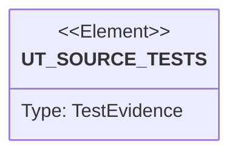

# Semantic TD: cap/tests

## Schema
<!-- type: schema lang: yaml -->

```yaml
semantic_domain:
  key: "cap/tests"
  source_group: "projects/cap/tests"
  coverage_kind: semantic
  evidence:
    source_units:
      - path: "projects/cap/tests/behavior_cap_config_logging_and_reap_policy.rs"
        language: "rust"
        ownership_state: "codegen"
        generator_primitives: ["service_method", "test_case"]
        symbols:
          - name: "cap_config_logging_and_reap_policy"
            kind: "function"
            public: false
        source_evidence_node:
          layer: "backend"
          ecosystem: "rust"
          role: "test"
          section_type: "unit-test"
          domain: "projects/cap/tests"
      - path: "projects/cap/tests/behavior_cap_agent_hook_installation.rs"
        language: "rust"
        ownership_state: "codegen"
        generator_primitives: ["service_method", "test_case"]
        symbols:
          - name: "cap_agent_hook_installation"
            kind: "function"
            public: false
        source_evidence_node:
          layer: "backend"
          ecosystem: "rust"
          role: "test"
          section_type: "unit-test"
          domain: "projects/cap/tests"
      - path: "projects/cap/tests/behavior_cap_command_lease_throttling.rs"
        language: "rust"
        ownership_state: "codegen"
        generator_primitives: ["service_method", "test_case"]
        symbols:
          - name: "cap_command_lease_throttling"
            kind: "function"
            public: false
        source_evidence_node:
          layer: "backend"
          ecosystem: "rust"
          role: "test"
          section_type: "unit-test"
          domain: "projects/cap/tests"
      - path: "projects/cap/tests/behavior_cap_daemon_lifecycle_and_status.rs"
        language: "rust"
        ownership_state: "codegen"
        generator_primitives: ["service_method", "test_case"]
        symbols:
          - name: "cap_daemon_lifecycle_and_status"
            kind: "function"
            public: false
        source_evidence_node:
          layer: "backend"
          ecosystem: "rust"
          role: "test"
          section_type: "unit-test"
          domain: "projects/cap/tests"
      - path: "projects/cap/tests/behavior_cap_hook_auto_command_optimizer_whitelist.rs"
        language: "rust"
        ownership_state: "codegen"
        generator_primitives: ["service_method", "test_case"]
        symbols:
          - name: "cap_hook_auto_command_optimizer_whitelist"
            kind: "function"
            public: false
        source_evidence_node:
          layer: "backend"
          ecosystem: "rust"
          role: "test"
          section_type: "unit-test"
          domain: "projects/cap/tests"
      - path: "projects/cap/tests/behavior_cap_command_replacement_parity.rs"
        language: "rust"
        ownership_state: "handwrite"
        generator_primitives: ["data_model", "service_method", "test_case"]
        symbols:
          - name: "active_replacements_match_success_and_error_behavior"
            kind: "function"
            public: false
          - name: "Case"
            kind: "struct"
            public: false
          - name: "new"
            kind: "function"
            public: false
          - name: "assert_success_parity"
            kind: "function"
            public: false
          - name: "assert_error_parity"
            kind: "function"
            public: false
          - name: "assert_quiet_nonzero_parity"
            kind: "function"
            public: false
          - name: "run"
            kind: "function"
            public: false
          - name: "exit_code"
            kind: "function"
            public: false
          - name: "build_cap_frontend"
            kind: "function"
            public: false
          - name: "compile_c"
            kind: "function"
            public: false
          - name: "cap_full_binary"
            kind: "function"
            public: false
          - name: "Fixture"
            kind: "struct"
            public: false
          - name: "create"
            kind: "function"
            public: false
          - name: "list_dir"
            kind: "function"
            public: false
          - name: "cat_file"
            kind: "function"
            public: false
          - name: "uniq_file"
            kind: "function"
            public: false
          - name: "find_root"
            kind: "function"
            public: false
          - name: "du_root"
            kind: "function"
            public: false
          - name: "sort_file"
            kind: "function"
            public: false
          - name: "sed_file"
            kind: "function"
            public: false
          - name: "grep_root"
            kind: "function"
            public: false
          - name: "path_string"
            kind: "function"
            public: false
        source_evidence_node:
          layer: "backend"
          ecosystem: "rust"
          role: "test"
          section_type: "unit-test"
          domain: "projects/cap/tests"
```

## Unit Test
<!-- type: unit-test lang: mermaid -->



## Changes
<!-- type: changes lang: yaml -->

```yaml
coverage_kind: semantic
changes:
  - path: "projects/cap/tests/behavior_cap_config_logging_and_reap_policy.rs"
    action: modify
    section: schema
    description: |
      Existing source behavior is covered by this feature/domain semantic TD.
    impl_mode: hand-written
  - path: "projects/cap/tests/behavior_cap_agent_hook_installation.rs"
    action: modify
    section: schema
    description: |
      Existing source behavior is covered by this feature/domain semantic TD.
    impl_mode: hand-written
  - path: "projects/cap/tests/behavior_cap_command_lease_throttling.rs"
    action: modify
    section: schema
    description: |
      Existing source behavior is covered by this feature/domain semantic TD.
    impl_mode: hand-written
  - path: "projects/cap/tests/behavior_cap_daemon_lifecycle_and_status.rs"
    action: modify
    section: schema
    description: |
      Existing source behavior is covered by this feature/domain semantic TD.
    impl_mode: hand-written
  - path: "projects/cap/tests/behavior_cap_hook_auto_command_optimizer_whitelist.rs"
    action: modify
    section: schema
    description: |
      Existing source behavior is covered by this feature/domain semantic TD.
    impl_mode: hand-written
  - path: "projects/cap/tests/behavior_cap_command_replacement_parity.rs"
    action: modify
    section: schema
    description: |
      Existing source behavior is covered by this feature/domain semantic TD.
    impl_mode: hand-written
    replaces:
      - "<handwrite-tracker:projects-cap-tests-behavior-cap-command-replacement-parity-rs>"
```
