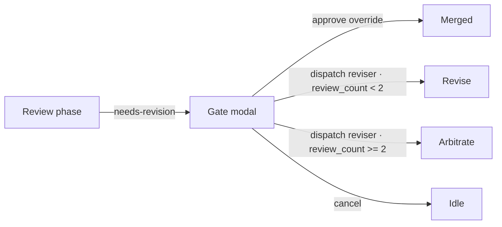

# cue TUI - legacy layout and keybindings

Status: legacy scaffold.

cue is now a web-based Prompt-to-Governed-App platform. This TUI layout was part
of the old terminal SDD-runner direction and should not be extended as the main
product surface.

## Panes

```
┌──────────────────────────────┬───────────────────────────────────────────────┐
│ Issues (list)                │ CRRR phase gauge  [Requirements…Merged]       │
│                              ├───────────────────────────────────────────────┤
│ ▶ slug [phase] rN            │ Issue — <slug>                                │
│   slug [phase] rN            │                                               │
│   …                          │ Problem / Requirements / Scope / RefCtx /     │
│                              │ Reviews (body, scroll-wrapped)                │
├──────────────────────────────┴───────────────────────────────────────────────┤
│ log / envelopes (ring buffer, most recent last)                              │
├──────────────────────────────────────────────────────────────────────────────┤
│ action bar:  n new · r run · a approve · v revise · Enter open · j/k · q     │
│ status:      <transient message>                          ⚠ warnings         │
└──────────────────────────────────────────────────────────────────────────────┘
```

## Keybindings

### Normal mode

| Key           | Action                                      |
|---------------|---------------------------------------------|
| `j` / `↓`     | Select next issue                           |
| `k` / `↑`     | Select previous issue                       |
| `Enter`       | Open selected issue in detail pane          |
| `r`           | Run CRRR (start driver; enter Requirements) |
| `a`           | Approve current review phase                |
| `v`           | Open gate modal (dispatch reviser / approve override / cancel) |
| `n`           | New issue (stub — shows "not yet implemented") |
| `q` / `Ctrl+C`| Quit                                        |

### Gate modal (reviewer verdict = needs-revision)

| Key             | Action                                |
|-----------------|---------------------------------------|
| `j` / `↓` / Tab | Move cursor down                      |
| `k` / `↑`       | Move cursor up                        |
| `Enter`         | Activate selected choice              |
| `Esc`           | Dismiss modal without choosing        |

Choices: `approve (override)` · `dispatch reviser` · `cancel`.

### Message modal (stubs / notices)

| Key                      | Action                |
|--------------------------|-----------------------|
| `Enter` / `Esc` / `q`    | Dismiss               |

## Gate modal flow


