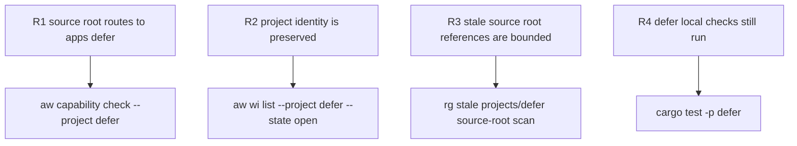

# defer app source-root taxonomy

## Logic
<!-- type: logic lang: mermaid -->


## Config
<!-- type: config lang: yaml -->

```yaml
repo_taxonomy_migration:
  project: defer
  canonical_source_root: apps/defer
  legacy_source_root: projects/defer
  preserved_identity:
    aw_project: defer
    github_label: project:defer
    persistent_branch: project-defer
    td_bucket: projects/defer/tech-design
  rewrite_classes:
    - root_readme_inventory_link
    - cargo_workspace_member
    - aw_project_path
    - aw_cap_path
    - project_local_aw_toml_path
    - install_or_build_script_path
    - test_fixture_or_manifest_path
    - generated_evidence_source_root_path
  preserve_classes:
    - historical_release_notes
    - issue_body_reference_context
    - td_bucket_path
    - git_branch_name
    - github_label
  verification:
    aw_resolution:
      - aw wi show 1217
      - aw wi list --project defer --state open
      - aw capability check --project defer
    local_checks:
      - cargo test -p defer
      - aw td check projects/defer/tech-design
    stale_source_root_scan:
      command: rg -n "projects/defer" README.md CONTRIBUTING.md aw.toml .aw/config.toml Cargo.toml apps projects .github
      allowed_contexts:
        - projects/defer/tech-design
        - historical text that explicitly names the retired source root
```

## Unit Test
<!-- type: unit-test lang: mermaid -->



## Changes
<!-- type: changes lang: yaml -->

```yaml
changes:
  - path: projects/defer
    action: move
    target: apps/defer
    section: logic
    impl_mode: hand-written
    reason: "Defer's live app source root moves to the apps/ taxonomy."
  - path: README.md
    action: update
    section: config
    impl_mode: hand-written
    reason: "Root project inventory and install/discovery links should point at apps/defer for Defer."
  - path: Cargo.toml
    action: update
    section: config
    impl_mode: hand-written
    reason: "Workspace membership and package routing must resolve the Defer crate under apps/defer."
  - path: aw.toml
    action: update
    section: config
    impl_mode: hand-written
    reason: "Project discovery must include app-local aw.toml files so defer resolves through apps/defer."
  - path: .aw/config.toml
    action: update
    section: config
    impl_mode: hand-written
    reason: "AW project path and cap_path for project defer must point at apps/defer while retaining name defer and label project:defer."
  - path: apps/defer/README.md
    action: update
    section: config
    impl_mode: hand-written
    reason: "Project-local capability docs and verification paths should use apps/defer or path-relative references for the live source root."
  - path: apps/defer/aw.toml
    action: update
    section: config
    impl_mode: hand-written
    reason: "Project-local AW metadata should describe the moved app path without changing project identity."
  - path: apps/defer/tests
    action: update
    section: unit-test
    impl_mode: hand-written
    reason: "Any project-local tests or manifests that hard-code projects/defer as source root should use apps/defer or relative paths."
  - path: projects/defer/tech-design
    action: preserve
    section: config
    impl_mode: hand-written
    reason: "The issue explicitly keeps the TD project bucket under projects/defer/tech-design until a separate TD-platform migration exists."
```
