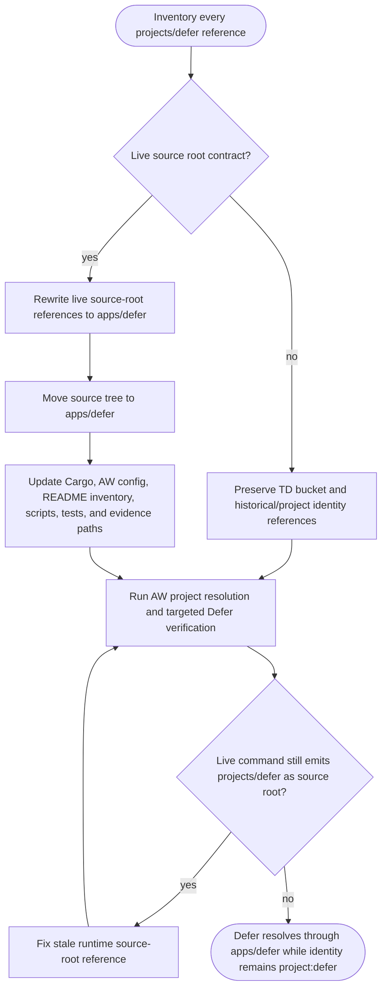

# defer app source-root taxonomy

## Logic
<!-- type: logic lang: mermaid -->

```mermaid
---
id: defer-app-source-root-taxonomy-flow
entry: inventory
nodes:
  inventory:
    kind: start
    label: "Inventory every projects/defer reference"
  classify:
    kind: decision
    label: "Is this reference the live source root contract?"
  preserve:
    kind: process
    label: "Preserve TD bucket, historical notes, and project identity references"
  migrate:
    kind: process
    label: "Rewrite live source-root references to apps/defer"
  move_tree:
    kind: process
    label: "Move the Defer source tree to apps/defer"
  route:
    kind: process
    label: "Update Cargo, AW config, README inventory, scripts, tests, and evidence paths"
  smoke:
    kind: process
    label: "Run AW project resolution and targeted Defer verification"
  stale:
    kind: decision
    label: "Does a live command still emit projects/defer as source root?"
  fix:
    kind: process
    label: "Fix the stale runtime source-root reference"
  done:
    kind: terminal
    label: "Defer resolves through apps/defer while project identity remains project:defer"
edges:
  - from: inventory
    to: classify
    label: "reference classified"
  - from: classify
    to: preserve
    label: "not source root"
  - from: classify
    to: migrate
    label: "source root"
  - from: preserve
    to: smoke
    label: "kept intentionally"
  - from: migrate
    to: move_tree
    label: "paths rewritten"
  - from: move_tree
    to: route
    label: "tree moved"
  - from: route
    to: smoke
    label: "routing updated"
  - from: smoke
    to: stale
    label: "checks complete"
  - from: stale
    to: fix
    label: "yes"
  - from: fix
    to: smoke
    label: "retry"
  - from: stale
    to: done
    label: "no"
---
flowchart TD
    inventory([Inventory every projects/defer reference]) --> classify{Live source root contract?}
    classify -- no --> preserve[Preserve TD bucket and historical/project identity references]
    classify -- yes --> migrate[Rewrite live source-root references to apps/defer]
    migrate --> move_tree[Move source tree to apps/defer]
    move_tree --> route[Update Cargo, AW config, README inventory, scripts, tests, and evidence paths]
    preserve --> smoke[Run AW project resolution and targeted Defer verification]
    route --> smoke
    smoke --> stale{Live command still emits projects/defer as source root?}
    stale -- yes --> fix[Fix stale runtime source-root reference]
    fix --> smoke
    stale -- no --> done([Defer resolves through apps/defer while identity remains project:defer])
```
