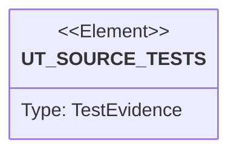

# Semantic TD: guard/guard-cli/src/bin

## Schema
<!-- type: schema lang: yaml -->

```yaml
semantic_domain:
  key: "guard/guard-cli/src/bin"
  source_group: "projects/guard/guard-cli/src/bin"
  coverage_kind: semantic
  evidence:
    source_units:
      - path: "projects/guard/guard-cli/src/bin/guard.rs"
        language: "rust"
        ownership_state: "codegen"
        generator_primitives: ["service_method"]
        symbols:
          - name: "main"
            kind: "function"
            public: false
        source_evidence_node:
          layer: "backend"
          ecosystem: "rust"
          role: "source"
          section_type: "schema"
          domain: "projects/guard/guard-cli/src/bin"
```

## Unit Test
<!-- type: unit-test lang: mermaid -->



## Changes
<!-- type: changes lang: yaml -->

```yaml
coverage_kind: semantic
changes:
  - path: "projects/guard/guard-cli/src/bin/guard.rs"
    action: modify
    section: schema
    description: |
      Existing source behavior is covered by this feature/domain semantic TD.
    impl_mode: hand-written
  - action: annotate
    section: unit-test
    impl_mode: hand-written
    description: "Traceability metadata edge for the unit-test section."
```
