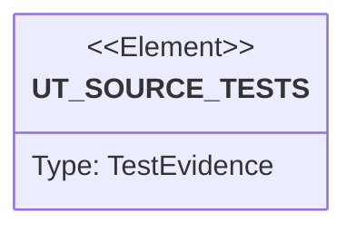

# Semantic TD: guard/src

## Schema
<!-- type: schema lang: yaml -->

```yaml
semantic_domain:
  key: "guard/src"
  source_group: "projects/guard/src"
  coverage_kind: semantic
  evidence:
    source_units:
      - path: "projects/guard/src/lib.rs"
        language: "rust"
        ownership_state: "codegen"
        generator_primitives: ["source_unit"]
        symbols:
          - name: "evidence"
            kind: "module"
            public: true
          - name: "report"
            kind: "module"
            public: true
          - name: "scan"
            kind: "module"
            public: true
        source_evidence_node:
          layer: "backend"
          ecosystem: "rust"
          role: "source"
          section_type: "schema"
          domain: "projects/guard/src"
      - path: "projects/guard/src/report.rs"
        language: "rust"
        ownership_state: "codegen"
        generator_primitives: ["config_surface", "data_model", "enum_model", "service_method"]
        symbols:
          - name: "SCHEMA_VERSION"
            kind: "constant"
            public: true
          - name: "Severity"
            kind: "enum"
            public: true
          - name: "rank"
            kind: "function"
            public: true
          - name: "is_actionable"
            kind: "function"
            public: true
          - name: "OverallStatus"
            kind: "enum"
            public: true
          - name: "exit_code"
            kind: "function"
            public: true
          - name: "is_clean"
            kind: "function"
            public: true
          - name: "Location"
            kind: "struct"
            public: true
          - name: "Finding"
            kind: "struct"
            public: true
          - name: "Summary"
            kind: "struct"
            public: true
          - name: "from_findings"
            kind: "function"
            public: true
          - name: "Completion"
            kind: "struct"
            public: true
          - name: "IntegrationMap"
            kind: "struct"
            public: true
          - name: "default"
            kind: "function"
            public: false
          - name: "GuardReport"
            kind: "struct"
            public: true
          - name: "from_scan"
            kind: "function"
            public: true
          - name: "from_scan_with_evidence"
            kind: "function"
            public: true
          - name: "stub"
            kind: "function"
            public: true
          - name: "tool_error"
            kind: "function"
            public: true
          - name: "persist"
            kind: "function"
            public: true
          - name: "read_last"
            kind: "function"
            public: true
          - name: "missing_integrations"
            kind: "function"
            public: false
          - name: "finding_id"
            kind: "function"
            public: true
        source_evidence_node:
          layer: "backend"
          ecosystem: "rust"
          role: "source"
          section_type: "schema"
          domain: "projects/guard/src"
      - path: "projects/guard/src/evidence.rs"
        language: "rust"
        ownership_state: "codegen"
        generator_primitives: ["data_model", "enum_model", "service_method"]
        symbols:
          - name: "EvidenceCommand"
            kind: "struct"
            public: true
          - name: "argv"
            kind: "function"
            public: true
          - name: "shell"
            kind: "function"
            public: true
          - name: "display_command"
            kind: "function"
            public: true
          - name: "with_cwd"
            kind: "function"
            public: true
          - name: "with_env"
            kind: "function"
            public: true
          - name: "EvidenceStatus"
            kind: "enum"
            public: true
          - name: "ExternalEvidence"
            kind: "struct"
            public: true
          - name: "to_guard_finding"
            kind: "function"
            public: true
          - name: "run_evidence_commands"
            kind: "function"
            public: true
          - name: "run_one"
            kind: "function"
            public: false
          - name: "parse_json_payload"
            kind: "function"
            public: false
          - name: "report_clean"
            kind: "function"
            public: false
          - name: "finding_count"
            kind: "function"
            public: false
          - name: "compact_report"
            kind: "function"
            public: false
          - name: "tail_lossy"
            kind: "function"
            public: false
          - name: "squash"
            kind: "function"
            public: false
          - name: "tests"
            kind: "module"
            public: false
        source_evidence_node:
          layer: "backend"
          ecosystem: "rust"
          role: "source"
          section_type: "schema"
          domain: "projects/guard/src"
      - path: "projects/guard/src/scan.rs"
        language: "rust"
        ownership_state: "codegen"
        generator_primitives: ["data_model", "enum_model", "service_method"]
        symbols:
          - name: "PolicyProfile"
            kind: "enum"
            public: true
          - name: "as_str"
            kind: "function"
            public: true
          - name: "ScanOptions"
            kind: "struct"
            public: true
          - name: "default"
            kind: "function"
            public: false
          - name: "default_languages"
            kind: "function"
            public: true
          - name: "scan_path"
            kind: "function"
            public: true
          - name: "scan_path_with_options"
            kind: "function"
            public: true
          - name: "one_based"
            kind: "function"
            public: false
          - name: "include_diagnostic"
            kind: "function"
            public: false
          - name: "security_lint_rule"
            kind: "function"
            public: false
          - name: "map_severity"
            kind: "function"
            public: false
          - name: "sql_injection_language"
            kind: "function"
            public: false
          - name: "remediation_for_rule"
            kind: "function"
            public: false
          - name: "tests"
            kind: "module"
            public: false
        source_evidence_node:
          layer: "backend"
          ecosystem: "rust"
          role: "source"
          section_type: "schema"
          domain: "projects/guard/src"
```

## Unit Test
<!-- type: unit-test lang: mermaid -->



## Changes
<!-- type: changes lang: yaml -->

```yaml
coverage_kind: semantic
changes:
  - path: "projects/guard/src/lib.rs"
    action: modify
    section: schema
    description: |
      Existing source behavior is covered by this feature/domain semantic TD.
    impl_mode: hand-written
  - path: "projects/guard/src/report.rs"
    action: modify
    section: schema
    description: |
      Existing source behavior is covered by this feature/domain semantic TD.
    impl_mode: hand-written
  - path: "projects/guard/src/evidence.rs"
    action: modify
    section: schema
    description: |
      Existing source behavior is covered by this feature/domain semantic TD.
    impl_mode: hand-written
  - path: "projects/guard/src/scan.rs"
    action: modify
    section: schema
    description: |
      Existing source behavior is covered by this feature/domain semantic TD.
    impl_mode: hand-written
  - action: annotate
    section: unit-test
    impl_mode: hand-written
    description: "Traceability metadata edge for the unit-test section."
```
