# jet transform resolver: Nx tsconfig path aliases never wired into codegen-layer resolution

## Logic
<!-- type: logic lang: mermaid -->

```mermaid
(fill)
```
## Unit Test

```mermaid
---
id: jet-transform-resolver-nx-tsconfig-path-aliases-never-wired-into-verification
requirements:
  alias_miss_falls_through_to_unresolved_literal_without_panic_isolated_unit:
    id: R4
    text: "Isolated unit-level pin (not full pipeline) on the new ModuleResolutionIndex::from_module_map_and_aliases constructor and the new alias-consultation branch in resolve_module_path, proving prior fallback behavior is preserved on a miss: a resolution_index built with a non-empty alias_entries list, resolved against a bare specifier that does not match any alias prefix, must fall through to the pre-existing final literal require('<spec>') string exactly as before this fix (no panic, no incorrect match), and a resolution_index built via the existing from_module_map (empty alias_entries) must behave identically to before this fix for the same specifier -- pinning that the new field/branch is purely additive."
    kind: regression
    risk: low
    verify: cargo test -p jet --lib transform::modules::tests::resolve_module_path_alias_miss_falls_through_to_unresolved_literal
  nx_alias_exact_prefix_match_with_empty_rest_resolves_to_alias_target_entry_file:
    id: R3
    text: "Edge case pinning the alias_entries prefix-strip-and-join arithmetic's rest.is_empty() branch (mirrors resolver/mod.rs::resolve_alias's own candidate = target.clone() branch 1:1, not the target.join(rest) branch R1 already exercises): an entry module that imports the alias key specifier itself with no trailing subpath (e.g. import x from '@operations/tech-platform-lib', where the tsconfig path alias maps that exact specifier to a single target file with no further joinable segment) must still resolve through the full bundle pipeline to the alias target's module id, with no literal unresolved specifier surviving in BundleOutput.code."
    kind: functional
    risk: medium
    verify: cargo test -p jet --lib transform::modules::tests::bundle_resolves_nx_alias_exact_prefix_match_with_empty_rest
  nx_workspace_library_import_via_tsconfig_alias_resolves_full_pipeline_bundle:
    id: R1
    text: "WI #1305 AC1/AC2 minimal repro at the full Bundler::bundle() pipeline level (build_graph -> transform_modules/resolve_module_path -> generate_bundle), driven through the real AliasResolver::load loading path (not a hand-built alias Vec): a tempdir fixture with a tsconfig.base.json declaring '@operations/tech-platform-lib': ['libs/tech-platform-lib/src/index.ts'] plus that library file, and an entry module that imports the library via its bare alias specifier (e.g. import { platformValue } from '@operations/tech-platform-lib'). resolve_options.alias must be populated via AliasResolver::load(root, ...).to_resolve_aliases() exactly as cli.rs::browser_production_resolve_options does. The emitted BundleOutput.code must contain no literal unresolved alias specifier substring (no require('@operations/tech-platform-lib') / require(\"@operations/tech-platform-lib\")) and must contain the aliased library module's compiled body (a stable marker from the fixture source, e.g. 'NX_ALIAS_LIB_MARKER') reachable via a require(<id>) reference into the _mods array."
    kind: functional
    risk: high
    verify: cargo test -p jet --lib transform::modules::tests::bundle_resolves_nx_workspace_library_via_tsconfig_alias_full_pipeline
  ordinary_bare_package_import_regression_control_unaffected_by_alias_branch:
    id: R2
    text: "WI #1305 AC3 no-regression control at the same full-pipeline level: when resolve_options.alias is populated (as it always is for jet build --nx), an entry module's ordinary bare-specifier import of an ordinary (non-aliased) node_modules package must continue to resolve exactly as before this fix -- no literal unresolved specifier string in BundleOutput.code, and the target package module's transformed body present in _mods -- proving the new alias-consultation branch in resolve_module_path is reached only after (and does not short-circuit or otherwise interfere with) the pre-existing node_modules ancestor walk-up and package-root-index bare-specifier resolution strategies."
    kind: regression
    risk: medium
    verify: cargo test -p jet --lib transform::modules::tests::bundle_resolves_ordinary_bare_package_import_unaffected_by_alias_branch
---
flowchart TD
    r1[R1 nx workspace library import via tsconfig alias resolves full pipeline bundle] --> cargo_test_p_jet_lib_transform_modules_tests_bundle_resolves_nx_workspace_library_via_tsconfig_alias_full_pipeline[cargo test -p jet --lib transform::modules::tests::bundle_resolves_nx_workspace_library_via_tsconfig_alias_full_pipeline]
    r2[R2 ordinary bare package import regression control unaffected by alias branch] --> cargo_test_p_jet_lib_transform_modules_tests_bundle_resolves_ordinary_bare_package_import_unaffected_by_alias_branch[cargo test -p jet --lib transform::modules::tests::bundle_resolves_ordinary_bare_package_import_unaffected_by_alias_branch]
    r3[R3 nx alias exact prefix match with empty rest resolves to alias target entry file] --> cargo_test_p_jet_lib_transform_modules_tests_bundle_resolves_nx_alias_exact_prefix_match_with_empty_rest[cargo test -p jet --lib transform::modules::tests::bundle_resolves_nx_alias_exact_prefix_match_with_empty_rest]
    r4[R4 alias miss falls through to unresolved literal without panic isolated unit] --> cargo_test_p_jet_lib_transform_modules_tests_resolve_module_path_alias_miss_falls_through_to_unresolved_literal[cargo test -p jet --lib transform::modules::tests::resolve_module_path_alias_miss_falls_through_to_unresolved_literal]
```

<!-- type: unit-test lang: mermaid -->



## Changes
<!-- type: changes lang: yaml -->

```yaml
changes:
  - path: projects/jet/src/transform/modules.rs
    action: update
    section: logic
    impl_mode: hand-written
    reason: "Fix WI #1305 R1/R2: add a new alias_entries: Vec<(String, PathBuf)> field to ModuleResolutionIndex (alongside the existing private module_ids/package_roots), and a new constructor ModuleResolutionIndex::from_module_map_and_aliases(module_map: &HashMap<PathBuf, usize>, alias_entries: &[(String, PathBuf)]) that builds it; the existing from_module_map becomes a thin wrapper calling the new constructor with an empty slice, so every existing call site (including this file's own mod tests) and every prior no-alias-loaded build path is unchanged. In resolve_module_path's bare-specifier branch, insert one new step immediately after the existing Node-builtin polyfill fallback (WI #1306, unchanged) and before the final unresolved-literal fallback: when resolution_index is Some and its alias_entries contains a (prefix, target) pair such that path.starts_with(prefix) (entries are tried in AliasResolver::load's pre-sorted longest-prefix-first order, preserved verbatim through the new field -- exactly mirroring resolver/mod.rs::resolve_alias's own matching order), compute candidate with the identical prefix-strip-and-join arithmetic as resolve_alias (rest = &path[prefix.len()..]; candidate = if rest.is_empty() { target.clone() } else { target.join(rest.trim_start_matches('/')) }), then resolve candidate via the existing lookup_file_or_directory_module_id(module_map, resolution_index, &candidate) helper (already used by every other bare-specifier strategy in this function -- extension probing, directory index probing, package.json main/module/exports probing) and return require(<id>) on a hit. On a miss (no alias entries, no matching prefix, or the candidate does not resolve to a module id), fall through to the pre-existing final literal require('<spec>') string exactly as before this fix. No change to resolver/mod.rs, resolver/alias.rs, or cli.rs (all Out of Scope on WI #1305, and already correct) -- this fix only teaches the codegen-time resolver to re-derive and look up the same candidate path resolver/mod.rs::resolve_alias already computed and successfully resolved during build_graph."
  - path: projects/jet/src/transform/modules.rs
    action: update
    section: unit-test
    impl_mode: hand-written
    reason: "Add the R1-R4 regression tests specified in the unit-test section to the existing mod tests block, following the exact full-pipeline test pattern WI #1306 already landed in this same file (a small tempdir fixture-writing helper, crate::bundler::BundleOptions with resolve_options pointed at the fixture root, crate::bundler::Bundler::new(opts).bundle(entry).await, then asserting on BundleOutput.code). R1 adds a new fixture-writing helper (or reuses/generalizes the existing write_node_builtin_fixture helper) that also writes a tsconfig.base.json declaring an Nx-style path alias plus the aliased library file, and drives resolve_options.alias through the REAL AliasResolver::load(root, ...).to_resolve_aliases() loading path (not a hand-built Vec), proving WI #1305 AC1/AC2 end-to-end: no literal unresolved alias specifier in BundleOutput.code, and the aliased library's compiled body present in _mods via a require(<id>) reference. R2 is a same-shape full-pipeline negative/no-regression control (resolve_options.alias populated but the entry imports an ordinary non-aliased bare package) proving AC3 -- the new alias branch does not interfere with pre-existing bare-specifier strategies. R3 is a same-shape full-pipeline edge case pinning the rest.is_empty() branch of the alias prefix-strip-and-join arithmetic (importing the alias key specifier itself, no subpath). R4 is an isolated (non-pipeline) unit test directly exercising ModuleResolutionIndex::from_module_map_and_aliases and resolve_module_path's new branch on an alias-miss, pinning that the fallback to the pre-existing literal require('<spec>') string is unchanged and that from_module_map (empty alias_entries) behaves identically to before this fix."
  - path: projects/jet/src/bundler/mod.rs
    action: update
    section: logic
    impl_mode: hand-written
    reason: "Fix WI #1305 R1: add a private alias_entries: Vec<(String, PathBuf)> field to the Bundler struct. In Bundler::new, clone options.resolve_options.alias into this new field BEFORE resolve_options is moved into crate::resolver::ModuleResolver::new(resolve_options)? (which already consumes ResolveOptions::alias for the graph-walk resolver via the pre-existing resolve_alias/is_alias methods on resolver/mod.rs -- this fix does not change resolver/mod.rs at all, it only additionally retains a copy of the same already-loaded data on the Bundler for the codegen-time step, closing the exact gap WI #1305 identifies: Bundler::new previously discarded options.resolve_options.alias once it built ModuleResolver, and transform_modules never had it to pass on). In Bundler::transform_modules, replace the resolution_index construction call crate::transform::modules::ModuleResolutionIndex::from_module_map(&module_map) with crate::transform::modules::ModuleResolutionIndex::from_module_map_and_aliases(&module_map, &self.alias_entries), so the same Vec<(String, PathBuf)> cli.rs::browser_production_resolve_options already loads via AliasResolver::load (called from both run_nx_build and the plain jet build path, since both funnel through browser_production_resolve_options) now also reaches the codegen-time resolver. No cli.rs change is required -- cli.rs already threads resolve_options.alias into BundleOptions.resolve_options today; the gap was entirely between Bundler::new (which discarded the alias data) and Bundler::transform_modules (which never had it to pass on)."
```
