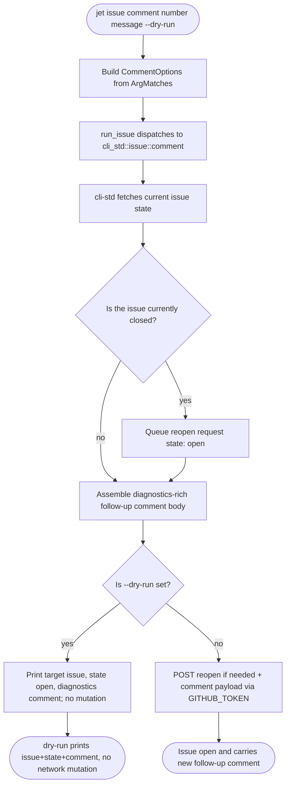

# jet CLI: add issue comment auto-reopen follow-up

## Logic
<!-- type: logic lang: mermaid -->



## Config
<!-- type: config lang: yaml -->

```yaml
jet_issue_comment_cli:
  clap_surface:
    file: projects/jet/src/standard_cli.rs
    fn: issue_command
    parent_command: issue
    parent_flags: [subcommand_required: true, arg_required_else_help: true]
    new_subcommand: comment
    about: "Comment on an issue and ensure it is open"
    args:
      number:
        required: true
        value_parser: u64
        help: "Issue number"
      dry-run:
        long: dry-run
        action: SetTrue
        help: "Print the reopen/comment request without changing GitHub state"
      message:
        num_args: "0.."
        help: "Follow-up note to add after reopening"
  dispatch_surface:
    file: projects/jet/src/standard_cli.rs
    fn: run_issue
    match_arm: "Some((\"comment\", m))"
    calls: cli_std::issue::comment(&TOOL, CommentOptions)
  field_mapping:
    number: "m.get_one::<u64>(\"number\").expect(...)"
    message: "m.get_many::<String>(\"message\") joined with a space, filtered to None when blank"
    repo: "None (jet always targets TOOL.repo = chrischeng-c4/axiom; no --repo override exposed for comment, matching create/search)"
    dry_run: "m.get_flag(\"dry-run\")"
    yes: "true (jet's standard CLI commands run non-interactively; no confirmation prompt surface)"
  shared_logic_ownership:
    crate: libs/cli-std
    module: libs/cli-std/src/issue.rs
    owns:
      - "CommentOptions struct definition"
      - "issue state fetch + auto-reopen-if-closed request"
      - "followup_comment_body() diagnostics-rich body assembly (render_diagnostics + assemble_body)"
      - "comment_payload() GitHub comment JSON shaping"
      - "all GitHub REST API calls (behind the online feature)"
    jet_must_not_duplicate:
      - "reqwest/GitHub HTTP calls"
      - "issue open/closed state resolution"
      - "diagnostics body formatting"
  preserved_behavior:
    search: "unchanged - SearchOptions{query,state,limit}"
    view: "unchanged - view(&TOOL, number)"
    create: "unchanged - CreateOptions{title,message,url,repo,label:[app:jet],dry_run,yes:true}"
  feature_gating:
    jet_cargo_toml: "projects/jet/Cargo.toml depends on cli-std with features = [\"online\"] unconditionally (no jet-local [features] table)"
    cli_std_cargo_toml: "libs/cli-std/Cargo.toml: online = [\"dep:reqwest\"]; comment()'s network-mutating body (reopen PATCH + comment POST) is #[cfg(feature = \"online\")]"
    acceptance_mapping: "'online/release feature build type-checks the comment path' == a standard `cargo build -p jet` (which always compiles cli-std with online enabled) must type-check the new comment dispatch arm and CommentOptions construction"
  verification_commands:
    - "cargo build -p jet"
    - "cargo build -p jet --release"
    - "cargo test -p jet --lib standard_cli"
    - "cargo test -p cli-std"
```

## Unit Test
<!-- type: unit-test lang: mermaid -->

```mermaid
---
id: jet-cli-add-issue-comment-auto-reopen-follow-up-verification
requirements:
  comment_dry_run_wires_to_shared_comment_api_without_network_credential:
    id: R3
    text: "`run_issue` on a `comment --dry-run` match arm builds `cli_std::issue::CommentOptions` and calls `cli_std::issue::comment`, returning `Ok(())` without requiring a GitHub credential or performing a network mutation (dry-run prints the target issue, resolved state open, and the diagnostics comment body via the shared cli-std preview path)."
    kind: functional
    risk: high
    verify: cargo test -p jet --lib standard_cli::tests::issue_comment_dry_run_returns_ok_without_network_credential
  comment_parses_number_message_dry_run:
    id: R2
    text: "`jet issue comment <number> [message...] [--dry-run]` parses the issue number, joined free-text message, and dry-run flag correctly."
    kind: functional
    risk: low
    verify: cargo test -p jet --lib standard_cli::tests::issue_comment_parses_number_message_and_dry_run
  issue_help_lists_comment:
    id: R1
    text: "`jet issue --help` lists the `comment` subcommand."
    kind: functional
    risk: low
    verify: cargo test -p jet --lib standard_cli::tests::issue_help_lists_comment
  no_duplicated_github_api_logic_in_jet:
    id: R5
    text: "jet's own CLI dispatch (`projects/jet/src/standard_cli.rs`) contains no GitHub HTTP client construction or REST call logic; all issue state/reopen/comment network behavior stays owned by `libs/cli-std`."
    kind: regression
    risk: medium
    verify: ! rg -n "reqwest::|http_client\(|github\.com/repos" projects/jet/src/standard_cli.rs
  release_build_type_checks_comment_path:
    id: R6
    text: "A standard release build of jet (which always compiles `cli-std` with the `online` feature per `projects/jet/Cargo.toml`) type-checks the new `comment` dispatch arm and `CommentOptions` construction."
    kind: functional
    risk: medium
    verify: cargo build -p jet --release
  search_view_create_regression:
    id: R4
    text: "Existing `jet issue search` / `view` / `create` parsing and shared cli-std payload/body-assembly behavior still pass unchanged."
    kind: regression
    risk: medium
    verify: cargo test -p jet --lib standard_cli && cargo test -p cli-std
---
flowchart TD
    r1[R1 issue help lists comment] --> cargo_test_p_jet_lib_standard_cli_tests_issue_help_lists_comment[cargo test -p jet --lib standard_cli::tests::issue_help_lists_comment]
    r2[R2 comment parses number message dry run] --> cargo_test_p_jet_lib_standard_cli_tests_issue_comment_parses_number_message_and_dry_run[cargo test -p jet --lib standard_cli::tests::issue_comment_parses_number_message_and_dry_run]
    r3[R3 comment dry run wires to shared comment api without network credential] --> cargo_test_p_jet_lib_standard_cli_tests_issue_comment_dry_run_returns_ok_without_network_credential[cargo test -p jet --lib standard_cli::tests::issue_comment_dry_run_returns_ok_without_network_credential]
    r4[R4 search view create regression] --> cargo_test_p_jet_lib_standard_cli_cargo_test_p_cli_std[cargo test -p jet --lib standard_cli && cargo test -p cli-std]
    r5[R5 no duplicated github api logic in jet] --> rg_n_reqwest_http_client_github_com_repos_projects_jet_src_standard_cli_rs[! rg -n "reqwest::|http_client\(|github\.com/repos" projects/jet/src/standard_cli.rs]
    r6[R6 release build type checks comment path] --> cargo_build_p_jet_release[cargo build -p jet --release]
```

## Changes
<!-- type: changes lang: yaml -->

```yaml
changes:
  - path: projects/jet/src/standard_cli.rs
    action: modify
    section: logic
    impl_mode: hand-written
    reason: "Adds the `comment` subcommand to issue_command() (number/dry-run/message args) and the comment dispatch arm in run_issue() that builds cli_std::issue::CommentOptions and calls cli_std::issue::comment(&TOOL, opts); no GitHub API logic is duplicated in jet. Landed ahead of this TD (commit 97b7f320fa) per standard aw-td-writer retroactive-documentation practice for already-shipped code; this TD formalizes and capability-tracks it under WI #928."
  - path: projects/jet/src/standard_cli.rs
    action: modify
    section: unit-test
    impl_mode: hand-written
    reason: "Adds a new #[tokio::test] issue_comment_dry_run_returns_ok_without_network_credential to the existing `mod tests`, invoking run_issue on a parsed `issue comment <n> --dry-run` ArgMatches with GITHUB_TOKEN/GH_TOKEN unset and asserting Ok(()); closes R3 (dry-run wiring proof) and helps prove R6 (comment path type-checks in a release build). Not yet applied as of TD authoring; scoped for the handwrite fill step."
  - path: projects/jet/README.md
    action: update
    section: config
    impl_mode: hand-written
    reason: "Registers the jet-cli-standard-commands capability (Capability Index row + H3 field-style contract + work-root table row for WI #928) so the comment auto-reopen follow-up is capability-tracked; already applied ahead of this TD per standard aw-td-writer capability-registration practice."
```
