# jet --lib --dts isolatedDeclarations: Object.assign at-scale truncation verification

(pending fill)

## Logic

```mermaid
---
id: jet-dts-object-assign-multi-property-scale-truncation-verification
entry: object_literal_source
nodes:
  object_literal_source: { kind: start,    label: "exported const object literal,\nN properties, one or more members\nwhose value is an arrow with its own\nexplicit return type and a concise body\nObject.assign({}, ...arr.map(cb))\n(WI #1262 exact repro: 3 members;\nreal-world fe-shared shape: 11 members,\nsingle Object.assign-valued member)" }
  member_value_scan: { kind: process,  label: "infer_arrow_function_type_from_text\nper member: resolves the arrow's own\nhead (params): ReturnType => ...\nbody text after => (the Object.assign\ncall) is NEVER inspected -- unchanged\nfrom the #1238 finding" }
  outer_comma_split: { kind: process,  label: "split_top_level(inner, ',')\nsplits the OUTER object literal's\nmembers at bracket-depth 0,\nregardless of how many members\nfollow the Object.assign-valued one\nor how many Object.assign-valued\nmembers exist in the same literal" }
  depth_tracks_arrow_ret: { kind: decision, label: "split_top_level / split_once_top_level:\n'>' immediately after '=' (the arrow\ntoken's own '>') skipped, not treated\nas a generic-close that decrements\ndepth? (fixed by WI #1264, commit\n75cb5e5ca)" }
  correct_member_boundaries: { kind: process, label: "every top-level property-separating\ncomma is found correctly; each\nObject.assign(...) call's own internal\ncommas/parens/brackets/nested map\ncallback bodies stay nested and never\nsplit the outer member list, at ANY\nproperty count or Object.assign-valued\nmember count" }
  full_dts_emitted: { kind: terminal, label: "ALL N members emitted in the .d.ts,\nmatching tsc --isolatedDeclarations\nground truth exactly -- empirically\nverified for the issue's exact 3-member\nrepro, an 11-member real-world-scale\nreconstruction of fe-shared's _Query,\nand a 12-member variant carrying TWO\nObject.assign-valued members in the\nsame literal" }
  corrupted_depth: { kind: process, label: "PRE-#1264: the arrow's trailing '>'\nwrongly decrements depth to -1;\nObject.assign's own '(' incidentally\nrebalances it back to 0, so\nObject.assign's internal top-level\ncommas are misread as outer property\nseparators" }
  silent_truncate_at_scale: { kind: terminal, label: "every member after the first\nObject.assign-valued one is silently\ndropped from the emitted .d.ts, no\nerror, exit code 0 (WI #1262's filed\nreport: 0.4.16, 11-method _Query,\nonly parse survives)" }
edges:
  - { from: object_literal_source,      to: member_value_scan }
  - { from: member_value_scan,          to: outer_comma_split }
  - { from: outer_comma_split,          to: depth_tracks_arrow_ret }
  - { from: depth_tracks_arrow_ret,     to: correct_member_boundaries, label: "yes (current app/jet\nHEAD, post #1264/#1263)" }
  - { from: depth_tracks_arrow_ret,     to: corrupted_depth,           label: "no (pre-#1264, incl.\nthe 0.4.16 release\nWI #1262 was filed\nagainst)" }
  - { from: correct_member_boundaries,  to: full_dts_emitted }
  - { from: corrupted_depth,            to: silent_truncate_at_scale }
id_note: this TD's sole empirical question was whether the WI #1264/#1263 split_top_level bracket-depth fix -- already known (per the #1238 TD) to hold for a 2-property Object.assign-valued shape -- also holds for WI #1262's actual filed scale (single Object.assign-valued member among 11 siblings) and for a harder synthetic case (two Object.assign-valued members among 12 siblings); both probes emit complete, tsc-matching output on current app/jet HEAD, so the fix generalizes and there is no remaining member-count-dependent or Object.assign-count-dependent edge left to chase
---
flowchart TD
    object_literal_source(["exported const object literal, N properties,\none or more members whose value is an arrow with\nits own explicit return type and a concise body\nObject.assign({}, ...arr.map(cb))\n(WI #1262 exact repro: 3 members;\nreal-world fe-shared shape: 11 members)"]) --> member_value_scan["infer_arrow_function_type_from_text per member:\nresolves the arrow's own head (params): ReturnType => ...\nbody text after => (the Object.assign call)\nis NEVER inspected -- unchanged from #1238"]
    member_value_scan --> outer_comma_split["split_top_level(inner, ','):\nsplits the OUTER object literal's members at\nbracket-depth 0, regardless of how many members\nfollow the Object.assign-valued one or how many\nObject.assign-valued members exist in the literal"]
    outer_comma_split --> depth_tracks_arrow_ret{"split_top_level / split_once_top_level:\n'>' immediately after '=' (the arrow token's\nown '>') skipped, not treated as a generic-close\nthat decrements depth? (fixed by WI #1264,\ncommit 75cb5e5ca)"}
    depth_tracks_arrow_ret -->|yes, current app/jet HEAD post #1264/#1263| correct_member_boundaries["every top-level property-separating comma is\nfound correctly; each Object.assign(...) call's own\ninternal commas/parens/brackets/nested map callback\nbodies stay nested and never split the outer member\nlist, at ANY property count or Object.assign-valued\nmember count"]
    depth_tracks_arrow_ret -->|no, pre-#1264, incl. the 0.4.16 release\nWI #1262 was filed against| corrupted_depth["PRE-#1264: the arrow's trailing '>' wrongly\ndecrements depth to -1; Object.assign's own '('\nincidentally rebalances it back to 0, so its\ninternal top-level commas are misread as outer\nproperty separators"]
    correct_member_boundaries --> full_dts_emitted(["ALL N members emitted in the .d.ts, matching\ntsc --isolatedDeclarations ground truth exactly --\nempirically verified for the issue's exact 3-member\nrepro, an 11-member real-world-scale reconstruction\nof fe-shared's _Query, and a 12-member variant\ncarrying TWO Object.assign-valued members"])
    corrupted_depth --> silent_truncate_at_scale(["every member after the first Object.assign-valued\none is silently dropped from the emitted .d.ts, no\nerror, exit code 0 (WI #1262's filed report: 0.4.16,\n11-method _Query, only parse survives)"])
```

<!-- type: logic lang: mermaid -->

Scope for WI #1262 (`projects/jet/src/bundler/dts.rs`): the dispatch instructions for this TD explicitly required re-running the issue's FULL verbatim repro (not a reduced variant) through a fresh-built `jet build --lib --format esm --dts` and diffing the emitted `.d.ts` against the issue's stated tsc ground truth, because the prior #1238 TD's empirical work only validated a 2-property (`parse` + one sibling `stringify`) reduction of this shape and explicitly disclaimed coverage of WI #1262's actual filed scale (11 real methods). This TD closes that gap:

1. **Issue's exact minimal repro** (3 properties: `simpleMethod`, `parse` with `Object.assign({}, ...str.split('&').filter(Boolean).map(cb))`, `formatToQueryObject`), built fresh with `target/debug/jet build --lib --format esm --dts` on current `app/jet` HEAD: emits all 3 members, byte-for-byte matching the issue's stated tsc ground truth (`simpleMethod: (x: number) => number; parse: (str: string) => Record<string, string>; formatToQueryObject: (obj: Record<string, string>) => string;`). No truncation.
2. **Real-world-scale reconstruction** (11 properties reproducing the fe-shared `_Query` shape named in the issue's "Real-world impact" section: `parse` [`Object.assign` + chained `.replace().split().filter().map()`], `formatToQueryObject`, `getOperatorsInOrder`, `transformCase`, `camelCase`, `snakeCase`, `kebabCase`, `formatToQueryString`, `int`, `genOrderList`, `genOrderStrList`), built the same way: emits all 11 members. Cross-checked against `tsc --isolatedDeclarations --declaration --emitDeclarationOnly` run directly on the same source file (installed at `/Users/chrischeng/.nvm/versions/node/v22.18.0/bin/tsc`): jet's `.d.ts` output is textually identical to tsc's, member-for-member and signature-for-signature (tsc additionally emits unrelated `TS2550` lib-target diagnostics for `Object.assign`/`Object.entries` on this environment's configured `lib`, but still emits the correct, complete `.d.ts` -- confirming jet's output matches the compiler's own ground truth, not just a hand-written expectation).
3. **Harder synthetic stress variant** (12 properties, TWO separate Object.assign-valued members in the same literal -- `parse` early and a second `second` property later, each followed by more siblings): emits all 12 members correctly. This was not required by the issue but rules out a member-count-relative or Object.assign-count-relative regression the prior #1238 TD's single-Object.assign, 2-property probe could not have detected.

Root cause of why this is already fixed at scale (no change to Object.assign-handling logic needed, and no new scale-dependent defect found): the mechanism is identical to the one the #1238 TD already root-caused. `infer_arrow_function_type_from_text` resolves each member's own arrow head from its explicit return type annotation and never inspects the `Object.assign(...)` body at all, so the Object.assign call itself was never actually the obstacle. The real defect lived in `split_top_level(inner, ',')`, the single shared routine every object-literal member-splitting call site uses to find the OUTER object literal's property-separating commas. WI #1264's fix (commit `75cb5e5ca`) made this routine skip the arrow token's own trailing `>` (immediately after `=`) instead of miscounting it as a generic-close that decrements bracket depth. Because that miscount was the ONLY thing that ever let `Object.assign`'s internal top-level commas leak into the outer split, and the fix is applied once per `>` character scan with no dependency on how many members exist or how many Object.assign-valued members are present, the fix generalizes uniformly regardless of scale -- it is not a fix that happens to work for 2 properties and coincidentally fails at 11. WI #1262's own filed report (11-method truncation, only `parse` survives) was reproducing jet 0.4.16's PRE-#1264 state; on current `app/jet` HEAD (post commits `75cb5e5ca` and `d9ac6afea`, same as the #1238/#1263/#1264 siblings), the defect this WI describes is already fixed as a side effect of that shared-routine correction.

**Family terminus**: this closes the `jet --lib --dts` isolatedDeclarations false-positive/truncation TD family. All four sibling WIs (#937 `expr as Type` explicit-annotation false positive, #1264 arrow-body-returns-typed-object-literal false positive, #1263 nested-plain-object-literal false positive, #1238 Object.assign+computed-key arrow-property false positive/truncation) are `td_merged`, and this TD's empirical work closes the one remaining open thread #1238 explicitly deferred -- WI #1262's real-world at-scale (11-method) silent-truncation symptom. No further open WI in this family references `projects/jet/src/bundler/dts.rs`'s object-literal member-splitting path as of this TD.

## Unit Test

```mermaid
---
id: jet-dts-object-assign-multi-property-scale-truncation-verification-verification
requirements:
  object_assign_computed_key_arrow_property_multiple_members_same_literal_no_truncation:
    id: R2
    text: "Non-regression stress control: TWO separate Object.assign({}, ...arr.map(cb))-valued arrow properties in the same object literal (`parse` and `second`), each followed by further sibling properties -- a shape not covered by the #1238 TD's single-Object.assign probes -- emits all twelve members, proving the split_top_level bracket-depth fix generalizes to more than one Object.assign-valued member per literal."
    kind: regression
    risk: medium
    verify: cargo test -p jet --lib bundler::dts::tests::infers_object_assign_computed_key_arrow_property_multiple_members_same_literal_signature
  object_assign_computed_key_arrow_property_real_world_scale_no_truncation:
    id: R1
    text: "WI #1262's real-world-scale repro: an 11-method reconstruction of the issue's own \"Real-world impact\" description (fe-shared's `_Query`), with a single Object.assign({}, ...arr.map(cb))-valued arrow property (`parse`) followed by TEN sibling properties in the same object literal, emits ALL eleven members in the .d.ts (not just `parse`), matching tsc --isolatedDeclarations ground truth exactly, plus an explicit emitted-member-count assertion (== 11) so a partial-truncation regression that happens to preserve unrelated member text still fails the test."
    kind: regression
    risk: high
    verify: cargo test -p jet --lib bundler::dts::tests::infers_object_assign_computed_key_arrow_property_at_real_world_scale_signature
---
flowchart TD
    r1[R1 object assign computed key arrow property real world scale no truncation] --> cargo_test_p_jet_lib_bundler_dts_tests_infers_object_assign_computed_key_arrow_property_at_real_world_scale_signature[cargo test -p jet --lib bundler::dts::tests::infers_object_assign_computed_key_arrow_property_at_real_world_scale_signature]
    r2[R2 object assign computed key arrow property multiple members same literal no truncation] --> cargo_test_p_jet_lib_bundler_dts_tests_infers_object_assign_computed_key_arrow_property_multiple_members_same_literal_signature[cargo test -p jet --lib bundler::dts::tests::infers_object_assign_computed_key_arrow_property_multiple_members_same_literal_signature]
```

<!-- type: unit-test lang: mermaid -->

