# jet: docs site carries cclab-era branding after move to projects/jet/docs

## Logic

```mermaid
---
id: jet-docs-site-rebrand-and-orphan-nav-linking-flow
entry: rebrand
nodes:
  rebrand:
    kind: start
    label: "Rebrand projects/jet/docs/index.md hero.name,\n.vitepress/config.mjs title, and package.json name\nfrom cclab-era branding to jet identity"
  strip_placeholders:
    kind: process
    label: "Remove the Mamba and SDD '(Docs coming soon)'\nplaceholder features from index.md;\nkeep only the Jet feature card"
  enumerate_docs:
    kind: process
    label: "Glob every markdown file under projects/jet/docs/\n(excluding node_modules/.vitepress/dist/.vitepress/cache)"
  diff_against_nav:
    kind: process
    label: "Grep .vitepress/config.mjs nav+sidebar link targets;\ndiff against the enumerated markdown file set"
  orphan_found:
    kind: decision
    label: "Is this markdown file's link path\nabsent from nav/sidebar?"
  add_nav_entry:
    kind: process
    label: "Add a sidebar item (grouped by topic:\nArchitecture or Design Notes) linking to the\norphaned file's path"
  linked_already:
    kind: process
    label: "Leave the existing nav/sidebar entry unchanged"
  more_files:
    kind: decision
    label: "More enumerated markdown files left to classify?"
  verify_no_cclab:
    kind: process
    label: "Grep projects/jet/docs/ for residual 'cclab' branding\nand for the retired Mamba/SDD placeholder text"
  verify_all_linked:
    kind: process
    label: "Re-diff nav/sidebar link targets against the full\nmarkdown file set; confirm zero orphans remain"
  done:
    kind: terminal
    label: "index.md, .vitepress/config.mjs, and package.json\ncarry jet identity with no cclab branding or stray\nplaceholder features; every design-note markdown file\nis reachable from the VitePress nav/sidebar"
edges:
  - from: rebrand
    to: strip_placeholders
    label: "branding fields rewritten"
  - from: strip_placeholders
    to: enumerate_docs
    label: "placeholder features removed"
  - from: enumerate_docs
    to: diff_against_nav
    label: "file set enumerated"
  - from: diff_against_nav
    to: orphan_found
    label: "per-file classification"
  - from: orphan_found
    to: add_nav_entry
    label: "yes"
  - from: orphan_found
    to: linked_already
    label: "no"
  - from: add_nav_entry
    to: more_files
    label: "entry added"
  - from: linked_already
    to: more_files
    label: "already discoverable"
  - from: more_files
    to: diff_against_nav
    label: "yes"
  - from: more_files
    to: verify_no_cclab
    label: "no"
  - from: verify_no_cclab
    to: verify_all_linked
    label: "no residual branding found"
  - from: verify_all_linked
    to: done
    label: "zero orphans remain"
---
flowchart TD
    rebrand([Rebrand index.md hero, vitepress config title, package.json name to jet identity]) --> strip_placeholders[Remove Mamba/SDD Docs coming soon placeholder features]
    strip_placeholders --> enumerate_docs[Enumerate every markdown file under projects/jet/docs/]
    enumerate_docs --> diff_against_nav[Diff enumerated files against vitepress nav/sidebar link targets]
    diff_against_nav --> orphan_found{Is file's link path absent from nav/sidebar?}
    orphan_found -- yes --> add_nav_entry[Add grouped sidebar entry for the orphaned file]
    orphan_found -- no --> linked_already[Leave existing nav/sidebar entry unchanged]
    add_nav_entry --> more_files{More files to classify?}
    linked_already --> more_files
    more_files -- yes --> diff_against_nav
    more_files -- no --> verify_no_cclab[Grep docs tree for residual cclab branding and retired placeholder text]
    verify_no_cclab --> verify_all_linked[Re-diff nav/sidebar against full file set]
    verify_all_linked --> done([Site carries jet identity; every design-note file is nav-discoverable])
```

<!-- type: logic lang: mermaid -->



## Config
<!-- type: config lang: yaml -->

```yaml
docs_site_rebrand:
  project: jet
  site_root: projects/jet/docs
  branding_fixes:
    - path: projects/jet/docs/index.md
      field: "frontmatter hero.name"
      from: "cclab"
      to: "Jet"
    - path: projects/jet/docs/.vitepress/config.mjs
      field: "defineConfig({ title })"
      from: "cclab"
      to: "Jet"
    - path: projects/jet/docs/package.json
      field: "name"
      from: "cclab-docs"
      to: "jet-docs"
  placeholder_features_removed:
    - path: projects/jet/docs/index.md
      field: "frontmatter features[]"
      removed:
        - title: "Mamba"
          details: "Force-typed Python compiler with Cranelift backend. (Docs coming soon)"
        - title: "SDD"
          details: "Spec-Driven Development workflow engine. (Docs coming soon)"
      retained:
        - title: "Jet"
  nav_sidebar_additions:
    config_path: projects/jet/docs/.vitepress/config.mjs
    sidebar_root: "themeConfig.sidebar['/']"
    existing_group: "Jet"
    new_groups:
      - group: "Architecture"
        items:
          - text: "Project Layout"
            link: "/architecture/layout"
            source_file: projects/jet/docs/architecture/layout.md
          - text: "Source-Tree Reorg Plan"
            link: "/architecture/reorg-plan"
            source_file: projects/jet/docs/architecture/reorg-plan.md
      - group: "Design Notes"
        items:
          - text: "Build Fails Loudly on Unresolved Bare Specifiers"
            link: "/build-fails-loudly-on-unresolved-bare-specifiers"
            source_file: projects/jet/docs/build-fails-loudly-on-unresolved-bare-specifiers.md
          - text: "Check Exits Non-Zero While Unimplemented"
            link: "/check-exits-non-zero-while-unimplemented"
            source_file: projects/jet/docs/check-exits-non-zero-while-unimplemented.md
          - text: "Dev Server Source Analysis UTF-8 Safety"
            link: "/dev-server-source-analysis-utf8-safety"
            source_file: projects/jet/docs/dev-server-source-analysis-utf8-safety.md
          - text: "Layout Box Model -- Slice 7a"
            link: "/layout-box-slice-7a"
            source_file: projects/jet/docs/layout-box-slice-7a.md
          - text: "Wasm Config Accepts Shared Jet Sections"
            link: "/wasm-config-accept-shared-jet-sections"
            source_file: projects/jet/docs/wasm-config-accept-shared-jet-sections.md
          - text: "Wasm Transpiler Boolean useState Literals"
            link: "/wasm-transpiler-boolean-usestate-literals"
            source_file: projects/jet/docs/wasm-transpiler-boolean-usestate-literals.md
    existing_group_additions:
      - text: "OpenAPI Codegen"
        link: "/openapi-codegen"
        source_file: projects/jet/docs/openapi-codegen.md
      - text: "Library Publishing"
        link: "/library-publishing"
        source_file: projects/jet/docs/library-publishing.md
      - text: "Migration from Playwright"
        link: "/migration-from-playwright"
        source_file: projects/jet/docs/migration-from-playwright.md
  out_of_scope:
    - "projects/jet/docs/.vitepress/config.mjs themeConfig.socialLinks github URL still points at the retired 'cclab' repo slug; WI #1083 scopes only hero.name, vitepress title, and package.json name, so this stale link is left for a follow-up WI rather than re-litigated here."
  verification:
    tooling_availability:
      node: "present via nvm (node v22.18.0, npm bundled)"
      vitepress_install: "absent -- no node_modules under projects/jet/docs or repo root; installing vitepress requires network access out of scope for this hand-written content/config change"
      acceptance_scope: "content and config correctness verified via grep/read, not a live `npm run build`; optional manual verification once deps are installed: npm --prefix projects/jet/docs install && npm --prefix projects/jet/docs run build"
    local_checks:
      - "aw td check projects/jet/tech-design/logic/jet-docs-site-carries-cclab-era-branding-after-move-to-projects.md"
      - "aw capability report --project jet"
    branding_scan:
      command: "grep -rn 'cclab' projects/jet/docs/index.md projects/jet/docs/.vitepress/config.mjs projects/jet/docs/package.json"
      expected: "no matches for hero.name, title, or package.json name fields"
    placeholder_scan:
      command: "grep -n 'Mamba\\|SDD' projects/jet/docs/index.md"
      expected: "no matches"
    orphan_scan:
      command: "for f in $(find projects/jet/docs -name '*.md' -not -path '*/node_modules/*'); do link=\"/${f#projects/jet/docs/}\"; link=\"${link%.md}\"; grep -q -- \"$link\" projects/jet/docs/.vitepress/config.mjs || echo \"orphan: $f\"; done"
      expected: "no output (every markdown file's link path appears in the nav/sidebar config)"
```
