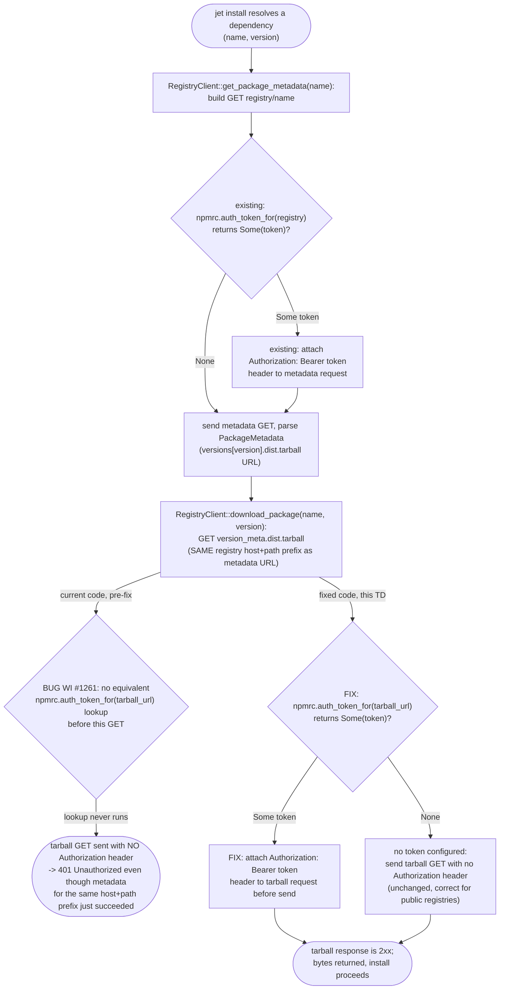

# jet install: 401 on tarball download despite valid .npmrc _authToken

## Logic
<!-- type: logic lang: mermaid -->

Scope for WI #1261 (`projects/jet/src/pkg_manager/registry.rs`): empirically re-verified against the current `app/jet` source tree (`cargo build -p jet`, then read `RegistryClient::get_package_metadata` and `RegistryClient::download_package` side by side) — `get_package_metadata` (lines 493-501) builds the metadata GET, then calls `self.npmrc.auth_token_for(registry)` and, when it returns `Some(token)`, attaches `req.header("Authorization", format!("Bearer {}", token))` before `req.send().await?`. `download_package` (lines 535-557) reuses that same cached `PackageMetadata` to read `version_meta.dist.tarball`, but then issues `self.client.get(&version_meta.dist.tarball).send().await?` directly — there is no call to `self.npmrc.auth_token_for(..)` and no `.header("Authorization", ..)` anywhere on that request builder. For a scoped registry configured GCP-Artifact-Registry style (`@scope:registry=https://host/path/`, `//host/path/:_authToken=<token>`), `version_meta.dist.tarball` is a URL under that same `host/path` prefix (confirmed by the reporter's independent curl test: 200 with `Authorization: Bearer <token>` on the exact tarball URL, 401 without), so `npmrc.auth_token_for(tarball_url)` — which matches by `registry_url.contains(pattern.trim_start_matches("//"))` — would resolve the same token used for the metadata request. This is a single missing call site, not a matching-logic defect: `auth_token_for` itself is correct and already proven against the metadata path; `download_package` simply never invokes it.

Root cause: `download_package` was written as a plain unauthenticated GET (`self.client.get(&version_meta.dist.tarball).send().await?`) with no auth-header-attachment step mirroring the one `get_package_metadata` already has, so any registry that requires `always-auth`/`_authToken` on tarball downloads (not just metadata) 401s on every tarball fetch even though the token is present and valid in `.npmrc` and jet's `NpmrcConfig::auth_token_for` already resolves it correctly for the metadata host+path.

Fix: in `download_package`, after computing `version_meta.dist.tarball`, build the tarball GET the same way `get_package_metadata` builds its request — call `self.npmrc.auth_token_for(&version_meta.dist.tarball)` and, when it returns `Some(token)`, attach `.header("Authorization", format!("Bearer {}", token))` to the request builder before `.send().await?`. No new auth-resolution logic is introduced; this reuses the exact same `auth_token_for` routine and header format the metadata path already uses, keyed off the tarball URL (which shares the registry's host+path prefix) instead of the metadata registry URL. Registries with no configured token continue to send tarball requests with no `Authorization` header, unchanged from today.

## Unit Test

```mermaid
---
id: jet-install-tarball-download-missing-auth-header-verification
requirements:
  download_package_attaches_configured_auth_token_to_tarball_request:
    id: R1
    text: "WI #1261 regression pin: given an .npmrc with a scoped registry (`@scope:registry=...`) and a matching `//host/path/:_authToken=<token>` entry (GCP Artifact Registry shape), RegistryClient::download_package must attach `Authorization: Bearer <token>` to the tarball GET request (not just the metadata GET), using wiremock mock servers for both the metadata endpoint (returns a PackageMetadata JSON body whose dist.tarball points at the mock tarball endpoint) and the tarball endpoint (asserts the Authorization header via wiremock header_exists/header matcher and returns 401 when absent, 200 with bytes when present) -- proving the exact reporter-verified curl behavior (200 with header, 401 without) now holds inside jet itself."
    kind: regression
    risk: high
    verify: cargo test -p jet --lib pkg_manager::registry::tests::download_package_attaches_configured_auth_token_to_tarball_request
  download_package_returns_tarball_bytes_on_authenticated_success:
    id: R4
    text: "Happy-path regression: once the Authorization header is attached and the mock tarball endpoint returns 200 with a known byte payload, download_package's existing response.bytes().await? handling still returns exactly those bytes unchanged (the fix only adds header attachment before send, it does not alter response handling)."
    kind: regression
    risk: low
    verify: cargo test -p jet --lib pkg_manager::registry::tests::download_package_returns_tarball_bytes_on_authenticated_success
  download_package_sends_no_auth_header_when_no_token_configured:
    id: R3
    text: "Negative control: when NpmrcConfig has no _authToken entry matching the tarball URL's host+path (public/unauthenticated registry), download_package must NOT attach an Authorization header to the tarball GET -- a wiremock tarball endpoint configured to 401 whenever an Authorization header IS present, and 200 when absent, must still return 200, proving the fix does not unconditionally attach a stale/empty header to every tarball request."
    kind: functional
    risk: medium
    verify: cargo test -p jet --lib pkg_manager::registry::tests::download_package_sends_no_auth_header_when_no_token_configured
  get_package_metadata_still_attaches_auth_token_unchanged:
    id: R2
    text: "Regression control: get_package_metadata's existing Authorization header attachment (auth_token_for(registry) -> Bearer header on the metadata GET) is unchanged by the tarball-side fix -- a wiremock metadata endpoint that requires the Authorization header still returns 200 and jet still parses PackageMetadata successfully."
    kind: regression
    risk: low
    verify: cargo test -p jet --lib pkg_manager::registry::tests::get_package_metadata_still_attaches_auth_token_unchanged
---
flowchart TD
    r1[R1 download package attaches configured auth token to tarball request] --> cargo_test_p_jet_lib_pkg_manager_registry_tests_download_package_attaches_configured_auth_token_to_tarball_request[cargo test -p jet --lib pkg_manager::registry::tests::download_package_attaches_configured_auth_token_to_tarball_request]
    r2[R2 get package metadata still attaches auth token unchanged] --> cargo_test_p_jet_lib_pkg_manager_registry_tests_get_package_metadata_still_attaches_auth_token_unchanged[cargo test -p jet --lib pkg_manager::registry::tests::get_package_metadata_still_attaches_auth_token_unchanged]
    r3[R3 download package sends no auth header when no token configured] --> cargo_test_p_jet_lib_pkg_manager_registry_tests_download_package_sends_no_auth_header_when_no_token_configured[cargo test -p jet --lib pkg_manager::registry::tests::download_package_sends_no_auth_header_when_no_token_configured]
    r4[R4 download package returns tarball bytes on authenticated success] --> cargo_test_p_jet_lib_pkg_manager_registry_tests_download_package_returns_tarball_bytes_on_authenticated_success[cargo test -p jet --lib pkg_manager::registry::tests::download_package_returns_tarball_bytes_on_authenticated_success]
```

<!-- type: unit-test lang: mermaid -->

