# jet install: 401 on tarball download despite valid .npmrc _authToken

## Logic
<!-- type: logic lang: mermaid -->

```mermaid
(fill)
```
## Unit Test

```mermaid
---
id: jet-install-tarball-download-missing-auth-header-verification
requirements:
  download_package_attaches_configured_auth_token_to_tarball_request:
    id: R1
    text: "WI #1261 regression pin: given an .npmrc with a scoped registry (`@scope:registry=...`) and a matching `//host/path/:_authToken=<token>` entry (GCP Artifact Registry shape), RegistryClient::download_package must attach `Authorization: Bearer <token>` to the tarball GET request (not just the metadata GET), using wiremock mock servers for both the metadata endpoint (returns a PackageMetadata JSON body whose dist.tarball points at the mock tarball endpoint) and the tarball endpoint (asserts the Authorization header via wiremock header_exists/header matcher and returns 401 when absent, 200 with bytes when present) -- proving the exact reporter-verified curl behavior (200 with header, 401 without) now holds inside jet itself."
    kind: regression
    risk: high
    verify: cargo test -p jet --lib pkg_manager::registry::tests::download_package_attaches_configured_auth_token_to_tarball_request
  download_package_returns_tarball_bytes_on_authenticated_success:
    id: R4
    text: "Happy-path regression: once the Authorization header is attached and the mock tarball endpoint returns 200 with a known byte payload, download_package's existing response.bytes().await? handling still returns exactly those bytes unchanged (the fix only adds header attachment before send, it does not alter response handling)."
    kind: regression
    risk: low
    verify: cargo test -p jet --lib pkg_manager::registry::tests::download_package_returns_tarball_bytes_on_authenticated_success
  download_package_sends_no_auth_header_when_no_token_configured:
    id: R3
    text: "Negative control: when NpmrcConfig has no _authToken entry matching the tarball URL's host+path (public/unauthenticated registry), download_package must NOT attach an Authorization header to the tarball GET -- a wiremock tarball endpoint configured to 401 whenever an Authorization header IS present, and 200 when absent, must still return 200, proving the fix does not unconditionally attach a stale/empty header to every tarball request."
    kind: functional
    risk: medium
    verify: cargo test -p jet --lib pkg_manager::registry::tests::download_package_sends_no_auth_header_when_no_token_configured
  get_package_metadata_still_attaches_auth_token_unchanged:
    id: R2
    text: "Regression control: get_package_metadata's existing Authorization header attachment (auth_token_for(registry) -> Bearer header on the metadata GET) is unchanged by the tarball-side fix -- a wiremock metadata endpoint that requires the Authorization header still returns 200 and jet still parses PackageMetadata successfully."
    kind: regression
    risk: low
    verify: cargo test -p jet --lib pkg_manager::registry::tests::get_package_metadata_still_attaches_auth_token_unchanged
---
flowchart TD
    r1[R1 download package attaches configured auth token to tarball request] --> cargo_test_p_jet_lib_pkg_manager_registry_tests_download_package_attaches_configured_auth_token_to_tarball_request[cargo test -p jet --lib pkg_manager::registry::tests::download_package_attaches_configured_auth_token_to_tarball_request]
    r2[R2 get package metadata still attaches auth token unchanged] --> cargo_test_p_jet_lib_pkg_manager_registry_tests_get_package_metadata_still_attaches_auth_token_unchanged[cargo test -p jet --lib pkg_manager::registry::tests::get_package_metadata_still_attaches_auth_token_unchanged]
    r3[R3 download package sends no auth header when no token configured] --> cargo_test_p_jet_lib_pkg_manager_registry_tests_download_package_sends_no_auth_header_when_no_token_configured[cargo test -p jet --lib pkg_manager::registry::tests::download_package_sends_no_auth_header_when_no_token_configured]
    r4[R4 download package returns tarball bytes on authenticated success] --> cargo_test_p_jet_lib_pkg_manager_registry_tests_download_package_returns_tarball_bytes_on_authenticated_success[cargo test -p jet --lib pkg_manager::registry::tests::download_package_returns_tarball_bytes_on_authenticated_success]
```

<!-- type: unit-test lang: mermaid -->



## Changes
<!-- type: changes lang: yaml -->

```yaml
changes:
  - path: projects/jet/src/pkg_manager/registry.rs
    action: update
    section: logic
    impl_mode: hand-written
    reason: "Empirically confirmed on the current app/jet source tree (cargo build -p jet; read RegistryClient::get_package_metadata and RegistryClient::download_package side by side in projects/jet/src/pkg_manager/registry.rs) that get_package_metadata (lines 493-501) calls self.npmrc.auth_token_for(registry) and attaches an Authorization: Bearer <token> header before send, but download_package (lines 535-557) issues self.client.get(&version_meta.dist.tarball).send().await? with no equivalent auth_token_for lookup or header attachment, so scoped-registry (GCP Artifact Registry style) tarball downloads 401 even though the metadata fetch for the same host+path prefix succeeds (WI #1261). Fix: in download_package, after resolving version_meta.dist.tarball, call self.npmrc.auth_token_for(&version_meta.dist.tarball) and, when it returns Some(token), attach .header(\"Authorization\", format!(\"Bearer {}\", token)) to the request builder before .send().await?, mirroring the existing metadata-path shape exactly. No change to auth_token_for's matching logic (already proven correct for the metadata path) or to response handling."
  - path: projects/jet/src/pkg_manager/registry.rs
    action: update
    section: unit-test
    impl_mode: hand-written
    reason: "Add the R1-R4 regression tests specified in the unit-test section to the existing `mod tests` block in projects/jet/src/pkg_manager/registry.rs, using wiremock::MockServer to stand up local metadata + tarball endpoints: R1 pins the WI #1261 fix (tarball request now carries the configured Authorization header); R2 is a regression control proving the pre-existing metadata-path header attachment is untouched; R3 is a negative control proving no Authorization header is sent when no token is configured (no unconditional/blank header regression); R4 is a happy-path regression control proving response byte handling is unchanged by the added header-attachment step."
  - path: projects/jet/Cargo.toml
    action: update
    section: unit-test
    impl_mode: hand-written
    reason: "The R1-R4 wiremock-based tests need `wiremock` as a dev-dependency of the jet crate; it is already declared in the workspace root Cargo.toml's [workspace.dependencies] (used by other projects) but is not yet pulled into projects/jet/Cargo.toml's [dev-dependencies]. Add `wiremock = { workspace = true }` there so `cargo test -p jet --lib pkg_manager::registry` can build the new tests."
```
