# jet --lib --dts isolatedDeclarations: arrow function body returning a typed object literal

## Logic

```mermaid
---
id: jet-dts-arrow-body-return-object-inference
entry: declarator_value
nodes:
  declarator_value:      { kind: start,    label: "const declarator value\n(no explicit type annotation)" }
  as_or_satisfies:       { kind: decision, label: "annotated_expression_type:\nas_expression / satisfies_expression?" }
  emit_asserted_type:    { kind: terminal, label: "emit asserted type verbatim\n(existing #937 path, unchanged)" }
  is_arrow_with_own_ret: { kind: decision, label: "infer_arrow_function_type:\narrow_function with its own\nexplicit return_type field?" }
  emit_arrow_signature:  { kind: terminal, label: "emit (params) => <declared return type>\n(existing path, unchanged)" }
  is_arrow_block_body:   { kind: decision, label: "NEW infer_arrow_body_return_object_type:\narrow_function, no return_type field,\nbody is a statement_block?" }
  is_single_return_obj:  { kind: decision, label: "block body is exactly ONE statement,\nthat statement is a return_statement,\nand the returned expression is an\nobject literal (kind == object)?" }
  infer_object_members:  { kind: process,  label: "infer_object_literal_type(returned, source):\nreuse existing member-by-member inference\n(typed arrow/method properties, literals)\n-- same routine object-literal-const path uses" }
  members_all_typed:     { kind: decision, label: "every member resolved\nto a concrete type?" }
  emit_inferred_arrow:   { kind: terminal, label: "emit (params) => { member: Type; ... }\nbody dropped, only the signature is ambient" }
  fallback_object_paths: { kind: process,  label: "existing fallback chain unchanged:\ninfer_object_literal_type(value) /\ninfer_single_arrow_property_object_literal_type(value)\n(covers const = {...} shapes, not arrow bodies)" }
  isolated_decl_error:   { kind: terminal, label: "isolatedDeclarations error\n(DtsDiagnostic, fail-loud)" }
edges:
  - { from: declarator_value,      to: as_or_satisfies }
  - { from: as_or_satisfies,       to: emit_asserted_type,    label: "yes" }
  - { from: as_or_satisfies,       to: is_arrow_with_own_ret, label: "no" }
  - { from: is_arrow_with_own_ret, to: emit_arrow_signature,  label: "yes" }
  - { from: is_arrow_with_own_ret, to: is_arrow_block_body,   label: "no" }
  - { from: is_arrow_block_body,   to: is_single_return_obj,  label: "yes" }
  - { from: is_arrow_block_body,   to: fallback_object_paths, label: "no (concise body,\nnot arrow_function, etc.)" }
  - { from: is_single_return_obj,  to: infer_object_members,  label: "yes" }
  - { from: is_single_return_obj,  to: fallback_object_paths, label: "no (multi-statement,\ncontrol flow, non-object return)" }
  - { from: infer_object_members,  to: members_all_typed }
  - { from: members_all_typed,     to: emit_inferred_arrow,   label: "yes" }
  - { from: members_all_typed,     to: isolated_decl_error,   label: "no" }
  - { from: fallback_object_paths, to: isolated_decl_error,   label: "no match either" }
---
flowchart TD
    declarator_value(["const declarator value\n(no explicit type annotation)"]) --> as_or_satisfies{"annotated_expression_type:\nas_expression / satisfies_expression?"}
    as_or_satisfies -->|yes| emit_asserted_type(["emit asserted type verbatim\n(existing #937 path, unchanged)"])
    as_or_satisfies -->|no| is_arrow_with_own_ret{"infer_arrow_function_type:\narrow_function with its own\nexplicit return_type field?"}
    is_arrow_with_own_ret -->|yes| emit_arrow_signature(["emit (params) => declared return type\n(existing path, unchanged)"])
    is_arrow_with_own_ret -->|no| is_arrow_block_body{"NEW infer_arrow_body_return_object_type:\narrow_function, no return_type field,\nbody is a statement_block?"}
    is_arrow_block_body -->|yes| is_single_return_obj{"block body is exactly ONE statement,\nthat statement is a return_statement,\nand the returned expression is an\nobject literal (kind == object)?"}
    is_arrow_block_body -->|no, concise body etc.| fallback_object_paths["existing fallback chain unchanged:\ninfer_object_literal_type(value) /\ninfer_single_arrow_property_object_literal_type(value)"]
    is_single_return_obj -->|yes| infer_object_members["infer_object_literal_type(returned, source):\nreuse existing member-by-member inference"]
    is_single_return_obj -->|no| fallback_object_paths
    infer_object_members --> members_all_typed{"every member resolved\nto a concrete type?"}
    members_all_typed -->|yes| emit_inferred_arrow(["emit (params) => { member: Type; ... }\nbody dropped, only signature is ambient"])
    members_all_typed -->|no| isolated_decl_error(["isolatedDeclarations error\n(DtsDiagnostic, fail-loud)"])
    fallback_object_paths -->|no match either| isolated_decl_error
```

<!-- type: logic lang: mermaid -->



Scope for WI #1264 (`projects/jet/src/bundler/dts.rs`): empirically re-verified against the issue's exact minimal repro on the current `app/jet` source tree — `cargo build -p jet --bin jet` then `jet build --lib --format esm --dts` against a standalone `export const funcReturningTypedObject = (a: string, b: number = 1) => { return { fromOutsource: (x: string): Promise<string> => Promise.resolve(x), toOutsource: (y?: string): string => y ?? a, }; };` still fails with `isolatedDeclarations error — exported \`const funcReturningTypedObject\` lacks an explicit type annotation`, so this is a real analyzer gap, not an already-implemented case pinned only by tests (contrast WI #937, which turned out to be already-implemented and closed as tests-only).

Root cause: `infer_variable_declarator_type` (the entry point for inferring an untyped `const` initializer's declared type) tries, in order, `annotated_expression_type` (the `#937` `as`/`satisfies` path), `infer_arrow_function_type` (requires the arrow to carry its own explicit `return_type` field — the already-fixed #799 case), then `infer_object_literal_type` / `infer_single_arrow_property_object_literal_type` directly on the declarator's `value` node. When `value` is an `arrow_function` whose body is a `statement_block` (i.e. uses `{ return ...; }` rather than a concise `=> expr` body), none of those three fallbacks ever look *inside* the arrow's body — `infer_object_literal_type`/`infer_single_arrow_property_object_literal_type` both early-return `None` because `value.kind() == "arrow_function"`, not `"object"`. The returned object literal's own already-typed members are therefore never reached, and the declarator falls through to the fail-loud isolatedDeclarations diagnostic even though every property inside the returned object literal carries an explicit type (`tsc --isolatedDeclarations` accepts this shape and infers the return type from the returned literal).

Fix: add `infer_arrow_body_return_object_type`, tried immediately after `infer_arrow_function_type` fails and before the direct object-literal fallbacks. It only fires for the narrow shape the issue names — arrow function, no explicit `return_type` field, `statement_block` body containing *exactly one* statement that is a `return_statement` whose returned expression is an `object` node — and then delegates member typing to the existing `infer_object_literal_type(returned_object, source)` routine (the same routine `const x = { ... }` initializers already use), so no new member-typing logic is introduced. Any other body shape (multiple statements, conditionals, loops, a non-object return expression, or an untyped/partially-typed object literal) still falls through unchanged to the existing fail-loud `isolatedDeclarations error` diagnostic — this keeps the fix scoped to exactly the shape in the issue and its real-world `fe-shared` `srcHelper` hit, and does not intersect the sibling false-positive variants tracked separately in #1263 (nested object literals returned from deeper call chains), #1238 (`Object.assign` + computed-key body shapes), and #1262 (property truncation after an `Object.assign` spread) — none of those shapes are a single bare `return { ... }` of a directly-typed object literal, so this logic path leaves their still-open false positives unchanged. Also distinct from the already-fixed #799/#865 case where the object literal is the const's *own* initializer (not returned from inside a function body) and the already-fixed #937 case where the returned/initializer expression carries an explicit `as`/`satisfies` cast.

## Unit Test

```mermaid
---
id: jet-dts-arrow-body-return-object-inference-verification
requirements:
  arrow_body_return_partially_typed_object_literal_still_errors:
    id: R2
    text: "Negative control: the same single-return-of-object-literal arrow body shape as R1, but one property's arrow value has no explicit return type (e.g. `toOutsource: (y?: string) => y ?? a` instead of `(y?: string): string => y ?? a`), must still raise an isolatedDeclarations error, proving the new inference path only fires when every returned-object member is itself locally inferable and does not silently widen to genuinely untyped members."
    kind: regression
    risk: high
    verify: cargo test -p jet --lib bundler::dts::tests::uninferrable_exported_const_arrow_body_return_partially_typed_object_literal_errors
  arrow_body_single_return_typed_object_literal:
    id: R1
    text: "WI #1264 minimal repro: an exported const arrow function with no explicit return type, whose body is exactly one `return` of an object literal whose own properties all carry explicit types (`export const funcReturningTypedObject = (a: string, b: number = 1) => { return { fromOutsource: (x: string): Promise<string> => Promise.resolve(x), toOutsource: (y?: string): string => y ?? a, }; };`), emits `export declare const funcReturningTypedObject: (a: string, b?: number) => { fromOutsource: (x: string) => Promise<string>; toOutsource: (y?: string) => string; };` instead of an isolatedDeclarations error."
    kind: functional
    risk: medium
    verify: cargo test -p jet --lib bundler::dts::tests::infers_exported_const_arrow_body_single_return_typed_object_literal_signature
  arrow_concise_body_without_return_type_still_errors:
    id: R4
    text: "No-regression control on the existing sibling case: an exported const arrow function with a concise (non-block) body and no explicit return type (`export const delay = (ms: number) => Promise.resolve();`) must remain fail-loud with an isolatedDeclarations error — this pre-existing test must keep passing unchanged after the new `statement_block`-only inference path is added, proving the fix does not touch the concise-body code path."
    kind: regression
    risk: low
    verify: cargo test -p jet --lib bundler::dts::tests::exported_const_arrow_without_return_type_errors
  arrow_multi_statement_body_return_object_literal_still_errors:
    id: R3
    text: "Negative control: an exported const arrow function with no explicit return type whose body has more than one statement before returning a fully-typed object literal (e.g. a local variable assignment followed by `return { ... };`) must still raise an isolatedDeclarations error, proving the new inference is scoped to a body that is exactly one `return` statement and does not broaden to 'eventually returns an object literal'."
    kind: regression
    risk: high
    verify: cargo test -p jet --lib bundler::dts::tests::uninferrable_exported_const_arrow_multi_statement_body_return_object_literal_errors
---
flowchart TD
    r1[R1 arrow body single return typed object literal] --> cargo_test_p_jet_lib_bundler_dts_tests_infers_exported_const_arrow_body_single_return_typed_object_literal_signature[cargo test -p jet --lib bundler::dts::tests::infers_exported_const_arrow_body_single_return_typed_object_literal_signature]
    r2[R2 arrow body return partially typed object literal still errors] --> cargo_test_p_jet_lib_bundler_dts_tests_uninferrable_exported_const_arrow_body_return_partially_typed_object_literal_errors[cargo test -p jet --lib bundler::dts::tests::uninferrable_exported_const_arrow_body_return_partially_typed_object_literal_errors]
    r3[R3 arrow multi statement body return object literal still errors] --> cargo_test_p_jet_lib_bundler_dts_tests_uninferrable_exported_const_arrow_multi_statement_body_return_object_literal_errors[cargo test -p jet --lib bundler::dts::tests::uninferrable_exported_const_arrow_multi_statement_body_return_object_literal_errors]
    r4[R4 arrow concise body without return type still errors] --> cargo_test_p_jet_lib_bundler_dts_tests_exported_const_arrow_without_return_type_errors[cargo test -p jet --lib bundler::dts::tests::exported_const_arrow_without_return_type_errors]
```

<!-- type: unit-test lang: mermaid -->



## Changes
<!-- type: changes lang: yaml -->

```yaml
changes:
  - path: projects/jet/src/bundler/dts.rs
    action: update
    section: logic
    impl_mode: hand-written
    reason: "Empirically re-verified against WI #1264's exact minimal repro (`jet build --lib --format esm --dts` on a standalone `export const funcReturningTypedObject = (a: string, b: number = 1) => { return { fromOutsource: (x: string): Promise<string> => Promise.resolve(x), toOutsource: (y?: string): string => y ?? a, }; };`) still fails on the current source tree, so this is a genuine analyzer gap (not an already-implemented case pinned only by tests, contrast WI #937). Add `infer_arrow_body_return_object_type` and wire it into `infer_variable_declarator_type` immediately after `infer_arrow_function_type`: for an arrow function value with no explicit `return_type` field whose body is a `statement_block` containing exactly one `return_statement` of an `object` node, delegate member typing to the existing `infer_object_literal_type` routine and emit `(params) => { member: Type; ... }`; any other body shape keeps falling through unchanged to the existing fail-loud isolatedDeclarations diagnostic. Scoped to the shape named in the issue only; does not intersect #1263 (nested object literals), #1238 (Object.assign+computed-key), or #1262 (property truncation after Object.assign spread)."
  - path: projects/jet/src/bundler/dts.rs
    action: update
    section: unit-test
    impl_mode: hand-written
    reason: "Add the R1-R4 regression tests specified in the unit-test section to the existing `mod tests` block: R1 pins the WI #1264 minimal-repro positive case; R2 and R3 are negative controls proving the new inference path stays scoped to a single-statement return-of-a-fully-typed-object-literal body; R4 re-asserts the pre-existing concise-body negative test is untouched by the new statement_block-only path."
```
