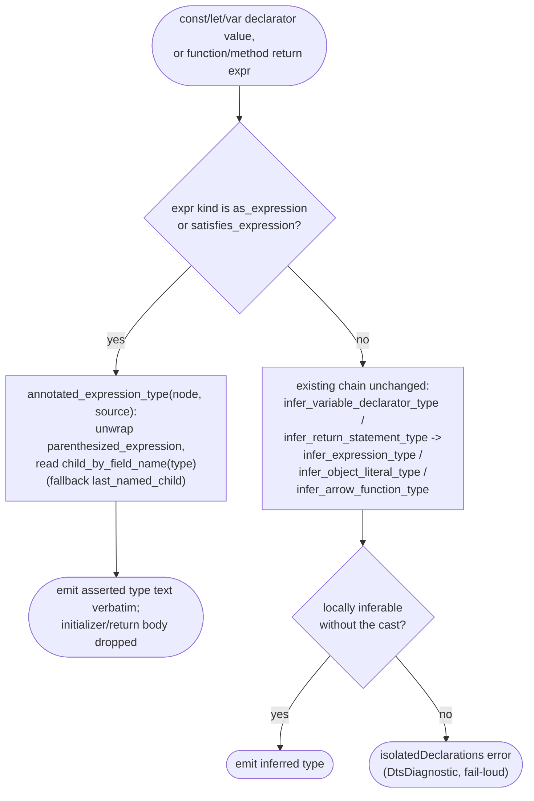

# jet --lib --dts isolatedDeclarations: `expr as Type` explicit-annotation inference

## Logic
<!-- type: logic lang: mermaid -->

Scope for WI #937 (`projects/jet/src/bundler/dts.rs`): `annotated_expression_type` already recognizes `as_expression` / `satisfies_expression` nodes and returns the asserted type's source text regardless of the wrapped expression's shape (object literal, identifier, call expression, generic function type). It is wired into both call sites the WI's acceptance criteria name — `infer_variable_declarator_type` (const/let/var initializer position, tried before arrow-function / object-literal inference) and `infer_return_statement_type` (function/method return position, tried per `return_statement` before the text-based `infer_expression_type` fallback, so a local-variable-then-`return x as Type` shape resolves through the cast, not the variable). Verified end-to-end: `jet build --lib --format esm --dts` against the WI's exact minimal repro (`asCastConst`, `asCastReturn`) and its three cited real-code shapes (`useRouterConfig`'s local-var-then-cast return, `SpAlert`'s identifier cast, `SpTable`'s generic function-type cast) all emit correctly-typed `.d.ts` output with 0 isolatedDeclarations errors on the current source tree.

This closes the `expr as Type` false-positive family without intersecting the sibling variants tracked separately in #1238 (Object.assign+computed-key body), #1263 (nested object literals), and #1264 (arrow function without explicit return type returning a typed object literal) — none of those source shapes pass through an `as_expression`/`satisfies_expression` node, so this logic path leaves their still-open false positives unchanged.

The `unit-test` section pins deterministic regression coverage for both positions plus a negative case: prior tests exercised an `as`-cast on an object-literal-with-async-method const shape and a local-object-then-cast function return, but none pinned the WI's exact plain-object-literal `{ a: 1 } as Foo` const-initializer shape, and no test pairs the two `as`-cast regressions with an explicit negative case proving a genuinely untyped/uninferrable expression (no `as`/`satisfies` wrapper, no explicit annotation) still fails loud once this inference path exists.
