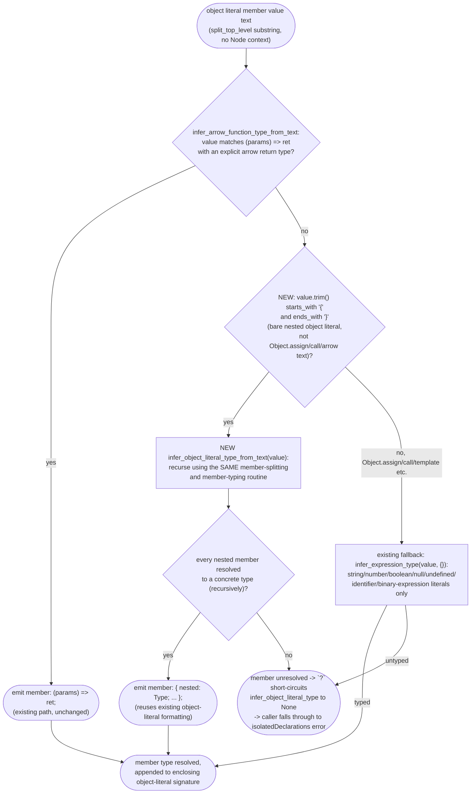

# jet --lib --dts isolatedDeclarations: nested plain-literal object literal member inference

## Logic
<!-- type: logic lang: mermaid -->

Scope for WI #1263 (`projects/jet/src/bundler/dts.rs`): empirically re-verified against the issue's exact minimal repro on the current `app/jet` source tree (post-#1264, commit `75cb5e5ca`, 38 passing `bundler::dts` unit tests) -- `cargo build -p jet --bin jet` then `jet build --lib --format esm --dts` against a standalone `export const flatLiteral = { ltr: 'ltr', rtl: 'rtl' }; export const nestedLiteral = { ltr: 'ltr', heading: { h1: 'editor-heading--h1' } };` still fails with `isolatedDeclarations error — exported \`const nestedLiteral\` lacks an explicit type annotation`, confirming this is a real, still-open analyzer gap (not an already-implemented case pinned only by tests, contrast WI #937). `flatLiteral` (depth 1) passes today because #796 already wired flat plain-literal member typing through `infer_object_literal_type`; only nesting depth >= 2 reproduces.

Root cause: `infer_object_literal_type` (the routine used for both a `const`'s own object-literal initializer and, since #1264, an arrow function's single-statement `return { ... }` body) resolves each member's value type via `infer_arrow_function_type_from_text(value).or_else(|| infer_expression_type(value, &empty_param_types))?` (dts.rs, member loop). `infer_expression_type` operates purely on trimmed text and only recognizes string/number/boolean/`null`/`undefined`/bare-identifier/binary-expression literals -- it never inspects whether `value` is itself a bare `{ ... }` object-literal substring, so it always returns `None` for a nested-object-valued member. Neither of the two member-typing calls ever recurses, so a member whose value is `{ h1: 'editor-heading--h1' }` fails to type, the `?` on that failed `Option` short-circuits the whole `for raw_property in split_top_level(...)` loop, and `infer_object_literal_type` returns `None` for the ENTIRE outer object literal -- not just the nested member. This exactly matches the empirical observation: `nestedLiteral` is rejected wholesale (a single isolatedDeclarations error naming the whole `const`), not silently missing one field. This is a distinct mechanism from #1262 (still open): #1262's silent truncation comes from `Object.assign({}, ...arr.map(cb))`-shaped values already text-matching a *different* branch and a bracket-depth/`split_top_level` interaction with call-expression argument lists, whereas #1263's bare `{ ... }`-valued members never text-match any existing branch at all and cause total rejection, not truncation. This TD stays scoped to plain nested object-literal member values only and does not touch the `Object.assign`/computed-key code paths #1238 and #1262 exercise.

Fix: because `infer_object_literal_type`'s member-splitting and member-typing logic already operates purely on the `text` derived from `node_text(node, source)` (the `node.kind() != "object"` check and `node_text` call are the only two places the function actually needs a tree-sitter `Node` -- everything after that is plain `&str` manipulation via `split_top_level`/`split_once_top_level`), factor the body of `infer_object_literal_type` (from the `strip_prefix('{')`/`strip_suffix('}')` step through the final `members`-join) out into a new `infer_object_literal_type_from_text(text: &str) -> Option<String>` that takes only the already-stripped `{ ... }` text and needs no `Node` at all. `infer_object_literal_type(node, source)` becomes a thin Node-to-text adapter that calls it. In the member-value-typing chain, add a new branch tried after the existing arrow-type-from-text check and before the `infer_expression_type` fallback: if `value.trim()` starts with `'{'` and ends with `'}'`, call `infer_object_literal_type_from_text(value.trim())` recursively (recursion terminates because each nested `{ ... }` substring is strictly shorter than its parent); on `Some(nested_type)`, emit `{key}: {nested_type};` using the same member-formatting the top-level path already uses. Any value text that does not text-match a bare `{ ... }` object literal (e.g. `Object.assign(...)`, other call expressions, template literals) falls through unchanged to the existing `infer_expression_type` fallback, leaving #1238/#1262's still-open false positives untouched. Nesting depth is unbounded by construction (the recursion has no depth cap), matching the real-world `fe-shared` `lexicalTheme` repro's 3+ levels.
