# jet --lib --dts isolatedDeclarations: Object.assign+computed-key arrow-property inference

## Logic
<!-- type: logic lang: mermaid -->

```mermaid
---
id: jet-dts-object-assign-computed-key-arrow-property-inference
entry: member_value
nodes:
  member_value:          { kind: start,    label: "object literal member value text\n(split_top_level substring, e.g.\nparse: (search: string): Record<string,\nstring> => Object.assign({}, ...))" }
  is_arrow_typed_value:  { kind: decision, label: "infer_arrow_function_type_from_text:\nvalue matches (params) => ret\nwith an explicit arrow return type?\n(body text after => is NEVER inspected)" }
  emit_arrow_member_type: { kind: terminal, label: "emit member: (params) => ret;\nObject.assign(...) call body dropped,\nonly the arrow's own head is ambient" }
  outer_comma_split:     { kind: process,  label: "split_top_level(inner, ',')\nsplits the OUTER object literal's\nmembers at bracket-depth 0" }
  depth_tracks_arrow_ret: { kind: decision, label: "FIXED (#1264, split_top_level /\nsplit_once_top_level): '>' immediately\nafter '=' (the arrow token's own '>')\nis skipped, not treated as a\ngeneric-close that decrements depth?" }
  correct_member_boundary: { kind: terminal, label: "member boundary lands exactly at the\nproperty-separating top-level comma;\nObject.assign(...)'s own internal\ncommas/parens/brackets stay nested\nand never split the outer list" }
  corrupted_depth:       { kind: process,   label: "PRE-#1264 (jet <=0.4.15 and the\nintermediate 0.4.16-bundle state):\nthe arrow's trailing '>' wrongly\ndecrements depth to -1; Object.assign's\nown '(' incidentally rebalances it back\nto 0, so Object.assign's internal\ntop-level commas are misread as\nouter property separators" }
  single_property_shape: { kind: decision,  label: "object literal has exactly ONE\nproperty (whole-object fallback\ninfer_single_arrow_property_object_literal_type\napplies, added in the 0.4.16 bundle)?" }
  loud_reject_0415:      { kind: terminal,  label: "jet 0.4.15: bogus split fragment\nstarts with '...' (the spread operator) ->\nproperty.starts_with(\"...\") guard fires ->\nisolatedDeclarations error on the WHOLE\nconst (matches WI #1238's original filed report)" }
  silent_truncate_0416:  { kind: terminal,  label: "0.4.16-bundle, multi-property: corrupted\ndepth causes a later sibling member\n(e.g. stringify) to be swallowed into the\nObject.assign-bodied member's split fragment\nand silently dropped from the emitted .d.ts\n(matches the #1238 second-comment symptom\nfiled separately as WI #1262)" }
  isolated_decl_error:   { kind: terminal,  label: "isolatedDeclarations error\n(DtsDiagnostic, fail-loud)" }
edges:
  - { from: member_value,           to: is_arrow_typed_value }
  - { from: is_arrow_typed_value,   to: emit_arrow_member_type, label: "yes (explicit\narrow return type present)" }
  - { from: is_arrow_typed_value,   to: isolated_decl_error,    label: "no (no explicit\narrow return type)" }
  - { from: emit_arrow_member_type, to: outer_comma_split }
  - { from: outer_comma_split,      to: depth_tracks_arrow_ret }
  - { from: depth_tracks_arrow_ret, to: correct_member_boundary, label: "yes (current\napp/jet HEAD, post #1264/#1263)" }
  - { from: depth_tracks_arrow_ret, to: corrupted_depth,         label: "no (pre-#1264)" }
  - { from: corrupted_depth,        to: single_property_shape }
  - { from: single_property_shape,  to: loud_reject_0415,        label: "yes, and no\nsingle-arrow-property\nfallback yet (0.4.15)" }
  - { from: single_property_shape,  to: silent_truncate_0416,    label: "no (2+ properties;\n0.4.16-bundle fallback\ndoes not apply)" }
id_note: single-property 0.4.16-bundle case is resolved by the NEW infer_single_arrow_property_object_literal_type fallback (bypasses split_top_level entirely), which is why it stopped erroring before #1264 landed while the multi-property case kept truncating
---
flowchart TD
    member_value(["object literal member value text\n(split_top_level substring, e.g.\nparse: (search: string): Record<string,\nstring> => Object.assign({}, ...))"]) --> is_arrow_typed_value{"infer_arrow_function_type_from_text:\nvalue matches (params) => ret\nwith an explicit arrow return type?\n(body text after => is NEVER inspected)"}
    is_arrow_typed_value -->|yes, explicit arrow return type present| emit_arrow_member_type["emit member: (params) => ret;\nObject.assign(...) call body dropped,\nonly the arrow's own head is ambient"]
    is_arrow_typed_value -->|no, no explicit arrow return type| isolated_decl_error(["isolatedDeclarations error\n(DtsDiagnostic, fail-loud)"])
    emit_arrow_member_type --> outer_comma_split["split_top_level(inner, ','):\nsplits the OUTER object literal's\nmembers at bracket-depth 0"]
    outer_comma_split --> depth_tracks_arrow_ret{"FIXED (#1264): '>' immediately after '='\n(the arrow token's own '>') is skipped,\nnot treated as a generic-close that\ndecrements depth?"}
    depth_tracks_arrow_ret -->|yes, current app/jet HEAD post #1264/#1263| correct_member_boundary(["member boundary lands exactly at the\nproperty-separating top-level comma;\nObject.assign(...)'s own internal\ncommas/parens/brackets stay nested"])
    depth_tracks_arrow_ret -->|no, pre-#1264| corrupted_depth["PRE-#1264: arrow's trailing '>' wrongly\ndecrements depth to -1; Object.assign's\nown '(' rebalances it back to 0, so its\ninternal top-level commas are misread\nas outer property separators"]
    corrupted_depth --> single_property_shape{"object literal has exactly ONE property\n(whole-object fallback\ninfer_single_arrow_property_object_literal_type\napplies, added in the 0.4.16 bundle)?"}
    single_property_shape -->|yes, and no single-arrow-property\nfallback yet (0.4.15)| loud_reject_0415(["jet 0.4.15: bogus split fragment starts\nwith '...' -> property.starts_with(\"...\")\nguard fires -> isolatedDeclarations error\non the WHOLE const (WI #1238 original report)"])
    single_property_shape -->|no, 2+ properties; 0.4.16-bundle\nfallback does not apply| silent_truncate_0416(["0.4.16-bundle, multi-property: a later\nsibling member (e.g. stringify) is swallowed\nand silently dropped from the emitted .d.ts\n(WI #1238 second-comment symptom, filed\nseparately as WI #1262)"])
```

Scope for WI #1238 (`projects/jet/src/bundler/dts.rs`): empirically re-verified against the issue's exact minimal repro (the `_Query.parse` shape: a single-property `const` whose sole property is an arrow function with its own explicit return type, `Object.assign({}, ...chain.of.calls.map((pair) => { ...; return { [computed]: value }; }))` as the concise body) against three points on the commit history:

1. `jet@0.4.15` tag (the version cited in the issue as reproducing): `cargo test -p jet --lib` with the issue's exact source **fails** with `isolatedDeclarations error — exported \`const _Query\` lacks an explicit type annotation` — matches the issue verbatim.
2. `75cb5e5ca~1` (the 0.4.16 release-bundle state cited in the issue's second comment, before WI #1264/#1263 landed): the single-property exact repro now **passes** (a new `infer_single_arrow_property_object_literal_type` fallback landed in the 0.4.16 bundle and sidesteps the broken multi-member comma-splitting entirely for single-property objects), but a **2-property** variant of the same shape (`parse` using `Object.assign`+computed-key, followed by a sibling `stringify` property) **silently truncates** — the emitted `.d.ts` contains only `parse`, silently dropping `stringify`, with **no error at all**. This is a real, reproduced instance of the failure mode the issue's second comment describes and that was filed separately as WI #1262.
3. Current `app/jet` HEAD (post WI #1264 commit `75cb5e5ca` and WI #1263 commit `d9ac6afea`): both the exact single-property repro AND the 2-property variant **pass cleanly** with correct, complete `.d.ts` output for every property — confirmed via `cargo test -p jet --lib bundler::dts` (41 passing tests) plus ad hoc probes reproducing the issue's exact source and the second comment's real-code shape (`Object.entries(...).map(([key, value]) => {...})` destructured-pair variant).

Root cause (why it is fixed now, without any change to the Object.assign-handling logic itself): the member value `parse: (search: string): Record<string, string> => Object.assign(...)` was ALREADY resolvable via the pre-existing `infer_arrow_function_type_from_text` routine, which only inspects the arrow's own head (`(params): ReturnType =>`) via `split_once_top_level_arrow`/`split_arrow_head_params_and_return` and never looks at what follows the `=>` at all — so an `Object.assign(...)`-shaped body was never actually the obstacle for THIS member in isolation. The real defect lived one level up, in `split_top_level(inner, ',')` (used by `infer_object_literal_type`/`infer_object_literal_type_from_text` to split the OUTER object literal into its comma-separated members): before WI #1264, this function treated every `>` character as closing a generic bracket and decrementing depth, including the trailing `>` of the member's own `=>` arrow token — even though that `>` has no corresponding unmatched `<` (the member's `Record<string, string>` had already closed its own `<`/`>` pair cleanly). This spurious decrement pushes the running depth to -1 immediately after the arrow token; `Object.assign(`'s own opening `(` then incidentally rebalances the counter back to depth 0, so `Object.assign`'s OWN internal top-level argument commas are misread as top-level OUTER property-separator commas. Depending on how many properties follow and exactly where the corrupted depth counter lands relative to the rest of the text, this produced either total rejection (0.4.15, single property, a bogus split fragment beginning with `...` trips the existing `property.starts_with("...")` hard-bail guard) or silent truncation of later sibling properties (0.4.16-bundle, 2+ properties, a later property gets swallowed into an earlier split fragment and its `key: type` pair is never separately emitted).

WI #1264 (commit `75cb5e5ca`) fixed `split_top_level` and `split_once_top_level` to special-case the arrow token: `'>' if prev == '='` is now skipped rather than decrementing depth, so a member's own explicit arrow return type (however generic) never corrupts the outer comma-splitting depth counter. This fix was authored to close WI #1264's own arrow-body-return-object shape and its own TD explicitly (and, per this empirical re-verification, incompletely) disclaimed any effect on WI #1238/#1262 — but because `split_top_level` is the single shared routine every object-literal member-splitting call site uses, the fix transitively closed WI #1238's Object.assign+computed-key arrow-property false positive (both the original loud-rejection symptom and the intermediate silent-truncation symptom) as a side effect, without any change to Object.assign-specific logic. This matches the established WI #937 pattern in this TD family: an already-implemented fix, closed with regression-locking tests rather than a new logic change.

This TD stays scoped to the arrow-property form of the Object.assign+computed-key shape (`key: (params): ReturnType => Object.assign(...)`), which is textually and structurally distinct from the METHOD-SHORTHAND form (`key(params): ReturnType { return Object.assign(...); }`) already pinned by the pre-existing `infers_object_literal_method_with_object_assign_computed_key_body` test (added for WI #1263/#1262 investigation) — both forms now pass, through different code paths (`infer_arrow_function_type_from_text` for the arrow-property form vs. `infer_object_method_member_type`'s pure-text signature match for the method-shorthand form), and this TD adds coverage only for the arrow-property form the issue's exact repro uses.

Entanglement with WI #1262 (still open): the empirical finding above — that the SAME shared `split_top_level` bracket-depth defect manifested as silent property truncation for a multi-property object at an intermediate commit — is direct evidence the two issues share a code path. However, on current `app/jet` HEAD, the moderate multi-property (2-property) reproductions of this entanglement no longer truncate; WI #1262's real-world 11-method trigger is not reproduced by this TD's probes and remains a distinct, still-open investigation. This TD adds one non-regression requirement (R2, below) pinning that a multi-property object literal with an `Object.assign`+computed-key-bodied arrow property followed by a sibling property does NOT truncate, to guard the shared `split_top_level` code path against regressing back to either failure mode without claiming WI #1262's full real-world shape is covered.
## Unit Test

```mermaid
---
id: jet-dts-object-assign-computed-key-arrow-property-inference-verification
requirements:
  object_assign_computed_key_arrow_property_chained_calls_minimal_repro:
    id: R1
    text: "WI #1238 minimal repro: an exported const object literal with a single arrow-function property carrying its own explicit return type, whose concise body is `Object.assign({}, ...chain.of.calls.map((pair) => { ...; return { [computed]: value }; }))` (the issue's exact `_Query.parse` shape: chained `.replace().split().filter().map()` calls, a block-bodied `.map()` callback with array destructuring and a computed-key returned object literal), emits `export declare const _Query: { parse: (search: string) => Record<string, string>; };` instead of an isolatedDeclarations error."
    kind: functional
    risk: medium
    verify: cargo test -p jet --lib bundler::dts::tests::infers_exported_const_object_assign_computed_key_arrow_property_chained_calls_signature
  object_assign_computed_key_arrow_property_followed_by_sibling_member_no_truncation:
    id: R2
    text: "Non-regression control pinning the entanglement with the still-open WI #1262 (silent property truncation): the same Object.assign+computed-key arrow-property shape as R1, followed by a sibling object-literal member (e.g. `stringify: (obj: Record<string, string>): string => Object.keys(obj).join('&')`), emits BOTH members in the output (`parse` and `stringify`) -- proving the shared split_top_level bracket-depth fix that resolves R1 also keeps multi-property objects of this shape from silently dropping later sibling members, without claiming WI #1262's full real-world (11-method) shape is covered."
    kind: regression
    risk: high
    verify: cargo test -p jet --lib bundler::dts::tests::infers_object_assign_computed_key_arrow_property_followed_by_sibling_member_signature
  object_assign_computed_key_arrow_property_without_explicit_return_type_still_errors:
    id: R3
    text: "Negative control: the same Object.assign+computed-key arrow-property shape as R1, but with the arrow's own explicit return type annotation removed (e.g. `parse: (rows: Array<{ key: string }>) => Object.assign({}, ...rows.map((row) => ({ [row.key]: 1 })))`), must still raise an isolatedDeclarations error, proving the inference only fires because the arrow itself carries an explicit return type (infer_arrow_function_type_from_text never inspects the Object.assign(...) body) and does not silently widen to genuinely untyped members."
    kind: regression
    risk: high
    verify: cargo test -p jet --lib bundler::dts::tests::uninferrable_object_assign_computed_key_arrow_property_without_explicit_return_type_errors
  object_assign_computed_key_method_shorthand_form_unaffected:
    id: R4
    text: "No-regression control on the pre-existing method-shorthand form of the Object.assign+computed-key shape (added for the #1262/#1263 investigation): `render(rows: Array<{ key: string }>): Record<string, number> { return Object.assign({}, ...rows.map((row) => ({ [row.key]: 1 }))); }` must keep resolving through the existing infer_object_method_member_type text-signature-match path unchanged, proving the arrow-property form this TD covers and the pre-existing method-shorthand form use distinct, non-interfering code paths."
    kind: regression
    risk: low
    verify: cargo test -p jet --lib bundler::dts::tests::infers_object_literal_method_with_object_assign_computed_key_body
---
flowchart TD
    r1[R1 object assign computed key arrow property chained calls minimal repro] --> cargo_test_p_jet_lib_bundler_dts_tests_infers_exported_const_object_assign_computed_key_arrow_property_chained_calls_signature[cargo test -p jet --lib bundler::dts::tests::infers_exported_const_object_assign_computed_key_arrow_property_chained_calls_signature]
    r2[R2 object assign computed key arrow property followed by sibling member no truncation] --> cargo_test_p_jet_lib_bundler_dts_tests_infers_object_assign_computed_key_arrow_property_followed_by_sibling_member_signature[cargo test -p jet --lib bundler::dts::tests::infers_object_assign_computed_key_arrow_property_followed_by_sibling_member_signature]
    r3[R3 object assign computed key arrow property without explicit return type still errors] --> cargo_test_p_jet_lib_bundler_dts_tests_uninferrable_object_assign_computed_key_arrow_property_without_explicit_return_type_errors[cargo test -p jet --lib bundler::dts::tests::uninferrable_object_assign_computed_key_arrow_property_without_explicit_return_type_errors]
    r4[R4 object assign computed key method shorthand form unaffected] --> cargo_test_p_jet_lib_bundler_dts_tests_infers_object_literal_method_with_object_assign_computed_key_body[cargo test -p jet --lib bundler::dts::tests::infers_object_literal_method_with_object_assign_computed_key_body]
```

<!-- type: unit-test lang: mermaid -->



## Changes
<!-- type: changes lang: yaml -->

```yaml
changes:
  - path: projects/jet/src/bundler/dts.rs
    action: update
    section: unit-test
    impl_mode: hand-written
    reason: "Empirically re-verified WI #1238's exact minimal repro (the `_Query.parse` shape: an Object.assign({}, ...chain.map((pair) => { ...; return { [computed]: value }; })) concise arrow body, with an explicit return type on the arrow property itself) against jet@0.4.15 (reproduces the issue's exact loud isolatedDeclarations error), the intermediate 0.4.16-bundle state pre-#1264 (the single-property repro already passes via a new infer_single_arrow_property_object_literal_type fallback, but a 2-property variant of the same shape silently truncates the second property -- reproducing the #1262 symptom), and current app/jet HEAD (both the single- and multi-property repros pass cleanly, 41/41 bundler::dts tests green). The underlying mechanism -- infer_arrow_function_type_from_text resolving the arrow property's own explicit return type without ever inspecting the Object.assign(...) body, combined with WI #1264's split_top_level/split_once_top_level bracket-depth fix (commit 75cb5e5ca) correctly tracking the arrow token's trailing '>' so it no longer corrupts the outer object-literal's comma-splitting depth counter -- is already implemented and verified working on current source; no Object.assign-specific logic change is needed. This mirrors WI #937's already-implemented, tests-only closure pattern. Add the R1-R4 regression tests specified in the unit-test section to the existing `mod tests` block in dts.rs: R1 pins WI #1238's exact minimal-repro positive case (single-property, chained calls, block-bodied map callback, computed key); R2 is a non-regression control pinning the empirically-confirmed entanglement with WI #1262 (a multi-property object of this same shape must not silently truncate a sibling member -- guards the shared split_top_level code path without claiming WI #1262's full real-world 11-method shape is covered); R3 is a negative control proving the inference stays scoped to arrow properties that carry their own explicit return type annotation and does not silently widen to a genuinely untyped Object.assign-bodied property; R4 re-asserts the pre-existing method-shorthand-form test (`infers_object_literal_method_with_object_assign_computed_key_body`, added for the #1262/#1263 investigation) keeps passing unchanged, proving the arrow-property form this TD covers and the method-shorthand form use distinct, non-interfering code paths."
```
