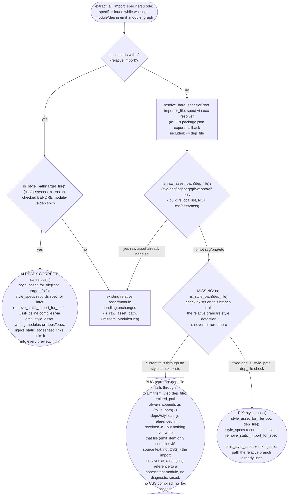

# jet stories build: bare-specifier CSS/SCSS/Sass style imports are not recognized as style assets

## Logic
<!-- type: logic lang: mermaid -->

Scope for WI #1237 (`projects/jet/src/stories/build.rs`, `rewrite_imports`): the relative-import branch already calls `is_style_path(&target_file)` before deciding module-vs-dep, so a relative `.scss`/`.css`/`.sass` import — the literal scenario #1237 describes (`sp-box.tsx` -> `import './sp-box.scss'`) — is compiled through `CssPipeline`, its static import statement is stripped, and the compiled CSS is linked into every static preview via `inject_static_stylesheet_links`. This is confirmed working on current `app/jet` HEAD by the pre-existing `build_compiles_scss_side_effect_imports_to_static_css` test (passing) and by a from-scratch minimal repro built for this investigation (a project-local `.scss` side-effect import, a full-package-subpath `.svg` import, an SVGR barrel `export { ReactComponent as X } from './icon.svg'` re-export, and a bare `.png` import all resolved and linked/compiled correctly). The SVGR barrel re-export handling (`is_svg_component_reexport`/`rewrite_svg_component_reexport_for_spec`) also landed after #1237 was filed (in the jet@0.4.16 release) and is confirmed working by the pre-existing `build_rewrites_svg_reactcomponent_barrel_reexports` test.

The bare-specifier branch, however, only checks `is_raw_asset_path(&dep_file)` (svg/png/jpg/jpeg/gif/webp/avif) before falling through to `EmitItem::Dep(dep_file)` — there is no equivalent `is_style_path` check on this branch at all. A bare specifier that resolves (via `super::deps::resolve_bare_specifier`, including the `#923` package.json `exports`-subpath fallback) straight to a `.css`/`.scss`/`.sass` file is therefore treated as a JS dependency: `EmitItem::Dep::emitted_path` unconditionally appends `.js` (`to_js_path`), so the rewritten import becomes a reference to `deps/<pkg>/<name>.css.js` — a file `emit_item` never writes (it only transforms JS source text). The result: the import specifier survives as a dangling reference in the emitted JS, no CSS is compiled, no `<link>` tag is added (since `emitted_styles` is only ever populated from `emit.styles`, which this path never populates), and no diagnostic is raised — the failure is silent. This was reproduced from scratch for this investigation (`import '@tw-tech/ds2/style.css'` resolving via a package.json `exports` subpath) and confirmed against current `app/jet` HEAD: the emitted `deps/@tw-tech/ds2` directory exists but is empty, and the importing module's rewritten JS references `../../../deps/@tw-tech/ds2/style.css.js`, a file that is never written.

The fix mirrors the relative branch exactly: add an `is_style_path(&dep_file)` check to the bare-specifier branch of `rewrite_imports`, ahead of (or alongside) the existing `is_raw_asset_path` check, that pushes a `StyleAsset` via the existing `style_asset_for_file` helper (which already branches on `path_has_node_modules` to compute the correct `deps/...css` emitted path) and records the spec in `style_specs` for `remove_static_import_for_spec`, then `continue`s the same way the relative branch does. No new CSS-compilation, link-injection, or path-computation logic is needed — `emit_style_asset`, `inject_static_stylesheet_links`, and `style_asset_for_file` already handle both module- and dep-rooted style assets correctly; only the missing detection branch needs wiring.

## Unit Test

```mermaid
---
id: jet-stories-build-bare-specifier-style-assets-verification
requirements:
  bare_specifier_css_import_compiles_and_links:
    id: R1
    text: "A bare-specifier `.css` import that resolves via a package's `package.json` exports subpath (e.g. `import '@scope/pkg/style.css'`) emits a real compiled CSS asset at `deps/<pkg>/<name>.css`, strips the import statement from the emitted JS module (no dangling `import` remains), and links the compiled CSS into every static preview via `<link rel=\"stylesheet\">` - matching the existing relative-import style-asset behavior instead of falling through to a broken `deps/<pkg>/<name>.css.js` JS-dependency reference."
    kind: functional
    risk: high
    verify: cargo test -p jet --test stories_build build_compiles_bare_specifier_css_import_to_static_css
  bare_specifier_raw_asset_import_still_resolves_as_dep:
    id: R3
    text: "Negative control: a bare-specifier import resolving to a non-style, non-raw-asset file (a plain `.js`/`.mjs` dependency module) is unaffected by the new `is_style_path` check on the bare-specifier branch and still resolves as `EmitItem::Dep` exactly as before, proving the fix is scoped to style extensions and does not change bare-specifier JS dependency resolution."
    kind: regression
    risk: medium
    verify: cargo test -p jet --test stories_build build_emits_svg_and_png_assets_as_url_strings
  bare_specifier_scss_import_compiles_via_css_pipeline:
    id: R2
    text: "A bare-specifier `.scss` import resolved through the same package.json exports subpath path is compiled through the real `CssPipeline` (nesting and variables flattened into valid CSS), not copied verbatim or left as raw Sass, confirming the fix reuses the identical style-asset detection and compilation path the relative-import branch already uses rather than adding a second, divergent implementation."
    kind: functional
    risk: medium
    verify: cargo test -p jet --test stories_build build_compiles_bare_specifier_scss_import_via_css_pipeline
---
flowchart TD
    r1[R1 bare specifier css import compiles and links] --> cargo_test_p_jet_test_stories_build_build_compiles_bare_specifier_css_import_to_static_css[cargo test -p jet --test stories_build build_compiles_bare_specifier_css_import_to_static_css]
    r2[R2 bare specifier scss import compiles via css pipeline] --> cargo_test_p_jet_test_stories_build_build_compiles_bare_specifier_scss_import_via_css_pipeline[cargo test -p jet --test stories_build build_compiles_bare_specifier_scss_import_via_css_pipeline]
    r3[R3 bare specifier raw asset import still resolves as dep] --> cargo_test_p_jet_test_stories_build_build_emits_svg_and_png_assets_as_url_strings[cargo test -p jet --test stories_build build_emits_svg_and_png_assets_as_url_strings]
```

<!-- type: unit-test lang: mermaid -->

