# jet transform resolver: dotted-basename extension probe drops extensionless/legacy-CJS relative imports

## Logic

```mermaid
---
id: jet-transform-resolver-dotted-basename-extension-probe
entry: relative_import_specifier
nodes:
  relative_import_specifier: { kind: start,    label: "unresolved relative import specifier\n(e.g. './router.config', '../../modules/es6.object.assign')\nfrom resolve_module_path /\nlookup_file_module_id_with_extensions" }
  direct_match:               { kind: decision, label: "direct module_map lookup on\nliteral candidate path (no extension probe)?" }
  return_resolved_direct:     { kind: terminal, label: "return require(id)\n(unchanged, not this bug)" }
  probe_extension_candidates: { kind: process,  label: "iterate candidate extensions\n[\"\", \".js\", \".jsx\", \".ts\", \".tsx\"(, \".json\")]\n(candidate list itself unchanged)" }
  build_candidate_old_buggy:  { kind: process,  label: "BEFORE (bug): PathBuf::set_extension(ext)\nreplaces text AFTER THE LAST '.' in the path\n'router.config' + '.ts' -> 'router.ts' (WRONG)\n'DraftEditor.react' + '.ts' -> 'DraftEditor.ts' (WRONG)\n'es6.object.assign' + '.js' -> 'es6.js' (WRONG)" }
  build_candidate_fixed:      { kind: process,  label: "AFTER (fix): append_extension(base, ext)\nstring-concat base_os_string + '.' + ext\n(mirrors resolver/mod.rs::append_extension,\nadded as a private helper in transform/modules.rs\nsince the two modules do not share a common lib)\n'router.config' + '.ts' -> 'router.config.ts' (CORRECT)\n'DraftEditor.react' + '.ts' -> 'DraftEditor.react.ts' (CORRECT)\n'es6.object.assign' + '.js' -> 'es6.object.assign.js' (CORRECT)" }
  probed_candidate_match:     { kind: decision, label: "lookup_module_id_for_resolution(module_map,\nresolution_index, candidate) hits?" }
  return_resolved_probed:     { kind: terminal, label: "return require(id)\n(module body now reachable in _mods)" }
  more_extensions_left:       { kind: decision, label: "more candidate extensions\nleft to probe?" }
  directory_index_fallback:   { kind: process,  label: "directory/index.* + package.json main\nfallback (lookup_directory_index_module_id /\nlookup_package_entry_module_id, unchanged\nby this fix)" }
  fallback_match:              { kind: decision, label: "fallback lookup hits?" }
  return_resolved_fallback:   { kind: terminal, label: "return require(id)" }
  unresolved_literal:         { kind: terminal, label: "return literal require('<spec>') string\nSILENT: no build error, exit 0,\ntarget module dropped from _mods\n(the bug's user-visible symptom;\nAC1/AC2 forbid this outcome for\ndotted-basename relative imports)" }
edges:
  - { from: relative_import_specifier, to: direct_match }
  - { from: direct_match,               to: return_resolved_direct,     label: "yes" }
  - { from: direct_match,               to: probe_extension_candidates, label: "no" }
  - { from: probe_extension_candidates, to: build_candidate_old_buggy,   label: "BEFORE fix" }
  - { from: probe_extension_candidates, to: build_candidate_fixed,       label: "AFTER fix" }
  - { from: build_candidate_old_buggy,  to: probed_candidate_match,      label: "corrupted candidate\n(dotted basename lost)" }
  - { from: build_candidate_fixed,      to: probed_candidate_match,      label: "correct candidate\n(full basename preserved)" }
  - { from: probed_candidate_match,     to: return_resolved_probed,      label: "yes" }
  - { from: probed_candidate_match,     to: more_extensions_left,        label: "no" }
  - { from: more_extensions_left,       to: probe_extension_candidates,  label: "yes, next ext" }
  - { from: more_extensions_left,       to: directory_index_fallback,    label: "no, extensions exhausted" }
  - { from: directory_index_fallback,   to: fallback_match }
  - { from: fallback_match,             to: return_resolved_fallback,    label: "yes" }
  - { from: fallback_match,             to: unresolved_literal,          label: "no" }
---
flowchart TD
    relative_import_specifier(["unresolved relative import specifier\n(e.g. './router.config', '../../modules/es6.object.assign')\nfrom resolve_module_path /\nlookup_file_module_id_with_extensions"]) --> direct_match{"direct module_map lookup on\nliteral candidate path (no extension probe)?"}
    direct_match -->|yes| return_resolved_direct(["return require(id)\n(unchanged, not this bug)"])
    direct_match -->|no| probe_extension_candidates["iterate candidate extensions\n['', '.js', '.jsx', '.ts', '.tsx'(, '.json')]\n(candidate list itself unchanged)"]
    probe_extension_candidates -->|BEFORE fix| build_candidate_old_buggy["BEFORE (bug): PathBuf::set_extension(ext)\nreplaces text AFTER THE LAST '.' in the path\n'router.config'+'.ts' -> 'router.ts' WRONG\n'DraftEditor.react'+'.ts' -> 'DraftEditor.ts' WRONG\n'es6.object.assign'+'.js' -> 'es6.js' WRONG"]
    probe_extension_candidates -->|AFTER fix| build_candidate_fixed["AFTER (fix): append_extension(base, ext)\nstring-concat base_os_string + '.' + ext\n(mirrors resolver/mod.rs::append_extension)\n'router.config'+'.ts' -> 'router.config.ts' CORRECT\n'DraftEditor.react'+'.ts' -> 'DraftEditor.react.ts' CORRECT\n'es6.object.assign'+'.js' -> 'es6.object.assign.js' CORRECT"]
    build_candidate_old_buggy --> probed_candidate_match{"lookup_module_id_for_resolution\n(module_map, resolution_index, candidate) hits?"}
    build_candidate_fixed --> probed_candidate_match
    probed_candidate_match -->|yes| return_resolved_probed(["return require(id)\n(module body now reachable in _mods)"])
    probed_candidate_match -->|no| more_extensions_left{"more candidate extensions\nleft to probe?"}
    more_extensions_left -->|yes, next ext| probe_extension_candidates
    more_extensions_left -->|no, extensions exhausted| directory_index_fallback["directory/index.* + package.json main\nfallback (lookup_directory_index_module_id /\nlookup_package_entry_module_id, unchanged\nby this fix)"]
    directory_index_fallback --> fallback_match{"fallback lookup hits?"}
    fallback_match -->|yes| return_resolved_fallback(["return require(id)"])
    fallback_match -->|no| unresolved_literal(["return literal require('<spec>') string\nSILENT: no build error, exit 0,\ntarget module dropped from _mods\n(AC1/AC2 forbid this outcome for\ndotted-basename relative imports)"])
```

<!-- type: logic lang: mermaid -->

Root cause: both extension-probe call sites in `projects/jet/src/transform/modules.rs` — `lookup_file_module_id_with_extensions` (used by the bare-specifier/`node_modules`/directory-index path) and `resolve_module_path`'s two inline relative-import probe loops (the legacy no-`current_dir` loop and the `current_dir`-relative loop) — build each extension candidate with `std::path::PathBuf::set_extension(ext)`. Per the stdlib contract, `set_extension` replaces everything after the LAST `.` in the path's file name, which is exactly the wrong operation for probing an already-extensionless-looking basename that itself contains a literal `.`: a dotted basename such as `router.config` or `DraftEditor.react` has its trailing `.config`/`.react` segment silently discarded and replaced by the probed extension (`router.ts`, `DraftEditor.ts`), so the probe candidate never matches the real on-disk/module-map path (`router.config.ts`, `DraftEditor.react.ts`) and the loop falls through every extension without a hit. The same corruption applies to legacy-CJS-style nested imports whose module segment is dotted, e.g. `../../modules/es6.object.assign` probing `es6.js` instead of `es6.object.assign.js`. Because none of the probe loops, nor `lookup_directory_index_module_id`/`lookup_package_entry_module_id` fallbacks, ever recover the correct candidate, `resolve_module_path` falls through to its final branch: it emits the literal, unresolved specifier string (`require('./router.config')`) into the generated bundle instead of `require(<module id>)`, with no error and exit 0 — the target module's transformed body is silently absent from the bundle's `_mods` map even though `check_unresolved_deps` for the *bare-specifier* class of imports does fail loudly (GH #1317); this relative-import class has no equivalent fail-loud guard, which is exactly why the bug is silent.

The sibling graph-walk resolver at `projects/jet/src/resolver/mod.rs::append_extension` already does this correctly: it builds the OS string by direct concatenation (`base.as_os_str().to_os_string()` then `path.push("."); path.push(ext.trim_start_matches('.'))`), which is agnostic to any `.` already present in the base name — the full original path is always preserved and the extension is only ever appended, never substituted. `resolver/mod.rs::try_extensions` calls this helper per candidate extension and is out of scope for this fix (already correct, per WI Out of Scope).

Fix (R1): add a private `append_extension(base: &Path, ext: &str) -> PathBuf` helper to `projects/jet/src/transform/modules.rs` — functionally identical to (and directly modeled on) `resolver/mod.rs::append_extension` — and replace every `let mut p = candidate.to_path_buf(); p.set_extension(&ext[1..]); p` / `test_path.set_extension(&ext[1..])` call site (`lookup_file_module_id_with_extensions`, and both probe loops inside `resolve_module_path`) with `append_extension(&candidate, ext)` / `append_extension(&test_path_base, ext)`. The candidate/extension lists themselves (`["", ".js", ".jsx", ".ts", ".tsx", ".json"]` for `lookup_file_module_id_with_extensions`; `["", ".js", ".jsx", ".ts", ".tsx"]` for `resolve_module_path`'s two loops) are unchanged — this fix is scoped purely to how each extension candidate path is built, not which extensions are probed or in what order, and does not touch `resolver/mod.rs`, `alias.rs`, TS path-alias resolution, or Node builtin polyfill wiring (all explicitly Out of Scope on WI #1304).

## Unit Test

```mermaid
---
id: jet-transform-resolver-dotted-basename-extension-probe-verification
requirements:
  append_extension_preserves_dotted_basename_unit:
    id: R4
    text: "Isolated unit-level pin on the new transform/modules.rs append_extension helper itself (introduced to mirror resolver/mod.rs::append_extension): appending extension 'ts' to base path '.../router.config' must yield '.../router.config.ts', not '.../router.ts' -- pinning the exact string-concatenation semantics (append, never replace-after-last-dot) that R1-R3 depend on at the full-pipeline level."
    kind: functional
    risk: low
    verify: cargo test -p jet --lib transform::modules::tests::append_extension_appends_without_replacing_dotted_basename
  dotted_basename_extensionless_relative_import_resolves_full_pipeline:
    id: R1
    text: "WI #1304 AC1 minimal repro at the full Bundler::bundle() pipeline level: an entry module with a relative import of a dotted-basename file with no extension, e.g. import x from './router.config' resolving on disk to router.config.ts, must resolve through the complete bundle (build_graph -> resolve_module_path -> transform -> generate_bundle): the emitted BundleOutput.code must contain no literal unresolved specifier string (no require('./router.config') / require(\"./router.config\") substring survives), and the target module's transformed body (a unique marker token from router.config.ts) must be present in the bundle's _mods map."
    kind: functional
    risk: high
    verify: cargo test -p jet --lib transform::modules::tests::bundle_resolves_dotted_basename_extensionless_relative_import
  legacy_cjs_nested_dotted_basename_relative_import_resolves_full_pipeline:
    id: R2
    text: "WI #1304 AC2: the equivalent full Bundler::bundle() pipeline regression test for a legacy-CJS-style nested relative import with a dotted basename inside a library-style subdirectory, e.g. require('../../modules/es6.object.assign') resolving on disk to modules/es6.object.assign.js, must resolve through the complete bundle with no literal unresolved specifier string surviving in BundleOutput.code (no require('../../modules/es6.object.assign') substring) and the target module's transformed body present in _mods."
    kind: functional
    risk: high
    verify: cargo test -p jet --lib transform::modules::tests::bundle_resolves_legacy_cjs_nested_dotted_basename_relative_import
  plain_extensionless_relative_import_regression_control:
    id: R3
    text: "Negative/no-regression control at the same full-pipeline level: a relative import of a plain (non-dotted) extensionless basename, e.g. import x from './utils' resolving to utils.ts, must continue to resolve exactly as before the fix (no literal unresolved specifier string in BundleOutput.code, target body present in _mods) -- proving the switch from PathBuf::set_extension to the new append_extension helper does not change behavior for the already-correct non-dotted-basename case."
    kind: regression
    risk: medium
    verify: cargo test -p jet --lib transform::modules::tests::bundle_resolves_plain_extensionless_relative_import_unchanged
---
flowchart TD
    r1[R1 dotted basename extensionless relative import resolves full pipeline] --> cargo_test_p_jet_lib_transform_modules_tests_bundle_resolves_dotted_basename_extensionless_relative_import[cargo test -p jet --lib transform::modules::tests::bundle_resolves_dotted_basename_extensionless_relative_import]
    r2[R2 legacy cjs nested dotted basename relative import resolves full pipeline] --> cargo_test_p_jet_lib_transform_modules_tests_bundle_resolves_legacy_cjs_nested_dotted_basename_relative_import[cargo test -p jet --lib transform::modules::tests::bundle_resolves_legacy_cjs_nested_dotted_basename_relative_import]
    r3[R3 plain extensionless relative import regression control] --> cargo_test_p_jet_lib_transform_modules_tests_bundle_resolves_plain_extensionless_relative_import_unchanged[cargo test -p jet --lib transform::modules::tests::bundle_resolves_plain_extensionless_relative_import_unchanged]
    r4[R4 append extension preserves dotted basename unit] --> cargo_test_p_jet_lib_transform_modules_tests_append_extension_appends_without_replacing_dotted_basename[cargo test -p jet --lib transform::modules::tests::append_extension_appends_without_replacing_dotted_basename]
```

<!-- type: unit-test lang: mermaid -->

