# jet transform resolver: Node builtin polyfill modules never wired into codegen-layer resolution

## Logic

```mermaid
---
id: jet-transform-resolver-node-builtin-polyfill-wiring
entry: bare_specifier
nodes:
  bare_specifier:                { kind: start,    label: "bare specifier text from literal source\nrequire('crypto') / import x from 'crypto' /\nimport 'node:crypto' -- direct or transitive\n(e.g. via seedrandom) -- into\nresolve_module_path(path, module_map,\nresolution_index, current_dir)" }
  literal_direct_match:          { kind: decision, label: "direct module_map lookup on the\nliteral specifier as a PathBuf\n(e.g. PathBuf::from('crypto'))?" }
  return_literal_direct:         { kind: terminal, label: "return require(id)\n(unchanged, not this bug --\nvirtually never hits for a bare\nbuiltin specifier)" }
  is_relative_path:              { kind: decision, label: "path starts with '.' or '/'\n(relative/absolute import)?" }
  relative_resolution_unchanged: { kind: process,  label: "relative-path extension/index/\npackage.json probing (unchanged\nby this fix -- not applicable to\nbare Node builtin specifiers)" }
  node_modules_walkup:           { kind: process,  label: "walk node_modules ancestor dirs\nfrom current_dir, probe\n<dir>/node_modules/<path> via\nlookup_file_or_directory_module_id\n(existing bare-specifier resolution,\nunchanged by this fix)" }
  node_modules_walkup_hit:       { kind: decision, label: "<dir>/node_modules/<path>\nresolves to a module id?" }
  return_walkup:                 { kind: terminal, label: "return require(id)\n(true for ordinary bare packages,\ne.g. 'react', 'seedrandom' itself --\nNOT true for Node builtins, since no\nnode_modules/crypto directory exists)" }
  package_roots_index:           { kind: process,  label: "resolve_bare_specifier_from_index /\nresolve_bare_specifier_from_module_map /\nresolve_bare_specifier_from_jet_store\n(existing package-root-based bare-specifier\nresolution, unchanged by this fix)" }
  package_roots_hit:             { kind: decision, label: "package-root resolution hits?" }
  return_package_root:           { kind: terminal, label: "return require(id)" }
  builtin_check_NEW:             { kind: decision, label: "NEW: node_builtin_name(path) matches\na private NODE_BUILTINS_WITH_BROWSER_FALLBACK\nconst + fn added to transform/modules.rs,\nmirroring resolver/mod.rs's list/fn of the\nsame name 1:1 (no shared lib between the two\nmodules, same duplication precedent as\nappend_extension in WI #1304)?" }
  builtin_polyfill_walkup_NEW:   { kind: process,  label: "NEW: reuse the existing node_modules\nancestor walk-up loop from current_dir,\nprobe <dir>/node_modules/.jet/polyfill-<builtin>.mjs\n-- the exact path resolver/mod.rs::resolve_browser_builtin\nwrites+registers via build_graph's resolve_dependency\ncall (for_browser_production() sets conditions to include\n'browser', so resolve_uncached's resolve_browser_builtin\nbranch already generated this file on disk AND build_graph\nalready gave it a module_map id BEFORE transform_modules runs,\nsince the module transform pass always follows graph\nconstruction in Bundler::bundle())" }
  builtin_polyfill_hit_NEW:      { kind: decision, label: "lookup_module_id_for_resolution(module_map,\nresolution_index, polyfill_candidate) hits?" }
  return_builtin_polyfill_NEW:   { kind: terminal, label: "return require(id)\n(module body = the already-generated\nbrowser polyfill content; no literal Node\nbuiltin require survives -- AC1/R1)" }
  unresolved_literal:            { kind: terminal, label: "return literal require('<spec>') string\n(BUG for builtins: throws ReferenceError /\nundefined at runtime in-browser --\nno build error, exit 0, silent)" }
edges:
  - { from: bare_specifier,                to: literal_direct_match }
  - { from: literal_direct_match,          to: return_literal_direct,       label: "yes" }
  - { from: literal_direct_match,          to: is_relative_path,            label: "no" }
  - { from: is_relative_path,              to: relative_resolution_unchanged, label: "yes (not this bug's class)" }
  - { from: is_relative_path,              to: node_modules_walkup,         label: "no (bare specifier)" }
  - { from: node_modules_walkup,           to: node_modules_walkup_hit }
  - { from: node_modules_walkup_hit,       to: return_walkup,               label: "yes" }
  - { from: node_modules_walkup_hit,       to: package_roots_index,         label: "no" }
  - { from: package_roots_index,           to: package_roots_hit }
  - { from: package_roots_hit,             to: return_package_root,         label: "yes" }
  - { from: package_roots_hit,             to: builtin_check_NEW,           label: "no (this is the existing\nfall-through point the fix hooks into)" }
  - { from: builtin_check_NEW,             to: builtin_polyfill_walkup_NEW, label: "yes, is a Node builtin" }
  - { from: builtin_check_NEW,             to: unresolved_literal,          label: "no, not a Node builtin\n(unchanged fallback behavior)" }
  - { from: builtin_polyfill_walkup_NEW,   to: builtin_polyfill_hit_NEW }
  - { from: builtin_polyfill_hit_NEW,      to: return_builtin_polyfill_NEW, label: "yes" }
  - { from: builtin_polyfill_hit_NEW,      to: unresolved_literal,          label: "no (polyfill file/id not\nfound -- should not occur when\nthe 'browser' condition is configured;\nfalls back to prior, pre-fix behavior)" }
---
flowchart TD
    bare_specifier(["bare specifier text from literal source\nrequire('crypto') / import x from 'crypto' /\nimport 'node:crypto' -- direct or transitive\n(e.g. via seedrandom) -- into\nresolve_module_path(path, module_map,\nresolution_index, current_dir)"]) --> literal_direct_match{"direct module_map lookup on the\nliteral specifier as a PathBuf\n(e.g. PathBuf::from('crypto'))?"}
    literal_direct_match -->|yes| return_literal_direct(["return require(id)\n(unchanged, not this bug --\nvirtually never hits for a bare\nbuiltin specifier)"])
    literal_direct_match -->|no| is_relative_path{"path starts with '.' or '/'\n(relative/absolute import)?"}
    is_relative_path -->|yes -- not this bug's class| relative_resolution_unchanged["relative-path extension/index/\npackage.json probing (unchanged\nby this fix -- not applicable to\nbare Node builtin specifiers)"]
    is_relative_path -->|no, bare specifier| node_modules_walkup["walk node_modules ancestor dirs\nfrom current_dir, probe\n<dir>/node_modules/<path> via\nlookup_file_or_directory_module_id\n(existing bare-specifier resolution,\nunchanged by this fix)"]
    node_modules_walkup --> node_modules_walkup_hit{"<dir>/node_modules/<path>\nresolves to a module id?"}
    node_modules_walkup_hit -->|yes| return_walkup(["return require(id)\n(true for ordinary bare packages,\ne.g. 'react', 'seedrandom' itself --\nNOT true for Node builtins, since no\nnode_modules/crypto directory exists)"])
    node_modules_walkup_hit -->|no| package_roots_index["resolve_bare_specifier_from_index /\nresolve_bare_specifier_from_module_map /\nresolve_bare_specifier_from_jet_store\n(existing package-root-based bare-specifier\nresolution, unchanged by this fix)"]
    package_roots_index --> package_roots_hit{"package-root resolution hits?"}
    package_roots_hit -->|yes| return_package_root(["return require(id)"])
    package_roots_hit -->|no, existing fall-through point| builtin_check_NEW{"NEW: node_builtin_name(path) matches\na private NODE_BUILTINS_WITH_BROWSER_FALLBACK\nconst + fn added to transform/modules.rs,\nmirroring resolver/mod.rs's list/fn of the\nsame name 1:1 (no shared lib between the two\nmodules, same duplication precedent as\nappend_extension in WI #1304)?"}
    builtin_check_NEW -->|yes, is a Node builtin| builtin_polyfill_walkup_NEW["NEW: reuse the existing node_modules\nancestor walk-up loop from current_dir,\nprobe <dir>/node_modules/.jet/polyfill-<builtin>.mjs\n-- the exact path resolver/mod.rs::resolve_browser_builtin\nwrites+registers via build_graph's resolve_dependency\ncall (for_browser_production() sets conditions to include\n'browser', so resolve_uncached's resolve_browser_builtin\nbranch already generated this file on disk AND build_graph\nalready gave it a module_map id BEFORE transform_modules runs,\nsince the module transform pass always follows graph\nconstruction in Bundler::bundle())"]
    builtin_check_NEW -->|no, not a Node builtin| unresolved_literal(["return literal require('<spec>') string\n(BUG for builtins: throws ReferenceError /\nundefined at runtime in-browser --\nno build error, exit 0, silent)"])
    builtin_polyfill_walkup_NEW --> builtin_polyfill_hit_NEW{"lookup_module_id_for_resolution(module_map,\nresolution_index, polyfill_candidate) hits?"}
    builtin_polyfill_hit_NEW -->|yes| return_builtin_polyfill_NEW(["return require(id)\n(module body = the already-generated\nbrowser polyfill content; no literal Node\nbuiltin require survives -- AC1/R1)"])
    builtin_polyfill_hit_NEW -->|no, polyfill not found| unresolved_literal
```

<!-- type: logic lang: mermaid -->

Root cause: `projects/jet/src/transform/modules.rs::resolve_module_path` implements the codegen-time (post-graph-walk) resolver that rewrites literal import/require specifiers into `require(<numeric id>)` references using the `module_map: HashMap<PathBuf, usize>` (and optional `ModuleResolutionIndex`) built from the already-completed module graph. For a bare Node builtin specifier such as `crypto` (imported directly, or transitively via a dependency like `seedrandom`'s own internal `require('crypto')`), `resolve_module_path` runs every existing bare-specifier resolution strategy in order -- literal direct match, `node_modules/<path>` ancestor walk-up, package-root index / module-map / `.jet-store` lookups -- and every one of them fails, because none of them know that `crypto` was never resolved to a `node_modules/crypto` directory in the first place: `resolver/mod.rs::resolve_uncached` special-cases Node builtins BEFORE regular package resolution (`resolve_browser_builtin`, gated on the `browser` export condition) and, when the condition is present (`ResolveOptions::for_browser_production()` always sets it, and `jet build` always uses that constructor per `cli.rs::browser_production_resolve_options`), writes a real browser-compatible polyfill module to `<base_dir>/node_modules/.jet/polyfill-<builtin>.mjs` and returns THAT path -- not a `node_modules/crypto` path -- as the resolved module. `bundler/mod.rs::build_graph`'s `resolve_dependency` call (fed by `imports::extract_imports`, which already extracts both ES `import` specifiers and CJS `require(...)` call specifiers into `static_imports`) therefore already walks to this polyfill path during graph construction and queues it as a real graph node with a real module id -- the polyfill module IS present in `module_map` by the time `transform_modules` runs. But `resolve_module_path` in `transform/modules.rs` has no equivalent Node-builtin special case: it never constructs the `node_modules/.jet/polyfill-<builtin>.mjs` candidate path, so it never looks it up in `module_map`, and falls through every existing bare-specifier strategy to the final branch, emitting the literal, unresolved specifier text `require('crypto')` into the compiled module body. This is silent -- `jet build` exits 0, `check_unresolved_deps` never sees it (the graph-walk resolution to the polyfill path succeeded, so nothing was ever recorded as unresolved) -- and the resulting bundle throws `ReferenceError: require is not defined` (or an unrelated symbol error) at runtime in a browser, because the literal Node builtin name was never a real identifier in the generated module-registry closure.

Fix (R1/R2): add a private `NODE_BUILTINS_WITH_BROWSER_FALLBACK` const slice and `node_builtin_name(specifier: &str) -> Option<&str>` fn to `projects/jet/src/transform/modules.rs`, functionally identical to (and directly modeled on, same list, same `node:` prefix stripping) `resolver/mod.rs`'s items of the same name -- the same intentional duplication precedent as `append_extension` from WI #1304, since `transform/modules.rs` and `resolver/mod.rs` share no common lib and pulling `resolver` in as a dependency of `transform` would invert the crate's existing module layering. In `resolve_module_path`'s bare-specifier resolution branch, after the existing `node_modules/<path>` ancestor walk-up and package-root-index strategies both miss (the exact point every bare Node builtin specifier currently falls through), add a new step: if `node_builtin_name(path)` returns `Some(builtin)`, reuse the SAME node_modules ancestor walk-up loop already used earlier in the function (`search_dir` climbing via `.parent()`) to probe `<dir>/node_modules/.jet/polyfill-<builtin>.mjs` at each ancestor, and resolve the first hit via the existing `lookup_module_id_for_resolution` helper; on a hit, return `require(<id>)` exactly like every other successful bare-specifier branch. This mirrors the existing implicit-dependency wiring pattern the WI calls out (`bundler/mod.rs::build_graph`'s `react/jsx-runtime` special case: consult a mapping the graph-walk machinery already produces, rather than inventing new resolution machinery) -- the polyfill mapping itself (which builtins get real polyfills vs. a stub, and the `.jet` directory convention) is entirely owned by `resolver/mod.rs`/`dev_server::polyfills` and is unchanged (Out of Scope on WI #1306); this fix only teaches the codegen-time resolver to consult the SAME already-materialized `node_modules/.jet/polyfill-<builtin>.mjs` path the graph walk already wrote and already registered a module id for. No change to `bundler/mod.rs::build_graph` is required: `build_graph`'s `resolve_dependency` already routes every Node builtin specifier (direct or transitive, since `imports::extract_imports` already extracts `require(...)` call specifiers into `static_imports` alongside ES `import` specifiers) through `resolver/mod.rs::resolve_uncached`, which already special-cases and correctly resolves+registers the polyfill BEFORE this WI's fix; the gap is exclusively in the codegen-time text-rewrite step (`transform/modules.rs`), not in graph construction.
